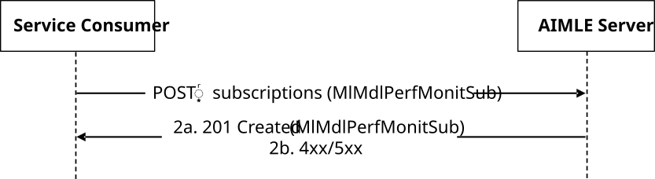
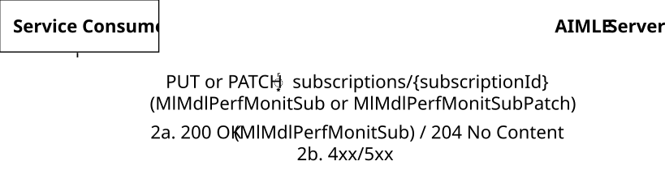
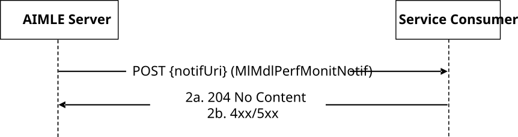

# 5.2.8 AIMLES_MLModelPerfMonitor Service

## 5.2.8.1 Service Description

The AIMLES_MLModelPerfMonitor Service, exposed by the AIMLE Server, enables a service consumer to:

\- create/update/delete an AIMLE ML Model Performance Monitor Subscription; and

\- receive AIMLE ML Model Performance Monitor Notifications.

## 5.2.8.2 Service Operations

### 5.2.8.2.1 Introduction

The service operations defined for the AIMLES_MLModelPerfMonitor API are shown in the table 5.2.8.2.1-1.

Table 5.2.8.2.1-1: Service operations of the AIMLES_MLModelPerfMonitor API

| Service Operation Name                | Description                                                                                                              | Initiated by     |
|---------------------------------------|--------------------------------------------------------------------------------------------------------------------------|------------------|
| AIMLES_MLModelPerfMonitor_Subscribe   | This service operation enables a service consumer to create an AIMLE ML model performance monitor subscription.          | e.g., VAL Server |
| AIMLES_MLModelPerfMonitor_Update      | This service operation enables a service consumer to update an existing AIMLE ML model performance monitor subscription. | e.g., VAL Server |
| AIMLES_MLModelPerfMonitor_Unsubscribe | This service operation enables a service consumer to delete an existing AIMLE ML model performance monitor subscription. | e.g., VAL Server |
| AIMLES_MLModelPerfMonitor_Notify      | This service operation enables a service consumer to receive AIMLE notifications.                                        | AIMLE Server     |

### 5.2.8.2.2 AIMLES_MLModelPerfMonitor_Subscribe

#### 5.2.8.2.2.1 General

This service operation is used by a service consumer to request the creation of AIMLE ML Model Performance Monitor Subscription at the AIMLE server.

The following procedures are supported by the "AIMLES_MLModelPerfMonitor_Subscribe" service operation:

\- AIMLE ML Model Performance Monitor Subscription Creation.

#### 5.2.8.2.2.2 AIMLE ML Model Performance Monitor Subscription Creation

Figure 5.2.8.2.2.2-1 depicts a scenario where a service consumer sends a request to the AIMLE Server to request the creation of AIMLE ML Model Performance Monitor Subscription (see also clause 8.22 of 3GPP TS 23.482 \[9\]).

Figure 5.2.8.2.2.2-1: Procedure for AIMLE ML Model Performance Monitor Subscription Creation

1\. In order to subscribe to AIMLE ML model performance monitoring, the service consumer shall send an HTTP POST request to the AIMLE Server targeting the URI of the "AIMLE ML Model Performance Monitor Subscriptions" collection resource, with the request body including the MlMdlPerfMonitSub data structure.

2a. Upon success, the AIMLE Server shall respond with an HTTP "201 Created" status code with the response body containing a representation of the created "Individual AIMLE ML Model Performance Monitor Subscription" resource within the MlMdlPerfMonitSub data structure, and an HTTP "Location" header field containing the URI of the created resource.

2b. On failure, the appropriate HTTP status code indicating the error shall be returned and appropriate additional error information should be returned in the HTTP POST response body, as specified in clause 6.1.9.7.

### 5.2.8.2.3 AIMLES_MLModelPerfMonitor_Update

#### 5.2.8.2.3.1 General

This service operation is used by a service consumer to request the update of an AIMLE ML Model Performance Monitor Subscription at the AIMLE server.

The following procedures are supported by the "AIMLES_MLModelPerfMonitor_Update" service operation:

\- AIMLE ML Model Performance Monitor Subscription Update.

#### 5.2.8.2.3.2 AIMLE ML Model Performance Monitor Subscription Update

Figure 5.2.8.2.3.2-1 depicts a scenario where a service consumer sends a request to the AIMLE Server to request the update of AIMLE ML Model Performance Monitor Subscription (see also clause 8.22 of 3GPP TS 23.482 \[9\]).

Figure 5.2.8.2.3.2-1: Procedure for AIMLE ML Model Performance Monitor Subscription Update

1\. In order to request the update of an existing AIMLE ML model performance monitoring subscription, the service consumer shall send an HTTP PUT/PATCH request to the AIMLE Server, targeting the URI of the corresponding "Individual AIMLE ML Model Performance Monitor Subscription" resource, with the request body including either:

\- the updated representation of the resource within the MlMdlPerfMonitSub data structure, in case the HTTP PUT method is used; or

\- the requested modifications to the resource within the MlMdlPerfMonitSubPatch data structure, in case the HTTP PATCH method is used.

2a. Upon success, the AIMLE Server shall update the targeted "Individual AIMLE ML Model Performance Monitor Subscription" resource accordingly and respond with either:

\- an HTTP "200 OK" status code with the response body containing a representation of the updated resource within the MlMdlPerfMonitSub data structure; or

\- an HTTP "204 No Content" status code.

2b. On failure, the appropriate HTTP status code indicating the error shall be returned and appropriate additional error information should be returned in the HTTP PUT/PATCH response body, as specified in clause 6.1.9.7.

### 5.2.8.2.4 AIMLES_MLModelPerfMonitor_Unsubscribe

#### 5.2.8.2.4.1 General

This service operation is used by a service consumer to request the deletion of AIMLE ML Model Performance Monitor Subscription at the AIMLE Server.

The following procedures are supported by the "AIMLES_MLModelPerfMonitor_Unsubscribe" service operation:

\- AIMLE ML Model Performance Monitor Subscription Deletion.

#### 5.2.8.2.4.2 AIMLE ML Model Performance Monitor Subscription Deletion

Figure 5.2.8.2.4.2-1 depicts a scenario where a service consumer sends a request to the AIMLE Server to delete an existing AIMLE ML Model Performance Monitor Subscription (see also clause 8.22 of 3GPP TS 23.482 \[9\]).

Figure 5.2.8.2.4.2-1: Procedure for AIMLE ML Model Performance Monitor Subscription Deletion

1\. In order to request the deletion of an existing AIMLE ML model performance monitoring subscription, the service consumer shall send an HTTP DELETE request to the AIMLE Server targeting the URI of the corresponding "Individual AIMLE ML Model Performance Monitor Subscription" resource.

2a. Upon success, the AIMLE Server shall respond with an HTTP "204 No Content" status code.

2b. On failure, the appropriate HTTP status code indicating the error shall be returned and appropriate additional error information should be returned in the HTTP DELETE response body, as specified in clause 6.1.9.7.

### 5.2.8.2.5 AIMLES_MLModelPerfMonitor_Notify

#### 5.2.8.2.5.1 General

This service operation is used by a AIMLE Server to notify a previously subscribed service consumer on:

\- AIMLE ML Model Performance Monitor report(s).

The following procedures are supported by the "AIMLES_MLModelPerfMonitor_Notify" service operation:

\- AIMLE ML Model Performance Monitor Notification.

#### 5.2.8.2.5.2 AIMLE ML Model Performance Monitor Notification

Figure 5.2.8.2.5.2-1 depicts a scenario where the AIMLE Server sends a request to notify a previously subscribed service consumer on AIMLE ML Model Performance Monitor report(s) (see also clause 8.22 of 3GPP TS 23.482 \[9\]).

Figure 5.2.8.2.5.2-1: Procedure for AIMLE ML Model Performance Monitor Notification

1\. In order to notify a previously subscribed service consumer on AIMLE ML Model Performance Monitor report(s), the AIMLE Server shall send an HTTP POST request to the service consumer with the request URI set to "{notifUri}", where the "notifUri" variable is set to the value received from the service consumer during the creation of the corresponding AIMLE ML Model Performance Monitor Subscription using the procedures defined in clauses 5.2.8.2.2.2, and the request body including the MlMdlPerfMonitNotif data structure.

2a. Upon success, the service consumer shall respond to the AIMLE Server with an HTTP "204 No Content" status code to acknowledge the reception of the notification.

2b. On failure, the appropriate HTTP status code indicating the error shall be returned and appropriate additional error information should be returned in the HTTP POST response body, as specified in clause 6.1.9.7.
