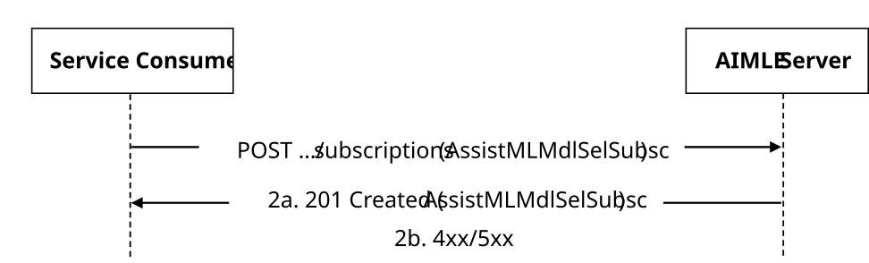
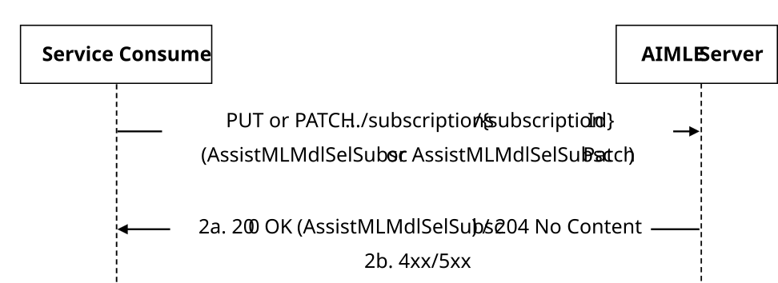
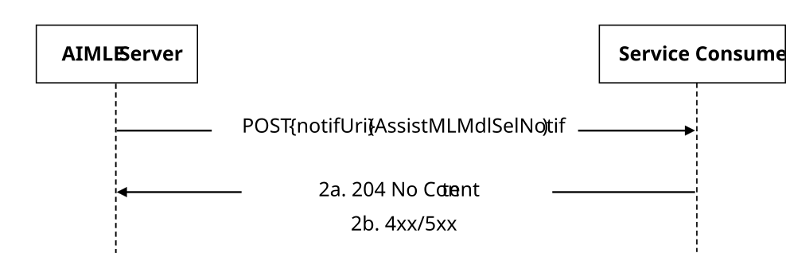

# 5.2.9 AIMLES_AssistedMLModelSelection Service

## 5.2.9.1 Service Description

The AIMLES_AssistedMLModelSelection service exposed by the AIMLE Server enables a service consumer to:

\- create/update/delete a AIMLE Assisted ML Model Selection Subscription; and

\- receive AIMLE Assisted ML Model Selection Notifications.

## 5.2.9.2 Service Operations

### 5.2.9.2.1 Introduction

The service operations defined for the AIMLES_AssistedMLModelSelection API are shown in the table 5.2.9.2.1-1.

Table 5.2.9.2.1-1: Service operations of the AIMLES_AssistedMLModelSelection API

| Service Operation Name                      | Description                                                                                                             | Initiated by    |
|---------------------------------------------|-------------------------------------------------------------------------------------------------------------------------|-----------------|
| AIMLES_AssistedMLModelSelection_Subscribe   | This service operation enables a service consumer to create a AIMLE Assisted ML Model Selection Subscription.           | e.g. VAL Server |
| AIMLES_AssistedMLModelSelection_Update      | This service operation enables a service consumer to update an existing AIMLE Assisted ML Model Selection Subscription. | e.g. VAL Server |
| AIMLES_AssistedMLModelSelection_Unsubscribe | This service operation enables a service consumer to delete an existing AIMLE Assisted ML Model Selection Subscription. | e.g. VAL Server |
| AIMLES_AssistedMLModelSelection_Notify      | This service operation enables a service consumer to receive AIMLE Assisted ML Model Selection notifications.           | AIMLE Server    |

### 5.2.9.2.2 AIMLES_AssistedMLModelSelection_Subscribe

#### 5.2.9.2.2.1 General

This service operation is used by a service consumer to request the creation of AIMLE Assisted ML Model Selection Subscription at the AIMLE server.

The following procedures are supported by the "AIMLES_AssistedMLModelSelection_Subscribe" service operation:

\- AIMLE Assisted ML Model Selection Subscription Creation.

This service operation is used by the analytics consumer for AIMLE Assisted ML Model Selection Subscription to the AIMLE Server.

#### 5.2.9.2.2.2 AIMLE Assisted ML Model Selection Subscription Creation

Figure 5.2.9.2.2.2-1 depicts a scenario where a service consumer sends a request to the AIMLE Server to request the creation of AIMLE Assisted ML Model Selection Subscription (see also clause 8.23 of 3GPP TS 23.482 \[9\]).

Figure 5.2.9.2.2.2-1: Procedure for AIMLE Assisted ML Model Selection Subscription Creation

1\. In order to subscribe to AIMLE Assisted ML Model Selection notification, the service consumer shall send an HTTP POST request to the AIMLE Server targeting the URI of the "AIMLE Assisted ML Model Selection Subscriptions" collection resource, with the request body including the AssistMLMdlSelSubsc data structure.

2a. Upon success, the AIMLE Server shall respond with an HTTP "201 Created" status code with the response body containing a representation of the created "Individual AIMLE Assisted ML Model Selection Subscription" resource within the AssistMLMdlSelSubsc data structure, and an HTTP "Location" header field containing the URI of the created resource.

2b. On failure, the appropriate HTTP status code indicating the error shall be returned and appropriate additional error information should be returned in the HTTP POST response body, as specified in clause 6.1.11.7.

### 5.2.9.2.3 AIMLES_AssistedMLModelSelection_Update

#### 5.2.9.2.3.1 General

This service operation is used by a service consumer to request the update of a AIMLE Assisted ML Model Selection Subscription at the AIMLE server.

The following procedures are supported by the "AIMLES_AssistedMLModelSelection_Update" service operation:

\- AIMLE Assisted ML Model Selection Subscription Update.

This service operation is used by the analytics consumer for AIMLE Assisted ML Model Selection Subscription to the AIMLE Server.

#### 5.2.9.2.3.2 AIMLE Assisted ML Model Selection Subscription Update

Figure 5.2.9.2.3.2-1 depicts a scenario where a service consumer sends a request to the AIMLE Server to request the update of AIMLE Assisted ML Model Selection Subscription (see also clause 8.23 of 3GPP TS 23.482 \[9\]).

Figure 5.2.9.2.3.2-1: Procedure for AIMLE Assisted ML Model Selection Subscription Update

1\. In order to request the update of an existing AIMLE Assisted ML Model Selection notification, the service consumer shall send an HTTP PUT/PATCH request to the AIMLE Server, targeting the URI of the corresponding "Individual AIMLE Assisted ML Model Selection Subscription" resource, with the request body including either:

\- the updated representation of the resource within the AssistMLMdlSelSubsc data structure, in case the HTTP PUT method is used; or

\- the requested modifications to the resource within the AssistMLMdlSelSubscPatch data structure, in case the HTTP PATCH method is used.

NOTE: An alternative service consumer (i.e. other than the one that requested the creation of the targeted resource) can initiate this request.

2a. Upon success, the AIMLE Server shall update the targeted "AIMLE Assisted ML Model Selection Subscriptions" resource accordingly and respond with either:

\- an HTTP "200 OK" status code with the response body containing a representation of the updated "Individual AIMLE Assisted ML Model Selection Subscription" resource within the AssistMLMdlSelSubsc data structure; or

\- an HTTP "204 No Content" status code.

2b. On failure, the appropriate HTTP status code indicating the error shall be returned and appropriate additional error information should be returned in the HTTP PUT/PATCH response body, as specified in clause 6.1.11.7.

### 5.2.9.2.4 AIMLES_AssistedMLModelSelection_Unsubscribe

#### 5.2.9.2.4.1 General

This service operation is used by a service consumer to request the deletion of AIMLE Assisted ML Model Selection Subscription at the AIMLE Server.

The following procedures are supported by the "AIMLES_AssistedMLModelSelection_Unsubscribe" service operation:

\- AIMLE Assisted ML Model Selection Subscription Deletion.

#### 5.2.9.2.4.2 AIMLE Assisted ML Model Selection Subscription Deletion

Figure 5.2.9.2.4.2-1 depicts a scenario where a service consumer sends a request to the AIMLE Server to delete an existing AIMLE Member Capability Analytics Subscription (see also clause 8.23 of 3GPP TS 23.482 \[9\]).

Figure 5.2.9.2.4.2-1: Procedure for AIMLE Assisted ML Model Selection Subscription Deletion

1\. In order to request the deletion of an existing AIMLE Assisted ML Model Selection Subscription, the service consumer shall send an HTTP DELETE request to the AIMLE Server targeting the URI of the corresponding "Individual AIMLE Assisted ML Model Selection Subscription" resource.

NOTE: An alternative service consumer (i.e. other than the one that requested the creation of the targeted resource) can initiate this request.

2a. Upon success, the AIMLE Server shall respond with an HTTP "204 No Content" status code.

2b. On failure, the appropriate HTTP status code indicating the error shall be returned and appropriate additional error information should be returned in the HTTP DELETE response body, as specified in clause 6.1.11.7.

### 5.2.9.2.5 AIMLES_AssistedMLModelSelection_Notify

#### 5.2.9.2.5.1 General

This service operation is used by a AIMLE Server to notify a previously subscribed service consumer on:

\- AIMLE Assisted ML Model Selection report(s).

The following procedures are supported by the "AIMLES_AssistedMLModelSelection_Notify" service operation:

\- AIMLE Assisted ML Model Selection Notification.

#### 5.2.9.2.5.2 AIMLE Assisted ML Model Selection Notification

Figure 5.2.9.2.5.2-1 depicts a scenario where the AIMLE Server sends a request to notify a previously subscribed service consumer on AIMLE Assisted ML Model Selection report(s) (see also clause 8.23 of 3GPP TS 23.482 \[9\]).

Figure 5.2.9.2.5.2-1: Procedure for AIMLE Assisted ML Model Selection Notification

1\. In order to notify a previously subscribed service consumer on AIMLE Assisted ML Model Selection report(s), the AIMLE Server shall send an HTTP POST request to the service consumer with the request URI set to "{notifUri}", where the "notifUri" variable is set to the value received from the service consumer during the creation of the corresponding AIMLE Assisted ML Model Selection Subscription using the procedures defined in clauses 5.2.9.2.2.2, and the request body including the AssistMLMdlSelNotif data structure.

2a. Upon success, the service consumer shall respond to the AIMLE Server with an HTTP "204 No Content" status code to acknowledge the reception of the notification.

2b. On failure, the appropriate HTTP status code indicating the error shall be returned and appropriate additional error information should be returned in the HTTP POST response body, as specified in clause 6.1.11.7.
