# 5.3 Services offered by the AIMLE Repository

## 5.3.1 MLR_MLModelManagement Service

### 5.3.1.1 Service Description

The MLR_MLModelManagement service exposed by the AIMLE Repository enables an NF service consumer to:

\- request to create/update/delete an ML Model(s) Storage.

### 5.3.1.2 Service Operations

#### 5.3.1.2.1 Introduction

The service operations defined for the MLR_MLModelManagement service are shown in table 5.3.1.2.1-1.

Table 5.3.1.2.1-1: MLR_MLModelManagement Service Operations

| Service Operation Name      | Description                                                                                                       | Initiated by       |
|-----------------------------|-------------------------------------------------------------------------------------------------------------------|--------------------|
| MLR_MLModelManagement_Store | This service operation enables the NF service consumer to request to create/update/delete an ML Model(s) Storage. | e.g., AIMLE Server |

#### 5.3.1.2.2 MLR_MLModelManagement_Store

##### 5.3.1.2.2.1 General

This service operation is used by a service consumer to request to create/update/delete an ML Model(s) Storage at the AIMLE Repository.

The following procedures are supported by the "MLR_MLModelManagement_Store" service operation:

\- ML Models Storage Creation.

\- ML Models Storage Update.

\- ML Models Storage Deletion.

##### 5.3.1.2.2.2 ML Models Storage Creation

Figure 5.3.1.2.2.2-1 depicts a scenario where a service consumer sends a request to the AIMLE Repository to request the creation of an ML Model(s) Storage (see also clause 8.11 of 3GPP TS 23.482 \[9\]).

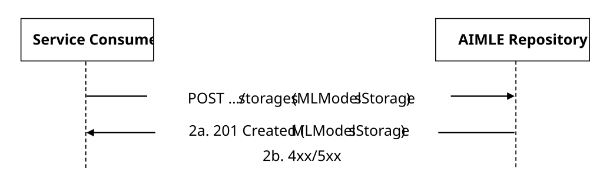

Figure 5.3.1.2.2.2-1: Procedure for ML Models Storage Creation

1\. In order to create or reserve a new ML Model(s) Storage, the service consumer shall send an HTTP POST request to the AIMLE Repository targeting the URI of the "ML Models Storages" collection resource, with the request body including the MLModelsStorage data structure.

2a. Upon success, the AIMLE Repository shall respond with an HTTP "201 Created" status code, with the response body containing a representation of the created "Individual ML Models Storage" resource within the MLModelsStorage data structure, and an HTTP "Location" header field containing the URI of the created resource.

2b. On failure, the appropriate HTTP status code indicating the error shall be returned and appropriate additional error information should be returned in the HTTP POST response body, as specified in clause 6.2.1.7.

##### 5.3.1.2.2.3 ML Models Storage Update

Figure 5.3.1.2.2.3-1 depicts a scenario where a service consumer sends a request to the AIMLE Repository to request the update of an existing ML Model(s) Storage (see also clause 8.11 of 3GPP TS 23.482 \[9\]).

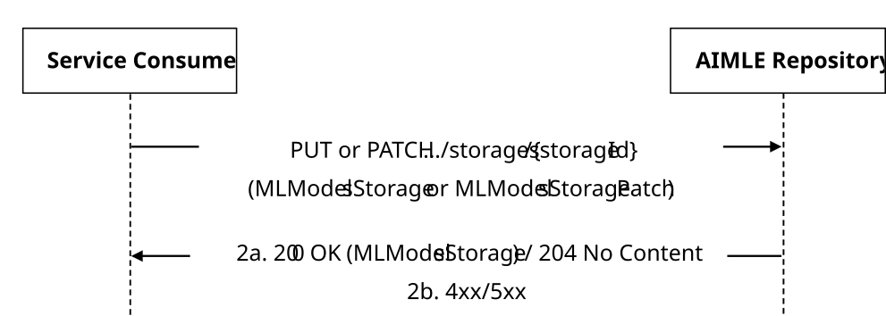

Figure 5.3.1.2.2.3-1: Procedure for ML Models Storage Update

1\. In order to update an existing ML Model(s) Storage, the service consumer shall send an HTTP PUT/PATCH request to the AIMLE Repository, targeting the URI of the corresponding "Individual ML Models Storage" resource, with the request body including either:

\- the updated representation of the resource within the MLModelsStorage data structure, in case the HTTP PUT method is used; or

\- the requested modifications to the resource within the MLModelsStoragePatch data structure, in case the HTTP PATCH method is used.

NOTE: An alternative service consumer (i.e., other than the one that requested the creation of the targeted resource) can initiate this request.

2a. Upon success, the AIMLE Repository shall update the targeted "Individual ML Models Storage" resource accordingly and respond with either:

\- an HTTP "200 OK" status code with the response body containing a representation of the updated "Individual ML Models Storage" resource within the MLModelsStorage data structure; or

\- an HTTP "204 No Content" status code.

2b. On failure, the appropriate HTTP status code indicating the error shall be returned and appropriate additional error information should be returned in the HTTP PUT/PATCH response body, as specified in clause 6.2.1.7.

##### 5.3.1.2.2.4 ML Models Storage Deletion

Figure 5.3.1.2.2.4-1 depicts a scenario where a service consumer sends a request to the AIMLE Repository to request the deletion of an existing ML Model(s) Storage (see also clause 8.11 of 3GPP TS 23.482 \[9\]).

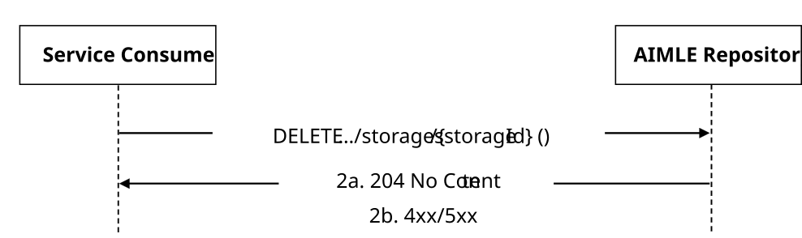

Figure 5.3.1.2.2.4-1: Procedure for ML Models Storage Deletion

1\. In order to request the deletion of an existing ML Models Storage, the service consumer shall send an HTTP DELETE request to the AIMLE Repository targeting the corresponding "Individual ML Models Storage" resource.

NOTE: An alternative service consumer (i.e., other than the one that requested the creation/update of the targeted resource) can initiate this request.

2a. Upon success, the AIMLE Repository shall respond with an HTTP "204 No Content" status code.

2b. On failure, the appropriate HTTP status code indicating the error shall be returned and appropriate additional error information should be returned in the HTTP DELETE response body, as specified in clause 6.2.1.7.

## 5.3.2 MLR_ModelInformationDiscovery Service

### 5.3.2.1 Service Description

The MLR_ModelInformationDiscovery service exposed by the MLR enables a service consumer to:

\- request MLR the model information discovery.

### 5.3.2.2 Service Operations

#### 5.3.2.2.1 Introduction

The service operation defined for MLR_ModelInformationDiscovery API is shown in the table 5.3.2.2.1-1.

Table 5.3.2.2.1-1: MLR_ModelInformationDiscovery Service Operations

| Service Operation Name                  | Description                                                                                      | Initiated by |
|-----------------------------------------|--------------------------------------------------------------------------------------------------|--------------|
| MLR_MLModelInformationDiscovery_Request | This service operation is used by a service consumer to request the model information discovery. | AIMLE Server |

#### 5.3.2.2.2 MLR_MLModelInformationDiscovery_Request

##### 5.3.2.2.2.1 General

This service operation is used by a service consumer to request the discovery of the ML model.

The following procedures are supported by the "MLR_MLModelInformationDiscovery_Request" service operation:

\- ML model discovery request.

##### 5.3.2.2.2.2 ML model discovery request

Figure 5.3.2.2.2.2-1 depicts a scenario where a service consumer sends a request to the MLR to request the discovery of the ML model(s) (see also clause 8.11 of 3GPP TS 23.482 \[9\]).

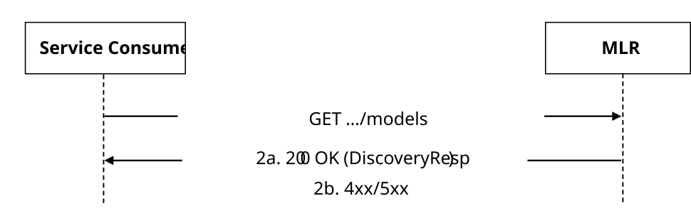

Figure 5.3.2.2.2.2-1: Procedure for ML model discovery request

1\. In order to discover the ML model(s), the service consumer shall send an HTTP GET request to the MLR targeting the URI of the "ML Models" resource.

2a. Upon success, the MLR shall respond with an HTTP "200 OK" status code with the response body containing the DiscoveryResp data structure.

2b. On failure, the appropriate HTTP status code indicating the error shall be returned and appropriate additional error information should be returned in the HTTP GET response body, as specified in clause 6.2.2.7.

## 5.3.3 MLR_FLEvents Service

### 5.3.3.1 Service Description

The MLR_FLEvents Service, exposed by the AIMLE Server or the VAL Server via the AIMLE Server, enables a service consumer to:

\- create/update/delete an MLR FL Events Subscription; and

\- receive MLR FL Events Notifications.

### 5.3.3.2 Service Operations

#### 5.3.3.2.1 Introduction

The service operations defined for the MLR_FLEvents API are shown in the table 5.3.3.2.1-1.

Table 5.3.3.2.1-1: Service operations of the MLR_FLEvents API

| Service Operation Name   | Description                                                                                            | Initiated by       |
|--------------------------|--------------------------------------------------------------------------------------------------------|--------------------|
| MLR_FLEvents_Subscribe   | This service operation enables a service consumer to create an FL related event subscription.          | e.g., AIMLE Server |
| MLR_FLEvents_Update      | This service operation enables a service consumer to update an existing FL related event subscription. | e.g., AIMLE Server |
| MLR_FLEvents_Unsubscribe | This service operation enables a service consumer to delete an existing FL related event subscription. | e.g., AIMLE Server |
| MLR_FLEvents_Notify      | This service operation enables a service consumer to receive FL related events notifications.          | ML Repository      |

#### 5.3.3.2.2 MLR_FLEvents_Subscribe

##### 5.3.3.2.2.1 General

This service operation is used by an e.g., AIMLE Server to request the creation of an MLR FL Events Subscription at the ML Repository.

The following procedures are supported by the "MLR_FLEvents_Subscribe" service operation:

\- MLR FL Events Subscription Creation.

This service operation is used by the analytics consumer e.g., AIMLE Server for MLR FL Events Subscription to the ML Repository.

##### 5.3.3.2.2.2 MLR FL Events Subscription Creation

Figure 5.3.3.2.2.2-1 depicts a scenario where a service consumer sends a request to the ML Repository to request the creation of MLR FL Events Subscription (see also clause 8.5 of 3GPP TS 23.482 \[9\]).

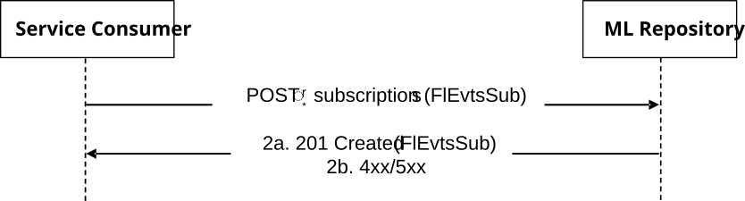

Figure 5.3.3.2.2.2-1: Procedure for MLR FL Events Subscription Creation

1\. In order to subscribe to MLR FL events, the service consumer shall send an HTTP POST request to the ML Repository targeting the URI of the "MLR FL Events Subscriptions" collection resource, with the request body including the FlEvtsSub data structure.

2a. Upon success, the ML Repository shall respond with an HTTP "201 Created" status code with the response body containing a representation of the created "Individual MLR FL Events Subscription" resource within the FlEvtsSub data structure, and an HTTP "Location" header field containing the URI of the created resource.

2b. On failure, the appropriate HTTP status code indicating the error shall be returned and appropriate additional error information should be returned in the HTTP POST response body, as specified in clause 6.2.3.7.

#### 5.3.3.2.3 MLR_FLEvents_Update

##### 5.3.3.2.3.1 General

This service operation is used by an e.g., the AIMLE Server to request the update of an MLR FL Events Subscription at the ML Repository.

The following procedures are supported by the "MLR_FLEvents_Update" service operation:

\- MLR FL Events Subscription Update.

This service operation is used by the analytics consumer for MLR FL Events Subscription Update to the ML Repository.

##### 5.3.3.2.3.2 MLR FL Events Subscription Update

Figure 5.3.3.2.3.2-1 depicts a scenario where a service consumer sends a request to the ML Repository to request the update of MLR FL Events Subscription (see also clause 8.5 of 3GPP TS 23.482 \[9\]).

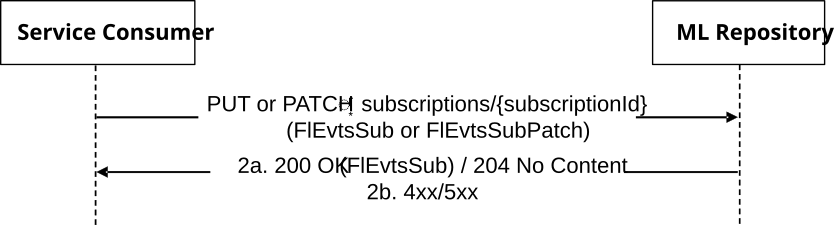

Figure 5.3.3.2.3.2-1: Procedure for MLR FL Events Subscription Update

1\. In order to request the update of an existing MLR FL events subscription, the service consumer shall send an HTTP PUT/PATCH request to the ML Repository, targeting the URI of the corresponding "Individual MLR FL Events Subscription" resource, with the request body including either:

\- the updated representation of the resource within the FlEvtsSub data structure, in case the HTTP PUT method is used; or

\- the requested modifications to the resource within the FlEvtsSubPatch data structure, in case the HTTP PATCH method is used.

2a. Upon success, the ML Repository shall update the targeted "Individual MLR FL Events Subscription" resource accordingly and respond with either:

\- an HTTP "200 OK" status code with the response body containing a representation of the updated resource within the FlEvtsSub data structure; or

\- an HTTP "204 No Content" status code.

2b. On failure, the appropriate HTTP status code indicating the error shall be returned and appropriate additional error information should be returned in the HTTP PUT/PATCH response body, as specified in clause 6.2.3.7.

#### 5.3.3.2.4 MLR_FLEvents_Unsubscribe

##### 5.3.3.2.4.1 General

This service operation is used by an e.g., the AIMLE Server to request the deletion of MLR FL Events Subscription at the ML Repository.

The following procedures are supported by the "MLR_FLEvents_Unsubscribe" service operation:

\- MLR FL Events Subscription Deletion.

##### 5.3.3.2.4.2 MLR FL Events Subscription Deletion

Figure 5.3.3.2.4.2-1 depicts a scenario where a service consumer sends a request to the ML Repository to delete an existing MLR FL Events Subscription (see also clause 8.5 of 3GPP TS 23.482 \[9\]).

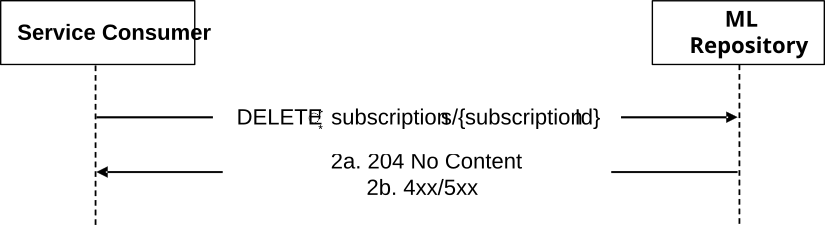

Figure 5.3.3.2.4.2-1: Procedure for MLR FL Events Subscription Deletion

1\. In order to request the deletion of an existing MLR FL events subscription, the service consumer shall send an HTTP DELETE request to the ML Repository targeting the URI of the corresponding "Individual MLR FL Events Subscription" resource.

2a. Upon success, the ML Repository shall respond with an HTTP "204 No Content" status code.

2b. On failure, the appropriate HTTP status code indicating the error shall be returned and appropriate additional error information should be returned in the HTTP DELETE response body, as specified in clause 6.2.3.7.

#### 5.3.3.2.5 MLR_FLEvents_Notify

##### 5.3.3.2.5.1 General

This service operation is used by an ML Repository to notify a previously subscribed service consumer on:

\- MLR FL Events report(s).

The following procedures are supported by the "MLR_FlEvents_Notify" service operation:

\- MLR FL Events Notification.

##### 5.3.3.2.5.2 MLR FL Events Notification

Figure 5.3.3.2.5.2-1 depicts a scenario where the ML Repository sends a request to notify a previously subscribed service consumer on MLR FL Events report(s) (see also clause 8.5 of 3GPP TS 23.482 \[9\]).

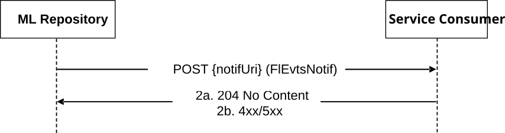

Figure 5.3.3.2.5.2-1: Procedure for MLR FL Events Notification

1\. In order to notify a previously subscribed service consumer on MLR FL Events report(s), the MLR repository shall send an HTTP POST request to the service consumer with the request URI set to "{notifUri}", where the "notifUri" variable is set to the value received from the service consumer during the creation of the corresponding MLR FL Events Subscription using the procedures defined in clauses 5.3.3.2.2.2, and the request body including the FlEvtsNotif data structure.

2a. Upon success, the service consumer shall respond to the ML Repository with an HTTP "204 No Content" status code to acknowledge the reception of the notification.

2b. On failure, the appropriate HTTP status code indicating the error shall be returned and appropriate additional error information should be returned in the HTTP POST response body, as specified in clause 6.2.3.7.

## 5.3.4 MLR_FLMember Service

### 5.3.4.1 Service Description

The MLR_FLMember Service, exposed by the AIMLE Repository, enables a service consumer to:

\- register/update/deregister/retrieve FL members consisting of AIMLE Clients.

### 5.3.4.2 Service Operations

#### 5.3.4.2.1 Introduction

The service operations defined for MLR_FLMember API for are shown in the table 5.3.4.2.1-1.

Table 5.3.4.2.1-1: Operations for MLR_FLMember API

| Service operation name  | Description                                                                                  | Initiated by       |
|-------------------------|----------------------------------------------------------------------------------------------|--------------------|
| MLR_FLMember_Register   | This service operation is used to register an Individual FL Member.                          | e.g., AIMLE Server |
| MLR_FLMember_Query      | This service operation is used to query for an Individual registered FL Member.              | e.g., AIMLE Server |
| MLR_FLMember_Update     | This service operation is used to update registration of an Individual registered FL Member. | e.g., AIMLE Server |
| MLR_FLMember_Deregister | This service operation is used to deregister an Individual registered FL Member.             | e.g., AIMLE Server |

#### 5.3.4.2.2 MLR_FLMember_Register

##### 5.3.4.2.2.1 General

This service operation is used by a service consumer to request the AIMLE Repository to register an Individual FL Member.

The following procedure is supported by the "MLR_FLMember_Register" service operation:

\- MLR FL Member Register.

##### 5.3.4.2.2.2 MLR FL Member Register

Figure 5.3.4.2.2.2-1 depicts a scenario where a service consumer sends a request to the AIMLE Repository to register an Individual FL Member. (see clause 8.4 of 3GPP TS 23.482 \[9\]).

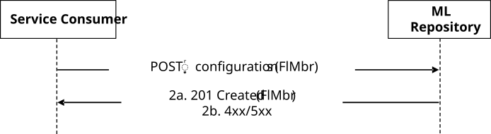

Figure 5.3.4.2.2.2-1: Procedure for MLR FL Member Register

1\. In order to register an Individual FL Member, the service consumer shall send an HTTP POST request to the AIMLE Repository targeting the URI of the corresponding resource (i.e., "FL Member Configurations"), with the request body including the FlMbr data structure.

2a. Upon success that the request to register the Individual FL Member is successfully received and processed, the AIMLE Repository shall respond with an HTTP "201 Created" status code with the response body including the FlMbr data structure.

2b. On failure, the appropriate HTTP status code indicating the error shall be returned and appropriate additional error information should be returned in the HTTP POST response body, as specified in clause 6.2.4.7.

#### 5.3.4.2.3 MLR_FLMember_Query

##### 5.3.4.2.3.1 General

This service operation is used by a service consumer to request the AIMLE Repository to query an Individual FL Member.

The following procedure is supported by the "MLR_FLMember_Query" service operation:

\- MLR FL Member Query.

##### 5.3.4.2.3.2 MLR FL Member Query

Figure 5.3.4.2.3.2-1 depicts a scenario where a service consumer sends a request to the AIMLE Repository to query an Individual FL Member. (see clause 8.4 of 3GPP TS 23.482 \[9\]).

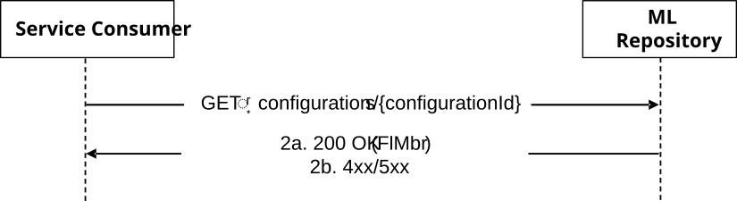

Figure 5.3.4.2.3.2-1: Procedure for MLR FL Member Query

1\. In order to query an Individual Registered FL Member, the service consumer shall send an HTTP GET request to the AIMLE Repository targeting the URI of the corresponding resource (i.e., " Individual FL Member Configuration ").

2a. Upon success that the request to query the Registered FL Member is successfully received and processed, the AIMLE Repository shall respond with an HTTP "200 OK" status code with the request body including the FlMbr data structure.

2b. On failure, the appropriate HTTP status code indicating the error shall be returned and appropriate additional error information should be returned in the HTTP GET response body, as specified in clause 6.2.4.7.

#### 5.3.4.2.4 MLR_FLMember_Update

##### 5.3.4.2.4.1 General

This service operation is used by a service consumer to request the AIMLE Repository to update registration of an Individual Registered FL Member.

The following procedure is supported by the "MLR_FLMember_Update" service operation:

\- MLR FL Member Update Register.

##### 5.3.4.2.4.2 MLR FL Member Update Register

Figure 5.3.4.2.4.2-1 depicts a scenario where a service consumer sends a request to the AIMLE Repository to update registration of an Individual Registered FL Member. (see clause 8.4 of 3GPP TS 23.482 \[9\]).

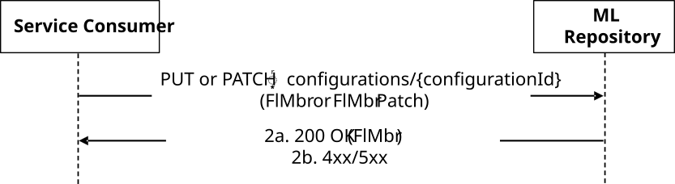

Figure 5.3.4.2.4.2-1: Procedure for MLR FL Member Update

1\. In order to update an Individual Registered FL Member, the service consumer shall send an HTTP PUT/PATCH request to the AIMLE Repository targeting the URI of the corresponding resource (i.e., "Individual FL Member Configuration"), with the request body including either:

\- the updated representation of the resource within the FlMbr data structure, in case the HTTP PUT method is used; or

\- the requested modifications to the resource within the FlMbrPatch data structure, in case the HTTP PATCH method is used.

NOTE: An alternative service consumer (i.e. other than the one that requested the creation of the targeted resource) can initiate this request.

2a. Upon success that the request to update the Individual FL Member Configuration is successfully received and processed, the AIMLE Repository shall respond with an HTTP "200 OK" status code with the response body including the FlMbr data structure.

\- an HTTP "200 OK" status code with the response body containing a representation of the updated resource within the FlMbr data structure; or

\- an HTTP "204 No Content" status code.

2b. On failure, the appropriate HTTP status code indicating the error shall be returned and appropriate additional error information should be returned in the HTTP PUT/PATCH response body, as specified in clause 6.2.4.7.

#### 5.3.4.2.5 MLR_FLMember_Deregister

##### 5.3.4.2.5.1 General

This service operation is used by a service consumer to request the AIMLE Repository to deregister an Individual Registered FL Member.

The following procedure is supported by the "MLR_FLMember_Deregister" service operation:

\- MLR FL Member Deregister.

##### 5.3.4.2.5.2 MLR FL Member Deregister

Figure 5.3.4.2.5.2-1 depicts a scenario where a service consumer sends a request to the AIMLE Repository to deregister an Individual Registered FL Member. (see also clause 8.4 of 3GPP TS 23.482 \[9\]).

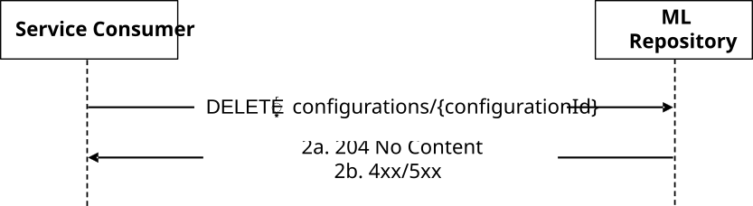

Figure 5.3.4.2.5.2-1: Procedure for MLR FL Member Deregister

1\. In order to delete an Individual Registered FL Member, the service consumer shall send an HTTP DELETE request to the AIMLE Repository targeting the URI of the corresponding resource (i.e., "Individual FL Member Configuration").

2a. Upon success that the request to delete the Individual Registered FL Member is successfully received and processed, the AIMLE Repository shall respond with an HTTP "204 No Content" status code.

2b. On failure, the appropriate HTTP status code indicating the error shall be returned and appropriate additional error information should be returned in the HTTP DELETE response body, as specified in clause 6.2.4.7.

## 5.3.5 MLR_CrossPlmnAIMLEServerDiscovery Service

### 5.3.5.1 Service Description

The MLR_CrossPlmnAIMLEServerDiscovery service, exposed by the ML repository, enables a service consumer to:

\- request the ML repository, discovery of a cross-PLMN AIMLE Server as defined in clause 8.32 of 3GPP TS 23.482 \[9\].

### 5.3.5.2 Service Operations

#### 5.3.5.2.1 Introduction

The service operation defined for MLR_CrossPlmnAIMLEServerDiscovery is shown in the table 5.3.5.2.1-1.

Table 5.3.5.2.1-1: MLR_CrossPlmnAIMLEServerDiscovery Service Operations

| Service operation name           | Description                                                                       | Initiated by                          |
|----------------------------------|-----------------------------------------------------------------------------------|---------------------------------------|
| MLR_AIMLEServerDiscovery_Request | This service operation is used to request discovery of a cross-PLMN AIMLE Server. | Service consumer (e.g., AIMLE Server) |

#### 5.3.5.2.2 MLR_AIMLEServerDiscovery_Request

##### 5.3.5.2.2.1 General

This service operation is used by a service consumer (e.g., AIMLE Server) to request the ML repository, discovery of a cross-PLMN AIMLE Server.

The following procedures are supported by the "MLR_AIMLEServerDiscovery_Request" service operation:

\- Cross-PLMN AIMLE Server Discovery Request.

##### 5.3.5.2.2.2 Cross-PLMN AIMLE Server Discovery Request

Figure 5.3.5.2.2.2-1 depicts a scenario where a service consumer (e.g., AIMLE Server) sends a request to the ML repository to request discovery of a cross-PLMN AIMLE Server (see clause 8.32 of 3GPP TS 23.482 \[9\]).

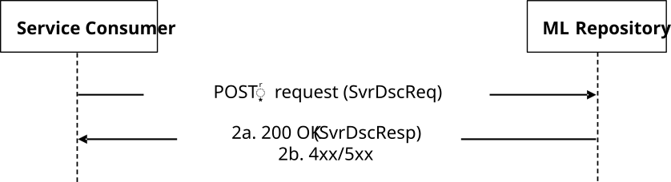

Figure 5.3.5.2.2.2-1: Procedure for Cross-PLMN AIMLE Server Discovery Request

1\. To request cross-PLMN AIMLE server discovery, the service consumer shall send an HTTP POST request to the ML Repository targeting the URI of the corresponding custom operation "RequestSvrDsc", with the request body including the SvrDscReq data structure.

2a. Upon success, the ML Repository shall respond with an HTTP "200 OK" status code with the response body containing the SvrDscResp data structure.

2b. On failure, the appropriate HTTP status code indicating the error shall be returned and appropriate additional error information should be returned in the HTTP POST response body, as specified in clause 6.2.5.7.
