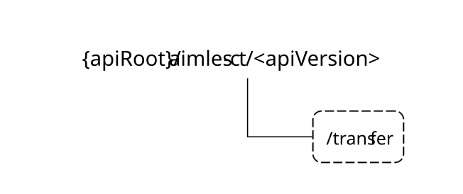

# 6.1.1 AIMLES_ContextTransfer API

## 6.1.1.1 Introduction

The AIMLES_ContextTransfer service shall use the AIMLES_ContextTransfer API.

The API URI of the AIMLES_ContextTransfer API shall be:

**{apiRoot}/\<apiName\>/\<apiVersion\>**

The request URIs used in HTTP requests shall have the Resource URI structure defined in clause 6.5 of 3GPP TS 29.549 \[10\], i.e.:

**{apiRoot}/\<apiName\>/\<apiVersion\>/\<apiSpecificSuffixes\>**

with the following components:

\- The {apiRoot} shall be set as described in clause 6.5 of 3GPP TS 29.549 \[10\].

\- The \<apiName\> shall be "aimles-ct".

\- The \<apiVersion\> shall be "v1".

\- The \<apiSpecificSuffixes\> shall be set as described in clauses 6.1.1.3 and 6.1.1.4.

NOTE: When 3GPP TS 29.122 \[2\] is referenced for the common protocol and interface aspects for API definition in the clauses under clause 6.1.1, the AIMLE Server takes the role of the SCEF and the service consumer takes the role of the SCS/AS.

## 6.1.1.2 Usage of HTTP

The provisions of clause 6.3 of 3GPP TS 29.549 \[10\] shall apply for the AIMLES_ContextTransfer API.

## 6.1.1.3 Resources

There are no resources defined for this API in this release of the specification.

## 6.1.1.4 Custom Operations without associated resources

### 6.1.1.4.1 Overview

The structure of the custom operation URIs of the AIMLES_ContextTransfer API is shown in Figure 6.1.1.4.1-1.

Figure 6.1.1.4.1-1: Custom operation URI structure of the AIMLES_ContextTransfer API

Table 6.1.1.4.1-1 provides an overview of the custom operations and applicable HTTP methods defined for the AIMLES_ContextTransfer API.

Table 6.1.1.4.1-1: Custom operations without associated resources

| Custom Operation Name | Custom operation URI | Mapped HTTP method | Description                                                                       |
|-----------------------|----------------------|--------------------|-----------------------------------------------------------------------------------|
| Transfer              | /transfer            | POST               | Enables a service consumer to request AIMLE context transfer to the AIMLE Server. |

The custom operations shall support the URI variables defined in table 6.1.1.4.1-2.

Table 6.1.1.4.1-2: URI variables for this custom operation

| Name    | Data type | Definition          |
|---------|-----------|---------------------|
| apiRoot | string    | See clause 6.1.1.1. |

### 6.1.1.4.2 Operation: Transfer

#### 6.1.1.4.2.1 Description

The custom operation enables a service consumer to send AIMLE context transfer to the AIMLE Server.

#### 6.1.1.4.2.2 Operation Definition

This operation shall support the request data structures and the response data structures and response codes specified in tables 6.1.1.4.2.2-1 and 6.1.1.4.2.2-2.

Table 6.1.1.4.2.2-1: Data structures supported by the POST Request Body on this custom operation

| Data type | P   | Cardinality | Description                                                |
|-----------|-----|-------------|------------------------------------------------------------|
| TransReq  | M   | 1           | Contains the parameters to request AIMLE context transfer. |

Table 6.1.1.4.2.2-2: Data structures supported by the POST Response Body on this custom operation

<table>
<colgroup>
<col style="width: 16%" />
<col style="width: 4%" />
<col style="width: 11%" />
<col style="width: 14%" />
<col style="width: 52%" />
</colgroup>
<thead>
<tr class="header">
<th>Data type</th>
<th>P</th>
<th>Cardinality</th>
<th>
Response

codes
</th>
<th>Description</th>
</tr>
</thead>
<tbody>
<tr class="odd">
<td>n/a</td>
<td></td>
<td></td>
<td>204 No Content</td>
<td>Successful case. The AIMLE Context Transfer request is successfully received and processed.</td>
</tr>
<tr class="even">
<td>n/a</td>
<td></td>
<td></td>
<td>307 Temporary Redirect</td>
<td>
Temporary redirection.

The response shall include a Location header field containing an alternative target URI located in an alternative AIMLE Server.

Redirection handling is described in clause 5.2.10 of 3GPP TS 29.122 [2].
</td>
</tr>
<tr class="odd">
<td>n/a</td>
<td></td>
<td></td>
<td>308 Permanent Redirect</td>
<td>
Permanent redirection.

The response shall include a Location header field containing an alternative target URI located in an alternative AIMLE Server.

Redirection handling is described in clause 5.2.10 of 3GPP TS 29.122 [2].
</td>
</tr>
<tr class="even">
<td colspan="5">NOTE: The mandatory HTTP error status codes for the HTTP POST method listed in Table 5.2.6-1 of 3GPP TS 29.122 [2] shall also apply.</td>
</tr>
</tbody>
</table>

Table 6.1.1.4.2.2-3: Headers supported by the 307 Response Code on this custom operation

| Name     | Data type | P   | Cardinality | Description                                                                |
|----------|-----------|-----|-------------|----------------------------------------------------------------------------|
| Location | string    | M   | 1           | Contains an alternative target URI located in an alternative AIMLE Server. |

Table 6.1.1.4.2.2-4: Headers supported by the 308 Response Code on this custom operation

| Name     | Data type | P   | Cardinality | Description                                                                |
|----------|-----------|-----|-------------|----------------------------------------------------------------------------|
| Location | string    | M   | 1           | Contains an alternative target URI located in an alternative AIMLE Server. |

## 6.1.1.5 Notifications

There are no notifications defined for this API in this release of the specification.

## 6.1.1.6 Data Model

### 6.1.1.6.1 General

This clause specifies the application data model supported by the API.

Table 6.1.1.6.1-1 specifies the data types defined for the AIMLES_ContextTransfer API.

Table 6.1.1.6.1-1: AIMLES_ContextTransfer API specific Data Types

| Data type            | Clause defined | Description                                                         | Applicability |
|----------------------|----------------|---------------------------------------------------------------------|---------------|
| AimleClientId        | 6.1.1.6.3.2    | Represents the unique identifier of the AIMLE Client.               |               |
| AimleServApp         | 6.1.1.6.2.4    | Represents the AIMLE service applicability information.             |               |
| AimleServOpStatus    | 6.1.1.6.3.3    | Represents the AIMLE service operations status.                     |               |
| AimleServStatus      | 6.1.1.6.2.3    | Represents the AIMLE service operations status related information. |               |
| MLContextInformation | 6.1.1.6.2.5    | Represents the context information related to the ML operation.     |               |
| TransReq             | 6.1.1.6.2.2    | Represents the AIMLE context transfer request.                      |               |

Table 6.1.1.6.1-2 specifies data types re-used by the AIMLES_ContextTransfer API from other specifications, including a reference to their respective specifications and when needed, a short description of their use within the AIMLES_ContextTransfer API.

Table 6.1.1.6.1-2: AIMLES_ContextTransfer API re-used Data Types

| Data type           | Reference             | Comments                                                 | Applicability |
|---------------------|-----------------------|----------------------------------------------------------|---------------|
| AimlOperation       | 3GPP TS 24.560 \[12\] | Represents the type of ML task.                          |               |
| DataSetRequirements | 3GPP TS 24.560 \[12\] | Represents the requirements on data set for FL training. |               |
| LocationArea5G      | 3GPP TS 29.122 \[2\]  | Represents Location information.                         |               |
| MLModelDetail       | 6.1.13.6.2.7          | Represents the ML Model information.                     |               |
| SplitOpProfile      | 6.1.12.6.2.9          | Represents the split operation profile.                  |               |

### 6.1.1.6.2 Structured data types

#### 6.1.1.6.2.1 Introduction

This clause defines the structures to be used in resource representations.

#### 6.1.1.6.2.2 Type: TransReq

Table 6.1.1.6.2.2-1: Definition of type TransReq

| Attribute name | Data type            | P   | Cardinality | Description                                                                                                                                                                                                                  | Applicability |
|----------------|----------------------|-----|-------------|------------------------------------------------------------------------------------------------------------------------------------------------------------------------------------------------------------------------------|---------------|
| clientId       | AimleClientId        | M   | 1           | Contains the identifier of the AIMLE Client to which the transferred context is associated.                                                                                                                                  |               |
| currServerId   | string               | O   | 0..1        | Contains the identifier of the AIMLE Server currently managing the AIMLE Client, i.e., the AIMLE Server associated with service area that the AIMLE Client (to which the transferred context is associated) is currently in. |               |
| prevServerIds  | array(string)        | O   | 1..N        | Contains the list of the identifier(s) of the AIMLE Server(s) that have previously managed the AIMLE Client (to which the transferred context is associated). This list is maintained by the AIMLE Client.                   |               |
| servStatus     | AimleServStatus      | O   | 0..1        | Contains the status of the AIML operations at the AIMLE Client.                                                                                                                                                              |               |
| servRes        | string               | O   | 0..1        | Contains the result of the AIML operations performed by the AIMLE Client.                                                                                                                                                    |               |
| servApp        | AimleServApp         | O   | 0..1        | Contains the applicability information of the AIML operations performed by the AIMLE Client.                                                                                                                                 |               |
| mlContextInfo  | MLContextInformation | O   | 0..1        | Contains the context information related to the ML operation that the AIMLE client is participating in or performing.                                                                                                        |               |

#### 6.1.1.6.2.3 Type: AimleServStatus

Table 6.1.1.6.2.3-1: Definition of type AimleServStatus

<table>
<colgroup>
<col style="width: 14%" />
<col style="width: 16%" />
<col style="width: 4%" />
<col style="width: 11%" />
<col style="width: 38%" />
<col style="width: 13%" />
</colgroup>
<thead>
<tr class="header">
<th>Attribute name</th>
<th>Data type</th>
<th>P</th>
<th>Cardinality</th>
<th>Description</th>
<th>Applicability</th>
</tr>
</thead>
<tbody>
<tr class="odd">
<td>servOpStatus</td>
<td>AimleServOpStatus</td>
<td>M</td>
<td>1</td>
<td>Contains the status of the AIML operations at the AIMLE Client.</td>
<td></td>
</tr>
<tr class="even">
<td>servOpCompPer</td>
<td>integer</td>
<td>O</td>
<td>0..1</td>
<td>
Contains the percentage of completion of the AIML operations at the AIMLE Client.

Minimum = 0. Maximum = 100.

This attribute may be present only when the value of the "servOpStatus" attribute is either "ACTIVE" or "PAUSED".
</td>
<td></td>
</tr>
</tbody>
</table>

#### 6.1.1.6.2.4 Type: AimleServApp

Table 6.1.1.6.2.4-1: Definition of type AimleServApp

| Attribute name    | Data type      | P   | Cardinality | Description                                                                                                    | Applicability |
|-------------------|----------------|-----|-------------|----------------------------------------------------------------------------------------------------------------|---------------|
| serviceArea       | LocationArea5G | O   | 0..1        | Contains the service area where the AIML operations are performed by the AIMLE client.                         |               |
| operationPipeline | string         | O   | 0..1        | Contains the split operation pipeline information where the AIML operations are performed by the AIMLE client. |               |

#### 6.1.1.6.2.5 Type: MLContextInformation

Table 6.1.1.6.2.5-1: Definition of type MLContextInformation

<table>
<colgroup>
<col style="width: 14%" />
<col style="width: 16%" />
<col style="width: 4%" />
<col style="width: 11%" />
<col style="width: 38%" />
<col style="width: 13%" />
</colgroup>
<thead>
<tr class="header">
<th>Attribute name</th>
<th>Data type</th>
<th>P</th>
<th>Cardinality</th>
<th>Description</th>
<th>Applicability</th>
</tr>
</thead>
<tbody>
<tr class="odd">
<td>valServId</td>
<td>string</td>
<td>O</td>
<td>0..1</td>
<td>Identifies the VAL Service, for which the request applies.</td>
<td></td>
</tr>
<tr class="even">
<td>mlModelInfo</td>
<td>MLModelDetail</td>
<td>M</td>
<td>1</td>
<td>Identifies the ML model, for which the request applies.</td>
<td></td>
</tr>
<tr class="odd">
<td>mlTask</td>
<td>AimlOperation</td>
<td>O</td>
<td>0..1</td>
<td>Identifies the ML task, for which the request applies.</td>
<td></td>
</tr>
<tr class="even">
<td>dataSetInfo</td>
<td>DataSetRequirements</td>
<td>O</td>
<td>0..1</td>
<td>
Identifies the data set information for training.

This attribute may be present only when the mlTask attribute value is set to "MODEL_TRAINING".
</td>
<td></td>
</tr>
<tr class="odd">
<td>trainOpStatus</td>
<td>AimleServOpStatus</td>
<td>O</td>
<td>0..1</td>
<td>
Identifies the status of the training operation at AIMLE client.

This attribute may be present only when the mlTask attribute value is set to "MODEL_TRAINING".
</td>
<td></td>
</tr>
<tr class="even">
<td>splitTaskInfo</td>
<td>SplitOpProfile</td>
<td>O</td>
<td>0..1</td>
<td>
Identifies the split operation profile that the service consumer participates to.

This attribute may be present only when the mlTask attribute value is set to "MODEL_SPLIT".
</td>
<td></td>
</tr>
</tbody>
</table>

### 6.1.1.6.3 Simple data types and enumerations

#### 6.1.1.6.3.1 Introduction

This clause defines simple data types and enumerations that can be referenced from data structures defined in the previous clauses.

#### 6.1.1.6.3.2 Simple data types

The simple data types defined in table 6.1.1.6.3.2-1 shall be supported.

Table 6.1.1.6.3.2-1: Simple data types

| Type Name     | Type Definition | Description                                           | Applicability |
|---------------|-----------------|-------------------------------------------------------|---------------|
| AimleClientId | string          | Represents the unique identifier of the AIMLE Client. |               |

#### 6.1.1.6.3.3 Enumeration: AimleServOpStatus

The enumeration AimleServOpStatus represents the AIMLE service operation status information. It shall comply with the provisions defined in table 6.1.1.6.3.3-1.

Table 6.1.1.6.3.3-1: Enumeration AimleServOpStatus

| Enumeration value | Description                                                                        | Applicability |
|-------------------|------------------------------------------------------------------------------------|---------------|
| ACTIVE            | Indicates that the status of the AIML operations at the AIMLE Client is active.    |               |
| PAUSED            | Indicates that the status of the AIML operations at the AIMLE Client is paused.    |               |
| COMPLETED         | Indicates that the status of the AIML operations at the AIMLE Client is completed. |               |

### 6.1.1.6.4 Data types describing alternative data types or combinations of data types

There are no data types describing alternative data types or combinations of data types defined for this API in this release of the specification.

### 6.1.1.6.5 Binary data

#### 6.1.1.6.5.1 Binary Data Types

Table 6.1.1.6.5.1-1: Binary Data Types

| Name | Clause defined | Content type |
|------|----------------|--------------|
|      |                |              |

## 6.1.1.7 Error Handling

### 6.1.1.7.1 General

For the AIMLES_ContextTransfer API, error handling shall be supported as specified in clause 6.7 of 3GPP TS 29.549 \[10\].

In addition, the requirements in the following clauses are applicable for the AIMLES_ContextTransfer API.

### 6.1.1.7.2 Protocol Errors

No specific protocol errors for the AIMLES_ContextTransfer API are specified.

### 6.1.1.7.3 Application Errors

The application errors defined for the AIMLES_ContextTransfer API are listed in Table 6.1.1.7.3-1.

Table 6.1.1.7.3-1: Application errors

| Application Error | HTTP status code | Description | Applicability |
|-------------------|------------------|-------------|---------------|
|                   |                  |             |               |

## 6.1.1.8 Feature negotiation

The optional features in table 6.1.1.8-1 are defined for the AIMLES_ContextTransfer API. They shall be negotiated using the extensibility mechanism defined in clause 6.8 of 3GPP TS 29.549 \[10\].

Table 6.1.1.8-1: Supported Features

| Feature number | Feature Name | Description |
|----------------|--------------|-------------|
|                |              |             |

## 6.1.1.9 Security

The provisions of clause 9 of 3GPP TS 29.549 \[10\] shall apply for the AIMLES_ContextTransfer API API.
