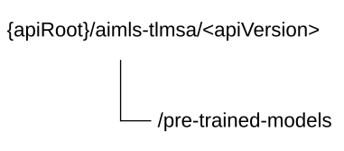

# 6.1.10 AIMLES_TLModelSelectionAssistance API

## 6.1.10.1 Introduction

The AIMLES_TLModelSelectionAssistance service shall use the AIMLES_TLModelSelectionAssistance API.

The API URI of the AIMLES_TLModelSelectionAssistance API shall be:

**{apiRoot}/\<apiName\>/\<apiVersion\>**

The request URIs used in HTTP requests shall have the Resource URI structure defined in clause 6.5 of 3GPP TS 29.549 \[10\], i.e.:

**{apiRoot}/\<apiName\>/\<apiVersion\>/\<apiSpecificSuffixes\>**

with the following components:

\- The {apiRoot} shall be set as described in clause 6.5 of 3GPP TS 29.549 \[10\].

\- The \<apiName\> shall be "aimles-tlmsa".

\- The \<apiVersion\> shall be "v1".

\- The \<apiSpecificSuffixes\> shall be set as described in clause 6.1.10.3 and clause 6.1.10.4.

NOTE: When 3GPP TS 29.122 \[2\] is referenced for the common protocol and interface aspects for API definition in the clauses under clause 6.1.10, the AIMLE Server takes the role of the SCEF and the service consumer takes the role of the SCS/AS.

## 6.1.10.2 Usage of HTTP and common API related aspects

The provisions of clause 6.3 of 3GPP TS 29.549 \[10\] shall apply for the AIMLES_TLModelSelectionAssistance API.

## 6.1.10.3 Resources

### 6.1.10.3.1 Overview

This clause describes the structure for the Resource URIs and the resources and methods used for the service.

Figure 6.1.10.3.1-1 depicts the resource URIs structure for the AIMLES_TLModelSelectionAssistance Service API.

Figure 6.1.10.3.1-1: Resource URI structure of the AIMLES_TLModelSelectionAssistance Service API

Table 6.1.10.3.1-1 provides an overview of the resources and applicable HTTP methods.

Table 6.1.10.3.1-1: Resources and methods overview

| Resource purpose/name               | Resource URI (relative path after API URI) | HTTP method or custom operation | Description (service operation)                                                      |
|-------------------------------------|--------------------------------------------|---------------------------------|--------------------------------------------------------------------------------------|
| AIMLE TL Model Selection Assistance | /pre-trained-models                        | GET                             | Request the AIMLE TL Model Selection Assistance according to the filtering criteria. |

### 6.1.10.3.2 Resource: AIMLE TL Model Selection Assistance

#### 6.1.10.3.2.1 Description

The "AIMLE TL Model Selection Assistance" resource represents the AIMLE TL Model Selection Assistance.

#### 6.1.10.3.2.2 Resource Definition

Resource URI: **{apiRoot}/aimles-tlmsa/\<apiVersion\>/pre-trained-models**

This resource shall support the resource URI variables defined in the table 6.1.10.3.2.2-1.

Table 6.1.10.3.2.2-1: Resource URI variables for this resource

| Name    | Data Type | Definition           |
|---------|-----------|----------------------|
| apiRoot | string    | See clause 6.1.10.1. |

#### 6.1.10.3.2.3 Resource Standard Methods

##### 6.1.10.3.2.3.1 GET

This method shall support the URI query parameters specified in table 6.1.10.3.2.3.1-1.

Table 6.1.10.3.2.3.1-1: URI query parameters supported by the GET method on this resource

<table style="width:100%;">
<colgroup>
<col style="width: 14%" />
<col style="width: 21%" />
<col style="width: 3%" />
<col style="width: 11%" />
<col style="width: 49%" />
</colgroup>
<thead>
<tr class="header">
<th>Name</th>
<th>Data type</th>
<th>P</th>
<th>Cardinality</th>
<th>Description</th>
</tr>
</thead>
<tbody>
<tr class="odd">
<td>filt-criteria</td>
<td>TlModelSelectAssistReq</td>
<td>M</td>
<td>1</td>
<td>Represents the AIMLE TL Model Selection Assistance filtering criteria.</td>
</tr>
<tr class="even">
<td>supported-features</td>
<td>SupportedFeatures</td>
<td>C</td>
<td>0..1</td>
<td>
Contains supported features information, used to negotiate the applicability of optional features.

This query parameter shall be present only if feature negotiation needs to take place.
</td>
</tr>
</tbody>
</table>

This method shall support the request data structures specified in table 6.1.10.3.2.3.1-2 and the response data structures and response codes specified in table 6.1.10.3.2.3.1-3.

Table 6.1.10.3.2.3.1-2: Data structures supported by the GET Request Body on this resource

| Data type | P   | Cardinality | Description |
|-----------|-----|-------------|-------------|
| n/a       |     |             |             |

Table 6.1.10.3.2.3.1-3: Data structures supported by the GET Response Body on this resource

<table>
<colgroup>
<col style="width: 23%" />
<col style="width: 3%" />
<col style="width: 11%" />
<col style="width: 12%" />
<col style="width: 49%" />
</colgroup>
<thead>
<tr class="header">
<th>Data type</th>
<th>P</th>
<th>Cardinality</th>
<th>
Response

codes
</th>
<th>Description</th>
</tr>
</thead>
<tbody>
<tr class="odd">
<td>TlModelSelectAssistResp</td>
<td>M</td>
<td>1</td>
<td>200 OK</td>
<td>Successful case. The response body contains one or more pre-trained ML models for the target ML task.</td>
</tr>
<tr class="even">
<td>n/a</td>
<td></td>
<td></td>
<td>307 Temporary Redirect</td>
<td>
Temporary redirection.

The response shall include a Location header field containing an alternative target URI of the resource located in an alternative AIMLE Server.

Redirection handling is described in clause 5.2.10 of 3GPP TS 29.122 [2].
</td>
</tr>
<tr class="odd">
<td>n/a</td>
<td></td>
<td></td>
<td>308 Permanent Redirect</td>
<td>
Permanent redirection.

The response shall include a Location header field containing an alternative target URI of the resource located in an alternative AIMLE Server.

Redirection handling is described in clause 5.2.10 of 3GPP TS 29.122 [2].
</td>
</tr>
<tr class="even">
<td colspan="5">NOTE: The mandatory HTTP error status codes for the HTTP GET method listed in table 5.2.6-1 of 3GPP TS 29.122 [2] shall also apply.</td>
</tr>
</tbody>
</table>

Table 6.1.10.3.2.3.1-4: Headers supported by the 307 Response Code on this resource

| Name     | Data type | P   | Cardinality | Description                                                                         |
|----------|-----------|-----|-------------|-------------------------------------------------------------------------------------|
| Location | string    | M   | 1           | Contains an alternative URI of the resource located in an alternative AIMLE Server. |

Table 6.1.10.3.2.3.1-5: Headers supported by the 308 Response Code on this resource

| Name     | Data type | P   | Cardinality | Description                                                                         |
|----------|-----------|-----|-------------|-------------------------------------------------------------------------------------|
| Location | string    | M   | 1           | Contains an alternative URI of the resource located in an alternative AIMLE Server. |

#### 6.1.10.3.2.4 Resource Custom Operations

There are no resource custom operations defined for this resource in this release of the specification.

## 6.1.10.4 Custom Operations without associated resources

There are no custom operations without associated resources in the present release of the document.

## 6.1.10.5 Notifications

There are no notifications in the present release of the document.

## 6.1.10.6 Data Model

### 6.1.10.6.1 General

This clause specifies the application data model supported by the API.

Table 6.1.10.6.1-1 specifies the data types defined for the AIMLES_TLModelSelectionAssistance API.

Table 6.1.10.6.1-1: AIMLES_TLModelSelectionAssistance API specific Data Types

| Data type | Section defined | Description | Applicability |
|-----------|-----------------|-------------|---------------|
|           |                 | .           |               |

Table 6.1.10.6.1-2 specifies data types re-used by the AIMLES_TLModelSelectionAssistance API from other specifications, including a reference to their respective specifications, and when needed, a short description of their use within the AIMLES_TLModelSelectionAssistance API.

Table 6.1.10.6.1-2: AIMLES_TLModelSelectionAssistance API Re-used Data Types

| Data type               | Reference             | Comments                                                                                         | Applicability |
|-------------------------|-----------------------|--------------------------------------------------------------------------------------------------|---------------|
| SupportedFeatures       | 3GPP TS 29.571 \[11\] | Represents the supported features, used to negotiate the supported optional features of the API. |               |
| TlModelSelectAssistReq  | 3GPP TS 24.560 \[12\] | Represents the filter criteria.                                                                  |               |
| TlModelSelectAssistResp | 3GPP TS 24.560 \[12\] | Represents the pre-trained models for the target ML task.                                        |               |

### 6.1.10.6.2 Structured data types

#### 6.1.10.6.2.1 Introduction

There is not any structure to be used in resource representations.

### 6.1.10.6.3 Simple data types and enumerations

#### 6.1.10.6.3.1 Introduction

This clause defines simple data types and enumerations that can be referenced from data structures defined in the previous clauses.

#### 6.1.10.6.3.2 Simple data types

The simple data types defined in table 6.1.10.6.3.2-1 shall be supported.

Table 6.1.10.6.3.2-1: Simple data types

|           |                 |             |               |
|-----------|-----------------|-------------|---------------|
| Type Name | Type Definition | Description | Applicability |
|           |                 |             |               |

### 6.1.10.6.4 Data types describing alternative data types or combinations of data types

There are no data types describing alternative data types and combinations of data types in this release of the specification.

### 6.1.10.6.5 Binary data

There are no binary data defined in this release of the specification.

## 6.1.10.7 Error Handling

### 6.1.10.7.1 General

For the AIMLES_TLModelSelectionAssistance API, error handling shall be supported as specified in clause 6.7 of 3GPP TS 29.549 \[10\].

In addition, the requirements in the following clauses are applicable for the AIMLES_TLModelSelectionAssistance API.

### 6.1.10.7.2 Protocol Errors

No specific procedures for the AIMLES_TLModelSelectionAssistance API are specified.

### 6.1.10.7.3 Application Errors

The application errors defined for AIMLES_TLModelSelectionAssistance API are listed in table 6.1.10.7.3-1.

Table 6.1.10.7.3-1: Application errors

| Application Error | HTTP status code | Description | Applicability |
|-------------------|------------------|-------------|---------------|
|                   |                  |             |               |

## 6.1.10.8 Feature Negotiation

The optional features in table 6.1.10.8-1 are defined for the AIMLES_TLModelSelectionAssistance API. They shall be negotiated using the extensibility mechanism defined in clause 6.8 of 3GPP TS 29.549 \[10\].

Table 6.1.10.8-1: Supported Features

| Feature number | Feature Name | Description |
|----------------|--------------|-------------|
|                |              |             |

## 6.1.10.9 Security

The provisions of clause 9 of 3GPP TS 29.549 \[10\] shall apply for the AIMLES_TLModelSelectionAssistance API.
