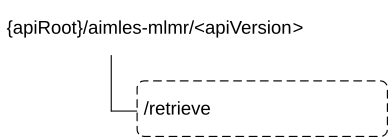

# 6.1.13.4 Custom Operations without associated resources

## 6.1.13.4.1 Overview

The structure of the custom operation URIs of the AIMLES_MLModelRetrieval API is shown in Figure 6.1.13.4.1-1.

Figure 6.1.13.4.1-1: Custom operation URI structure of the AIMLES_MLModelRetrieval API

Table 6.1.13.4.1-1 provides an overview of the custom operations and applicable HTTP methods defined for the AIMLES_MLModelRetrieval API.

Table 6.1.13.4.1-1: Custom operations without associated resources

| Custom Operation Name | Custom operation URI | Mapped HTTP method | Description                                                                              |
|-----------------------|----------------------|--------------------|------------------------------------------------------------------------------------------|
| Retrieve              | /retrieve            | POST               | Enables a service consumer to send AIMLE ML Model retrieval request to the AIMLE server. |

The custom operations shall support the URI variables defined in table 6.1.13.4.1-2.

Table 6.1.13.4.1-2: URI variables for this custom operation

| Name    | Data type | Definition        |
|---------|-----------|-------------------|
| apiRoot | string    | See clause 6.1.8. |

## 6.1.13.4.2 Operation: Retrieve

### 6.1.13.4.2.1 Description

The custom operation enables a service consumer to send AIMLE ML Model retrieval request to the AIMLE server.

### 6.1.13.4.2.2 Operation Definition

This operation shall support the response data structures and response codes specified in tables 6.1.13.4.2.2-1 and 6.1.13.4.2.2-2.

Table 6.1.13.4.2.2-1: Data structures supported by the POST Request Body on this resource

|             |     |             |                                                              |
|-------------|-----|-------------|--------------------------------------------------------------|
| Data type   | P   | Cardinality | Description                                                  |
| MLMdlRetReq | M   | 1           | Contains the parameters to request AIMLE ML Model retrieval. |

Table 6.1.13.4.2.2-2: Data structures supported by the POST Response Body on this resource

<table>
<colgroup>
<col style="width: 16%" />
<col style="width: 4%" />
<col style="width: 12%" />
<col style="width: 11%" />
<col style="width: 54%" />
</colgroup>
<tbody>
<tr class="odd">
<td>Data type</td>
<td>P</td>
<td>Cardinality</td>
<td>
Response

codes
</td>
<td>Description</td>
</tr>
<tr class="even">
<td>MLMdlRetRsp</td>
<td>M</td>
<td>1</td>
<td>200 OK</td>
<td>Successful case. The ML Model retrieval request is successfully received and processed. The identifier of the ML model selected by AIMLE server for retrieval shall be included in the response message.</td>
</tr>
<tr class="odd">
<td>n/a</td>
<td></td>
<td></td>
<td>307 Temporary Redirect</td>
<td>
Temporary redirection.

The response shall include a Location header field containing an alternative target URI located in an alternative target AIMLE server.

Redirection handling is described in clause 5.2.10 of 3GPP TS 29.122 [2].
</td>
</tr>
<tr class="even">
<td>n/a</td>
<td></td>
<td></td>
<td>308 Permanent Redirect</td>
<td>
Permanent redirection.

The response shall include a Location header field containing an alternative target URI located in an alternative target AIMLE server.

Redirection handling is described in clause 5.2.10 of 3GPP TS 29.122 [2].
</td>
</tr>
<tr class="odd">
<td colspan="5">NOTE: The manadatory HTTP error status code for the &lt;e.g. HTTP POST&gt; method listed in table 5.2.1.6-1 of 3GPP TS 29.122 [2] also apply.</td>
</tr>
</tbody>
</table>
