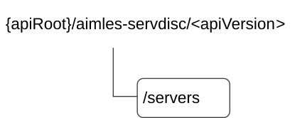

# 6.1.18 AIMLES_ServerDiscovery API

## 6.1.18.1 Introduction

The AIMLES_ServerDiscovery service shall use the AIMLES_ServerDiscovery API.

The API URI of the AIMLES_ServerDiscovery API shall be:

**{apiRoot}/\<apiName\>/\<apiVersion\>**

The request URIs used in HTTP requests shall have the Resource URI structure defined in clause 6.5 of 3GPP TS 29.549 \[10\], i.e.:

**{apiRoot}/\<apiName\>/\<apiVersion\>/\<apiSpecificSuffixes\>**

with the following components:

\- The {apiRoot} shall be set as described in clause 6.5 of 3GPP TS 29.549 \[10\].

\- The \<apiName\> shall be "aimles-servdisc".

\- The \<apiVersion\> shall be "v1".

\- The \<apiSpecificSuffixes\> shall be set as described in clause 6.1.18.3 and clause 6.1.18.4.

NOTE: When 3GPP TS 29.122 \[2\] is referenced for the common protocol and interface aspects for API definition in the clauses under clause 6.1.18, the AIMLE Server takes the role of the SCEF and the service consumer takes the role of the SCS/AS.

## 6.1.18.2 Usage of HTTP and common API related aspects

The provisions of clause 6.3 of 3GPP TS 29.122 \[2\] shall apply for the AIMLES_ServerDiscovery API.

## 6.1.18.3 Resources

### 6.1.18.3.1 Overview

This clause describes the structure for the Resource URIs and the resources and methods used for the service.

Figure 6.1.18.3.1-1 depicts the resource URIs structure for the AIMLES_ServerDiscovery Service API.

Figure 6.1.18.3.1-1: Resource URI structure of the AIMLES_ServerDiscovery Service API

Table 6.1.18.3.1-1 provides an overview of the resources and applicable HTTP methods.

Table 6.1.18.3.1-1: Resources and methods overview

| Resource purpose/name | Resource URI (relative path after API URI) | HTTP method or custom operation | Description (service operation)                                 |
|-----------------------|--------------------------------------------|---------------------------------|-----------------------------------------------------------------|
| AIMLE Servers         | /servers                                   | GET                             | Discover the AIMLE Servers according to the filtering criteria. |

### 6.1.18.3.2 Resource: AIMLE Servers

#### 6.1.18.3.2.1 Description

The "AIMLE Servers" resource represents the AIMLE Servers.

#### 6.1.18.3.2.2 Resource Definition

Resource URI: **{apiRoot}/aimles-servdisc/\<apiVersion\>/servers**

This resource shall support the resource URI variables defined in the table 6.1.18.3.2.2-1.

Table 6.1.18.3.2.2-1: Resource URI variables for this resource

| Name    | Data Type | Definition                               |
|---------|-----------|------------------------------------------|
| apiRoot | string    | See clause 6.5 of 3GPP TS 29.549 \[10\]. |

#### 6.1.18.3.2.3 Resource Standard Methods

##### 6.1.18.3.2.3.1 GET

This method shall support the URI query parameters specified in table 6.1.18.3.2.3.1-1.

Table 6.1.18.3.2.3.1-1: URI query parameters supported by the GET method on this resource

<table>
<colgroup>
<col style="width: 15%" />
<col style="width: 17%" />
<col style="width: 3%" />
<col style="width: 11%" />
<col style="width: 51%" />
</colgroup>
<thead>
<tr class="header">
<th>Name</th>
<th>Data type</th>
<th>P</th>
<th>Cardinality</th>
<th>Description</th>
</tr>
</thead>
<tbody>
<tr class="odd">
<td>serv-filt-criteria</td>
<td>ServerDiscCriteria</td>
<td>M</td>
<td>1</td>
<td>Represents the AIMLE server(s) discovery filtering criteria.</td>
</tr>
<tr class="even">
<td>supp-feats</td>
<td>SupportedFeatures</td>
<td>C</td>
<td>0..1</td>
<td>
Contains supported features information, used to negotiate the applicability of optional features.

This query parameter shall be present only if feature negotiation needs to take place.
</td>
</tr>
</tbody>
</table>

This method shall support the request data structures specified in table 6.1.18.3.2.3.1-2 and the response data structures and response codes specified in table 6.1.18.3.2.3.1-3.

Table 6.1.18.3.2.3.1-2: Data structures supported by the GET Request Body on this resource

| Data type | P   | Cardinality | Description |
|-----------|-----|-------------|-------------|
| n/a       |     |             |             |

Table 6.1.18.3.2.3.1-3: Data structures supported by the GET Response Body on this resource

<table>
<colgroup>
<col style="width: 21%" />
<col style="width: 3%" />
<col style="width: 11%" />
<col style="width: 13%" />
<col style="width: 50%" />
</colgroup>
<thead>
<tr class="header">
<th>Data type</th>
<th>P</th>
<th>Cardinality</th>
<th>
Response

codes
</th>
<th>Description</th>
</tr>
</thead>
<tbody>
<tr class="odd">
<td>ServerDiscResp</td>
<td>M</td>
<td>1</td>
<td>200 OK</td>
<td>Successful case. The AIMLE Server(s) matching the query filter criteria shall be returned.</td>
</tr>
<tr class="even">
<td>n/a</td>
<td></td>
<td></td>
<td>307 Temporary Redirect</td>
<td>
Temporary redirection.

The response shall include a Location header field containing an alternative target URI of the resource located in an alternative AIMLE Server.

Redirection handling is described in clause 5.2.10 of 3GPP TS 29.122 [2].
</td>
</tr>
<tr class="odd">
<td>n/a</td>
<td></td>
<td></td>
<td>308 Permanent Redirect</td>
<td>
Permanent redirection.

The response shall include a Location header field containing an alternative target URI of the resource located in an alternative AIMLE Server.

Redirection handling is described in clause 5.2.10 of 3GPP TS 29.122 [2].
</td>
</tr>
<tr class="even">
<td colspan="5">NOTE: The mandatory HTTP error status codes for the HTTP GET method listed in table 5.2.6-1 of 3GPP TS 29.122 [2] shall also apply.</td>
</tr>
</tbody>
</table>

Table 6.1.18.3.2.3.1-4: Headers supported by the 307 Response Code on this resource

|          |           |     |             |                                                                                     |
|----------|-----------|-----|-------------|-------------------------------------------------------------------------------------|
| Name     | Data type | P   | Cardinality | Description                                                                         |
| Location | string    | M   | 1           | Contains an alternative URI of the resource located in an alternative AIMLE Server. |

Table 6.1.18.3.2.3.1-5: Headers supported by the 308 Response Code on this resource

|          |           |     |             |                                                                                     |
|----------|-----------|-----|-------------|-------------------------------------------------------------------------------------|
| Name     | Data type | P   | Cardinality | Description                                                                         |
| Location | string    | M   | 1           | Contains an alternative URI of the resource located in an alternative AIMLE Server. |

#### 6.1.18.3.2.4 Resource Custom Operations

There are no resource custom operations defined for this resource in this release of the specification.

## 6.1.18.4 Custom Operations without associated resources

There are no custom operations without associated resources in the present release of the document.

## 6.1.18.5 Notifications

There are no notifications in the present release of the document.

## 6.1.18.6 Data Model

### 6.1.18.6.1 General

This clause specifies the application data model supported by the API.

Table 6.1.18.6.1-1 specifies the data types defined for the AIMLES_ServerDiscovery API.

Table 6.1.18.6.1-1: AIMLES_ServerDiscovery API specific Data Types

| Data type            | Section defined | Description                                                                                                                                                                     | Applicability |
|----------------------|-----------------|---------------------------------------------------------------------------------------------------------------------------------------------------------------------------------|---------------|
| AuthScheme           | 6.1.18.6.3.6    | Represents the authentication scheme supported by the AIMLE server.                                                                                                             |               |
| FunctionalCapability | 6.1.18.6.2.6    | Represents the functional capabilities of the AIMLE server (e.g., such as supported modalities, maximum input/output length, supported quantizations, streaming/batch support). |               |
| InferenceTaskReq     | 6.1.18.6.2.7    | Represents the requirements related to the inference task type. This information may be present when the task type is inference.                                                |               |
| LatencyRange         | 6.1.18.6.2.11   | Represents the supported latency range of the AIMLE server.                                                                                                                     |               |
| Modality             | 6.1.18.6.3.4    | Represents the modality supported.                                                                                                                                              |               |
| PerformanceProfile   | 6.1.18.6.2.10   | Represents the performance parameters of the AIMLE server, such as latency ranges, throughput, and concurrency limits.                                                          |               |
| PerformanceReq       | 6.1.18.6.2.8    | Represents the performance requirements (Target latency, throughput, concurrency/batch requirements, confidence reporting).                                                     |               |
| Precision            | 6.1.18.6.3.5    | Represents the required precision of the inference task.                                                                                                                        |               |
| ProcessingCapability | 6.1.18.6.2.9    | Represents the processing capability (eg., CPU/GPU/memory) of the AIMLE server.                                                                                                 |               |
| ServerDiscCriteria   | 6.1.18.6.2.2    | Represents the discovery criteria for discovering suitable AIMLE servers for AI/ML operations.                                                                                  |               |
| ServerDiscResp       | 6.1.18.6.2.3    | Represents the AIMLE Server discovery response.                                                                                                                                 |               |
| ServerEndpoint       | 6.1.18.6.2.4    | Represents the endpoints and supported interface profile of the AIMLE server.                                                                                                   |               |
| ServerInfo           | 6.1.18.6.2.5    | Represents the information of discovered AIMLE server.                                                                                                                          |               |
| TaskType             | 6.1.18.6.3.3    | Represents the type of AI/ML operations that should be supported (e.g., model training, testing, inference, model split, etc).                                                  |               |

Table 6.1.18.6.1-2 specifies data types re-used by the AIMLES_ServerDiscovery API from other specifications, including a reference to their respective specifications, and when needed, a short description of their use within the AIMLES_ServerDiscovery API.

Table 6.1.18.6.1-2: AIMLES_ServerDiscovery API Re-used Data Types

| Data type                  | Reference             | Comments                                                                                                      | Applicability |
|----------------------------|-----------------------|---------------------------------------------------------------------------------------------------------------|---------------|
| DateTime                   | 3GPP TS 29.122 \[2\]  | Represents a timestamp.                                                                                       |               |
| DurationSec                | 3GPP TS 29.122 \[2\]  | Represents the duration in seconds.                                                                           |               |
| LocationInfo               | 3GPP TS 29.122 \[2\]  | Represents the location info related to the AIMLE server.                                                     |               |
| ScheduledCommunicationTime | 3GPP TS 29.122 \[2\]  | Represents the availability duration or schedule of the AIMLE server.                                         |               |
| SupportedFeatures          | 3GPP TS 29.571 \[11\] | Represents the list of supported feature(s) and used to negotiate the applicability of the optional features. |               |
| Uinteger                   | 3GPP TS 29.571 \[11\] | Represents the integer attributes within measurement data.                                                    |               |
| Uri                        | 3GPP TS 29.122 \[2\]  | Represents the notification URI.                                                                              |               |

### 6.1.18.6.2 Structured data types

#### 6.1.18.6.2.1 Introduction

This clause defines the structures to be used in resource representations.

#### 6.1.18.6.2.2 Type: ServerDiscCriteria

Table 6.1.18.6.2.2-1: Definition of type ServerDiscCriteria

<table style="width:100%;">
<colgroup>
<col style="width: 16%" />
<col style="width: 15%" />
<col style="width: 9%" />
<col style="width: 11%" />
<col style="width: 32%" />
<col style="width: 13%" />
</colgroup>
<thead>
<tr class="header">
<th>Attribute name</th>
<th>Data type</th>
<th>P</th>
<th>Cardinality</th>
<th>Description</th>
<th>Applicability</th>
</tr>
</thead>
<tbody>
<tr class="odd">
<td>locInfo</td>
<td>LocationInfo</td>
<td>
C

(NOTE)
</td>
<td>0..1</td>
<td>Represents the location information and serving area information of the AIMLE server to be discovered.</td>
<td></td>
</tr>
<tr class="even">
<td>valServiceId</td>
<td>string</td>
<td>
C

(NOTE)
</td>
<td>0..1</td>
<td>Represents the identity of the VAL service for which the request applies.</td>
<td></td>
</tr>
<tr class="odd">
<td>taskTypes</td>
<td>array(TaskType)</td>
<td>
C

(NOTE)
</td>
<td>1..N</td>
<td>Represents the type of AI/ML operations that should be supported (e.g., model training, testing, inference, model split, etc).</td>
<td></td>
</tr>
<tr class="even">
<td>modelIds</td>
<td>array(string)</td>
<td>
C

(NOTE)
</td>
<td>1..N</td>
<td>Represents the types of ML model supported identifiers of the ML models.</td>
<td></td>
</tr>
<tr class="odd">
<td>availSched</td>
<td>ScheduledCommunicationTime</td>
<td>
C

(NOTE)
</td>
<td>0..1</td>
<td>Represents the required availability duration or schedule of the AIMLE server.</td>
<td></td>
</tr>
<tr class="even">
<td>processingCapability</td>
<td>ProcessingCapability</td>
<td>
C

(NOTE)
</td>
<td>0..1</td>
<td>Represents the processing capability (e.g., CPU, GPU, Memory, etc) of the AIMLE server.</td>
<td></td>
</tr>
<tr class="odd">
<td>inferenceTaskReq</td>
<td>InferenceTaskReq</td>
<td>O</td>
<td>0..1</td>
<td>Represents the requirements related to the inference task type. This attribute may be present when the Task type is inference.</td>
<td></td>
</tr>
<tr class="even">
<td colspan="6">NOTE: At least one of these attributes shall be present.</td>
</tr>
</tbody>
</table>

#### 6.1.18.6.2.3 Type: ServerDiscResp

Table 6.1.18.6.2.3-1: Definition of type ServerDiscResp

| Attribute name | Data type         | P   | Cardinality | Description                                                           | Applicability |
|----------------|-------------------|-----|-------------|-----------------------------------------------------------------------|---------------|
| aimleServers   | array(ServerInfo) | M   | 0..N        | Represents the list of AIMLE servers matching the discovery criteria. |               |

#### 6.1.18.6.2.4 Type: ServerEndpoint

Table 6.1.18.6.2.4-1: Definition of type ServerEndpoint

| Attribute name | Data type  | P   | Cardinality | Description                                                         | Applicability |
|----------------|------------|-----|-------------|---------------------------------------------------------------------|---------------|
| apiUri         | Uri        | M   | 1           | Represents the URI of the AIMLE server service endpoint.            |               |
| apiVersion     | string     | O   | 0..1        | Represents the supported API version.                               |               |
| authScheme     | AuthScheme | O   | 0..1        | Represents the authentication scheme supported by the AIMLE server. |               |

#### 6.1.18.6.2.5 Type: ServerInfo

Table 6.1.18.6.2.5-1: Definition of type ServerInfo

| Attribute name       | Data type                  | P   | Cardinality | Description                                                            | Applicability |
|----------------------|----------------------------|-----|-------------|------------------------------------------------------------------------|---------------|
| serverId             | string                     | M   | 1           | Represents the identifier of the AIMLE server.                         |               |
| endpoint             | ServerEndpoint             | M   | 1           | Represents the service endpoint and supported interface profile.       |               |
| modelIds             | array(string)              | O   | 1..N        | Represents the identifiers of ML models supported by the AIMLE server. |               |
| processingCapability | ProcessingCapability       | O   | 0..1        | Represents the processing capability of the AIMLE server.              |               |
| functionalCapability | FunctionalCapability       | O   | 0..1        | Represents the functional capabilities of the AIMLE server.            |               |
| performanceProfile   | PerformanceProfile         | O   | 0..1        | Represents the performance parameters of the AIMLE server.             |               |
| availSched           | ScheduledCommunicationTime | O   | 0..1        | Represents the availability duration or schedule of AIMLE server.      |               |

#### 6.1.18.6.2.6 Type: FunctionalCapability

Table 6.1.18.6.2.6-1: Definition of type FunctionalCapability

| Attribute name   | Data type       | P   | Cardinality | Description                                      | Applicability |
|------------------|-----------------|-----|-------------|--------------------------------------------------|---------------|
| modalities       | array(Modality) | O   | 1..N        | Represents the supported modalities.             |               |
| maxInputLength   | Uinteger        | O   | 0..1        | Represents the maximum supported input length.   |               |
| maxOutputLength  | Uinteger        | O   | 0..1        | Represents the maximum supported output length.  |               |
| quantizations    | array(string)   | O   | 1..N        | Represents the supported quantization formats.   |               |
| streamingSupport | boolean         | O   | 0..1        | Indicates whether streaming is supported.        |               |
| batchSupport     | boolean         | O   | 0..1        | Indicates whether batch processing is supported. |               |

#### 6.1.18.6.2.7 Type: InferenceTaskReq

Table 6.1.18.6.2.7-1: Definition of type InferenceTaskReq

<table style="width:100%;">
<colgroup>
<col style="width: 16%" />
<col style="width: 15%" />
<col style="width: 8%" />
<col style="width: 7%" />
<col style="width: 38%" />
<col style="width: 13%" />
</colgroup>
<thead>
<tr class="header">
<th>Attribute name</th>
<th>Data type</th>
<th>P</th>
<th>Cardinality</th>
<th>Description</th>
<th>Applicability</th>
</tr>
</thead>
<tbody>
<tr class="odd">
<td>modalities</td>
<td>array(Modality)</td>
<td>
C

(NOTE)
</td>
<td>1..N</td>
<td>Represents the modalities required for the inference task. Multiple values indicate a multimodal inference task.</td>
<td></td>
</tr>
<tr class="even">
<td>precision</td>
<td>array(Precision)</td>
<td>
C

(NOTE)
</td>
<td>1..N</td>
<td>Represents the required precision of the inference task.</td>
<td></td>
</tr>
<tr class="odd">
<td>perfReq</td>
<td>PerformanceReq</td>
<td>
C

(NOTE)
</td>
<td>0..1</td>
<td>Represents the performance requirements.</td>
<td></td>
</tr>
<tr class="even">
<td colspan="6">NOTE: At least one of these attributes shall be present.</td>
</tr>
</tbody>
</table>

#### 6.1.18.6.2.8 Type: PerformanceReq

Table 6.1.18.6.2.8-1: Definition of type PerformanceReq

<table style="width:100%;">
<colgroup>
<col style="width: 16%" />
<col style="width: 15%" />
<col style="width: 8%" />
<col style="width: 7%" />
<col style="width: 38%" />
<col style="width: 13%" />
</colgroup>
<thead>
<tr class="header">
<th>Attribute name</th>
<th>Data type</th>
<th>P</th>
<th>Cardinality</th>
<th>Description</th>
<th>Applicability</th>
</tr>
</thead>
<tbody>
<tr class="odd">
<td>targetLatency</td>
<td>DurationSec</td>
<td>
C

(NOTE)
</td>
<td>0..1</td>
<td>Represents the maximum acceptable latency for the inference task.</td>
<td></td>
</tr>
<tr class="even">
<td>throughput</td>
<td>Uinteger</td>
<td>
C

(NOTE)
</td>
<td>0..1</td>
<td>Represents the supported throughput.</td>
<td></td>
</tr>
<tr class="odd">
<td>concurrencyReq</td>
<td>Uinteger</td>
<td>
C

(NOTE)
</td>
<td>0..1</td>
<td>Represents the required concurrency for the inference task.</td>
<td></td>
</tr>
<tr class="even">
<td>batchSize</td>
<td>Uinteger</td>
<td>
C

(NOTE)
</td>
<td>0..1</td>
<td>Represents the maximum batch size requirement for the inference task.</td>
<td></td>
</tr>
<tr class="odd">
<td>confidReporting</td>
<td>boolean</td>
<td>
C

(NOTE)
</td>
<td>0..1</td>
<td>Indicates whether confidence reporting is supported by the AIMLE server.</td>
<td></td>
</tr>
<tr class="even">
<td colspan="6">NOTE: At least one of these attributes shall be present.</td>
</tr>
</tbody>
</table>

#### 6.1.18.6.2.9 Type: ProcessingCapability

Table 6.1.18.6.2.9-1: Definition of type ProcessingCapability

| Attribute name | Data type | P   | Cardinality | Description                                     | Applicability |
|----------------|-----------|-----|-------------|-------------------------------------------------|---------------|
| cpuInfo        | string    | O   | 0..1        | Represents the cpu capability information.      |               |
| gpuInfo        | string    | O   | 0..1        | Represents the gpu capability information.      |               |
| memorySize     | Uinteger  | O   | 0..1        | Represents the available memory size.           |               |
| memoryUnit     | string    | O   | 0..1        | Represents the unit of memory (e.g., MB or GB). |               |

#### 6.1.18.6.2.10 Type: PerformanceProfile

Table 6.1.18.6.2.10-1: Definition of type PerformanceProfile

| Attribute name | Data type    | P   | Cardinality | Description                                                         | Applicability |
|----------------|--------------|-----|-------------|---------------------------------------------------------------------|---------------|
| latencyRange   | LatencyRange | O   | 0..1        | Represents the supported latency range.                             |               |
| maxConcurrency | Uinteger     | O   | 0..1        | Represents the maximum concurrency limit supported by AIMLE server. |               |
| throughput     | Uinteger     | O   | 0..1        | Represents the supported throughput.                                |               |

#### 6.1.18.6.2.11 Type: LatencyRange

Table 6.1.18.6.2.11-1: Definition of type LatencyRange

| Attribute name | Data type   | P   | Cardinality | Description                               | Applicability |
|----------------|-------------|-----|-------------|-------------------------------------------|---------------|
| minLatency     | DurationSec | O   | 0..1        | Represents the minimum supported latency. |               |
| maxLatency     | DurationSec | O   | 0..1        | Represents the maximum supported latency. |               |

### 6.1.18.6.3 Simple data types and enumerations

#### 6.1.18.6.3.1 Introduction

This clause defines simple data types and enumerations that can be referenced from data structures defined in the previous clauses.

#### 6.1.18.6.3.2 Simple data types

The simple data types defined in table 6.1.18.6.3.2-1 shall be supported.

Table 6.1.18.6.3.2-1: Simple data types

|           |                 |             |               |
|-----------|-----------------|-------------|---------------|
| Type Name | Type Definition | Description | Applicability |
|           |                 |             |               |

#### 6.1.18.6.3.3 Enumeration: TaskType

The enumeration TaskType represents the supported AI/ML operations. It shall comply with the provisions defined in table 6.1.18.6.3.3-1.

Table 6.1.18.6.3.3-1: Enumeration TaskType

| Enumeration value | Description                                                      | Applicability |
|-------------------|------------------------------------------------------------------|---------------|
| INFERENCE         | Indicates that the supported operation is model inference.       |               |
| TESTING           | Indicates that the supported operation is model testing.         |               |
| TRAINING          | Indicates that the supported operation is model training.        |               |
| MODEL_SPLIT       | Indicates that the supported operation is model split operation. |               |

#### 6.1.18.6.3.4 Enumeration: Modality

The enumeration Modality represents a modality supported by the AIMLE server or required for an inference task. It shall comply with the provisions defined in table 6.1.18.6.3.4-1.

Table 6.1.18.6.3.4-1: Enumeration Modality

| Enumeration value | Description                                      | Applicability |
|-------------------|--------------------------------------------------|---------------|
| AUDIO             | Indicates that the supported modality is audio.  |               |
| IMAGE             | Indicates that the supported modality is image.  |               |
| SENSOR            | Indicates that the supported modality is sensor. |               |
| TEXT              | Indicates that the supported modality is text.   |               |
| VIDEO             | Indicates that the supported modality is video.  |               |

#### 6.1.18.6.3.5 Enumeration: Precision

The enumeration Precision represents the required precision of the inference task. It shall comply with the provisions defined in table 6.1.18.6.3.5-1.

Table 6.1.18.6.3.5-1: Enumeration Precision

| Enumeration value | Description                                                                | Applicability |
|-------------------|----------------------------------------------------------------------------|---------------|
| FP16              | Indicates that the supported precision is 16-bit floating point precision. |               |
| FP32              | Indicates that the supported precision is 32-bit floating point precision. |               |
| INT8              | Indicates that the supported precision is 8-bit integer precision.         |               |

#### 6.1.18.6.3.6 Enumeration: AuthScheme

The enumeration AuthScheme represents the authentication scheme supported by the AIMLE server. It shall comply with the provisions defined in table 6.1.18.6.3.5-1.

Table 6.1.18.6.3.6-1: Enumeration AuthScheme

| Enumeration value | Description                                               | Applicability |
|-------------------|-----------------------------------------------------------|---------------|
| OAUTH2            | Indicates that the supported authentication is OAuth 2.0. |               |
| TLS_CERT          | Indicates the certificate-based authentication.           |               |
| API_KEY           | Indicates the API-key based authentication.               |               |

### 6.1.18.6.4 Data types describing alternative data types or combinations of data types

There are no data types describing alternative data types and combinations of data types in this release of the specification.

### 6.1.18.6.5 Binary data

There are no binary data defined in this release of the specification.

## 6.1.18.7 Error Handling

### 6.1.18.7.1 General

For the AIMLES_ServerDiscovery API, error handling shall be supported as specified in clause 6.7 of 3GPP TS 29.549 \[10\].

In addition, the requirements in the following clauses are applicable for the AIMLES_ServerDiscovery API.

### 6.1.18.7.2 Protocol Errors

No specific procedures for the AIMLES_ServerDiscovery API are specified.

### 6.1.18.7.3 Application Errors

The application errors defined for AIMLES_ServerDiscovery API are listed in table 6.1.18.7.3-1.

Table 6.1.18.7.3-1: Application errors

| Application Error | HTTP status code | Description | Applicability |
|-------------------|------------------|-------------|---------------|
|                   |                  |             |               |

## 6.1.18.8 Feature Negotiation

The optional features in table 6.1.18.8-1 are defined for the AIMLES_ServerDiscovery API. They shall be negotiated using the extensibility mechanism defined in clause 6.8 of 3GPP TS 29.549 \[10\].

Table 6.1.18.8-1: Supported Features

| Feature number | Feature Name | Description |
|----------------|--------------|-------------|
|                |              |             |

## 6.1.18.9 Security

The provisions of clause 9 of 3GPP TS 29.549 \[10\] shall apply for the AIMLES_ServerDiscovery API.
