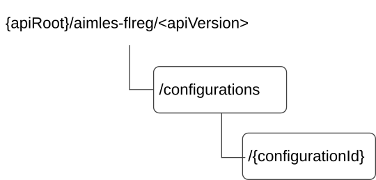

# 6.1.19 AIMLES_FLMember API

## 6.1.19.1 Introduction

The AIMLES_FLMember Service shall use the AIMLES_FLMember API.

The API URI of the AIMLES_FLMember API shall be:

**{apiRoot}/\<apiName\>/\<apiVersion\>**

The request URIs used in HTTP requests shall have the Resource URI structure defined in clause 6.5 of 3GPP TS 29.549 \[10\], i.e.:

**{apiRoot}/\<apiName\>/\<apiVersion\>/\<apiSpecificSuffixes\>**

with the following components:

> \- The {apiRoot} shall be set as described in clause 6.5 of 3GPP TS 29.549 \[10\].
>
> \- The \<apiName\> shall be "aimles-flreg".
>
> \- The \<apiVersion\> shall be "v1".
>
> \- The \<apiSpecificSuffixes\> shall be set as described in clause 6.1.19.3 and clause 6.1.19.4.
>
> NOTE: When 3GPP TS 29.122 \[2\] is referenced for the common protocol and interface aspects for API definition in the clauses under clause 6.1.19, the AIMLE Server takes the role of the SCEF and the service consumer takes the role of the SCS/AS.

## 6.1.19.2 Usage of HTTP and common API related aspects

The provisions of clause 6.3 of 3GPP TS 29.549 \[10\] shall apply for the AIMLES_FLMember API.

## 6.1.19.3 Resources

### 6.1.19.3.1 Overview

This clause describes the structure for the Resource URIs and the resources and methods used for the service.

Figure 6.1.19.3.1-1 depicts the resource URIs structure for the AIMLES_FLMember API.

**Figure 6.1.19.3.1-1: Resource URI structure of the AIMLES_FLMember API**

Table 6.1.19.3.1-1 provides an overview of the resources and applicable HTTP methods.

**Table 6.1.19.3.1-1: Resources and methods overview**

| **Resource name**                  | **Resource URI**                  | **HTTP method or custom operation** | **Description (service operation)**                     |
|------------------------------------|-----------------------------------|-------------------------------------|---------------------------------------------------------|
| FL Member Configurations           | /configurations                   | POST                                | Register a new Individual FL Member resource            |
| Individual FL Member Configuration | /configurations/{configurationId} | GET                                 | Query an Individual Registered FL Member resource.      |
|                                    |                                   | PUT                                 | Update an Individual Registered FL Member resource.     |
|                                    |                                   | PATCH                               | Modify an Individual Registered FL Member resource.     |
|                                    |                                   | DELETE                              | Deregister an Individual Registered FL Member resource. |

### 6.1.19.3.2 Resource: FL Member Configurations

#### 6.1.19.3.2.1 Description

This resource represents the FL Member Configurations resource managed by the AIMLE Server.

#### 6.1.19.3.2.2 Resource Definition

Resource URI: **{apiRoot}/aimles-flreg/\<apiVersion\>/configurations**

This resource shall support the resource URI variables defined in table 6.1.19.3.2.2-1.

Table 6.1.19.3.2.2-1: Resource URI variables for this resource

| Name    | Data type | Definition           |
|---------|-----------|----------------------|
| apiRoot | string    | See clause 6.1.19.1. |

#### 6.1.19.3.2.3 Resource Standard Methods

##### 6.1.19.3.2.3.1 POST

The HTTP POST method enables the service consumer (e.g., VAL Server) to register an FL Member at the AIMLE Server.

This method shall support the URI query parameters specified in table 6.1.19.3.2.3.1-1.

Table 6.1.19.3.2.3.1-1: URI query parameters supported by the POST method on this resource

| Name | Data type | P   | Cardinality | Description | Applicability |
|------|-----------|-----|-------------|-------------|---------------|
| n/a  |           |     |             |             |               |

This method shall support the request data structures specified in table 6.1.19.3.2.3.1-2 and the response data structures and response codes specified in table 6.1.19.3.2.3.1-3.

Table 6.1.19.3.2.3.1-2: Data structures supported by the POST Request Body on this resource

| Data type | P   | Cardinality | Description                          |
|-----------|-----|-------------|--------------------------------------|
| FlMbr     | M   | 1           | Register a new Individual FL member. |

Table 6.1.19.3.2.3.1-3: Data structures supported by the POST Response Body on this resource

<table>
<colgroup>
<col style="width: 16%" />
<col style="width: 4%" />
<col style="width: 12%" />
<col style="width: 11%" />
<col style="width: 54%" />
</colgroup>
<thead>
<tr class="header">
<th>Data type</th>
<th>P</th>
<th>Cardinality</th>
<th>
Response

codes
</th>
<th>Description</th>
</tr>
</thead>
<tbody>
<tr class="odd">
<td>FlMbr</td>
<td>M</td>
<td>1</td>
<td>201 Created</td>
<td>
Successful case. The registration of the new Individual FL Member is confirmed and a representation of that resource is returned.

An HTTP "Location" header that contains the URI of the created resource shall also be included.
</td>
</tr>
<tr class="even">
<td colspan="5">NOTE: The manadatory HTTP error status code for the HTTP POST method listed in table 5.2.6-1 of 3GPP TS 29.122 [2] also apply.</td>
</tr>
</tbody>
</table>

Table 6.1.19.3.2.3.1-4: Headers supported by the 201 Response Code on this resource

<table>
<colgroup>
<col style="width: 16%" />
<col style="width: 14%" />
<col style="width: 4%" />
<col style="width: 11%" />
<col style="width: 52%" />
</colgroup>
<thead>
<tr class="header">
<th>Name</th>
<th>Data type</th>
<th>P</th>
<th>Cardinality</th>
<th>Description</th>
</tr>
</thead>
<tbody>
<tr class="odd">
<td>Location</td>
<td>string</td>
<td>M</td>
<td>1</td>
<td>
Contains the URI of the newly created resource, according to the structure:

{apiRoot}/aimles-flreg/&lt;apiVersion&gt;/configurations/{configurationId}
</td>
</tr>
</tbody>
</table>

#### 6.1.19.3.2.4 Resource Custom Operations

There are no resource custom operations defined for this resource in this release of the specification.

### 6.1.19.3.3 Resource: Individual FL Member Configuration

#### 6.1.19.3.3.1 Description

This resource represents the individual FL Member Configuration resource managed by the AIMLE Server.

#### 6.1.19.3.3.2 Resource Definition

Resource URI: **{apiRoot}/aimles-flreg/\<apiVersion\>/configurations/{configurationId}**

This resource shall support the resource URI variables defined in table 6.1.19.3.3.2-1.

Table 6.1.19.3.3.2-1: Resource URI variables for this resource

| Name            | Data type | Definition                                                                    |
|-----------------|-----------|-------------------------------------------------------------------------------|
| apiRoot         | string    | See clause 6.1.19.1.                                                          |
| configurationId | string    | Represents the identifier of the Individual FL Member Configuration resource. |

#### 6.1.19.3.3.3 Resource Standard Methods

##### 6.1.19.3.3.3.1 GET

The HTTP GET method enables the service consumer (e.g., VAL Server) to query an Individual Registered FL Member at the AIMLE Server.

This method shall support the URI query parameters specified in table 6.1.19.3.3.3.1-1.

Table 6.1.19.3.3.3.1-1: URI query parameters supported by the GET method on this resource

| Name | Data type | P   | Cardinality | Description | Applicability |
|------|-----------|-----|-------------|-------------|---------------|
| n/a  |           |     |             |             |               |

This method shall support the request data structures specified in table 6.1.19.3.3.3.1-2 and the response data structures and response codes specified in table 6.1.19.3.3.3.1-3.

Table 6.1.19.3.3.3.1-2: Data structures supported by the GET Request Body on this resource

| Data type | P   | Cardinality | Description |
|-----------|-----|-------------|-------------|
| n/a       |     |             |             |

Table 6.1.19.3.3.3.1-3: Data structures supported by the GET Response Body on this resource

<table>
<colgroup>
<col style="width: 16%" />
<col style="width: 4%" />
<col style="width: 12%" />
<col style="width: 11%" />
<col style="width: 54%" />
</colgroup>
<thead>
<tr class="header">
<th>Data type</th>
<th>P</th>
<th>Cardinality</th>
<th>
Response

codes
</th>
<th>Description</th>
</tr>
</thead>
<tbody>
<tr class="odd">
<td>FlMbr</td>
<td>M</td>
<td>1</td>
<td>200 OK</td>
<td>Successful case. The requested information on the Individual Registered FL Member is confirmed and a representation of that resource is returned.</td>
</tr>
<tr class="even">
<td>n/a</td>
<td></td>
<td></td>
<td>307 Temporary Redirect</td>
<td>
Temporary redirection.

The response shall include a Location header field containing an alternative URI of the resource located in an alternative AIMLE Server.

Redirection handling is described in clause 5.2.10 of 3GPP TS 29.122 [2].
</td>
</tr>
<tr class="odd">
<td>n/a</td>
<td></td>
<td></td>
<td>308 Permanent Redirect</td>
<td>
Permanent redirection.

The response shall include a Location header field containing an alternative URI of the resource located in an alternative AIMLE Server.

Redirection handling is described in clause 5.2.10 of 3GPP TS 29.122 [2].
</td>
</tr>
<tr class="even">
<td colspan="5">NOTE: The manadatory HTTP error status code for the HTTP GET method listed in table 5.2.6-1 of 3GPP TS 29.122 [2] also apply.</td>
</tr>
</tbody>
</table>

Table 6.1.19.3.3.3.1-4: Headers supported by the 307 Response Code on this resource

| Name     | Data type | P   | Cardinality | Description                                                                         |
|----------|-----------|-----|-------------|-------------------------------------------------------------------------------------|
| Location | string    | M   | 1           | Contains an alternative URI of the resource located in an alternative AIMLE Server. |

Table 6.1.19.3.3.3.1-5: Headers supported by the 308 Response Code on this resource

| Name     | Data type | P   | Cardinality | Description                                                                         |
|----------|-----------|-----|-------------|-------------------------------------------------------------------------------------|
| Location | string    | M   | 1           | Contains an alternative URI of the resource located in an alternative AIMLE Server. |

##### 6.1.19.3.3.3.2 PUT

The HTTP PUT method enables the service consumer (e.g., VAL Server) to update an Individual Registered FL Member at the AIMLE Server.

This method shall support the URI query parameters specified in table 6.1.19.3.3.3.2-1.

Table 6.1.19.3.3.3.2-1: URI query parameters supported by the PUT method on this resource

| Name | Data type | P   | Cardinality | Description | Applicability |
|------|-----------|-----|-------------|-------------|---------------|
| n/a  |           |     |             |             |               |

This method shall support the request data structures specified in table 6.1.19.3.3.3.2-2 and the response data structures and response codes specified in table 6.1.19.3.3.3.2-3.

Table 6.1.19.3.3.3.2-2: Data structures supported by the PUT Request Body on this resource

| Data type | P   | Cardinality | Description                                                                  |
|-----------|-----|-------------|------------------------------------------------------------------------------|
| FlMbr     | M   | 1           | Represents the updated representation of an Individual Registered FL Member. |

Table 6.1.19.3.3.3.2-3: Data structures supported by the PUT Response Body on this resource

<table>
<colgroup>
<col style="width: 16%" />
<col style="width: 4%" />
<col style="width: 12%" />
<col style="width: 11%" />
<col style="width: 54%" />
</colgroup>
<thead>
<tr class="header">
<th>Data type</th>
<th>P</th>
<th>Cardinality</th>
<th>
Response

codes
</th>
<th>Description</th>
</tr>
</thead>
<tbody>
<tr class="odd">
<td>FlMbr</td>
<td>M</td>
<td>1</td>
<td>200 OK</td>
<td>Successful case. The requested update of the Individual Registered FL Member is confirmed and a representation of that resource is returned.</td>
</tr>
<tr class="even">
<td>n/a</td>
<td></td>
<td></td>
<td>204 No Content</td>
<td>Successful case. The requested update of the Individual Registered FL Member is confirmed and no content is returned.</td>
</tr>
<tr class="odd">
<td>n/a</td>
<td></td>
<td></td>
<td>307 Temporary Redirect</td>
<td>
Temporary redirection.

The response shall include a Location header field containing an alternative URI of the resource located in an alternative AIMLE Server.

Redirection handling is described in clause 5.2.10 of 3GPP TS 29.122 [2].
</td>
</tr>
<tr class="even">
<td>n/a</td>
<td></td>
<td></td>
<td>308 Permanent Redirect</td>
<td>
Permanent redirection.

The response shall include a Location header field containing an alternative URI of the resource located in an alternative AIMLE Server.

Redirection handling is described in clause 5.2.10 of 3GPP TS 29.122 [2].
</td>
</tr>
<tr class="odd">
<td colspan="5">NOTE: The manadatory HTTP error status code for the HTTP PUT method listed in table 5.2.6-1 of 3GPP TS 29.122 [2] also apply.</td>
</tr>
</tbody>
</table>

Table 6.1.19.3.3.3.2-4: Headers supported by the 307 Response Code on this resource

| Name     | Data type | P   | Cardinality | Description                                                                         |
|----------|-----------|-----|-------------|-------------------------------------------------------------------------------------|
| Location | string    | M   | 1           | Contains an alternative URI of the resource located in an alternative AIMLE Server. |

Table 6.1.19.3.3.3.2-5: Headers supported by the 308 Response Code on this resource

| Name     | Data type | P   | Cardinality | Description                                                                         |
|----------|-----------|-----|-------------|-------------------------------------------------------------------------------------|
| Location | string    | M   | 1           | Contains an alternative URI of the resource located in an alternative AIMLE Server. |

##### 6.1.19.3.3.3.3 PATCH

The HTTP PATCH method enables the service consumer (e.g., VAL Server) to modify an Individual Registered FL Member at the AIMLE Server.

This method shall support the URI query parameters specified in table 6.1.19.3.3.3.3-1.

Table 6.1.19.3.3.3.3-1: URI query parameters supported by the PATCH method on this resource

| Name | Data type | P   | Cardinality | Description | Applicability |
|------|-----------|-----|-------------|-------------|---------------|
| n/a  |           |     |             |             |               |

This method shall support the request data structures specified in table 6.1.19.3.3.3.3-2 and the response data structures and response codes specified in table 6.1.19.3.3.3.3-3.

Table 6.1.19.3.3.3.3-2: Data structures supported by the PATCH Request Body on this resource

| Data type  | P   | Cardinality | Description                                                                |
|------------|-----|-------------|----------------------------------------------------------------------------|
| FlMbrPatch | M   | 1           | Represents the parameters to modify of an Individual Registered FL Member. |

Table 6.1.19.3.3.3.3-3: Data structures supported by the PATCH Response Body on this resource

<table>
<colgroup>
<col style="width: 16%" />
<col style="width: 4%" />
<col style="width: 12%" />
<col style="width: 11%" />
<col style="width: 54%" />
</colgroup>
<thead>
<tr class="header">
<th>Data type</th>
<th>P</th>
<th>Cardinality</th>
<th>
Response

codes
</th>
<th>Description</th>
</tr>
</thead>
<tbody>
<tr class="odd">
<td>FlMbr</td>
<td>M</td>
<td>1</td>
<td>200 OK</td>
<td>Successful case. The requested modification of the Individual FL Registered Member is confirmed and a representation of that resource is returned.</td>
</tr>
<tr class="even">
<td>n/a</td>
<td></td>
<td></td>
<td>204 No Content</td>
<td>Successful case. The requested modification of the Individual Registered FL Member is confirmed and no content is returned.</td>
</tr>
<tr class="odd">
<td>n/a</td>
<td></td>
<td></td>
<td>307 Temporary Redirect</td>
<td>
Temporary redirection.

The response shall include a Location header field containing an alternative URI of the resource located in an alternative AIMLE Server

Redirection handling is described in clause 5.2.10 of 3GPP TS 29.122 [2].
</td>
</tr>
<tr class="even">
<td>n/a</td>
<td></td>
<td></td>
<td>308 Permanent Redirect</td>
<td>
Permanent redirection.

The response shall include a Location header field containing an alternative URI of the resource located in an alternative AIMLE Server.

Redirection handling is described in clause 5.2.10 of 3GPP TS 29.122 [2].
</td>
</tr>
<tr class="odd">
<td colspan="5">NOTE: The manadatory HTTP error status code for the HTTP PATCH method listed in table 5.2.6-1 of 3GPP TS 29.122 [2] also apply.</td>
</tr>
</tbody>
</table>

Table 6.1.19.3.3.3.3-4: Headers supported by the 307 Response Code on this resource

| Name     | Data type | P   | Cardinality | Description                                                                         |
|----------|-----------|-----|-------------|-------------------------------------------------------------------------------------|
| Location | string    | M   | 1           | Contains an alternative URI of the resource located in an alternative AIMLE Server. |

Table 6.1.19.3.3.3.3-5: Headers supported by the 308 Response Code on this resource

| Name     | Data type | P   | Cardinality | Description                                                                         |
|----------|-----------|-----|-------------|-------------------------------------------------------------------------------------|
| Location | string    | M   | 1           | Contains an alternative URI of the resource located in an alternative AIMLE Server. |

##### 6.1.19.3.3.3.4 DELETE

The HTTP DELETE method enables the service consumer (e.g., VAL Server) to deregister an Individual Registered FL Member at the AIMLE Server.

This method shall support the URI query parameters specified in table 6.1.19.3.3.3.4-1.

Table 6.1.19.3.3.3.4-1: URI query parameters supported by the DELETE method on this resource

| Name | Data type | P   | Cardinality | Description | Applicability |
|------|-----------|-----|-------------|-------------|---------------|
| n/a  |           |     |             |             |               |

This method shall support the request data structures specified in table 6.1.19.3.3.3.4-2 and the response data structures and response codes specified in table 6.1.19.3.3.3.4-3.

Table 6.1.19.3.3.3.4-2: Data structures supported by the DELETE Request Body on this resource

| Data type | P   | Cardinality | Description |
|-----------|-----|-------------|-------------|
| n/a       |     |             |             |

Table 6.1.19.3.3.3.4-3: Data structures supported by the DELETE Response Body on this resource

<table>
<colgroup>
<col style="width: 16%" />
<col style="width: 4%" />
<col style="width: 12%" />
<col style="width: 11%" />
<col style="width: 54%" />
</colgroup>
<thead>
<tr class="header">
<th>Data type</th>
<th>P</th>
<th>Cardinality</th>
<th>
Response

codes
</th>
<th>Description</th>
</tr>
</thead>
<tbody>
<tr class="odd">
<td>n/a</td>
<td></td>
<td></td>
<td>204 No Content</td>
<td>Successful case. Deregistration of the Individual Registered FL Member is confirmed.</td>
</tr>
<tr class="even">
<td>n/a</td>
<td></td>
<td></td>
<td>307 Temporary Redirect</td>
<td>
Temporary redirection.

The response shall include a Location header field containing an alternative URI of the resource located in an alternative AIMLE Server.

Redirection handling is described in clause 5.2.10 of 3GPP TS 29.122 [2].
</td>
</tr>
<tr class="odd">
<td>n/a</td>
<td></td>
<td></td>
<td>308 Permanent Redirect</td>
<td>
Permanent redirection.

The response shall include a Location header field containing an alternative URI of the resource located in an alternative AIMLE Server.

Redirection handling is described in clause 5.2.10 of 3GPP TS 29.122 [2].
</td>
</tr>
<tr class="even">
<td colspan="5">NOTE: The manadatory HTTP error status code for the HTTP DELETE method listed in table 5.2.6-1 of 3GPP TS 29.122 [2] also apply.</td>
</tr>
</tbody>
</table>

Table 6.1.19.3.3.3.4-4: Headers supported by the 307 Response Code on this resource

| Name     | Data type | P   | Cardinality | Description                                                                         |
|----------|-----------|-----|-------------|-------------------------------------------------------------------------------------|
| Location | string    | M   | 1           | Contains an alternative URI of the resource located in an alternative AIMLE Server. |

Table 6.1.19.3.3.3.4-5: Headers supported by the 308 Response Code on this resource

| Name     | Data type | P   | Cardinality | Description                                                                         |
|----------|-----------|-----|-------------|-------------------------------------------------------------------------------------|
| Location | string    | M   | 1           | Contains an alternative URI of the resource located in an alternative AIMLE Server. |

#### 6.1.19.3.3.4 Resource Custom Operations

There are no resource custom operations defined for this resource in this release of the specification.

## 6.1.19.4 Custom Operations without associated resources

### 6.1.19.4.1 Overview

There are no custom operations without associated resources defined for this API in this release of the specification.

## 6.1.19.5 Notifications

There are no notifications defined for this API in this release of the specification.

## 6.1.19.6 Data Model

### 6.1.19.6.1 General

This clause specifies the application data model supported by the API.

Table 6.1.19.6.1-1 specifies the data types defined for the AIMLES_FLMember API.

Table 6.1.19.6.1-1: AIMLES_FLMember API specific Data Types

| Data type | Clause defined | Description | Applicability |
|-----------|----------------|-------------|---------------|
|           |                |             |               |

Table 6.1.19.6.1-2 specifies data types re-used by the AIMLES_FLMember API from other specifications, including a reference to their respective specifications, and when needed, a short description of their use within the AIMLES_FLMember API.

Table 6.1.19.6.1-2: AIMLES_FLMember API re-used Data Types

| Data type  | Reference   | Comments                                                                                     | Applicability |
|------------|-------------|----------------------------------------------------------------------------------------------|---------------|
| FlMbr      | 6.2.4.6.2.2 | Registration of a new individual FL Member and Individual Registered FL Member to be updated |               |
| FlMbrPatch | 6.2.4.6.2.3 | Individual Registered FL Member to be modified                                               |               |

### 6.1.19.6.2 Structured data types

#### 6.1.19.6.2.1 Introduction

This clause defines the structures to be used in resource representations.

### 6.1.19.6.3 Simple data types and enumerations

#### 6.1.19.6.3.1 Introduction

This clause defines simple data types and enumerations that can be referenced from data structures defined in the previous clauses.

#### 6.1.19.6.3.2 Simple data types

The simple data types defined in table 6.1.19.6.3.2-1 shall be supported.

Table 6.1.19.6.3.2-1: Simple data types

| Type Name | Type Definition | Description | Applicability |
|-----------|-----------------|-------------|---------------|
|           |                 |             |               |

### 6.1.19.6.4 Data types describing alternative data types or combinations of data types

There are no data types describing alternative data types or combination of data types for AIMLES_FLMember API in this release of the specification.

### 6.1.19.6.5 Binary data

#### 6.1.19.6.5.1 Binary Data Types

The binary data types defined for the AIMLES_FLMember API are listed in Table 6.1.19.6.5.1-1.

Table 6.1.19.6.5.1-1: Binary Data Types

| Name | Clause defined | Content type |
|------|----------------|--------------|
|      |                |              |

## 6.1.19.7 Error Handling

### 6.1.19.7.1 General

For the AIMLES_FLMember API, HTTP error responses shall be supported as specified in clause 6.7 of 3GPP TS 29.549 \[10\].

In addition, the requirements in the following clauses are applicable for the AIMLES_FLMember API.

### 6.1.19.7.2 Protocol Errors

No specific procedures for the AIMLES_FLMember API are specified.

### 6.1.19.7.3 Application Errors

The application errors defined for the AIMLES_FLMember API are listed in Table 6.1.19.7.3-1.

Table 6.1.19.7.3-1: Application errors

| Application Error | HTTP status code | Description |
|-------------------|------------------|-------------|
|                   |                  |             |

## 6.1.19.8 Feature negotiation

The optional features in table 6.1.19.8-1 are defined for the AIMLES_FLMember API. They shall be negotiated using the extensibility mechanism defined in clause 6.8 of 3GPP TS 29.549 \[10\].

Table 6.1.19.8-1: Supported Features

| Feature number | Feature Name | Description |
|----------------|--------------|-------------|
|                |              |             |

## 6.1.19.9 Security

The provisions of clause 9 of 3GPP TS 29.549 \[10\] shall apply for the AIMLES_FLMember API.
