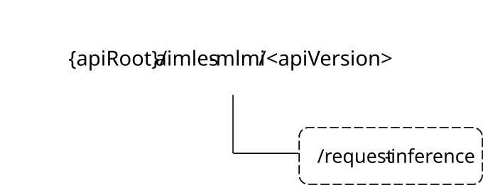

# 6.1.20 AIMLES_MLModelInference API

## 6.1.20.1 Introduction

The AIMLES_MLModelInference service shall use the AIMLES_MLModelInference API.

The API URI of the AIMLES_MLModelInference API shall be:

**{apiRoot}/\<apiName\>/\<apiVersion\>**

The request URIs used in HTTP requests shall have the Resource URI structure defined in clause 6.5 of 3GPP TS 29.549 \[10\], i.e.:

**{apiRoot}/\<apiName\>/\<apiVersion\>/\<apiSpecificSuffixes\>**

with the following components:

\- The {apiRoot} shall be set as described in clause 6.5 of 3GPP TS 29.549 \[10\].

\- The \<apiName\> shall be "aimles-mlmi".

\- The \<apiVersion\> shall be "v1".

\- The \<apiSpecificSuffixes\> shall be set as described in clauses 6.1.20.3 and 6.1.20.4.

NOTE: When 3GPP TS 29.122 \[2\] is referenced for the common protocol and interface aspects for API definition in the clauses under clause 6.1.20, the AIMLE Server takes the role of the SCEF and the service consumer takes the role of the SCS/AS.

## 6.1.20.2 Usage of HTTP and common API related aspects

The provisions of clause 6.3 of 3GPP TS 29.549 \[10\] shall apply for the AIMLES_MLModelInference API.

## 6.1.20.3 Resources

There are no resources defined for this API in this release of the specification.

## 6.1.20.4 Custom Operations without associated resources

### 6.1.20.4.1 Overview

The structure of the custom operation URIs of the AIMLES_MLModelInference API is shown in Figure 6.1.20.4.1-1.

Figure 6.1.20.4.1-1: Custom operation URI structure of the AIMLES_MLModelInference API

Table 6.1.20.4.1-1 provides an overview of the custom operations and applicable HTTP methods defined for the AIMLES_MLModelInference API.

Table 6.1.20.4.1-1: Custom operations without associated resources

| Custom Operation Name | Custom operation URI | Mapped HTTP method | Description                                                                              |
|-----------------------|----------------------|--------------------|------------------------------------------------------------------------------------------|
| RequestInference      | /request-inference   | POST               | Enables a service consumer to send AIMLE ML Model Inference request to the AIMLE Server. |

The custom operations shall support the URI variables defined in table 6.1.20.4.1-2.

Table 6.1.20.4.1-2: URI variables for this custom operation

| Name    | Data type | Definition           |
|---------|-----------|----------------------|
| apiRoot | string    | See clause 6.1.20.1. |

### 6.1.20.4.2 Operation: RequestInference

#### 6.1.20.4.2.1 Description

The custom operation enables a service consumer to send AIMLE ML Model Inference request to the AIMLE Server.

#### 6.1.20.4.2.2 Operation Definition

This operation shall support the request data structures and response data structures and response codes specified in tables 6.1.20.4.2.2-1 and 6.1.20.4.2.2-2.

Table 6.1.20.4.2.2-1: Data structures supported by the POST Request Body on this resource

|                   |     |             |                                                              |
|-------------------|-----|-------------|--------------------------------------------------------------|
| Data type         | P   | Cardinality | Description                                                  |
| MLMdlInferenceReq | M   | 1           | Contains the parameters to request AIMLE ML Model Inference. |

Table 6.1.20.4.2.2-2: Data structures supported by the POST Response Body on this resource

<table>
<colgroup>
<col style="width: 16%" />
<col style="width: 4%" />
<col style="width: 12%" />
<col style="width: 11%" />
<col style="width: 54%" />
</colgroup>
<tbody>
<tr class="odd">
<td>Data type</td>
<td>P</td>
<td>Cardinality</td>
<td>
Response

codes
</td>
<td>Description</td>
</tr>
<tr class="even">
<td>MLMdlInferenceRsp</td>
<td>M</td>
<td>1</td>
<td>200 OK</td>
<td>Successful case. The AIMLE ML Model Inference request is successfully received and processed. The AIMLE ML Model Inference response shall be returned.</td>
</tr>
<tr class="odd">
<td>n/a</td>
<td></td>
<td></td>
<td>307 Temporary Redirect</td>
<td>
Temporary redirection.

The response shall include a Location header field containing an alternative target URI located in an alternative AIMLE Server.

Redirection handling is described in clause 5.2.10 of 3GPP TS 29.122 [2].
</td>
</tr>
<tr class="even">
<td>n/a</td>
<td></td>
<td></td>
<td>308 Permanent Redirect</td>
<td>
Permanent redirection.

The response shall include a Location header field containing an alternative target URI located in an alternative AIMLE Server.

Redirection handling is described in clause 5.2.10 of 3GPP TS 29.122 [2].
</td>
</tr>
<tr class="odd">
<td colspan="5">NOTE: The mandatory HTTP error status codes for the HTTP POST method listed in table 5.2.6-1 of 3GPP TS 29.122 [2] shall also apply.</td>
</tr>
</tbody>
</table>

Table 6.1.20.4.2.2-3: Headers supported by the 307 Response Code on this resource

|          |           |     |             |                                                                                                                                                |
|----------|-----------|-----|-------------|------------------------------------------------------------------------------------------------------------------------------------------------|
| Name     | Data type | P   | Cardinality | Description                                                                                                                                    |
| Location | string    | M   | 1           | Contains an alternative URI representing the end point of an alternative service consumer towards which the notification should be redirected. |

Table 6.1.20.4.2.2-4: Headers supported by the 308 Response Code on this resource

|          |           |     |             |                                                                                                                                                |
|----------|-----------|-----|-------------|------------------------------------------------------------------------------------------------------------------------------------------------|
| Name     | Data type | P   | Cardinality | Description                                                                                                                                    |
| Location | string    | M   | 1           | Contains an alternative URI representing the end point of an alternative service consumer towards which the notification should be redirected. |

## 6.1.20.5 Notifications

There are no notifications defined for this API in this release of the specification.

## 6.1.20.6 Data Model

### 6.1.20.6.1 General

This clause specifies the application data model supported by the API.

Table 6.1.20.6.1-1 specifies the data types defined for the AIMLES_MLModelInference API.

Table 6.1.20.6.1-1: AIMLES_MLModelInference API specific Data Types

| Data type             | Clause defined | Description                                                       | Applicability |
|-----------------------|----------------|-------------------------------------------------------------------|---------------|
| InferenceParams       | 6.1.20.6.2.4   | Represents additional parameters for AIMLE ML Model Inference.    |               |
| InferenceResponse     | 6.1.20.6.2.5   | Represents the response of an AIMLE ML Model Inference execution. |               |
| InferenceTask         | 6.1.20.6.3.3   | Represents the type or goal of the inference task                 |               |
| MLMdlInferenceReq     | 6.1.20.6.2.2   | Represents the AIMLE ML Model Inference request.                  |               |
| MLMdlInferenceReqInfo | 6.1.20.6.2.6   | Represents the AIMLE ML Model Inference requirement information.  |               |
| MLMdlInferenceRsp     | 6.1.20.6.2.3   | Represents the AIMLE ML Model Inference response.                 |               |

Table 6.1.20.6.1-2 specifies data types re-used by the AIMLES_MLModelInference API from other specifications, including a reference to their respective specifications, and when needed, a short description of their use within the AIMLES_MLModelInference API.

Table 6.1.20.6.1-2: AIMLES_MLModelInference API re-used Data Types

| Data type   | Reference             | Comments                                                                                   | Applicability |
|-------------|-----------------------|--------------------------------------------------------------------------------------------|---------------|
| Bytes       | 3GPP TS 29.571 \[11\] | Represents the data used as input to, or produced as output from AIMLE ML Model Inference. |               |
| Float       | 3GPP TS 29.571 \[11\] | Represents a floating point value.                                                         |               |
| MlModelInfo | 6.1.8.6.2.5           | Represents the AIMLE ML Model Information.                                                 |               |
| Uinteger    | 3GPP TS 29.571 \[11\] | Represents an unsigned Integer.                                                            |               |
| Uri         | 3GPP TS 29.122 \[2\]  | Represents a URI used to indicate the inference data location.                             |               |

### 6.1.20.6.2 Structured data types

#### 6.1.20.6.2.1 Introduction

This clause defines the structures to be used in resource representations.

#### 6.1.20.6.2.2 Type: MLMdlInferenceReq

Table 6.1.20.6.2.2-1: Definition of type MLMdlInferenceReq

<table>
<colgroup>
<col style="width: 16%" />
<col style="width: 14%" />
<col style="width: 4%" />
<col style="width: 11%" />
<col style="width: 38%" />
<col style="width: 13%" />
</colgroup>
<thead>
<tr class="header">
<th>Attribute name</th>
<th>Data type</th>
<th>P</th>
<th>Cardinality</th>
<th>Description</th>
<th>Applicability</th>
</tr>
</thead>
<tbody>
<tr class="odd">
<td>inferenceServiceId</td>
<td>string</td>
<td>C</td>
<td>0..1</td>
<td>
Contains the identifier of the discovered inference service returned from the inference service discovery procedure.

(NOTE 2)
</td>
<td></td>
</tr>
<tr class="even">
<td>inferenceData</td>
<td>Bytes</td>
<td>C</td>
<td>0..1</td>
<td>
Contains the original data to be used for inference.

(NOTE 1)
</td>
<td></td>
</tr>
<tr class="odd">
<td>inferenceDataLocation</td>
<td>Uri</td>
<td>C</td>
<td>0..1</td>
<td>
Contains the location of the data used for inference. The AIMLE Server can fetch the inference data from this location.

(NOTE 1)
</td>
<td></td>
</tr>
<tr class="even">
<td>inferenceParams</td>
<td>InferenceParams</td>
<td>O</td>
<td>0..1</td>
<td>Contains additional inference parameters.</td>
<td></td>
</tr>
<tr class="odd">
<td>mlModelInfo</td>
<td>MlModelInfo</td>
<td>C</td>
<td>0..1</td>
<td>
Contains the ML model information specified by the service consumer for performing inference.

(NOTE 2)
</td>
<td></td>
</tr>
<tr class="even">
<td>mlModelInferenceReqInfo</td>
<td>MLMdlInferenceReqInfo</td>
<td>C</td>
<td>0..1</td>
<td>
Contains the ML model inference requirement information.

(NOTE 2)
</td>
<td></td>
</tr>
<tr class="odd">
<td colspan="6">
NOTE 1: These attributes are mutually exclusive, only one of them shall be present.

NOTE 2: At least one of these attributes shall be present.
</td>
</tr>
</tbody>
</table>

#### 6.1.20.6.2.3 Type: MLMdlInferenceRsp

Table 6.1.20.6.2.3-1: Definition of type MLMdlInferenceRsp

| Attribute name        | Data type         | P   | Cardinality | Description                                                                               | Applicability |
|-----------------------|-------------------|-----|-------------|-------------------------------------------------------------------------------------------|---------------|
| serviceId             | string            | O   | 0..1        | Contains the identifier of the service that executed the inference.                       |               |
| inferenceInvocationId | string            | O   | 0..1        | Contains the identifier of the inference invocation for tracking or follow-up operations. |               |
| inferenceResponse     | InferenceResponse | M   | 1           | Contains the ML model inference response.                                                 |               |

#### 6.1.20.6.2.4 Type: InferenceParams

Table 6.1.20.6.2.4-1: Definition of type InferenceParams

<table>
<colgroup>
<col style="width: 16%" />
<col style="width: 14%" />
<col style="width: 4%" />
<col style="width: 11%" />
<col style="width: 38%" />
<col style="width: 13%" />
</colgroup>
<thead>
<tr class="header">
<th>Attribute name</th>
<th>Data type</th>
<th>P</th>
<th>Cardinality</th>
<th>Description</th>
<th>Applicability</th>
</tr>
</thead>
<tbody>
<tr class="odd">
<td>maxOutputLength</td>
<td>Uinteger</td>
<td>C</td>
<td>0..1</td>
<td>
Contains the maximum output length requested for inference.

(NOTE)
</td>
<td></td>
</tr>
<tr class="even">
<td>temperature</td>
<td>Float</td>
<td>C</td>
<td>0..1</td>
<td>
Contains the temperature parameter requested for inference.

(NOTE)
</td>
<td></td>
</tr>
<tr class="odd">
<td>batchSize</td>
<td>Uinteger</td>
<td>C</td>
<td>0..1</td>
<td>
Contains the batch size requested for inference.

(NOTE)
</td>
<td></td>
</tr>
<tr class="even">
<td colspan="6">NOTE: At least one of these attributes shall be present.</td>
</tr>
</tbody>
</table>

#### 6.1.20.6.2.5 Type: InferenceResponse

Table 6.1.20.6.2.5-1: Definition of type InferenceResponse

| Attribute name  | Data type | P   | Cardinality | Description                                                                         | Applicability |
|-----------------|-----------|-----|-------------|-------------------------------------------------------------------------------------|---------------|
| inferenceResult | Bytes     | M   | 1           | Contains the inference result.                                                      |               |
| mlModelId       | string    | O   | 0..1        | Contains the identifier of the ML model selected by the AIMLE Server for inference. |               |

#### 6.1.20.6.2.6 Type: MLMdlInferenceReqInfo

Table 6.1.20.6.2.6-1: Definition of type MLMdlInferenceReqInfo

| Attribute name | Data type     | P   | Cardinality | Description                                        | Applicability |
|----------------|---------------|-----|-------------|----------------------------------------------------|---------------|
| inferenceTask  | InferenceTask | M   | 1           | Identifies the type or goal of the inference task. |               |

### 6.1.20.6.3 Simple data types and enumerations

#### 6.1.20.6.3.1 Introduction

This clause defines simple data types and enumerations that can be referenced from data structures defined in the previous clauses.

#### 6.1.20.6.3.2 Simple data types

The simple data types defined in table 6.1.20.6.3.2-1 shall be supported.

Table 6.1.20.6.3.2-1: Simple data types

|           |                 |             |               |
|-----------|-----------------|-------------|---------------|
| Type Name | Type Definition | Description | Applicability |
|           |                 |             |               |

#### 6.1.20.6.3.3 Enumeration: InferenceTask

The enumeration InferenceTask represents the type or goal of the inference task. It shall comply with the provisions defined in table 6.1.20.6.3.3-1.

Table 6.1.20.6.3.3-1: Enumeration InferenceTask

| Enumeration value   | Description                                                              | Applicability |
|---------------------|--------------------------------------------------------------------------|---------------|
| TEXT_CLASSIFICATION | Indicates that the AIMLE ML Model Inference task is text classification. |               |
| IMAGE_RECOGNITION   | Indicates that the AIMLE ML Model Inference task is image recognition.   |               |
| SENTIMENT_ANALYSIS  | Indicates that the AIMLE ML Model Inference task is sentiment analysis.  |               |

### 6.1.20.6.4 Data types describing alternative data types or combinations of data types

There are no data types describing alternative data types or combinations of data types defined for this API in this release of the specification.

### 6.1.20.6.5 Binary data

#### 6.1.20.6.5.1 Binary Data Types

Table 6.1.20.6.5.1-1: Binary Data Types

| Name | Clause defined | Content type |
|------|----------------|--------------|
|      |                |              |

## 6.1.20.7 Error Handling

### 6.1.20.7.1 General

For the AIMLES_MLModelInference API, HTTP error responses shall be supported as specified in clause 5.2.1.6 of 3GPP TS 29.122 \[2\]. Protocol errors and application errors specified in clause 5.2.1.6 of 3GPP TS 29.122 \[2\] shall be supported for the HTTP status codes specified in table 5.2.1.6-1 of 3GPP TS 29.122 \[2\].

In addition, the requirements in the following clauses are applicable for the AIMLES_MLModelInference API.

### 6.1.20.7.2 Protocol Errors

No specific procedures for the AIMLES_MLModelInference API are specified.

### 6.1.20.7.3 Application Errors

The application errors defined for the AIMLES_MLModelInference API are listed in table 6.1.20.7.3-1.

Table 6.1.20.7.3-1: Application errors

| Application Error | HTTP status code | Description |
|-------------------|------------------|-------------|
|                   |                  |             |

## 6.1.20.8 Feature negotiation

The optional features in table 6.1.20.8-1 are defined for the AIMLES_MLModelInference API. They shall be negotiated using the extensibility mechanism defined in clause 5.2.1.7 of 3GPP TS 29.122 \[2\].

Table 6.1.20.8-1: Supported Features

| Feature number | Feature Name | Description |
|----------------|--------------|-------------|
|                |              |             |

## 6.1.20.9 Security

The provisions of clause 6 of 3GPP TS 29.122 \[2\] shall apply for the AIMLES_MLModelInference API.
