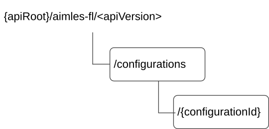

# 6.1.3.3 Resources

## 6.1.3.3.1 Overview

This clause describes the structure for the Resource URIs and the resources and methods used for the service.

Figure 6.1.3.3.1-1 depicts the resource URIs structure for the AIMLES_FLMemberGroupSupport API.

Figure 6.1.3.3.1-1: Resource URI structure of the AIMLES_FLMemberGroupSupport API

Table 6.1.3.3.1-1 provides an overview of the resources and applicable HTTP methods.

Table 6.1.3.3.1-1: Resources and methods overview

| Resource name                                    | Resource URI                      | HTTP method or custom operation | Description (service operation)                                                 |
|--------------------------------------------------|-----------------------------------|---------------------------------|---------------------------------------------------------------------------------|
| FL Member Group Support Configurations           | /configurations                   | POST                            | Create a new Individual FL Member Group Support Configuration resource          |
| Individual FL Member Group Support Configuration | /configurations/{configurationId} | GET                             | Retrieve an existing Individual FL Member Group Support Configuration resource. |
|                                                  |                                   | PUT                             | Update an existing Individual FL Member Group Support Configuration resource.   |
|                                                  |                                   | PATCH                           | Modify an existing Individual FL Member Group Support Configuration resource.   |
|                                                  |                                   | DELETE                          | Delete an existing Individual FL Member Group Support Configuration resource.   |

## 6.1.3.3.2 Resource: FL Member Group Support Configurations

### 6.1.3.3.2.1 Description

This resource represents the FL Member Group Support Configurations resource managed by the AIMLE Server.

### 6.1.3.3.2.2 Resource Definition

Resource URI: **{apiRoot}/aimles-fl/\<apiVersion\>/configurations**

This resource shall support the resource URI variables defined in table 6.1.3.3.2.2-1.

Table 6.1.3.3.2.2-1: Resource URI variables for this resource

| Name    | Data type | Definition         |
|---------|-----------|--------------------|
| apiRoot | string    | See clause 6.1.3.1 |

### 6.1.3.3.2.3 Resource Standard Methods

#### 6.1.3.3.2.3.1 POST

The HTTP POST method enables the AIMLE service consumer to create a new Individual FL Member Group Support for an FL process at the AIMLE Server.

This method shall support the URI query parameters specified in table 6.1.3.3.2.3.1-1.

Table 6.1.3.3.2.3.1-1: URI query parameters supported by the POST method on this resource

|      |           |     |             |             |               |
|------|-----------|-----|-------------|-------------|---------------|
| Name | Data type | P   | Cardinality | Description | Applicability |
| n/a  |           |     |             |             |               |

This method shall support the request data structures specified in table 6.1.3.3.2.3.1-2 and the response data structures and response codes specified in table 6.1.3.3.2.3.1-3.

Table 6.1.3.3.2.3.1-2: Data structures supported by the POST Request Body on this resource

|              |     |             |                                                                    |
|--------------|-----|-------------|--------------------------------------------------------------------|
| Data type    | P   | Cardinality | Description                                                        |
| FlMbrSuppGrp | M   | 1           | Create a new Individual FL Member Group Support for an FL process. |

Table 6.1.3.3.2.3.1-3: Data structures supported by the POST Response Body on this resource

<table>
<colgroup>
<col style="width: 16%" />
<col style="width: 4%" />
<col style="width: 12%" />
<col style="width: 11%" />
<col style="width: 54%" />
</colgroup>
<tbody>
<tr class="odd">
<td>Data type</td>
<td>P</td>
<td>Cardinality</td>
<td>
Response

codes
</td>
<td>Description</td>
</tr>
<tr class="even">
<td>FlMbrSuppGrp</td>
<td>M</td>
<td>1</td>
<td>201 Created</td>
<td>
Successful case. The creation of the new Individual FL Member Group Support for the FL process is confirmed and a representation of that resource is returned.

An HTTP "Location" header that contains the URI of the created resource shall also be included.
</td>
</tr>
<tr class="odd">
<td colspan="5">NOTE: The mandatory HTTP error status code for the HTTP POST method listed in table 5.2.6-1 of 3GPP TS 29.122 [2] also apply.</td>
</tr>
</tbody>
</table>

Table 6.1.3.3.2.3.1-4: Headers supported by the 201 Response Code on this resource

<table>
<colgroup>
<col style="width: 16%" />
<col style="width: 14%" />
<col style="width: 4%" />
<col style="width: 11%" />
<col style="width: 52%" />
</colgroup>
<thead>
<tr class="header">
<th>Name</th>
<th>Data type</th>
<th>P</th>
<th>Cardinality</th>
<th>Description</th>
</tr>
</thead>
<tbody>
<tr class="odd">
<td>Location</td>
<td>string</td>
<td>M</td>
<td>1</td>
<td>
Contains the URI of the newly created resource, according to the structure:

{apiRoot}/aimles-fl/&lt;apiVersion&gt;/configurations/{configurationId}
</td>
</tr>
</tbody>
</table>

### 6.1.3.3.2.4 Resource Custom Operations

There are no resource custom operations defined for this resource in this release of the specification.

## 6.1.3.3.3 Resource: Individual FL Member Group Support Configuration

### 6.1.3.3.3.1 Description

This resource represents the individual FL Member Group Support Configuration resource managed by the AIMLE Server.

### 6.1.3.3.3.2 Resource Definition

Resource URI: **{apiRoot}/aimles-fl/\<apiVersion\>/configurations/{configurationId}**

This resource shall support the resource URI variables defined in table 6.1.3.3.3.2-1.

Table 6.1.3.3.3.2-1: Resource URI variables for this resource

| Name            | Data type | Definition                                                                                  |
|-----------------|-----------|---------------------------------------------------------------------------------------------|
| apiRoot         | string    | See clause 6.1.3.1                                                                          |
| configurationId | string    | Represents the identifier of the Individual FL Member Group Support Configuration resource. |

### 6.1.3.3.3.3 Resource Standard Methods

#### 6.1.3.3.3.3.1 GET

The HTTP GET method enables the AIMLE service consumer to query an existing Individual FL Member Group Support for an FL process at the AIMLE Server.

This method shall support the URI query parameters specified in table 6.1.3.3.3.3.1-1.

Table 6.1.3.3.3.3.1-1: URI query parameters supported by the GET method on this resource

|              |           |     |             |                                    |               |
|--------------|-----------|-----|-------------|------------------------------------|---------------|
| Name         | Data type | P   | Cardinality | Description                        | Applicability |
| fl-member-id | string    | O   | 0..1        | ID of the FL member to be queried. |               |

This method shall support the request data structures specified in table 6.1.3.3.3.3.1-2 and the response data structures and response codes specified in table 6.1.3.3.3.3.1-3.

Table 6.1.3.3.3.3.1-2: Data structures supported by the GET Request Body on this resource

|           |     |             |             |
|-----------|-----|-------------|-------------|
| Data type | P   | Cardinality | Description |
| n/a       |     |             |             |

Table 6.1.3.3.3.3.1-3: Data structures supported by the GET Response Body on this resource

<table>
<colgroup>
<col style="width: 16%" />
<col style="width: 4%" />
<col style="width: 12%" />
<col style="width: 11%" />
<col style="width: 54%" />
</colgroup>
<tbody>
<tr class="odd">
<td>Data type</td>
<td>P</td>
<td>Cardinality</td>
<td>
Response

codes
</td>
<td>Description</td>
</tr>
<tr class="even">
<td>FlMbrSuppGrp</td>
<td>M</td>
<td>1</td>
<td>200 OK</td>
<td>Successful case. The requested Individual FL Member Group Support for the FL process is confirmed and a representation of that resource is returned.</td>
</tr>
<tr class="odd">
<td>n/a</td>
<td></td>
<td></td>
<td>307 Temporary Redirect</td>
<td>
Temporary redirection.

The response shall include a Location header field containing an alternative URI of the resource located in an alternative AIMLE Server.

Redirection handling is described in clause 5.2.10 of 3GPP TS 29.122 [2].
</td>
</tr>
<tr class="even">
<td>n/a</td>
<td></td>
<td></td>
<td>308 Permanent Redirect</td>
<td>
Permanent redirection.

The response shall include a Location header field containing an alternative URI of the resource located in an alternative AIMLE Server.

Redirection handling is described in clause 5.2.10 of 3GPP TS 29.122 [2].
</td>
</tr>
<tr class="odd">
<td colspan="5">NOTE: The manadatory HTTP error status code for the HTTP GET method listed in table 5.2.6-1 of 3GPP TS 29.122 [2] also apply.</td>
</tr>
</tbody>
</table>

Table 6.1.3.3.3.3.1-4: Headers supported by the 307 Response Code on this resource

| Name     | Data type | P   | Cardinality | Description                                                                         |
|----------|-----------|-----|-------------|-------------------------------------------------------------------------------------|
| Location | string    | M   | 1           | Contains an alternative URI of the resource located in an alternative AIMLE Server. |

Table 6.1.3.3.3.3.1-5: Headers supported by the 308 Response Code on this resource

| Name     | Data type | P   | Cardinality | Description                                                                         |
|----------|-----------|-----|-------------|-------------------------------------------------------------------------------------|
| Location | string    | M   | 1           | Contains an alternative URI of the resource located in an alternative AIMLE Server. |

#### 6.1.3.3.3.3.2 PUT

The HTTP PUT method enables the AIMLE service consumer to update an existing Individual FL Member Group Support for an FL process at the AIMLE Server.

This method shall support the URI query parameters specified in table 6.1.3.3.3.3.2-1.

Table 6.1.3.3.3.3.2-1: URI query parameters supported by the PUT method on this resource

|      |           |     |             |             |               |
|------|-----------|-----|-------------|-------------|---------------|
| Name | Data type | P   | Cardinality | Description | Applicability |
| n/a  |           |     |             |             |               |

This method shall support the request data structures specified in table 6.1.3.3.3.3.2-2 and the response data structures and response codes specified in table 6.1.3.3.3.3.2-3.

Table 6.1.3.3.3.3.2-2: Data structures supported by the PUT Request Body on this resource

|              |     |             |                                                                                                            |
|--------------|-----|-------------|------------------------------------------------------------------------------------------------------------|
| Data type    | P   | Cardinality | Description                                                                                                |
| FlMbrSuppGrp | M   | 1           | Represents the updated representation of an existing Individual FL Member Group Support for an FL process. |

Table 6.1.3.3.3.3.2-3: Data structures supported by the PUT Response Body on this resource

<table>
<colgroup>
<col style="width: 16%" />
<col style="width: 4%" />
<col style="width: 12%" />
<col style="width: 11%" />
<col style="width: 54%" />
</colgroup>
<tbody>
<tr class="odd">
<td>Data type</td>
<td>P</td>
<td>Cardinality</td>
<td>
Response

codes
</td>
<td>Description</td>
</tr>
<tr class="even">
<td>FlMbrSuppGrp</td>
<td>M</td>
<td>1</td>
<td>200 OK</td>
<td>Successful case. The requested update of the existing Individual FL Member Group Support for the FL process is confirmed and a representation of that resource is returned.</td>
</tr>
<tr class="odd">
<td>n/a</td>
<td></td>
<td></td>
<td>204 No Content</td>
<td>Successful case. The requested update of the existing Individual FL Member Group Support for the FL process is confirmed and no content is returned.</td>
</tr>
<tr class="even">
<td>n/a</td>
<td></td>
<td></td>
<td>307 Temporary Redirect</td>
<td>
Temporary redirection.

The response shall include a Location header field containing an alternative URI of the resource located in an alternative AIMLE Server.

Redirection handling is described in clause 5.2.10 of 3GPP TS 29.122 [2].
</td>
</tr>
<tr class="odd">
<td>n/a</td>
<td></td>
<td></td>
<td>308 Permanent Redirect</td>
<td>
Permanent redirection.

The response shall include a Location header field containing an alternative URI of the resource located in an alternative AIMLE Server.

Redirection handling is described in clause 5.2.10 of 3GPP TS 29.122 [2].
</td>
</tr>
<tr class="even">
<td colspan="5">NOTE: The manadatory HTTP error status code for the HTTP PUT method listed in table 5.2.6-1 of 3GPP TS 29.122 [2] also apply.</td>
</tr>
</tbody>
</table>

Table 6.1.3.3.3.3.2-4: Headers supported by the 307 Response Code on this resource

| Name     | Data type | P   | Cardinality | Description                                                                         |
|----------|-----------|-----|-------------|-------------------------------------------------------------------------------------|
| Location | string    | M   | 1           | Contains an alternative URI of the resource located in an alternative AIMLE Server. |

Table 6.1.3.3.3.3.2-5: Headers supported by the 308 Response Code on this resource

| Name     | Data type | P   | Cardinality | Description                                                                         |
|----------|-----------|-----|-------------|-------------------------------------------------------------------------------------|
| Location | string    | M   | 1           | Contains an alternative URI of the resource located in an alternative AIMLE Server. |

#### 6.1.3.3.3.3.3 PATCH

The HTTP PATCH method enables the AIMLE service consumer to modify an existing Individual FL Member Group Support for an FL process at the AIMLE Server.

This method shall support the URI query parameters specified in table 6.1.3.3.3.3.3-1.

Table 6.1.3.3.3.3.3-1: URI query parameters supported by the PATCH method on this resource

|      |           |     |             |             |               |
|------|-----------|-----|-------------|-------------|---------------|
| Name | Data type | P   | Cardinality | Description | Applicability |
| n/a  |           |     |             |             |               |

This method shall support the request data structures specified in table 6.1.3.3.3.3.3-2 and the response data structures and response codes specified in table 6.1.3.3.3.3.3-3.

Table 6.1.3.3.3.3.3-2: Data structures supported by the PATCH Request Body on this resource

|                   |     |             |                                                                                                          |
|-------------------|-----|-------------|----------------------------------------------------------------------------------------------------------|
| Data type         | P   | Cardinality | Description                                                                                              |
| FlMbrSuppGrpPatch | M   | 1           | Represents the parameters to modify of an existing Individual FL Member Group Support for an FL process. |

Table 6.1.3.3.3.3.3-3: Data structures supported by the PATCH Response Body on this resource

<table>
<colgroup>
<col style="width: 16%" />
<col style="width: 4%" />
<col style="width: 12%" />
<col style="width: 11%" />
<col style="width: 54%" />
</colgroup>
<tbody>
<tr class="odd">
<td>Data type</td>
<td>P</td>
<td>Cardinality</td>
<td>
Response

codes
</td>
<td>Description</td>
</tr>
<tr class="even">
<td>FlMbrSuppGrp</td>
<td>M</td>
<td>1</td>
<td>200 OK</td>
<td>Successful case. The requested modification of the existing Individual FL Member Group Support for the FL process is confirmed and a representation of that resource is returned.</td>
</tr>
<tr class="odd">
<td>n/a</td>
<td></td>
<td></td>
<td>204 No Content</td>
<td>Successful case. The requested modification of the existing Individual FL Member Group Support for the FL process is confirmed and no content is returned.</td>
</tr>
<tr class="even">
<td>n/a</td>
<td></td>
<td></td>
<td>307 Temporary Redirect</td>
<td>
Temporary redirection.

The response shall include a Location header field containing an alternative URI of the resource located in an alternative AIMLE Server.

Redirection handling is described in clause 5.2.10 of 3GPP TS 29.122 [2].
</td>
</tr>
<tr class="odd">
<td>n/a</td>
<td></td>
<td></td>
<td>308 Permanent Redirect</td>
<td>
Permanent redirection.

The response shall include a Location header field containing an alternative URI of the resource located in an alternative AIMLE Server.

Redirection handling is described in clause 5.2.10 of 3GPP TS 29.122 [2].
</td>
</tr>
<tr class="even">
<td colspan="5">NOTE: The manadatory HTTP error status code for the HTTP PATCH method listed in table 5.2.6-1 of 3GPP TS 29.122 [2] also apply.</td>
</tr>
</tbody>
</table>

Table 6.1.3.3.3.3.3-4: Headers supported by the 307 Response Code on this resource

| Name     | Data type | P   | Cardinality | Description                                                                         |
|----------|-----------|-----|-------------|-------------------------------------------------------------------------------------|
| Location | string    | M   | 1           | Contains an alternative URI of the resource located in an alternative AIMLE Server. |

Table 6.1.3.3.3.3.3-5: Headers supported by the 308 Response Code on this resource

| Name     | Data type | P   | Cardinality | Description                                                                         |
|----------|-----------|-----|-------------|-------------------------------------------------------------------------------------|
| Location | string    | M   | 1           | Contains an alternative URI of the resource located in an alternative AIMLE Server. |

#### 6.1.3.3.3.3.4 DELETE

The HTTP DELETE method enables the AIMLE service consumer to delete an existing Individual FL Member Group Support for an FL process at the AIMLE Server.

This method shall support the URI query parameters specified in table 6.1.3.3.3.3.4-1.

Table 6.1.3.3.3.3.4-1: URI query parameters supported by the DELETE method on this resource

|      |           |     |             |             |               |
|------|-----------|-----|-------------|-------------|---------------|
| Name | Data type | P   | Cardinality | Description | Applicability |
| n/a  |           |     |             |             |               |

This method shall support the request data structures specified in table 6.1.3.3.3.3.4-2 and the response data structures and response codes specified in table 6.1.3.3.3.3.4-3.

Table 6.1.3.3.3.3.4-2: Data structures supported by the DELETE Request Body on this resource

|           |     |             |             |
|-----------|-----|-------------|-------------|
| Data type | P   | Cardinality | Description |
| n/a       |     |             |             |

Table 6.1.3.3.3.3.4-3: Data structures supported by the DELETE Response Body on this resource

<table>
<colgroup>
<col style="width: 16%" />
<col style="width: 4%" />
<col style="width: 12%" />
<col style="width: 11%" />
<col style="width: 54%" />
</colgroup>
<tbody>
<tr class="odd">
<td>Data type</td>
<td>P</td>
<td>Cardinality</td>
<td>
Response

codes
</td>
<td>Description</td>
</tr>
<tr class="even">
<td>n/a</td>
<td></td>
<td></td>
<td>204 No Content</td>
<td>Successful case. Deletion of the existing Individual FL Member Group Support for the FL process is confirmed.</td>
</tr>
<tr class="odd">
<td>n/a</td>
<td></td>
<td></td>
<td>307 Temporary Redirect</td>
<td>
Temporary redirection.

The response shall include a Location header field containing an alternative URI of the resource located in an alternative AIMLE Server.

Redirection handling is described in clause 5.2.10 of 3GPP TS 29.122 [2].
</td>
</tr>
<tr class="even">
<td>n/a</td>
<td></td>
<td></td>
<td>308 Permanent Redirect</td>
<td>
Permanent redirection.

The response shall include a Location header field containing an alternative URI of the resource located in an alternative AIMLE Server.

Redirection handling is described in clause 5.2.10 of 3GPP TS 29.122 [2].
</td>
</tr>
<tr class="odd">
<td colspan="5">NOTE: The manadatory HTTP error status code for the HTTP DELETE method listed in table 5.2.6-1 of 3GPP TS 29.122 [2] also apply.</td>
</tr>
</tbody>
</table>

Table 6.1.3.3.3.3.4-4: Headers supported by the 307 Response Code on this resource

| Name     | Data type | P   | Cardinality | Description                                                                         |
|----------|-----------|-----|-------------|-------------------------------------------------------------------------------------|
| Location | string    | M   | 1           | Contains an alternative URI of the resource located in an alternative AIMLE Server. |

Table 6.1.3.3.3.3.4-5: Headers supported by the 308 Response Code on this resource

| Name     | Data type | P   | Cardinality | Description                                                                         |
|----------|-----------|-----|-------------|-------------------------------------------------------------------------------------|
| Location | string    | M   | 1           | Contains an alternative URI of the resource located in an alternative AIMLE Server. |

### 6.1.3.3.3.4 Resource Custom Operations

There are no resource custom operations defined for this resource in this release of the specification.
