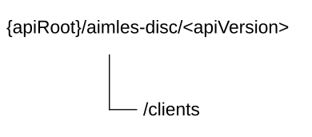

# 6.1.6 AIMLES_AIMLEClientDiscovery API

## 6.1.6.1 Introduction

The AIMLES_AIMLEClientDiscovery service shall use the AIMLES_AIMLEClientDiscovery API.

The API URI of the AIMLES_AIMLEClientDiscovery API shall be:

**{apiRoot}/\<apiName\>/\<apiVersion\>**

The request URIs used in HTTP requests shall have the Resource URI structure defined in clause 6.5 of 3GPP TS 29.549 \[10\], i.e.:

**{apiRoot}/\<apiName\>/\<apiVersion\>/\<apiSpecificSuffixes\>**

with the following components:

\- The {apiRoot} shall be set as described in clause 6.5 of 3GPP TS 29.549 \[10\].

\- The \<apiName\> shall be "aimles-disc".

\- The \<apiVersion\> shall be "v1".

\- The \<apiSpecificSuffixes\> shall be set as described in clause 6.1.6.3 and clause 6.1.6.4.

NOTE: When 3GPP TS 29.122 \[2\] is referenced for the common protocol and interface aspects for API definition in the clauses under clause 6.1.6, the AIMLE Server takes the role of the SCEF and the service consumer takes the role of the SCS/AS.

## 6.1.6.2 Usage of HTTP and common API related aspects

The provisions of clause 6.3 of 3GPP TS 29.549 \[10\] shall apply for the AIMLES_AIMLEClientDiscovery API.

## 6.1.6.3 Resources

### 6.1.6.3.1 Overview

This clause describes the structure for the Resource URIs and the resources and methods used for the service.

Figure 6.1.6.3.1-1 depicts the resource URIs structure for the AIMLES_AIMLEClientDiscovery Service API.

Figure 6.1.6.3.1-1: Resource URI structure of the AIMLES_AIMLEClientDiscovery Service API

Table 6.1.6.3.1-1 provides an overview of the resources and applicable HTTP methods.

Table 6.1.6.3.1-1: Resources and methods overview

| Resource purpose/name | Resource URI (relative path after API URI) | HTTP method or custom operation | Description (service operation)                                 |
|-----------------------|--------------------------------------------|---------------------------------|-----------------------------------------------------------------|
| AIMLE Clients         | /clients                                   | GET                             | Discover the AIMLE Clients according to the filtering criteria. |

### 6.1.6.3.2 Resource: AIMLE Clients

#### 6.1.6.3.2.1 Description

The "AIMLE Clients" resource represents the AIMLE Clients.

#### 6.1.6.3.2.2 Resource Definition

Resource URI: **{apiRoot}/aimles-disc/\<apiVersion\>/clients**

This resource shall support the resource URI variables defined in the table 6.1.6.3.2.2-1.

Table 6.1.6.3.2.2-1: Resource URI variables for this resource

| Name    | Data Type | Definition          |
|---------|-----------|---------------------|
| apiRoot | string    | See clause 6.1.6.1. |

#### 6.1.6.3.2.3 Resource Standard Methods

##### 6.1.6.3.2.3.1 GET

This method shall support the URI query parameters specified in table 6.1.6.3.2.3.1-1.

Table 6.1.6.3.2.3.1-1: URI query parameters supported by the GET method on this resource

<table>
<colgroup>
<col style="width: 15%" />
<col style="width: 17%" />
<col style="width: 3%" />
<col style="width: 11%" />
<col style="width: 51%" />
</colgroup>
<thead>
<tr class="header">
<th>Name</th>
<th>Data type</th>
<th>P</th>
<th>Cardinality</th>
<th>Description</th>
</tr>
</thead>
<tbody>
<tr class="odd">
<td>filt-criteria</td>
<td>ClientDiscCriteria</td>
<td>M</td>
<td>1</td>
<td>Represents the AIMLE Client(s) filtering criteria.</td>
</tr>
<tr class="even">
<td>cl-number</td>
<td>Uinteger</td>
<td>O</td>
<td>0..1</td>
<td>Represents the required number of the discovered AIMLE Clients.</td>
</tr>
<tr class="odd">
<td>supported-features</td>
<td>SupportedFeatures</td>
<td>C</td>
<td>0..1</td>
<td>
Contains supported features information, used to negotiate the applicability of optional features.

This query parameter shall be present only if feature negotiation needs to take place.
</td>
</tr>
</tbody>
</table>

This method shall support the request data structures specified in table 6.1.6.3.2.3.1-2 and the response data structures and response codes specified in table 6.1.6.3.2.3.1-3.

Table 6.1.6.3.2.3.1-2: Data structures supported by the GET Request Body on this resource

| Data type | P   | Cardinality | Description |
|-----------|-----|-------------|-------------|
| n/a       |     |             |             |

Table 6.1.6.3.2.3.1-3: Data structures supported by the GET Response Body on this resource

<table>
<colgroup>
<col style="width: 21%" />
<col style="width: 3%" />
<col style="width: 11%" />
<col style="width: 13%" />
<col style="width: 50%" />
</colgroup>
<thead>
<tr class="header">
<th>Data type</th>
<th>P</th>
<th>Cardinality</th>
<th>
Response

codes
</th>
<th>Description</th>
</tr>
</thead>
<tbody>
<tr class="odd">
<td>ClientDiscResp</td>
<td>M</td>
<td>1</td>
<td>200 OK</td>
<td>Successful case. The response body contains the result of the search over the list of AIMLE Clients.</td>
</tr>
<tr class="even">
<td>n/a</td>
<td></td>
<td></td>
<td>307 Temporary Redirect</td>
<td>
Temporary redirection.

The response shall include a Location header field containing an alternative target URI of the resource located in an alternative AIMLE Server.

Redirection handling is described in clause 5.2.10 of 3GPP TS 29.122 [2].
</td>
</tr>
<tr class="odd">
<td>n/a</td>
<td></td>
<td></td>
<td>308 Permanent Redirect</td>
<td>
Permanent redirection.

The response shall include a Location header field containing an alternative target URI of the resource located in an alternative AIMLE Server.

Redirection handling is described in clause 5.2.10 of 3GPP TS 29.122 [2].
</td>
</tr>
<tr class="even">
<td colspan="5">NOTE: The mandatory HTTP error status codes for the HTTP GET method listed in table 5.2.6-1 of 3GPP TS 29.122 [2] shall also apply.</td>
</tr>
</tbody>
</table>

Table 6.1.6.3.2.3.1-4: Headers supported by the 307 Response Code on this resource

|          |           |     |             |                                                                                     |
|----------|-----------|-----|-------------|-------------------------------------------------------------------------------------|
| Name     | Data type | P   | Cardinality | Description                                                                         |
| Location | string    | M   | 1           | Contains an alternative URI of the resource located in an alternative AIMLE Server. |

Table 6.1.6.3.2.3.1-5: Headers supported by the 308 Response Code on this resource

|          |           |     |             |                                                                                     |
|----------|-----------|-----|-------------|-------------------------------------------------------------------------------------|
| Name     | Data type | P   | Cardinality | Description                                                                         |
| Location | string    | M   | 1           | Contains an alternative URI of the resource located in an alternative AIMLE Server. |

#### 6.1.6.3.2.4 Resource Custom Operations

There are no resource custom operations defined for this resource in this release of the specification.

## 6.1.6.4 Custom Operations without associated resources

There are no custom operations without associated resources in the present release of the document.

## 6.1.6.5 Notifications

There are no notifications in the present release of the document.

## 6.1.6.6 Data Model

### 6.1.6.6.1 General

This clause specifies the application data model supported by the API.

Table 6.1.6.6.1-1 specifies the data types defined for the AIMLES_AIMLEClientDiscovery API.

Table 6.1.6.6.1-1: AIMLES_AIMLEClientDiscovery API specific Data Types

| Data type             | Section defined | Description                                                   | Applicability |
|-----------------------|-----------------|---------------------------------------------------------------|---------------|
| AimlOperationRole     | 6.1.6.6.3.5     | Represents the AIMLE operation role.                          |               |
| ClientAppCapability   | 6.1.6.6.2.4     | Represents the AIMLE Client Application layer capabilities.   |               |
| ClientDiscCriteria    | 6.1.6.6.2.2     | Represents the AIMLE Client discovery criteria.               |               |
| ClientDiscResp        | 6.1.6.6.2.9     | Represents the AIMLE Client discovery response.               |               |
| ClientTaskCapability  | 6.1.6.6.2.8     | Represents the AIMLE Client task capability information.      |               |
| ClientVelocity        | 6.1.6.6.3.10    | Represents the AIMLE Client velocity level.                   |               |
| ComputeCapability     | 6.1.6.6.3.9     | Represents the AIMLE Client compute capability type.          |               |
| DatasetAvailability   | 6.1.6.6.2.6     | Represents the dataset availability information.              |               |
| DatasetCapability     | 6.1.6.6.2.7     | Represents the dataset capability information.                |               |
| DatasetRequirement    | 6.1.6.6.2.5     | Represents the dataset requirements.                          |               |
| DataType              | 6.1.6.6.3.7     | Represents the type of the collected data.                    |               |
| EASInfo               | 6.1.6.6.2.11    | Represents the EAS information.                               |               |
| EdgeAIMLES            | 6.1.6.6.2.10    | Represents the information of the Edge deployed AIMLE server. | AIML_2        |
| MlAppType             | 6.1.6.6.3.6     | Represents the ML application type.                           |               |
| MlModelType           | 6.1.6.6.3.4     | Represents the ML model type.                                 |               |
| PerformanceCapability | 6.1.6.6.3.8     | Represents the performance capabilities.                      |               |
| ServicePermLevel      | 6.1.6.6.3.3     | Represents the service permission level.                      |               |
| ServiceRequirement    | 6.1.6.6.2.3     | Represents the AIMLE service requirements.                    |               |

Table 6.1.6.6.1-2 specifies data types re-used by the AIMLES_AIMLEClientDiscovery API from other specifications, including a reference to their respective specifications, and when needed, a short description of their use within the AIMLES_AIMLEClientDiscovery API.

Table 6.1.6.6.1-2: AIMLES_AIMLEClientDiscovery API Re-used Data Types

| Data type                  | Reference             | Comments                                                                                         | Applicability |
|----------------------------|-----------------------|--------------------------------------------------------------------------------------------------|---------------|
| AimleClientId              | 6.1.1.6.3.2           | Represents unique identifier of a AIMLE client.                                                  |               |
| DateTime                   | 3GPP TS 29.122 \[2\]  | Used to indicate a timestamp.                                                                    |               |
| Dnai                       | 3GPP TS 29.571 \[11\] | Identifies a DNAI.                                                                               |               |
| EndPoint                   | 3GPP TS 29.558 \[15\] | Represents the endpoint information.                                                             |               |
| LocationArea5G             | 3GPP TS 29.122 \[2\]  | Represents the location.                                                                         |               |
| ScheduledCommunicationTime | 3GPP TS 29.122 \[2\]  | Represents an offered scheduled communication time.                                              |               |
| ServiceArea                | 3GPP TS 29.548 \[17\] | Represents the topological and geographical service area information.                            |               |
| SupportedFeatures          | 3GPP TS 29.571 \[11\] | Represents the supported features, used to negotiate the supported optional features of the API. |               |
| TransQualMeasCriteriaSet   | 3GPP TS 29.548 \[17\] | Represents QoS criteria.                                                                         |               |
| Uinteger                   | 3GPP TS 29.571 \[11\] | Represents an unsigned Integer.                                                                  |               |

### 6.1.6.6.2 Structured data types

#### 6.1.6.6.2.1 Introduction

This clause defines the structures to be used in resource representations.

#### 6.1.6.6.2.2 Type: ClientDiscCriteria

Table 6.1.6.6.2.2-1: Definition of type ClientDiscCriteria

| Attribute name | Data type                       | P   | Cardinality | Description                                                         | Applicability |
|----------------|---------------------------------|-----|-------------|---------------------------------------------------------------------|---------------|
| serviceReq     | ServiceRequirement              | M   | 1           | Represents the service requirements.                                |               |
| mlModelTypes   | array(MlModelType)              | O   | 1..N        | Represents the requested ML model types.                            |               |
| aimlOpers      | array(AimlOperationRole)        | M   | 1..N        | Represents the roles for AI/ML operations.                          |               |
| clientAppCap   | ClientAppCapability             | M   | 1           | Represents the AIMLE Client application layer capabilities.         |               |
| datasetReq     | DatasetRequirement              | O   | 0..1        | Represents the dataset requirements.                                |               |
| clientTaskCap  | ClientTaskCapability            | O   | 0..1        | Represents the AIMLE Client task capabilities.                      |               |
| clientVel      | ClientVelocity                  | O   | 0..1        | Represents the AIMLE Client velocity.                               |               |
| location       | LocationArea5G                  | O   | 0..1        | Represents the location information for the AIMLE Client discovery. |               |
| clientQosReqs  | array(TransQualMeasCriteriaSet) | O   | 1..N        | Represents the requirements on AIMLE Client QoS for discovery.      |               |
| edgeAimleS     | EdgeAIMLES                      | O   | 0..1        | Represents the information of the edge deployed AIMLE server.       | AIML_2        |

#### 6.1.6.6.2.3 Type: ServiceRequirement

Table 6.1.6.6.2.3-1: Definition of type ServiceRequirement

| Attribute name | Data type        | P   | Cardinality | Description                              | Applicability |
|----------------|------------------|-----|-------------|------------------------------------------|---------------|
| valServId      | string           | M   | 1           | Represents the VAL Service identifier.   |               |
| permLevel      | ServicePermLevel | O   | 0..1        | Represents the service permission level. |               |

#### 6.1.6.6.2.4 Type: ClientAppCapability

Table 6.1.6.6.2.4-1: Definition of type ClientAppCapability

<table style="width:100%;">
<colgroup>
<col style="width: 16%" />
<col style="width: 15%" />
<col style="width: 3%" />
<col style="width: 11%" />
<col style="width: 38%" />
<col style="width: 13%" />
</colgroup>
<thead>
<tr class="header">
<th>Attribute name</th>
<th>Data type</th>
<th>P</th>
<th>Cardinality</th>
<th>Description</th>
<th>Applicability</th>
</tr>
</thead>
<tbody>
<tr class="odd">
<td>appType</td>
<td>MlAppType</td>
<td>M</td>
<td>1</td>
<td>Represents the ML application identifier.</td>
<td></td>
</tr>
<tr class="even">
<td>avail</td>
<td>array(ScheduledCommunicationTime)</td>
<td>O</td>
<td>1..N</td>
<td>Represents the availability of AIMLE Client to support operations.</td>
<td></td>
</tr>
<tr class="odd">
<td>dropOfRate</td>
<td>integer</td>
<td>O</td>
<td>0..1</td>
<td>
Represents the drop off rate in percent.

Minimum: 0

Maximum: 100
</td>
<td></td>
</tr>
</tbody>
</table>

#### 6.1.6.6.2.5 Type: DatasetRequirement

Table 6.1.6.6.2.5-1: Definition of type DatasetRequirement

| Attribute name | Data type           | P   | Cardinality | Description                                      | Applicability |
|----------------|---------------------|-----|-------------|--------------------------------------------------|---------------|
| avail          | DatasetAvailability | O   | 0..1        | Represents the dataset availability information. |               |
| cap            | DatasetCapability   | O   | 0..1        | Represents the dataset capability information.   |               |

#### 6.1.6.6.2.6 Type: DatasetAvailability

Table 6.1.6.6.2.6-1: Definition of type DatasetAvailability

| Attribute name | Data type     | P   | Cardinality | Description                                                             | Applicability |
|----------------|---------------|-----|-------------|-------------------------------------------------------------------------|---------------|
| ids            | array(string) | O   | 1..N        | Represents the list dataset identifiers.                                |               |
| age            | DateTime      | O   | 0..1        | Represents the age of the dataset, i.e., when the data set was created. |               |
| size           | Uinteger      | O   | 0..1        | Represents the dataset size in bytes.                                   |               |
| features       | array(string) | O   | 1..N        | Represents the list of dataset features identifiers.                    |               |

#### 6.1.6.6.2.7 Type: DatasetCapability

Table 6.1.6.6.2.7-1: Definition of type DatasetCapability

| Attribute name | Data type     | P   | Cardinality | Description                                                     | Applicability |
|----------------|---------------|-----|-------------|-----------------------------------------------------------------|---------------|
| dataType       | DataType      | O   | 0..1        | Represents the type of data.                                    |               |
| functions      | array(string) | O   | 1..N        | Represents the list of the exploratory data analysis functions. |               |

#### 6.1.6.6.2.8 Type: ClientTaskCapability

Table 6.1.6.6.2.8-1: Definition of type ClientTaskCapability

| Attribute name | Data type             | P   | Cardinality | Description                              | Applicability |
|----------------|-----------------------|-----|-------------|------------------------------------------|---------------|
| compCap        | ComputeCapability     | O   | 0..1        | Represents the compute capabilities.     |               |
| perfCap        | PerformanceCapability | O   | 0..1        | Represents the performance capabilities. |               |

#### 6.1.6.6.2.9 Type: ClientDiscResp

Table 6.1.6.6.2.9-1: Definition of type ClientDiscResp

<table style="width:100%;">
<colgroup>
<col style="width: 16%" />
<col style="width: 15%" />
<col style="width: 3%" />
<col style="width: 11%" />
<col style="width: 38%" />
<col style="width: 13%" />
</colgroup>
<thead>
<tr class="header">
<th>Attribute name</th>
<th>Data type</th>
<th>P</th>
<th>Cardinality</th>
<th>Description</th>
<th>Applicability</th>
</tr>
</thead>
<tbody>
<tr class="odd">
<td>clients</td>
<td>array(AimleClientId)</td>
<td>M</td>
<td>0..N</td>
<td>
Represents the AIMLE client identifiers that matches the discovery criteria.

If there are no client identifiers matching the provided query parameters, an empty array shall be provided within this attribute.
</td>
<td></td>
</tr>
<tr class="even">
<td>edgeAimleSs</td>
<td>map(EdgeAIMLES)</td>
<td>O</td>
<td>1..N</td>
<td>
Represents the information of the edge deployed AIMLE server.

The key of the map shall be set to an AIMLE client ID from the "clients" attribute and shall identify the client for which the corresponding map value provides the information of the Edge‑deployed AIMLE server.
</td>
<td>AIML_2</td>
</tr>
<tr class="odd">
<td>suppTasks</td>
<td>array(ClientTaskCapability)</td>
<td>O</td>
<td>1..N</td>
<td>Represents the supported AIML tasks.</td>
<td></td>
</tr>
<tr class="even">
<td>suppFeats</td>
<td>SupportedFeatures</td>
<td>C</td>
<td>0..1</td>
<td>
Contains supported features information, used to negotiate the applicability of optional features.

This query parameter shall be present only if feature negotiation needs to take place.
</td>
<td></td>
</tr>
</tbody>
</table>

#### 6.1.6.6.2.10 Type: EdgeAIMLES

Table 6.1.6.6.2.10-1: Definition of type EdgeAIMLES

<table style="width:100%;">
<colgroup>
<col style="width: 16%" />
<col style="width: 15%" />
<col style="width: 3%" />
<col style="width: 11%" />
<col style="width: 38%" />
<col style="width: 13%" />
</colgroup>
<thead>
<tr class="header">
<th>Attribute name</th>
<th>Data type</th>
<th>P</th>
<th>Cardinality</th>
<th>Description</th>
<th>Applicability</th>
</tr>
</thead>
<tbody>
<tr class="odd">
<td>easInfo</td>
<td>EASInfo</td>
<td>C</td>
<td>0..1</td>
<td>
Represents the information of the EAS.

(NOTE)
</td>
<td></td>
</tr>
<tr class="even">
<td>aimleServId</td>
<td>string</td>
<td>C</td>
<td>0..1</td>
<td>
Represents the identifier of the edge deployed AIMLE server.

(NOTE)
</td>
<td></td>
</tr>
<tr class="odd">
<td colspan="6">NOTE: At least one of these attributes shall be provided.</td>
</tr>
</tbody>
</table>

#### 6.1.6.6.2.11 Type: EASInfo

Table 6.1.6.6.2.11-1: Definition of type EASInfo

<table style="width:100%;">
<colgroup>
<col style="width: 16%" />
<col style="width: 15%" />
<col style="width: 3%" />
<col style="width: 11%" />
<col style="width: 38%" />
<col style="width: 13%" />
</colgroup>
<thead>
<tr class="header">
<th>Attribute name</th>
<th>Data type</th>
<th>P</th>
<th>Cardinality</th>
<th>Description</th>
<th>Applicability</th>
</tr>
</thead>
<tbody>
<tr class="odd">
<td>easID</td>
<td>string</td>
<td>O</td>
<td>0..1</td>
<td>
Represents the identifier of the EAS.

(NOTE)
</td>
<td></td>
</tr>
<tr class="even">
<td>easEndPoint</td>
<td>EndPoint</td>
<td>O</td>
<td>0..1</td>
<td>
Represents the End Point of the EAS.

(NOTE)
</td>
<td></td>
</tr>
<tr class="odd">
<td>dnais</td>
<td>array(Dnai)</td>
<td>O</td>
<td>1..N</td>
<td>
Represents a list of DNAIs supported by the EAS.

(NOTE)
</td>
<td></td>
</tr>
<tr class="even">
<td>serviceArea</td>
<td>ServiceArea</td>
<td>O</td>
<td>0..1</td>
<td>
Represents the service area of the EAS.

(NOTE)
</td>
<td></td>
</tr>
</tbody>
</table>

### 6.1.6.6.3 Simple data types and enumerations

#### 6.1.6.6.3.1 Introduction

This clause defines simple data types and enumerations that can be referenced from data structures defined in the previous clauses.

#### 6.1.6.6.3.2 Simple data types

None.

#### 6.1.6.6.3.3 Enumeration: ServicePermLevel

The enumeration ServicePermLevel represents the service permission level requested. It shall comply with the provisions defined in table 6.1.6.6.3.3-1.

Table 6.1.6.6.3.3-1: Enumeration ServicePermLevel

| Enumeration value | Description                                              | Applicability |
|-------------------|----------------------------------------------------------|---------------|
| PREMIUM           | Indicates that the service permission level is premium.  |               |
| STANDARD          | Indicates that the service permission level is standard. |               |
| LIMITED           | Indicates that the service permission level is limited.  |               |

#### 6.1.6.6.3.4 Enumeration: MlModelType

The enumeration MlModelType represents the ML model type requested. It shall comply with the provisions defined in table 6.1.6.6.3.4-1.

Table 6.1.6.6.3.4-1: Enumeration MlModelType

| Enumeration value | Description                                            | Applicability |
|-------------------|--------------------------------------------------------|---------------|
| DECISION_TREES    | Indicates that the ML model type is decision trees.    |               |
| LINEAR_REGRESSION | Indicates that the ML model type is linear regression. |               |
| NEURAL_NETWORKS   | Indicates that the ML model type is neural networks.   |               |

#### 6.1.6.6.3.5 Enumeration: AimlOperationRole

The enumeration AimlOperationRole represents the AIML operation role requested. It shall comply with the provisions defined in table 6.1.6.6.3.5-1.

Table 6.1.6.6.3.5-1: Enumeration AimlOperationRole

| Enumeration value | Description                                                          | Applicability |
|-------------------|----------------------------------------------------------------------|---------------|
| MODEL_TRAINING    | Indicates that the supported AIML operation role is model training.  |               |
| MODEL_TRANSFER    | Indicates that the supported AIML operation role is model transfer.  |               |
| MODEL_INFERENCE   | Indicates that the supported AIML operation role is model inference. |               |
| MODEL_OFFLOAD     | Indicates that the supported AIML operation role is model offload.   |               |
| MODEL_SPLIT       | Indicates that the supported AIML operation role is model split.     |               |

#### 6.1.6.6.3.6 Enumeration: MlAppType

The enumeration MlAppType represents the ML application type requested. It shall comply with the provisions defined in table 6.1.6.6.3.6-1.

Table 6.1.6.6.3.6-1: Enumeration MlAppType

| Enumeration value | Description                                                             | Applicability |
|-------------------|-------------------------------------------------------------------------|---------------|
| FL                | Indicates that the supported ML application type is Federated Learning. |               |
| TL                | Indicates that the supported ML application type is Transfer Learning.  |               |
| SL                | Indicates that the supported ML application type is Split Learning.     |               |

#### 6.1.6.6.3.7 Enumeration: DataType

The enumeration DataType represents the type of collected data requested. It shall comply with the provisions defined in table 6.1.6.6.3.7-1.

Table 6.1.6.6.3.7-1: Enumeration DataType

| Enumeration value | Description                                                 | Applicability |
|-------------------|-------------------------------------------------------------|---------------|
| RAW               | Indicates that the type of the collected data is raw.       |               |
| PROCESSED         | Indicates that the type of the collected data is processed. |               |

#### 6.1.6.6.3.8 Enumeration: PerformanceCapability

The enumeration PerformanceCapability represents the performance capability requested. It shall comply with the provisions defined in table 6.1.6.6.3.8-1.

Table 6.1.6.6.3.8-1: Enumeration PerformanceCapability

| Enumeration value | Description                                                    | Applicability |
|-------------------|----------------------------------------------------------------|---------------|
| GREEN_TASK        | Indicates that the performance capability is green task.       |               |
| ENERGY_EFFICIENT  | Indicates that the performance capability is energy-efficient. |               |
| LOW_COSTS         | Indicates that the performance capability is low costs.        |               |

#### 6.1.6.6.3.9 Enumeration: ComputeCapability

The enumeration ComputeCapability represents the compute capability requested. It shall comply with the provisions defined in table 6.1.6.6.3.9-1.

Table 6.1.6.6.3.9-1: Enumeration ComputeCapability

| Enumeration value | Description                                    | Applicability |
|-------------------|------------------------------------------------|---------------|
| LOW               | Indicates that the compute capability is low.  |               |
| HIGH              | Indicates that the compute capability is high. |               |

#### 6.1.6.6.3.10 Enumeration: ClientVelocity

The enumeration ClientVelocity represents the AIMLE Client velocity requested. It shall comply with the provisions defined in table 6.1.6.6.3.10-1.

Table 6.1.6.6.3.10-1: Enumeration ClientVelocity

| Enumeration value | Description                                                   | Applicability |
|-------------------|---------------------------------------------------------------|---------------|
| MOBILE_LOW        | Indicates that the AIMLE Client is mobile with low velocity.  |               |
| MOBILE_HIGH       | Indicates that the AIMLE Client is mobile with high velocity. |               |
| STATIC            | Indicates that the AIMLE Client is static.                    |               |

### 6.1.6.6.4 Data types describing alternative data types or combinations of data types

There are no data types describing alternative data types and combinations of data types in this release of the specification.

### 6.1.6.6.5 Binary data

There are no binary data defined in this release of the specification.

## 6.1.6.7 Error Handling

### 6.1.6.7.1 General

For the AIMLES_AIMLEClientDiscovery API, error handling shall be supported as specified in clause 6.7 of 3GPP TS 29.549 \[10\].

In addition, the requirements in the following clauses are applicable for the AIMLES_AIMLEClientDiscovery API.

### 6.1.6.7.2 Protocol Errors

No specific procedures for the AIMLES_AIMLEClientDiscovery API are specified.

### 6.1.6.7.3 Application Errors

The application errors defined for AIMLES_AIMLEClientDiscovery API are listed in table 6.1.6.7.3-1.

Table 6.1.6.7.3-1: Application errors

| Application Error | HTTP status code | Description | Applicability |
|-------------------|------------------|-------------|---------------|
|                   |                  |             |               |

## 6.1.6.8 Feature Negotiation

The optional features in table 6.1.6.8-1 are defined for the AIMLES_AIMLEClientDiscovery API. They shall be negotiated using the extensibility mechanism defined in clause 6.8 of 3GPP TS 29.549 \[10\].

Table 6.1.6.8-1: Supported Features

<table>
<colgroup>
<col style="width: 16%" />
<col style="width: 23%" />
<col style="width: 60%" />
</colgroup>
<thead>
<tr class="header">
<th>Feature number</th>
<th>Feature Name</th>
<th>Description</th>
</tr>
</thead>
<tbody>
<tr class="odd">
<td>1</td>
<td>AIML_2</td>
<td>
This feature indicates the support of the first set of enhancements to the SEAL AIMLE services.

Within this feature, the following enhancements are covered:

Indicates the support of hierarchical AIMLE deployments.
</td>
</tr>
</tbody>
</table>

## 6.1.6.9 Security

The provisions of clause 9 of 3GPP TS 29.549 \[10\] shall apply for the AIMLES_AIMLEClientDiscovery API.
