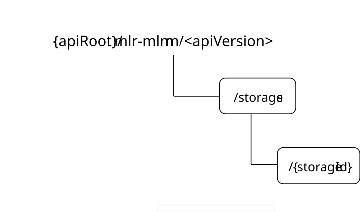

# 6.2.1.3 Resources

## 6.2.1.3.1 Overview

This clause describes the structure for the Resource URIs and the resources and methods used for the service.

Figure 6.2.1.3.1-1 depicts the resource URIs structure for the MLR_MLModelManagement API.

Figure 6.2.1.3.1-1: Resource URIs structure of the MLR_MLModelManagement API

Table 6.2.1.3.1-1 provides an overview of the resources and applicable HTTP methods for the MLR_MLModelManagement API.

Table 6.2.1.3.1-1: Resources and methods overview

| Resource name                | Resource URI          | HTTP method or custom operation | Description                                                                      |
|------------------------------|-----------------------|---------------------------------|----------------------------------------------------------------------------------|
| ML Models Storages           | /storages             | GET                             | Retrieve one or several existing ML Models Storage(s).                           |
|                              |                       | POST                            | Request the creation of a ML Models Storage.                                     |
| Individual ML Models Storage | /storages/{storageId} | GET                             | Retrieve an existing ML Models Storage.                                          |
|                              |                       | PUT                             | Request the update of an existing "Individual ML Models Storage" resource.       |
|                              |                       | PATCH                           | Request the modification of an existing "Individual ML Models Storage" resource. |
|                              |                       | DELETE                          | Request the deletion of an existing "Individual ML Models Storage" resource.     |

## 6.2.1.3.2 Resource: ML Models Storages

### 6.2.1.3.2.1 Description

This resource represents the collection of ML Models Storage(s) managed by the AIMLE Repository.

### 6.2.1.3.2.2 Resource Definition

Resource URI: **{apiRoot}/mlr-mlmm/\<apiVersion\>/storages**

This resource shall support the resource URI variables defined in table 6.2.1.3.2.2-1.

Table 6.2.1.3.2.2-1: Resource URI variables for this resource

| Name    | Data type | Definition          |
|---------|-----------|---------------------|
| apiRoot | string    | See clause 6.2.1.1. |

### 6.2.1.3.2.3 Resource Standard Methods

#### 6.2.1.3.2.3.1 GET

The HTTP GET method allows a service consumer to retrieve one or several existing "Individual ML Models Storage" resource(s) managed by the AIMLE Repository.

This method shall support the URI query parameters specified in table 6.2.1.3.2.3.1-1.

Table 6.2.1.3.2.3.1-1: URI query parameters supported by the GET method on this resource

<table>
<colgroup>
<col style="width: 14%" />
<col style="width: 0%" />
<col style="width: 16%" />
<col style="width: 4%" />
<col style="width: 11%" />
<col style="width: 36%" />
<col style="width: 16%" />
</colgroup>
<tbody>
<tr class="odd">
<td colspan="2">Name</td>
<td>Data type</td>
<td>P</td>
<td>Cardinality</td>
<td>Description</td>
<td>Applicability</td>
</tr>
<tr class="even">
<td colspan="2">storage-ids</td>
<td>array(string)</td>
<td>O</td>
<td>1..N</td>
<td>
Contains the identifier(s) of the targeted ML Models Storage resource(s).

(NOTE)
</td>
<td></td>
</tr>
<tr class="odd">
<td>profile-ids</td>
<td colspan="2">array(string)</td>
<td>O</td>
<td>1..N</td>
<td>
Contains the identifier(s) of the profile(s) of the targeted stored ML Model(s).

(NOTE)
</td>
<td></td>
</tr>
<tr class="even">
<td colspan="2">supp-feats</td>
<td>SupportedFeatures</td>
<td>C</td>
<td>0..1</td>
<td>
Contains the list of supported features among the ones defined in clause 6.2.1.8.

This query parameter shall be present only when feature negotiation is required.
</td>
<td></td>
</tr>
<tr class="odd">
<td colspan="7">NOTE: These query parameters are mutually exclusive and only one of them may be present.</td>
</tr>
</tbody>
</table>

This method shall support the request data structures specified in table 6.2.1.3.2.3.1-2 and the response data structures and response codes specified in table 6.2.1.3.2.3.1-3.

Table 6.2.1.3.2.3.1-2: Data structures supported by the GET Request Body on this resource

|           |     |             |             |
|-----------|-----|-------------|-------------|
| Data type | P   | Cardinality | Description |
| n/a       |     |             |             |

Table 6.2.1.3.2.3.1-3: Data structures supported by the GET Response Body on this resource

<table>
<colgroup>
<col style="width: 23%" />
<col style="width: 4%" />
<col style="width: 11%" />
<col style="width: 14%" />
<col style="width: 45%" />
</colgroup>
<tbody>
<tr class="odd">
<td>Data type</td>
<td>P</td>
<td>Cardinality</td>
<td>
Response

codes
</td>
<td>Description</td>
</tr>
<tr class="even">
<td>array(MLModelsStorage)</td>
<td>M</td>
<td>0..N</td>
<td>200 OK</td>
<td>
Successful case. The requested "Individual ML Models Storage" resource(s) shall be returned.

If there are no available "Individual ML Models Storage" resource(s) fulfilling the request, an empty array shall be returned.
</td>
</tr>
<tr class="odd">
<td>n/a</td>
<td></td>
<td></td>
<td>307 Temporary Redirect</td>
<td>
Temporary redirection.

The response shall include a Location header field containing an alternative URI of the resource located in an alternative AIMLE Repository.

Redirection handling is described in clause 5.2.10 of 3GPP TS 29.122 [2].
</td>
</tr>
<tr class="even">
<td>n/a</td>
<td></td>
<td></td>
<td>308 Permanent Redirect</td>
<td>
Permanent redirection.

The response shall include a Location header field containing an alternative URI of the resource located in an alternative AIMLE Repository.

Redirection handling is described in clause 5.2.10 of 3GPP TS 29.122 [2].
</td>
</tr>
<tr class="odd">
<td colspan="5">NOTE: The mandatory HTTP error status codes for the HTTP GET method listed in table 5.2.6-1 of 3GPP TS 29.122 [2] shall also apply.</td>
</tr>
</tbody>
</table>

Table 6.2.1.3.2.3.1-4: Headers supported by the 307 Response Code on this resource

|          |           |     |             |                                                                                         |
|----------|-----------|-----|-------------|-----------------------------------------------------------------------------------------|
| Name     | Data type | P   | Cardinality | Description                                                                             |
| Location | string    | M   | 1           | Contains an alternative URI of the resource located in an alternative AIMLE Repository. |

Table 6.2.1.3.2.3.1-5: Headers supported by the 308 Response Code on this resource

|          |           |     |             |                                                                                         |
|----------|-----------|-----|-------------|-----------------------------------------------------------------------------------------|
| Name     | Data type | P   | Cardinality | Description                                                                             |
| Location | string    | M   | 1           | Contains an alternative URI of the resource located in an alternative AIMLE Repository. |

#### 6.2.1.3.2.3.2 POST

The HTTP POST method allows a service consumer to request the creation of a ML Models Storage at the AIMLE Repository.

This method shall support the URI query parameters specified in table 6.2.1.3.2.3.2-1.

Table 6.2.1.3.2.3.2-1: URI query parameters supported by the POST method on this resource

|      |           |     |             |             |               |
|------|-----------|-----|-------------|-------------|---------------|
| Name | Data type | P   | Cardinality | Description | Applicability |
| n/a  |           |     |             |             |               |

This method shall support the request data structures specified in table 6.2.1.3.2.3.2-2 and the response data structures and response codes specified in table 6.2.1.3.2.3.2-3.

Table 6.2.1.3.2.3.2-2: Data structures supported by the POST Request Body on this resource

|                 |     |             |                                                                                    |
|-----------------|-----|-------------|------------------------------------------------------------------------------------|
| Data type       | P   | Cardinality | Description                                                                        |
| MLModelsStorage | M   | 1           | Represents the parameters to request the creation of a ML Models Storage resource. |

Table 6.2.1.3.2.3.2-3: Data structures supported by the POST Response Body on this resource

<table>
<colgroup>
<col style="width: 17%" />
<col style="width: 4%" />
<col style="width: 11%" />
<col style="width: 14%" />
<col style="width: 51%" />
</colgroup>
<tbody>
<tr class="odd">
<td>Data type</td>
<td>P</td>
<td>Cardinality</td>
<td>
Response

codes
</td>
<td>Description</td>
</tr>
<tr class="even">
<td>MLModelsStorage</td>
<td>M</td>
<td>1</td>
<td>201 Created</td>
<td>
Successful case. The ML Models Storage is successfully created and a representation of the created "Individual ML Models Storage" resource shall be returned.

An HTTP "Location" header that contains the URI of the created resource shall also be included.
</td>
</tr>
<tr class="odd">
<td colspan="5">NOTE: The mandatory HTTP error status codes for the HTTP POST method listed in table 5.2.6-1 of 3GPP TS 29.122 [2] shall also apply.</td>
</tr>
</tbody>
</table>

Table 6.2.1.3.2.3.2-4: Headers supported by the 201 Response Code on this resource

<table>
<colgroup>
<col style="width: 16%" />
<col style="width: 11%" />
<col style="width: 5%" />
<col style="width: 11%" />
<col style="width: 54%" />
</colgroup>
<tbody>
<tr class="odd">
<td>Name</td>
<td>Data type</td>
<td>P</td>
<td>Cardinality</td>
<td>Description</td>
</tr>
<tr class="even">
<td>Location</td>
<td>string</td>
<td>M</td>
<td>1</td>
<td>
Contains the URI of the newly created resource, according to the structure:

{apiRoot}/mlr-mlmm/&lt;apiVersion&gt;/storages/{storageId}
</td>
</tr>
</tbody>
</table>

### 6.2.1.3.2.4 Resource Custom Operations

There are no resource custom operations defined for this resource in this release of the specification.

## 6.2.1.3.3 Resource: Individual ML Models Storage

### 6.2.1.3.3.1 Description

This resource represents an "Individual ML Models Storage" resource managed by the AIMLE Repository.

### 6.2.1.3.3.2 Resource Definition

Resource URI: **{apiRoot}/mlr-mlmm/\<apiVersion\>/storages/{storageId}**

This resource shall support the resource URI variables defined in table 6.2.1.3.3.2-1.

Table 6.2.1.3.3.2-1: Resource URI variables for this resource

| Name      | Data type | Definition                                                                |
|-----------|-----------|---------------------------------------------------------------------------|
| apiRoot   | string    | See clause 6.2.1.1.                                                       |
| storageId | string    | Represents the identifier of the "Individual ML Models Storage" resource. |

### 6.2.1.3.3.3 Resource Standard Methods

#### 6.2.1.3.3.3.1 GET

The HTTP GET method allows a service consumer to retrieve an existing "Individual ML Models Storage" resource at the AIMLE Repository.

This method shall support the URI query parameters specified in table 6.2.1.3.3.3.1-1.

Table 6.2.1.3.3.3.1-1: URI query parameters supported by the GET method on this resource

|      |           |     |             |             |               |
|------|-----------|-----|-------------|-------------|---------------|
| Name | Data type | P   | Cardinality | Description | Applicability |
| n/a  |           |     |             |             |               |

This method shall support the request data structures specified in table 6.2.1.3.3.3.1-2 and the response data structures and response codes specified in table 6.2.1.3.3.3.1-3.

Table 6.2.1.3.3.3.1-2: Data structures supported by the GET Request Body on this resource

|           |     |             |             |
|-----------|-----|-------------|-------------|
| Data type | P   | Cardinality | Description |
| n/a       |     |             |             |

Table 6.2.1.3.3.3.1-3: Data structures supported by the GET Response Body on this resource

<table>
<colgroup>
<col style="width: 22%" />
<col style="width: 4%" />
<col style="width: 11%" />
<col style="width: 14%" />
<col style="width: 47%" />
</colgroup>
<tbody>
<tr class="odd">
<td>Data type</td>
<td>P</td>
<td>Cardinality</td>
<td>
Response

codes
</td>
<td>Description</td>
</tr>
<tr class="even">
<td>MLModelsStorage</td>
<td>M</td>
<td>1</td>
<td>200 OK</td>
<td>Successful case. The requested "Individual ML Models Storage" resource shall be returned.</td>
</tr>
<tr class="odd">
<td>n/a</td>
<td></td>
<td></td>
<td>307 Temporary Redirect</td>
<td>
Temporary redirection.

The response shall include a Location header field containing an alternative URI of the resource located in an alternative AIMLE Repository.

Redirection handling is described in clause 5.2.10 of 3GPP TS 29.122 [2].
</td>
</tr>
<tr class="even">
<td>n/a</td>
<td></td>
<td></td>
<td>308 Permanent Redirect</td>
<td>
Permanent redirection.

The response shall include a Location header field containing an alternative URI of the resource located in an alternative AIMLE Repository.

Redirection handling is described in clause 5.2.10 of 3GPP TS 29.122 [2].
</td>
</tr>
<tr class="odd">
<td colspan="5">NOTE: The mandatory HTTP error status codes for the HTTP GET method listed in table 5.2.6-1 of 3GPP TS 29.122 [2] shall also apply.</td>
</tr>
</tbody>
</table>

Table 6.2.1.3.3.3.1-4: Headers supported by the 307 Response Code on this resource

|          |           |     |             |                                                                                         |
|----------|-----------|-----|-------------|-----------------------------------------------------------------------------------------|
| Name     | Data type | P   | Cardinality | Description                                                                             |
| Location | string    | M   | 1           | Contains an alternative URI of the resource located in an alternative AIMLE Repository. |

Table 6.2.1.3.3.3.1-5: Headers supported by the 308 Response Code on this resource

|          |           |     |             |                                                                                         |
|----------|-----------|-----|-------------|-----------------------------------------------------------------------------------------|
| Name     | Data type | P   | Cardinality | Description                                                                             |
| Location | string    | M   | 1           | Contains an alternative URI of the resource located in an alternative AIMLE Repository. |

#### 6.2.1.3.3.3.2 PUT

The HTTP PUT method allows a service consumer to request the update of an existing "Individual ML Models Storage" resource at the AIMLE Repository.

This method shall support the URI query parameters specified in table 6.2.1.3.3.3.2-1.

Table 6.2.1.3.3.3.2-1: URI query parameters supported by the PUT method on this resource

|      |           |     |             |             |               |
|------|-----------|-----|-------------|-------------|---------------|
| Name | Data type | P   | Cardinality | Description | Applicability |
| n/a  |           |     |             |             |               |

This method shall support the request data structures specified in table 6.2.1.3.3.3.2-2 and the response data structures and response codes specified in table 6.2.1.3.3.3.2-3.

Table 6.2.1.3.3.3.2-2: Data structures supported by the PUT Request Body on this resource

|                 |     |             |                                                                                       |
|-----------------|-----|-------------|---------------------------------------------------------------------------------------|
| Data type       | P   | Cardinality | Description                                                                           |
| MLModelsStorage | M   | 1           | Represents the updated representation of the "Individual ML Models Storage" resource. |

Table 6.2.1.3.3.3.2-3: Data structures supported by the PUT Response Body on this resource

<table>
<colgroup>
<col style="width: 22%" />
<col style="width: 4%" />
<col style="width: 11%" />
<col style="width: 14%" />
<col style="width: 47%" />
</colgroup>
<tbody>
<tr class="odd">
<td>Data type</td>
<td>P</td>
<td>Cardinality</td>
<td>
Response

codes
</td>
<td>Description</td>
</tr>
<tr class="even">
<td>MLModelsStorage</td>
<td>M</td>
<td>1</td>
<td>200 OK</td>
<td>Successful case. The "Individual ML Models Storage" resource is successfully updated and a representation of the updated resource shall be returned in the response body.</td>
</tr>
<tr class="odd">
<td>n/a</td>
<td></td>
<td></td>
<td>204 No Content</td>
<td>Successful case. The "Individual ML Models Storage" resource is successfully updated and no content is returned in the response body.</td>
</tr>
<tr class="even">
<td>n/a</td>
<td></td>
<td></td>
<td>307 Temporary Redirect</td>
<td>
Temporary redirection.

The response shall include a Location header field containing an alternative URI of the resource located in an alternative AIMLE Repository.

Redirection handling is described in clause 5.2.10 of 3GPP TS 29.122 [2].
</td>
</tr>
<tr class="odd">
<td>n/a</td>
<td></td>
<td></td>
<td>308 Permanent Redirect</td>
<td>
Permanent redirection.

The response shall include a Location header field containing an alternative URI of the resource located in an alternative AIMLE Repository.

Redirection handling is described in clause 5.2.10 of 3GPP TS 29.122 [2].
</td>
</tr>
<tr class="even">
<td colspan="5">NOTE: The mandatory HTTP error status codes for the HTTP PUT method listed in table 5.2.6-1 of 3GPP TS 29.122 [2] shall also apply.</td>
</tr>
</tbody>
</table>

Table 6.2.1.3.3.3.2-4: Headers supported by the 307 Response Code on this resource

|          |           |     |             |                                                                                         |
|----------|-----------|-----|-------------|-----------------------------------------------------------------------------------------|
| Name     | Data type | P   | Cardinality | Description                                                                             |
| Location | string    | M   | 1           | Contains an alternative URI of the resource located in an alternative AIMLE Repository. |

Table 6.2.1.3.3.3.2-5: Headers supported by the 308 Response Code on this resource

|          |           |     |             |                                                                                         |
|----------|-----------|-----|-------------|-----------------------------------------------------------------------------------------|
| Name     | Data type | P   | Cardinality | Description                                                                             |
| Location | string    | M   | 1           | Contains an alternative URI of the resource located in an alternative AIMLE Repository. |

#### 6.2.1.3.3.3.3 PATCH

The HTTP PATCH method allows a service consumer to request the modification of an existing "Individual ML Models Storage" resource at the AIMLE Repository.

This method shall support the URI query parameters specified in table 6.2.1.3.3.3.3-1.

Table 6.2.1.3.3.3.3-1: URI query parameters supported by the PATCH method on this resource

|      |           |     |             |             |               |
|------|-----------|-----|-------------|-------------|---------------|
| Name | Data type | P   | Cardinality | Description | Applicability |
| n/a  |           |     |             |             |               |

This method shall support the request data structures specified in table 6.2.1.3.3.3.3-2 and the response data structures and response codes specified in table 6.2.1.3.3.3.3-3.

Table 6.2.1.3.3.3.3-2: Data structures supported by the PATCH Request Body on this resource

|                      |     |             |                                                                                                       |
|----------------------|-----|-------------|-------------------------------------------------------------------------------------------------------|
| Data type            | P   | Cardinality | Description                                                                                           |
| MLModelsStoragePatch | M   | 1           | Represents the parameters to request the modification of the "Individual ML Models Storage" resource. |

Table 6.2.1.3.3.3.3-3: Data structures supported by the PATCH Response Body on this resource

<table>
<colgroup>
<col style="width: 22%" />
<col style="width: 4%" />
<col style="width: 11%" />
<col style="width: 14%" />
<col style="width: 47%" />
</colgroup>
<tbody>
<tr class="odd">
<td>Data type</td>
<td>P</td>
<td>Cardinality</td>
<td>
Response

codes
</td>
<td>Description</td>
</tr>
<tr class="even">
<td>MLModelsStorage</td>
<td>M</td>
<td>1</td>
<td>200 OK</td>
<td>Successful case. The "Individual ML Models Storage" resource is successfully modified and a representation of the updated resource shall be returned in the response body.</td>
</tr>
<tr class="odd">
<td>n/a</td>
<td></td>
<td></td>
<td>204 No Content</td>
<td>Successful case. The "Individual ML Models Storage" resource is successfully modified and no content is returned in the response body.</td>
</tr>
<tr class="even">
<td>n/a</td>
<td></td>
<td></td>
<td>307 Temporary Redirect</td>
<td>
Temporary redirection.

The response shall include a Location header field containing an alternative URI of the resource located in an alternative AIMLE Repository.

Redirection handling is described in clause 5.2.10 of 3GPP TS 29.122 [2].
</td>
</tr>
<tr class="odd">
<td>n/a</td>
<td></td>
<td></td>
<td>308 Permanent Redirect</td>
<td>
Permanent redirection.

The response shall include a Location header field containing an alternative URI of the resource located in an alternative AIMLE Repository.

Redirection handling is described in clause 5.2.10 of 3GPP TS 29.122 [2].
</td>
</tr>
<tr class="even">
<td colspan="5">NOTE: The mandatory HTTP error status codes for the HTTP PATCH method listed in table 5.2.6-1 of 3GPP TS 29.122 [2] shall also apply.</td>
</tr>
</tbody>
</table>

Table 6.2.1.3.3.3.3-4: Headers supported by the 307 Response Code on this resource

|          |           |     |             |                                                                                         |
|----------|-----------|-----|-------------|-----------------------------------------------------------------------------------------|
| Name     | Data type | P   | Cardinality | Description                                                                             |
| Location | string    | M   | 1           | Contains an alternative URI of the resource located in an alternative AIMLE Repository. |

Table 6.2.1.3.3.3.3-5: Headers supported by the 308 Response Code on this resource

|          |           |     |             |                                                                                         |
|----------|-----------|-----|-------------|-----------------------------------------------------------------------------------------|
| Name     | Data type | P   | Cardinality | Description                                                                             |
| Location | string    | M   | 1           | Contains an alternative URI of the resource located in an alternative AIMLE Repository. |

#### 6.2.1.3.3.3.4 DELETE

The HTTP DELETE method allows a service consumer to request the deletion of an existing "Individual ML Models Storage" resource at the AIMLE Repository.

This method shall support the URI query parameters specified in table 6.2.1.3.3.3.4-1.

Table 6.2.1.3.3.3.4-1: URI query parameters supported by the DELETE method on this resource

|      |           |     |             |             |               |
|------|-----------|-----|-------------|-------------|---------------|
| Name | Data type | P   | Cardinality | Description | Applicability |
| n/a  |           |     |             |             |               |

This method shall support the request data structures specified in table 6.2.1.3.3.3.4-2 and the response data structures and response codes specified in table 6.2.1.3.3.3.4-3.

Table 6.2.1.3.3.3.4-2: Data structures supported by the DELETE Request Body on this resource

|           |     |             |             |
|-----------|-----|-------------|-------------|
| Data type | P   | Cardinality | Description |
| n/a       |     |             |             |

Table 6.2.1.3.3.3.4-3: Data structures supported by the DELETE Response Body on this resource

<table>
<colgroup>
<col style="width: 17%" />
<col style="width: 4%" />
<col style="width: 11%" />
<col style="width: 14%" />
<col style="width: 51%" />
</colgroup>
<tbody>
<tr class="odd">
<td>Data type</td>
<td>P</td>
<td>Cardinality</td>
<td>
Response

codes
</td>
<td>Description</td>
</tr>
<tr class="even">
<td>n/a</td>
<td></td>
<td></td>
<td>204 No Content</td>
<td>Successful case. The "Individual ML Models Storage" resource is successfully deleted.</td>
</tr>
<tr class="odd">
<td>n/a</td>
<td></td>
<td></td>
<td>307 Temporary Redirect</td>
<td>
Temporary redirection.

The response shall include a Location header field containing an alternative URI of the resource located in an alternative AIMLE Repository.

Redirection handling is described in clause 5.2.10 of 3GPP TS 29.122 [2].
</td>
</tr>
<tr class="even">
<td>n/a</td>
<td></td>
<td></td>
<td>308 Permanent Redirect</td>
<td>
Permanent redirection.

The response shall include a Location header field containing an alternative URI of the resource located in an alternative AIMLE Repository.

Redirection handling is described in clause 5.2.10 of 3GPP TS 29.122 [2].
</td>
</tr>
<tr class="odd">
<td colspan="5">NOTE: The mandatory HTTP error status codes for the HTTP DELETE method listed in table 5.2.6-1 of 3GPP TS 29.122 [2] shall also apply.</td>
</tr>
</tbody>
</table>

Table 6.2.1.3.3.3.4-4: Headers supported by the 307 Response Code on this resource

|          |           |     |             |                                                                                         |
|----------|-----------|-----|-------------|-----------------------------------------------------------------------------------------|
| Name     | Data type | P   | Cardinality | Description                                                                             |
| Location | string    | M   | 1           | Contains an alternative URI of the resource located in an alternative AIMLE Repository. |

Table 6.2.1.3.3.3.4-5: Headers supported by the 308 Response Code on this resource

|          |           |     |             |                                                                                         |
|----------|-----------|-----|-------------|-----------------------------------------------------------------------------------------|
| Name     | Data type | P   | Cardinality | Description                                                                             |
| Location | string    | M   | 1           | Contains an alternative URI of the resource located in an alternative AIMLE Repository. |

### 6.2.1.3.3.4 Resource Custom Operations

There are no resource custom operations defined for this resource in this release of the specification.
