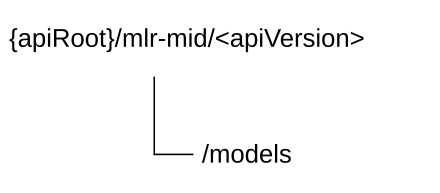

# 6.2.2 MLR_ModelInformationDiscovery API

## 6.2.2.1 Introduction

The MLR_ModelInformationDiscovery service shall use the MLR_ModelInformationDiscovery API.

The API URI of the MLR_ModelInformationDiscovery API shall be:

**{apiRoot}/\<apiName\>/\<apiVersion\>**

The request URIs used in HTTP requests shall have the Resource URI structure defined in clause 6.5 of 3GPP TS 29.549 \[10\], i.e.:

**{apiRoot}/\<apiName\>/\<apiVersion\>/\<apiSpecificSuffixes\>**

with the following components:

\- The {apiRoot} shall be set as described in clause 6.5 of 3GPP TS 29.549 \[10\].

\- The \<apiName\> shall be "mlr-mid".

\- The \<apiVersion\> shall be "v1".

\- The \<apiSpecificSuffixes\> shall be set as described in clauses 6.2.2.3 and 6.2.2.4.

NOTE: When 3GPP TS 29.122 \[2\] is referenced for the common protocol and interface aspects for API definition in the clauses under clause 6.2.2, the ML Repository takes the role of the SCEF and the service consumer takes the role of the SCS/AS.

## 6.2.2.2 Usage of HTTP and common API related aspects

The provisions of clause 6.3 of 3GPP TS 29.549 \[10\] shall apply for the MLR_ModelInformationDiscovery API.

## 6.2.2.3 Resources

### 6.2.2.3.1 Overview

This clause describes the structure for the Resource URIs and the resources and methods used for the service.

Figure 6.2.2.3.1-1 depicts the resource URIs structure for the MLR_ModelInformationDiscovery Service API.

Figure 6.2.2.3.1-1: Resource URI structure of the MLR_ModelInformationDiscovery Service API

Table 6.2.2.3.1-1 provides an overview of the resources and applicable HTTP methods.

Table 6.2.2.3.1-1: Resources and methods overview

| Resource purpose/name | Resource URI (relative path after API URI) | HTTP method or custom operation | Description (service operation)                                        |
|-----------------------|--------------------------------------------|---------------------------------|------------------------------------------------------------------------|
| ML Models             | /models                                    | GET                             | Discover the ML model information according to the filtering criteria. |

### 6.2.2.3.2 Resource: ML Models

#### 6.2.2.3.2.1 Description

The "ML Models" resource represents the ML Models.

#### 6.2.2.3.2.2 Resource Definition

Resource URI: **{apiRoot}/mlr-mid/\<apiVersion\>/models**

This resource shall support the resource URI variables defined in the table 6.2.2.3.2.2-1.

Table 6.2.2.3.2.2-1: Resource URI variables for this resource

| Name    | Data Type | Definition          |
|---------|-----------|---------------------|
| apiRoot | string    | See clause 6.2.2.1. |

#### 6.2.2.3.2.3 Resource Standard Methods

##### 6.2.2.3.2.3.1 GET

This method shall support the URI query parameters specified in table 6.2.2.3.2.3.1-1.

Table 6.2.2.3.2.3.1-1: URI query parameters supported by the GET method on this resource

<table>
<colgroup>
<col style="width: 15%" />
<col style="width: 17%" />
<col style="width: 3%" />
<col style="width: 11%" />
<col style="width: 51%" />
</colgroup>
<thead>
<tr class="header">
<th>Name</th>
<th>Data type</th>
<th>P</th>
<th>Cardinality</th>
<th>Description</th>
</tr>
</thead>
<tbody>
<tr class="odd">
<td>filt-criteria</td>
<td>MLModel</td>
<td>M</td>
<td>1</td>
<td>Represents the ML model filtering criteria.</td>
</tr>
<tr class="even">
<td>supported-features</td>
<td>SupportedFeatures</td>
<td>C</td>
<td>0..1</td>
<td>
Contains supported features information, used to negotiate the applicability of optional features.

This query parameter shall be present only if feature negotiation needs to take place.
</td>
</tr>
</tbody>
</table>

This method shall support the request data structures specified in table 6.2.2.3.2.3.1-2 and the response data structures and response codes specified in table 6.2.2.3.2.3.1-3.

Table 6.2.2.3.2.3.1-2: Data structures supported by the GET Request Body on this resource

| Data type | P   | Cardinality | Description |
|-----------|-----|-------------|-------------|
| n/a       |     |             |             |

Table 6.2.2.3.2.3.1-3: Data structures supported by the GET Response Body on this resource

<table>
<colgroup>
<col style="width: 21%" />
<col style="width: 3%" />
<col style="width: 11%" />
<col style="width: 13%" />
<col style="width: 50%" />
</colgroup>
<thead>
<tr class="header">
<th>Data type</th>
<th>P</th>
<th>Cardinality</th>
<th>
Response

codes
</th>
<th>Description</th>
</tr>
</thead>
<tbody>
<tr class="odd">
<td>DiscoveryResp</td>
<td>M</td>
<td>1</td>
<td>200 OK</td>
<td>Successful case. The response body contains the result of the search over the list of stored ML Models.</td>
</tr>
<tr class="even">
<td>n/a</td>
<td></td>
<td></td>
<td>307 Temporary Redirect</td>
<td>
Temporary redirection.

The response shall include a Location header field containing an alternative target URI of the resource located in an alternative MLR.

Redirection handling is described in clause 5.2.10 of 3GPP TS 29.122 [2].
</td>
</tr>
<tr class="odd">
<td>n/a</td>
<td></td>
<td></td>
<td>308 Permanent Redirect</td>
<td>
Permanent redirection.

The response shall include a Location header field containing an alternative target URI of the resource located in an alternative MLR.

Redirection handling is described in clause 5.2.10 of 3GPP TS 29.122 [2].
</td>
</tr>
<tr class="even">
<td colspan="5">NOTE: The mandatory HTTP error status codes for the HTTP GET method listed in table 5.2.6-1 of 3GPP TS 29.122 [2] shall also apply.</td>
</tr>
</tbody>
</table>

Table 6.2.2.3.2.3.1-4: Headers supported by the 307 Response Code on this resource

|          |           |     |             |                                                                            |
|----------|-----------|-----|-------------|----------------------------------------------------------------------------|
| Name     | Data type | P   | Cardinality | Description                                                                |
| Location | string    | M   | 1           | Contains an alternative URI of the resource located in an alternative MLR. |

Table 6.2.2.3.2.3.1-5: Headers supported by the 308 Response Code on this resource

|          |           |     |             |                                                                            |
|----------|-----------|-----|-------------|----------------------------------------------------------------------------|
| Name     | Data type | P   | Cardinality | Description                                                                |
| Location | string    | M   | 1           | Contains an alternative URI of the resource located in an alternative MLR. |

#### 6.2.2.3.2.4 Resource Custom Operations

There are no resource custom operations defined for this resource in this release of the specification.

## 6.2.2.4 Custom Operations without associated resources

There are no custom operations without associated resources in the present release of the document.

## 6.2.2.5 Notifications

There are no notifications in the present release of the document.

## 6.2.2.6 Data Model

### 6.2.2.6.1 General

This clause specifies the application data model supported by the API.

Table 6.2.2.6.1-1 specifies the data types defined for the MLR_ModelInformationDiscovery API.

Table 6.2.2.6.1-1: MLR_ModelInformationDiscovery API specific Data Types

| Data type     | Section defined | Description                                 | Applicability |
|---------------|-----------------|---------------------------------------------|---------------|
| DiscoveryResp | 6.2.2.6.2.2     | Represents the ML model discovery response. |               |
| MlModel       | 6.2.2.6.2.3     | Represents the ML model.                    |               |

Table 6.2.2.6.1-2 specifies data types re-used by the MLR_ModelInformationDiscovery API from other specifications, including a reference to their respective specifications, and when needed, a short description of their use within the MLR_ModelInformationDiscovery API.

Table 6.2.2.6.1-2: MLR_ModelInformationDiscovery API Re-used Data Types

| Data type         | Reference             | Comments                                                                                         | Applicability |
|-------------------|-----------------------|--------------------------------------------------------------------------------------------------|---------------|
| Bytes             | 3GPP TS 29.571 \[11\] | Represents data in bytes.                                                                        |               |
| MLModel           | Clause 6.2.1.6.2.4    | Represents the ML model information.                                                             |               |
| MLModelProfile    | Clause 6.2.1.6.2.3    | Represents the ML model profile.                                                                 |               |
| SupportedFeatures | 3GPP TS 29.571 \[11\] | Represents the supported features, used to negotiate the supported optional features of the API. |               |

### 6.2.2.6.2 Structured data types

#### 6.2.2.6.2.1 Introduction

This clause defines the structures to be used in resource representations.

#### 6.2.2.6.2.2 Type: DiscoveryResp

Table 6.2.2.6.2.2-1: Definition of type DiscoveryResp

<table style="width:100%;">
<colgroup>
<col style="width: 16%" />
<col style="width: 15%" />
<col style="width: 3%" />
<col style="width: 11%" />
<col style="width: 38%" />
<col style="width: 13%" />
</colgroup>
<thead>
<tr class="header">
<th>Attribute name</th>
<th>Data type</th>
<th>P</th>
<th>Cardinality</th>
<th>Description</th>
<th>Applicability</th>
</tr>
</thead>
<tbody>
<tr class="odd">
<td>profiles</td>
<td>array(MLModelProfile)</td>
<td>C</td>
<td>1..N</td>
<td>
Contains the list of ML model profiles.

(NOTE)
</td>
<td></td>
</tr>
<tr class="even">
<td>mlModels</td>
<td>array(MlModel)</td>
<td>C</td>
<td>1..N</td>
<td>
Contains the list of ML models.

(NOTE)
</td>
<td></td>
</tr>
<tr class="odd">
<td>indicator</td>
<td>boolean</td>
<td>O</td>
<td>0..1</td>
<td>
Represents the continuously training indicator.

- "true": Indicates that the ML Model needs to be continuously trained.

- "false": Indicates that the ML Model does not need to be continuously trained.

- The default value is "false" when this attribute is omitted.
</td>
<td></td>
</tr>
<tr class="even">
<td colspan="6">NOTE: One of these attributes shall be provided.</td>
</tr>
</tbody>
</table>

#### 6.2.2.6.2.3 Type: MlModel

Table 6.2.2.6.2.3-1: Definition of type MlModel

| Attribute name | Data type | P   | Cardinality | Description                         | Applicability |
|----------------|-----------|-----|-------------|-------------------------------------|---------------|
| mlModelId      | string    | M   | 1           | Represents the ML model identifier. |               |
| mlModel        | Bytes     | O   | 0..1        | Represents the ML model.            |               |

### 6.2.2.6.3 Simple data types and enumerations

#### 6.2.2.6.3.1 Introduction

This clause defines simple data types and enumerations that can be referenced from data structures defined in the previous clauses.

#### 6.2.2.6.3.2 Simple data types

None.

#### 6.2.2.6.3.3 Enumerations

There are no enumerations in this release of the specification.

### 6.2.2.6.4 Data types describing alternative data types or combinations of data types

There are no data types describing alternative data types and combinations of data types in this release of the specification.

### 6.2.2.6.5 Binary data

There are no binary data defined in this release of the specification.

## 6.2.2.7 Error Handling

### 6.2.2.7.1 General

For the MLR_ModelInformationDiscovery API, error handling shall be supported as specified in clause 6.7 of 3GPP TS 29.549 \[10\].

In addition, the requirements in the following clauses are applicable for the MLR_ModelInformationDiscovery API.

### 6.2.2.7.2 Protocol Errors

No specific procedures for the MLR_ModelInformationDiscovery API are specified.

### 6.2.2.7.3 Application Errors

The application errors defined for MLR_ModelInformationDiscovery API are listed in table 6.2.2.7.3-1.

Table 6.2.2.7.3-1: Application errors

| Application Error | HTTP status code | Description | Applicability |
|-------------------|------------------|-------------|---------------|
|                   |                  |             |               |

## 6.2.2.8 Feature Negotiation

The optional features in table 6.2.2.8-1 are defined for the MLR_ModelInformationDiscovery API. They shall be negotiated using the extensibility mechanism defined in clause 6.8 of 3GPP TS 29.549 \[10\].

Table 6.2.2.8-1: Supported Features

| Feature number | Feature Name | Description |
|----------------|--------------|-------------|
|                |              |             |

## 6.2.2.9 Security

The provisions of clause 9 of 3GPP TS 29.549 \[10\] shall apply for the MLR_ModelInformationDiscovery API.
