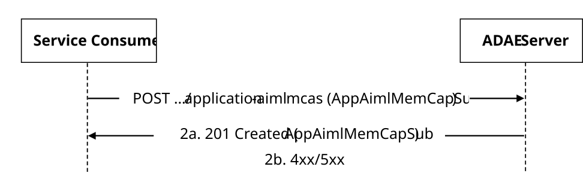
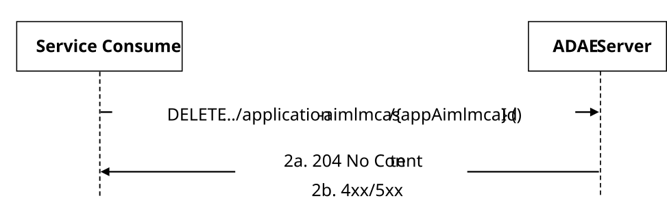
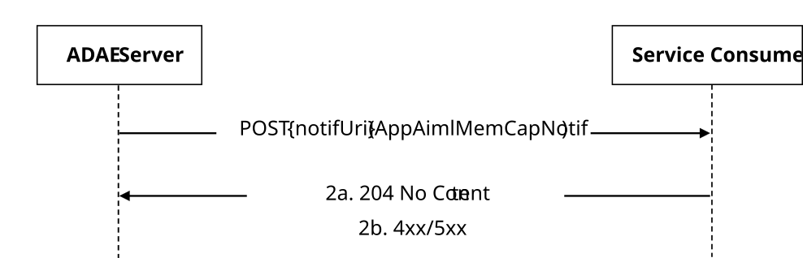
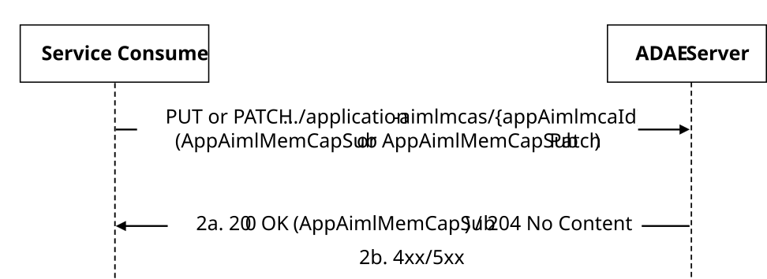

# 5.11.11 SS_ADAE_AIMLMemberCapabilityAnalytics API

## 5.11.11.1 Service Description

The SS_ADAE_AIMLMemberCapabilityAnalytics service exposed by the ADAE Server enables a service consumer to:

\- create/update/delete AIML Member Capability Analytics Subscription; and

\- receive AIML Member Capability Analytics Notifications.

## 5.11.11.2 Service Operations

### 5.11.11.2.1 Introduction

The service operations defined for the SS_ADAE_AIMLMemberCapabilityAnalytics service are shown in table 5.11.11.2.1-1.

Table 5.11.11.2.1-1: SS_ADAE_AIMLMemberCapabilityAnalytics Service Operations

| Service Operation Name                             | Description                                                                                                            | Initiated by                  |
|----------------------------------------------------|------------------------------------------------------------------------------------------------------------------------|-------------------------------|
| SS_ADAE_AIML_MemberCapabilityAnalytics_Subscribe   | This service operation enables a service consumer to create a AIML member capability analytics Subscription.           | e.g. VAL Server, AIMLE Server |
| SS_ADAE_AIML_MemberCapabilityAnalytics_Update      | This service operation enables a service consumer to update an existing AIML member capability analytics Subscription. | e.g. VAL Server, AIMLE Server |
| SS_ADAE_AIML_MemberCapabilityAnalytics_Unsubscribe | This service operation enables a service consumer to delete an existing AIML member capability analytics Subscription. | e.g. VAL Server, AIMLE Server |
| SS_ADAE_AIML_MemberCapabilityAnalytics_Notify      | This service operation enables a service consumer to receive AIML member capability analytics notifications.           | ADAE Server                   |

### 5.11.11.2.2 SS_ADAE_AIML_MemberCapabilityAnalytics_Subscribe

#### 5.11.11.2.2.1 General

This service operation is used by a service consumer to request the creation of AIML Member Capability Analytics Subscription at the ADAE Server.

The following procedures are supported by the "SS_ADAE_AIML_MemberCapabilityAnalytics_Subscribe" service operation:

\- AIML Member Capability Analytics Subscription Creation.

This service operation is used by the service consumer for AIML Member Capability Analytics Subscription to the ADAE Server.

#### 5.11.11.2.2.2 AIML Member Capability Analytics Subscription Creation

Figure 5.11.11.2.2.2-1 depicts a scenario where a service consumer sends a request to the ADAE Server to request the creation of AIML Member Capability Analytics Subscription (see also clause 8.16 of 3GPP°TS°23.436°\[38\]).

Figure 5.11.11.2.2.2-1: Procedure for AIML Member Capability Analytics Subscription Creation

1\. In order to subscribe to AIML Member Capability Analytics reporting, the service consumer shall send an HTTP POST request to the ADAE Server targeting the URI of the "AIML Member Capability Analytics Subscriptions" collection resource, with the request body including the AppAimlMemCapSub data structure.

2a. Upon success, the ADAE Server shall respond with an HTTP "201 Created" status code with the response body containing a representation of the created "Individual AIML Member Capability Analytics Subscription" resource within the AppAimlMemCapSub data structure, and an HTTP "Location" header field containing the URI of the created resource.

2b. On failure, the appropriate HTTP status code indicating the error shall be returned and appropriate additional error information should be returned in the HTTP POST response body, as specified in clause 7.10.11.6.

### 5.11.11.2.3 SS_ADAE_AIML_MemberCapabilityAnalytics_Unsubscribe

#### 5.11.11.2.3.1 General

This service operation is used by a service consumer to request the deletion of AIML Member Capability Analytics Subscription at the ADAE Server.

The following procedures are supported by the "SS_ADAE_AIML_MemberCapabilityAnalytics_Unsubscribe" service operation:

\- AIML Member Capability Analytics Subscription Deletion.

#### 5.11.11.2.3.2 AIML Member Capability Analytics Subscription Deletion

Figure 5.5.2.3.2-1 depicts a scenario where a service consumer sends a request to the ADAE Server to delete an existing AIML Member Capability Analytics Subscription (see also clause 8.16 of 3GPP°TS°23.436°\[38\])

Figure 5.5.2.3.2-1: Procedure for AIML Member Capability Analytics Subscription Deletion

1\. In order to request the deletion of an existing AIML Member Capability Analytics Subscription, the service consumer shall send an HTTP DELETE request to the ADAE Server targeting the URI of the corresponding "Individual AIML Member Capability Analytics Subscription" resource.

NOTE: An alternative service consumer (i.e. other than the one that requested the creation of the targeted resource) can initiate this request.

2a. Upon success, the ADAE Server shall respond with an HTTP "204 No Content" status code.

2b. On failure, the appropriate HTTP status code indicating the error shall be returned and appropriate additional error information should be returned in the HTTP DELETE response body, as specified in clause 7.10.11.6.

### 5.11.11.2.4 SS_ADAE_AIML_MemberCapabilityAnalytics_Notify

#### 5.11.11.2.4.1 General

This service operation is used by a ADAE Server to notify a previously subscribed service consumer on:

\- AIML Member Capability Analytics report(s).

The following procedures are supported by the "SS_ADAE_AIML_MemberCapabilityAnalytics_Notify" service operation:

\- AIML Member Capability Analytics Notification.

#### 5.11.11.2.4.2 AIML Member Capability Analytics Notification

Figure 5.11.11.2.3.2-1 depicts a scenario where the ADAE Server sends a request to notify a previously subscribed service consumer on AIML Member Capability Analytics report(s) (see also clause 8.16 of 3GPP°TS°23.436°\[38\])

Figure 5.5.2.5.4-1: Procedure for AIML Member Capability Analytics Notification

1\. In order to notify a previously subscribed service consumer on AIML Member Capability Analytics report(s), the ADAE Server shall send an HTTP POST request to the service consumer with the request URI set to "{notifUri}", where the "notifUri" variable is set to the value received from the service consumer during the creation of the corresponding AIML Member Capability Analytics Subscription using the procedures defined in clauses 5.11.11.2.2, and the request body including the AppAimlMemCapNotif data structure.

2a. Upon success, the service consumer shall respond to the ADAE Server with an HTTP "204 No Content" status code to acknowledge the reception of the notification.

2b. On failure, the appropriate HTTP status code indicating the error shall be returned and appropriate additional error information should be returned in the HTTP POST response body, as specified in clause 7.10.11.6.

### 5.11.11.2.5 SS_ADAE_AIML_MemberCapabilityAnalytics_Update

#### 5.11.11.2.5.1 General

This service operation is used by a service consumer to request the update of an ADAE_AIML_MemberCapabilityAnalytics Subscription at the ADAE Server.

The following procedures are supported by the "SS_ADAE_AIML_MemberCapabilityAnalytics_Update" service operation:

\- AIML Member Capability Analytics Subscription Update.

#### 5.11.11.2.5.2 AIML Member Capability Analytics Subscription Update

Figure 5.5.2.3.2-1 depicts a scenario where a service consumer sends a request to the ADAE Server to request the update of an existing ADAE_AIML_MemberCapabilityAnalytics Subscription (see also clause 8.16 of 3GPP°TS°23.436°\[38\]).

Figure 5.11.11.2.5.2-1: Procedure for AIML Member Capability Analytics Subscription Update

1\. In order to request the update of an existing AIML Member Capability Analytics reporting, the service consumer shall send an HTTP PUT/PATCH request to the ADAE Server, targeting the URI of the corresponding "Individual AIML Member Capability Analytics Subscription" resource, with the request body including either:

\- the updated representation of the resource within the AppAimlMemCapSub data structure, in case the HTTP PUT method is used; or

\- the requested modifications to the resource within the AppAimlMemCapSubPatch data structure, in case the HTTP PATCH method is used.

NOTE: An alternative service consumer (i.e. other than the one that requested the creation of the targeted resource) can initiate this request.

2a. Upon success, the ADAE Server shall update the targeted "Individual AIML Member Capability Analytics Subscription" resource accordingly and respond with either:

\- an HTTP "200 OK" status code with the response body containing a representation of the updated "Individual AIML Member Capability Analytics Subscription" resource within the AppAimlMemCapSub data structure; or

\- an HTTP "204 No Content" status code.

2b. On failure, the appropriate HTTP status code indicating the error shall be returned and appropriate additional error information should be returned in the HTTP PUT/PATCH response body, as specified in clause 7.10.11.6.
