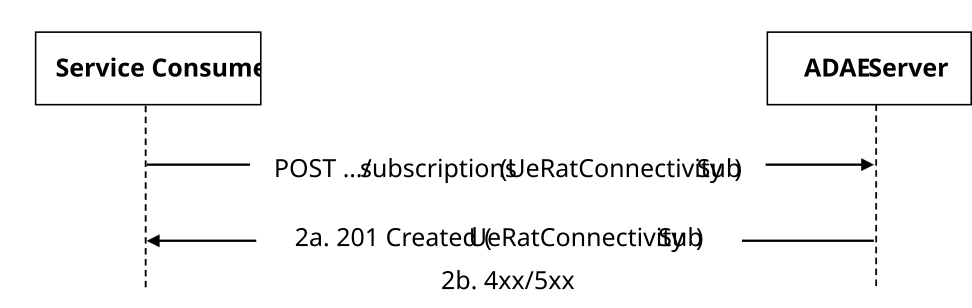
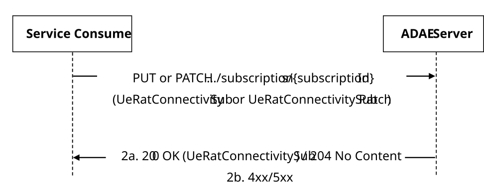
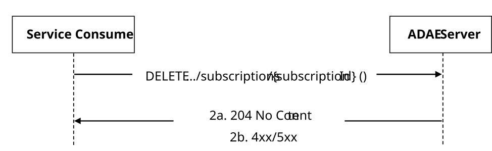
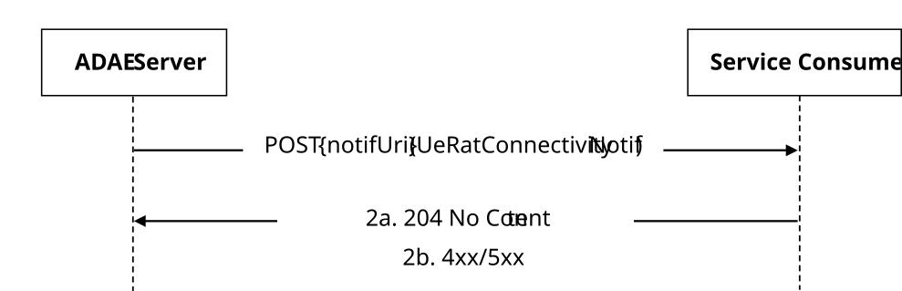

# 5.11.14 SS_ADAE_UeRatConnectivityAnalytics API

## 5.11.14.1 Service Description

The SS_ADAE_UeRatConnectivityAnalytics service exposed by the ADAE Server enables a service consumer to:

\- create/update/delete a UE RAT connectivity Analytics Subscription; and

\- receive UE RAT Connectivity Analytics Notifications.

## 5.11.14.2 Service Operations

### 5.11.14.2.1 Introduction

The service operations defined for the SS_ADAE_UeRatConnectivityAnalytics service are shown in table 5.11.14.2.1-1.

Table 5.11.14.2.1-1: SS_ADAE_UeRatConnectivityAnalytics Service Operations

| Service Operation Name                         | Description                                                                                                         | Initiated by     |
|------------------------------------------------|---------------------------------------------------------------------------------------------------------------------|------------------|
| SS_ADAE_UeRatConnectivityAnalytics_Subscribe   | This service operation enables a service consumer to create a UE RAT Connectivity Analytics Subscription.           | e.g., VAL Server |
| SS_ADAE_UeRatConnectivityAnalytics_Update      | This service operation enables a service consumer to update an existing UE RAT Connectivity Analytics Subscription. | e.g., VAL Server |
| SS_ADAE_UeRatConnectivityAnalytics_Unsubscribe | This service operation enables a service consumer to delete an existing UE RAT Connectivity Analytics Subscription. | e.g., VAL Server |
| SS_ADAE_UeRatConnectivityAnalytics_Notify      | This service operation enables a service consumer to receive UE RAT Connectivity Analytics Notifications.           | ADAE Server      |

### 5.11.14.2.2 SS_ADAE_UeRatConnectivityAnalytics_Subscribe

#### 5.11.14.2.2.1 General

This service operation is used by a service consumer to request the creation of a UE RAT Connectivity Analytics Subscription at the ADAE Server.

The following procedures are supported by the "SS_ADAE_UeRatConnectivityAnalytics_Subscribe" service operation:

\- UE RAT Connectivity Analytics Subscription Creation.

#### 5.11.14.2.2.2 UE RAT Connectivity Analytics Subscription Creation

Figure 5.11.14.2.2.2-1 depicts a scenario where a service consumer sends a request to the ADAE Server to request the creation of a UE RAT Connectivity Analytics Subscription (see also clause 10.2 of 3GPP°TS°23.436°\[38\]).

Figure 5.11.14.2.2.2-1: Procedure for UE RAT Connectivity Analytics Subscription Creation

1\. In order to subscribe to UE RAT Connectivity Analytics related event(s) reporting, the service consumer shall send an HTTP POST request to the ADAE Server targeting the URI of the "UE RAT Connectivity Analytics Subscriptions" collection resource, with the request body including the UeRatConnectivitySub data structure.

2a. Upon success, the ADAE Server shall respond with an HTTP "201 Created" status code with the response body containing a representation of the created "Individual UE RAT Connectivity Analytics Subscription" resource within the UeRatConnectivitySub data structure, and an HTTP "Location" header field containing the URI of the created resource.

2b. On failure, the appropriate HTTP status code indicating the error shall be returned and appropriate additional error information should be returned in the HTTP POST response body, as specified in clause 7.10.12.7.

### 5.11.14.2.3 SS_ADAE_UeRatConnectivityAnalytics_Update

#### 5.11.14.2.3.1 General

This service operation is used by a service consumer to request the update of an existing UE RAT Connectivity Analytics Subscription at the ADAE Server.

The following procedures are supported by the "SS_ADAE_UeRatConnectivityAnalytics_Update" service operation:

\- UE RAT Connectivity Analytics Subscription Update.

#### 5.11.14.2.3.2 UE RAT Connectivity Analytics Subscription Update

Figure 5.11.14.2.3.2-1 depicts a scenario where a service consumer sends a request to the ADAE Server to request the update of an existing UE RAT Connectivity Analytics Subscription (see also clause 10.2 of 3GPP°TS°23.436°\[38\]).

Figure 5.11.14.2.3.2-1: Procedure for UE RAT Connectivity Analytics Subscription Update

1\. In order to update an existing UE RAT Connectivity Analytics Subscription, the service consumer shall send an HTTP PUT/PATCH request to the ADAE Server, targeting the URI of the corresponding "Individual UE RAT Connectivity Analytics Subscription" resource, with the request body including either:

\- the updated representation of the resource within the UeRatConnectivitySub data structure, in case the HTTP PUT method is used; or

\- the requested modifications to the resource within the UeRatConnectivitySubPatch data structure, in case the HTTP PATCH method is used.

NOTE: An alternative service consumer (i.e., other than the one that requested the creation of the targeted resource) can initiate this request.

2a. Upon success, the ADAE Server shall update the targeted "Individual UE RAT Connectivity Analytics Subscription" resource accordingly and respond with either:

\- an HTTP "200 OK" status code with the response body containing a representation of the updated "Individual UE RAT Connectivity Analytics Subscription" resource within the UeRatConnectivitySub data structure; or

\- an HTTP "204 No Content" status code.

2b. On failure, the appropriate HTTP status code indicating the error shall be returned and appropriate additional error information should be returned in the HTTP PUT/PATCH response body, as specified in clause 7.10.12.7.

### 5.11.14.2.4 SS_ADAE_UeRatConnectivityAnalytics_Unsubscribe

#### 5.11.14.2.4.1 General

This service operation is used by a service consumer to request the deletion of an existing UE RAT Connectivity Analytics Subscription at the ADAE Server.

The following procedures are supported by the "SS_ADAE_UeRatConnectivityAnalytics_Unsubscribe" service operation:

\- UE RAT Connectivity Analytics Subscription Deletion.

#### 5.11.14.2.4.2 UE RAT Connectivity Analytics Subscription Deletion

Figure 5.11.14.2.4.2-1 depicts a scenario where a service consumer sends a request to the ADAE Server to delete an existing UE RAT Connectivity Analytics Subscription (see also clause 10.2 of 3GPP°TS°23.436°\[38\])

Figure 5.11.14.2.4.2-1: Procedure for UE RAT Connectivity Analytics Subscription Deletion

1\. In order to request the deletion of an existing UE RAT Connectivity Analytics Subscription, the service consumer shall send an HTTP DELETE request to the ADAE Server targeting the URI of the corresponding "Individual UE RAT Connectivity Analytics Subscription" resource.

NOTE: An alternative service consumer (i.e. other than the one that requested the creation/update of the targeted resource) can initiate this request.

2a. Upon success, the ADAE Server shall respond with an HTTP "204 No Content" status code.

2b. On failure, the appropriate HTTP status code indicating the error shall be returned and appropriate additional error information should be returned in the HTTP DELETE response body, as specified in clause 7.10.12.7.

### 5.11.14.2.5 SS_ADAE_UeRatConnectivityAnalytics_Notify

#### 5.11.14.2.5.1 General

This service operation is used by the ADAE Server to notify a previously subscribed service consumer on:

\- UE RAT Connectivity Analytics report(s).

The following procedures are supported by the "SS_ADAE_UeRatConnectivityAnalytics_Notify" service operation:

\- UE RAT Connectivity Analytics Notification.

#### 5.11.14.2.5.2 UE RAT Connectivity Analytics Notification

Figure 5.11.14.2.5.2-1 depicts a scenario where the ADAE Server sends a request to notify a previously subscribed service consumer on UE RAT Connectivity Analytics report(s) (see also clause 10.2 of 3GPP°TS°23.436°\[38\])

Figure 5.11.14.2.5.2-1: Procedure for UE RAT Connectivity Analytics Notification

1\. In order to notify a previously subscribed service consumer on UE RAT Connectivity Analytics report(s), the ADAE Server shall send an HTTP POST request to the service consumer with the request URI set to "{notifUri}", where the "notifUri" variable is set to the value received from the service consumer during the creation/update of the corresponding UE RAT Connectivity Analytics Subscription using the procedures defined in clauses 5.11.14.2.2 and 5.11.14.2.3, and the request body including the UeRatConnectivityNotif data structure.

2a. Upon success, the service consumer shall respond to the ADAE Server with an HTTP "204 No Content" status code to acknowledge the successful reception of the notification.

2b. On failure, the appropriate HTTP status code indicating the error shall be returned and appropriate additional error information should be returned in the HTTP POST response body, as specified in clause 7.10.12.7.
