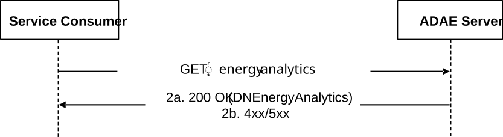
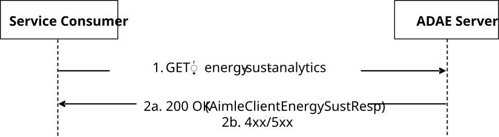

# 5.11.15 SS_ADAE_DN_energy_analytics Service

## 5.11.15.1 Service Description

The SS_ADAE_DN_energy_analytics Service, exposed by the VAL Server, EAS, or EES, enables a service consumer to:

\- request ADAE Server to provide DN energy efficiency and consumption analytics by using filter criteria.

## 5.11.15.2 Service Operations

### 5.11.15.2.1 Introduction

The service operations defined for the SS_ADAE_DN_energy_analytics API are shown in the table 5.11.15.2.1-1.

Table 5.11.15.2.1-1: Service operations of the SS_ADAE_DN_energy_analytics API

| Service Operation Name              | Description                                                                                                 | Initiated by     |
|-------------------------------------|-------------------------------------------------------------------------------------------------------------|------------------|
| SS_ADAE_DN_energy_analytics_Request | This service operation enables a service consumer to obtain DN energy efficiency and consumption analytics. | e.g., VAL Server |

### 5.11.15.2.2 SS_ADAE_DN_energy_analytics_Request

#### 5.11.15.2.2.1 General

This service operation is used by a service consumer to perform ADAE DN Energy Analytics Request at the ADAE Server.

The following procedures are supported by the "SS_ADAE_DN_energy_analytics_Request" service operation:

\- ADAE DN Energy Analytics Request.

#### 5.11.15.2.2.2 ADAE DN Energy Analytics Request

Figure 5.11.15.2.2.2-1 depicts a scenario where a service consumer sends a request to the ADAE Server to request ADAE DN Energy Analytic (see also clause 8.18 of 3GPP°TS°23.436°\[38\]).

Figure 5.11.15.2.2.2-1: Procedure for ADAE DN Energy Analytics Request

1\. In order to request to ADAE DN energy analytics, the service consumer shall send an HTTP GET request to the ADAE server targeting the URI of the "ADAE DN Energy Analytics" resource.

2a. Upon success, the ADAE Server shall respond with an HTTP "200 OK" status code with the response body containing the DNEnergyAnalytics data structure.

NOTE: ADAE Server calculates the energy efficiency and consumption analytics by using the trained ML model based on AIMLES_MLModelTraining service, obtained from AIMLE Server.

2b. On failure, the appropriate HTTP status code indicating the error shall be returned and appropriate additional error information should be returned in the HTTP GET response body, as specified in clause 7.10.15.7.

5.11.16 SS_ADAE_AIMLEnergyConsumptionAnalytics API

5.11.16.1 Service Description

The SS_ADAE_AIMLEnergyConsumptionAnalytics API, as defined 3GPP TS 23.436 \[38\], enables a service consumer to:

> \- create/update/delete an AIML energy consumption analytic Subscription; and
>
> \- receive AIML energy consumption analytic Subscription related event(s) notifications.

5.11.16.2 Service Operations

5.11.16.2.1 Introduction

The service operations defined for the SS_ADAE_AIMLEnergyConsumptionAnalytics API are shown in the table 5.11.16.2.1-1.

**Table 5.11.16.2.1-1: Operations of the SS_ADAE_AIMLEnergyConsumptionAnalytics**

|                                                  |                                                                                                                                                                          |                                |
|--------------------------------------------------|--------------------------------------------------------------------------------------------------------------------------------------------------------------------------|--------------------------------|
| **Service operation name**                       | **Description**                                                                                                                                                          | **Initiated by**               |
| SS_ADAE_AIMLEnergyConsumptionAnalytics_Subscribe | This service operation is used by the service consumer to create/update/delete an AIML energy consumption analytics Subscription.                                        | e.g., VAL server, AIMLE server |
| SS_ADAE_AIMLEnergyConsumptionAnalytics_Notify    | This service operation is used by the ADAE Server to notify a previously subscribed service consumer on AIML energy consumption analytics Subscription related event(s). | ADAE Server                    |

5.11.16.2.2 SS_ADAE_AIMLEnergyConsumptionAnalytics_Subscribe

5.11.16.2.2.1 General

This service operation is used by a service consumer to request the creation of an AIML energy consumption analytics Subscription at the ADAE Server.

The following procedures are supported by the "SS_ADAE_AIMLEnergyConsumptionAnalytics_Subscribe" service operation:

> \- AIML Energy Consumption Analytics Subscription Creation.
>
> \- AIML Energy Consumption Analytics Subscription Update.
>
> \- AIML Energy Consumption Analytics Subscription Deletion.

5.11.16.2.2.2 AIML Energy Consumption Analytics Subscription Creation

To subscribe to AIML Energy Consumption Analytics related event(s) reporting, the service consumer shall send an HTTP POST message to the ADAES targeting the URI of the "AIML Energy Consumption Analytics Subscriptions" collection resource, with the request body containing the AimlEngConpSub data structure as defined in clause 7.10.16.4.2.2.

Upon reception of the HTTP POST request message, the ADAE Server shall:

> 1\. verify the identity of the service consumer and determine if the service consumer is authorized to subscribe to AIML Energy Consumption Analytics related event(s) notification; and
>
> 2\. if the service consumer is authorized, the ADAE Server shall either:
>
> a\. if both one time reporting and immediate reporting were requested, respond to the service consumer with an HTTP "200 OK" status code with the response body including the AimlEngConpResp data structure; or
>
> b\. respond with an HTTP "201 Created" status code with the response body including a representation of the created "Individual AIML Energy Consumption Analytics Subscription" resource within the AimlEngConpSub data structure, and an HTTP Location header field containing the URI for the created resource.

On failure, the appropriate HTTP status code indicating the error shall be returned and appropriate additional error information should be returned in the HTTP POST response body, as specified in clause 7.10.16.7.

5.11.16.2.2.3 AIML Energy Consumption Analytics Subscription Update

In order to request the update of an existing Individual AIML Energy Consumption Analytics subscription, the service consumer shall send an HTTP PUT/PATCH request to the ADAE Server, targeting the corresponding "Individual AIML Energy Consumption Analytics Subscription" resource, with the request body including either:

> \- the fully updated representation of the resource within the AimlEngConpSub data structure, in case the HTTP PUT method is used; or
>
> \- the requested modifications to the resource within the AimlEngConpSubPatch data structure, in case the HTTP PATCH method is used.

Upon reception of the HTTP PUT/PATCH request, the ADAES Server shall:

> \- verify the identity of the service consumer and check if the service consumer is authorised to update the targeted "Individual AIML Energy Consumption Analytics Subscription" resource;
>
> \- if the service consumer is authorized and upon successful processing of the request, update the targeted "Individual AIML Energy Consumption Analytics Subscription" resource accordingly and respond with either:
>
> \- an HTTP "200 OK" status code with the response body containing a representation of the updated "Individual AIML Energy Consumption Analytics Subscription" resource within the AimlEngConpSub data structure; or
>
> \- an HTTP "204 No Content" status code.

On failure, the appropriate HTTP status code indicating the error shall be returned and appropriate additional error information should be returned in the HTTP PUT/PATCH response body, as specified in clause 7.10.16.7.

5.11.16.2.2.4 AIML Energy Consumption Analytics Subscription Deletion

To unsubscribe from AIML Energy Consumption Analytics related event(s) notification, the service consumer shall send an HTTP DELETE request targeting the URI of the corresponding "Individual AIML Energy Consumption Analytics Subscription" resource.

Upon reception of the HTTP DELETE request, the ADAE Server shall:

> \- verify the identity of the service consumer and check if the service consumer is authorised to terminate the targeted "Individual AIML Energy Consumption Analytics Subscription" resource;
>
> \- if the service consumer is authorized and upon successful processing of the request, the ADAE Server shall delete the corresponding subscription and respond with an HTTP "204 No Content" status code.

On failure, the appropriate HTTP status code indicating the error shall be returned and appropriate additional error information should be returned in the HTTP DELETE response body, as specified in clause 7.10.16.7.

5.11.16.2.3 SS_ADAE_AIMLEnergyConsumptionAnalytics_Notify

5.11.16.2.3.1 General

This service operation is used by the ADAE Server to notify on AIML Energy Consumption Analytics related event(s).

The following procedures are supported by the "SS_ADAE_AIMLEnergyConsumptionAnalytics_Notify" service operation:

> \- AIML Energy Consumption Analytics Event Notification.

5.11.16.2.3.2 AIML Energy Consumption Analytics Event Notification

To notify on AIML Energy Consumption Analytics related event(s), the ADAE Server shall send an HTTP POST request to the service consumer with the request URI set to "{notifUri}", where the "notifUri" variable is set to the value received from the service consumer during the creation of the corresponding "Individual AIML Energy Consumption Analytics Subscription" using the procedures defined in clause 5.11.16.2.2, and the request body containing the AimlEngConpNotif data structure as defined in clause 7.10.16.4.2.3.

Upon success, the service consumer shall respond to the ADAE Server with an HTTP "204 No Content" status code to acknowledge the reception of the notification.

On failure, the appropriate HTTP status code indicating the error shall be returned and appropriate additional error information should be returned in the HTTP POST response body, as specified in clause 7.10.16.7.

5.11.17 SS_ADAE_AIMLEClientEnergySustainabilityAnalytics API

5.11.17.1 Service Description

5.11.17.1.1 Overview

The SS_ADAE_AIMLEClientEnergySustainabilityAnalytics API allows the VAL server or AIMLE server to request AIMLE Client Energy Sustainability Analytics.

5.11.17.2 Service Operations

5.11.17.2.1 Introduction

The service operations defined for the SS_ADAE_AIMLEClientEnergySustainabilityAnalytics API is shown in table 5.11.17.2.1-1.

**Table 5.11.17.2.1-1: Operations of the SS_ADAE_AIMLEClientEnergySustainabilityAnalytics API**

| **Service operation name**                           | **Description**                                                                                                 | **Initiated by**               |
|------------------------------------------------------|-----------------------------------------------------------------------------------------------------------------|--------------------------------|
| SS_ADAE_AIMLEClientEnergySustainabilityAnalytics_Get | This service operation is used by the service consumer to request AIMLE Client Energy Sustainability Analytics. | e.g., VAL Server, AIMLE server |

5.11.15.2.2 SS_ADAE_AIMLEClientEnergySustainabilityAnalytics_Get

5.11.15.2.2.1 General

This service operation is used by a service consumer to communicate with the ADAE server for requesting for ADAE analytics for AIMLE Client Energy Sustainability.

5.11.15.2.2.2 Get AIMLE Client Energy Sustainability Analytics

Figure 5.11.15.2.2.2-1 depicts a scenario where a service consumer sends a request to the ADAE Server to request AIMLE Client Energy Sustainability Analytics (see also clause 8.23 of 3GPP°TS°23.436°\[38\]).

**Figure 5.11.15.2.2.2-1: Procedure for ADAE AIMLE Client Energy Sustainability Analytics**

> 1\. In order to request to AIMLE Client Energy Sustainability Analytics, the service consumer shall send an HTTP GET request to the ADAE server targeting the URI of the "AIMLE Client Energy Sustainability Analytics" resource.
>
> 2a. Upon success, the ADAE Server shall respond with an HTTP "200 OK" status code with the response body containing the AimleClientEnergySustResp data structure.
>
> 2b. On failure, the appropriate HTTP status code indicating the error shall be returned and appropriate additional error information should be returned in the HTTP GET response body, as specified in clause 7.10.17.7.
