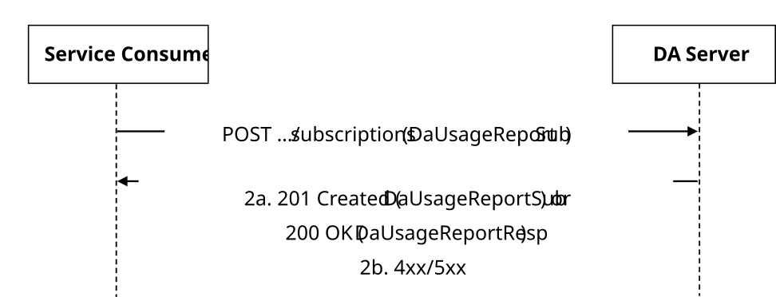
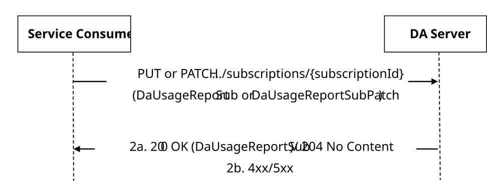
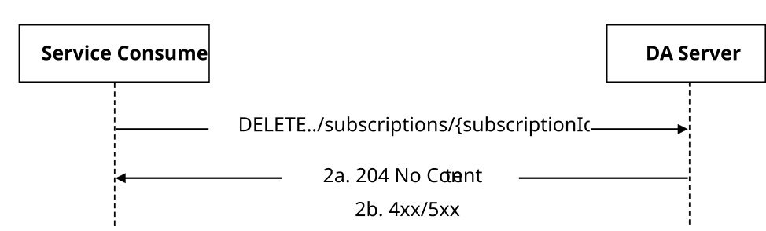
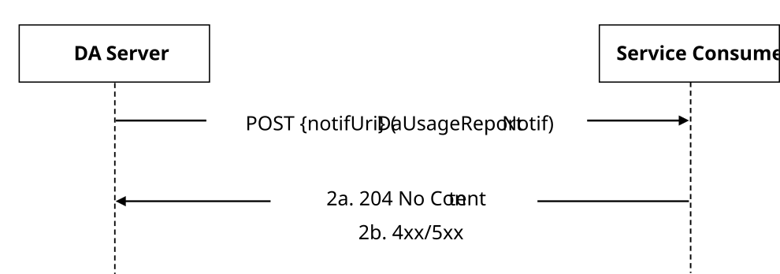

# 5.14 Digital Asset APIs

## 5.14.1 SS_DAProfileManagement API

### 5.14.1.1 Service Description

The SS_DAProfileManagement service exposed by the DA server enables a service consumer to:

\- manage digital asset profile on a DA server.

### 5.14.1.2 Service Operations

#### 5.14.1.2.1 Introduction

The service operation defined for SS_DAProfileManagement API is shown in the table 5.14.1.2.1-1.

Table 5.14.1.2.1-1: Operations of the SS_DAProfileManagement API

| Service operation name          | Description                                                                 | Initiated by     |
|---------------------------------|-----------------------------------------------------------------------------|------------------|
| SS_DAProfileManagement_Create   | This service operation enables to create digital asset profile(s).          | e.g., VAL server |
| SS_DAProfileManagement_Retrieve | This service operation enables to retrieve digital asset profiles.          | e.g., VAL server |
| SS_DAProfileManagement_Update   | This service operation enables to update existing digital asset profile(s). | e.g., VAL server |
| SS_DAProfileManagement_Delete   | This service operation enables to delete existing digital asset profile(s). | e.g., VAL server |

#### 5.14.1.2.2 SS_DAProfileManagement_Create

##### 5.14.1.2.2.1 General

This service operation is used by a service consumer to create DA Profile(s) at the DA server.

The following procedures are supported by the "SS_DAProfileManagement_Create" service operation:

\- Create Digital Asset Profile.

##### 5.14.1.2.2.2 Create Digital Asset Profile

##### 5.14.1.2.2.2 Create Digital Asset Profile

To create the digital asset profile, the VAL server shall send HTTP POST request message to DA server on the resource URI representing "DA Profiles" resource. The body of the HTTP POST message shall include the DigitalAssetProfile data type, as specified in the clause 7.13.1.3.2.3.1.

Upon receiving the HTTP POST message as described above, the DA server shall:

1\. verify the identity of the VAL server and check if the VAL server is authorized to create DA profile;

2\. if the VAL server is authorized to create DA profile, the DA server shall;

a\. create a new resource for Individual DA profile as specified in clause 7.13.1.3.2.3.1; and

b\. return within the response message body the created resource representation within the DigitalAssetProfile data structure, and within an HTTP Location header the created resource URI in the response message. and

If errors occur when processing the request, the DA Server shall respond to the VAL Server with an appropriate error response as specified in clause 7.13.1.7.

#### 5.14.1.2.3 SS_DAProfileManagement_Retrieve

##### 5.14.1.2.3.1 General

This service operation is used by VAL server to retrieve an individual digital asset profile information.

This service operation is used by a service consumer to retrieve an individual digital asset profile information on a DA server.

The following procedures are supported by the "Retrieve" service operation:

\- Retrieve Digital Asset Profile.

##### 5.14.1.2.3.2 Retrieve Digital Asset Profile

To retrieve the DA profile, the VAL server shall send HTTP GET request message to DA server on the resource URI representing the "Individual DA profile", as specified in clause 7.13.1.3.3.3.1.

Upon receiving the HTTP GET message as described above, the DA server shall:

1\. verify the identity of the VAL server and check if the VAL server is authorized to retrieve the DA profile;

2\. if the VAL server is authorized to retrieve the DA profile, the DA server shall;

a\. return the DA profile in DigitalAssetProfile data type, as specified in clause 7.13.1.3.3.3.1.

3\. if errors occur when processing the request, the DA Server shall respond to the VAL Server with an appropriate error response as specified in clause 7.13.1.7.

#### 5.14.1.2.4 SS_DAProfileManagement_Update

##### 5.14.1.2.4.1 General

This service operation is used by a service consumer to updates existing DA Profile(s) at the DA Server.

The following procedures are supported by the "SS_DAProfileManagement_Update" service operation:

\- Update Digital Asset Profile.

##### 5.14.1.2.4.2 Update Digital Asset Profile

To modify the DA profile, the VAL server shall send HTTP PUT message to the DA server to the Resource URI identifying the "Individual DA profile" resource representation, as specified in the clause 7.13.1.3.3.3.2. The VAL server may send an HTTP PATCH request message to the "Individual DA profile" resource URI as specified in clause 7.13.1.3.3.3.3. The body of the HTTP PATCH request message shall include the requested modifications as specified in clause 7.13.1.3.3.3.3.

When HTTP PUT is used, the "valServerId" attribute within the DigitalAssetProfile data structure shall not be updated.

Upon receiving the HTTP PUT or PATCH request message, the DA server shall:

1\. verify the identity of the VAL server and check if the VAL server is authorized to modify the DA profile;

2\. if the VAL server is authorized to modify the information, then the DA server shall;

a\. if the DA profile in the request is valid, update/modify the resource identified by the Resource URI of the DA profile received in the request; and

b\. return a 200 OK status code with the updated DA profile in the response or a 204 No Content status code.

3\. if errors occur when processing the request, the DA Server shall respond to the VAL Server with an appropriate error response as specified in clause 7.13.1.7.

#### 5.14.1.2.5 SS_DAProfileManagement_Delete

##### 5.14.1.2.5.1 General

This service operation is used by a service consumer to delete existing DA Profile(s) at the DA Server.

The following procedures are supported by the "SS_DAProfileManagement_Delete" service operation:

\- Delete Digital asset profile.

##### 5.14.1.2.5.2 Delete Digital Asset profile

To delete the DA profile, the VAL server shall send an HTTP DELETE message to the resource representing "Individual DA profile" as specified in clause 7.13.1.3.3.3.4.

Upon receiving the HTTP DELETE message, the DA server shall:

1\. verify the identity of the VAL server and check if the VAL server is authorized to delete the DA profile; and

2\. if the VAL server is authorized to delete the DA profile, the DA server shall;

a\. delete the resource pointed by the Resource URI for Individual DA profile;

b\. return a 204 No Content status code in the response.

3\. if errors occur when processing the request, the DA Server shall respond to the VAL Server with an appropriate error response as specified in clause 7.13.1.7.

## 5.14.2 SS_DADiscovery API

### 5.14.2.1 Service Description

The SS_DADiscovery service as defined 3GPP TS 23.438 \[46\], exposed by the DA server enables a service consumer to:

\- discover digital asset on a DA server.

### 5.14.2.2 Service Operations

#### 5.14.2.2.1 Introduction

The service operation defined for SS_DADiscovery API is shown in the table 5.14.2.2.1-1.

Table 5.14.2.2.1-1: Operations of the SS_DADiscovery API

|                        |                                                                          |              |
|------------------------|--------------------------------------------------------------------------|--------------|
| Service operation name | Description                                                              | Initiated by |
| Discovery              | This service operation is used by VAL server to discover digital assets. | VAL server   |

#### 5.14.2.2.2 Discovery

##### 5.14.2.2.2.1 General

The following procedures are supported by the "Discovery" service operation:

\- Discover Digital Assets profiles.

##### 5.14.2.2.2.2 Discover Digital Asset profiles

To discover the digital assets, the Service consumer shall send HTTP GET request message to DA server on the targeting resource URI of the DA profile with the request URI query parameters including the filter criteria to discover the matching digital assets.

Upon receiving the HTTP GET message as described above, the DA server shall:

1\. verify the identity of the Service consumer and check if the Service consumer is authorized to discover the digital asset;

2\. In case the Service consumer is authorized to discover the digital asset, the DA server shall;

a\. Upon success, the DA server shall respond with an HTTP "200 OK" status code with the response body containing the digital asset discovery results within the DaDiscResult data type, as specified in clause 7.13.2.3.2.3.1.

If the error(s) occur when processing the request, the DA Server shall respond to the Service consumer with an appropriate error response as specified in clause 7.13.2.7.

## 5.14.3 SS_DAMediaManagement API

### 5.14.3.1 Service Description

The SS_DAMediaManagement API, as defined 3GPP TS 23.438 \[46\], allows VAL server via DA-S reference point to manage digital asset media on a DA server.

### 5.14.3.2 Service Operations

#### 5.14.3.2.1 Introduction

The service operation defined for SS_DAMediaManagement API is shown in the table 5.14.3.2.1-1.

Table 5.14.3.2.1-1: Operations of the SS_DAMediaManagement API

|                        |                                                                                              |              |
|------------------------|----------------------------------------------------------------------------------------------|--------------|
| Service operation name | Description                                                                                  | Initiated by |
| Upload                 | This service enables a VAL server to manage media related to digital asset profile.          | VAL server   |
| Download               | This service operation is used by VAL server to download digital asset media(s) information. | VAL server   |
| Update                 | This service operation is used by VAL server to update digital asset media(s) information.   | VAL server   |
| Delete                 | This service operation is used by VAL server to delete digital asset media(s) information.   | VAL server   |

#### 5.14.3.2.2 Upload

##### 5.14.3.2.2.1 General

The following procedures are supported by the "Upload" service operation:

\- Upload Digital Asset Media.

##### 5.14.3.2.2.2 Upload Digital Asset Media

To upload the digital asset media, the VAL server shall send HTTP POST request message to DA server. The body of the HTTP POST message shall include the DigitalAssetMedia data type, as specified in the clause 7.13.3.3.2.3.1.

Upon receiving the HTTP POST message as described above, the DA server shall:

1\. verify the identity of the VAL server and check if the VAL server is authorized to upload DA media

2\. if the VAL server is authorized to upload DA media information, the DA server shall;

a\. Upload a new resource for Individual DA media as specified in clause 7.13.3.3.2.3.1; and

b\. return within the response message body the upload resource representation within the DigitalAssetMedia data structure, and within an HTTP Location header the upload resource URI in the response message. and

3\. if errors occur when processing the request, the DA Server shall respond to the VAL Server with an appropriate error response as specified in clause 7.13.3.7.

#### 5.14.3.2.3 Download

##### 5.14.3.2.3.1 General

The following procedures are supported by the "Download" service operation:

\- Individual Digital Asset Media download

##### 5.14.3.2.3.2 Individual Digital Asset Media download

To download the DA media, the VAL server shall send HTTP GET request message to DA server on the resource URI representing the individual SEAL DA media, as specified in 7.13.3.3.3.3.1.

Upon receiving the HTTP GET message as described above, the DA server shall:

1\. verify the identity of the VAL server and check if the VAL server is authorized to download the DA media;

2\. if the VAL server is authorized to download the DA media, the DA server shall;

a\. returns the DA media in DigitalAssetMedia data type, as specified in clause 7.13.3.3.3.3.1. and

3\. if errors occur when processing the request, the DA Server shall respond to the VAL Server with an appropriate error response as specified in clause 7.13.3.7.

#### 5.14.3.2.4 Update

##### 5.14.3.2.4.1 General

The following procedures are supported by the "Update" service operation:

\- Individual Digital Asset Media Update

##### 5.14.3.2.4.2 Individual Digital Asset Media Update

To modify the DA media, the VAL server shall send HTTP PUT message to the DA server to the Resource URI identifying the individual DA media resource representation, as specified in the clause 7.13.3.3.3.3.2. The VAL server may send an HTTP PATCH request message to the Individual DA media resource URI as specified in clause 7.13.3.3.3.3.3. The body of the HTTP PATCH request message shall include the requested modifications as specified in clause 7.13.3.2.6.3.3.

When HTTP PUT is used, the "valServerId" attribute within the DigitalAssetMedia data structure shall not be updated.

Upon receiving the HTTP PUT or PATCH request message, the DA server shall:

1\. verify the identity of the VAL server and check if the VAL server is authorized to modify the DA media;

2\. if the VAL server is authorized to modify the information, then the DA server shall;

a\. if the DA media in the request is valid, update/modify the resource identified by the Resource URI of the DA media received in the request;

b\. returns a 200 OK status code with the updated DA media in the response or a 204 No Content status code and

3\. if errors occur when processing the request, the DA Server shall respond to the VAL Server with an appropriate error response as specified in clause 7.13.3.7.

#### 5.14.3.2.5 Delete

##### 5.14.3.2.5.1 General

The following procedures are supported by the "Delete" service operation:

\- Individual Digital Asset Media Delete

##### 5.14.3.2.5.2 Individual Digital Asset Media Delete

To delete the DA media, the VAL server shall send an HTTP DELETE message to the resource representing Individual DA media as specified in clause 7.13.3.3.3.3.4.

Upon receiving the HTTP DELETE message, the DA server shall:

1\. verify the identity of the VAL server and check if the VAL server is authorized to delete the DA media;

2\. if the VAL server is authorized to delete the DA media, the DA server shall;

a\. delete the resource pointed by the Resource URI for Individual DA media;

b\. return a 204 No Content status code in the response and

3\. if errors occur when processing the request, the DA Server shall respond to the VAL Server with an appropriate error response as specified in clause 7.13.3.7.

## 5.14.4 SS_DAUsageReport API

### 5.14.4.1 Service Description

The SS_DAUsageReport API service enables a service consumer to:

\- create/update/delete a DA Usage Report subscription at the DA Server;

\- receive DA Usage information report(s) from the DA Server.

### 5.14.4.2 Service Operations

5.14.4.2.1 Introduction

The service operation defined for the SS_DAUsageReport API are shown in the Table 5.14.4.2.1-1.

**Table 5.14.4.2.1-1: Service operations of the SS_DAUsageReport API**

<table>
<colgroup>
<col style="width: 32%" />
<col style="width: 50%" />
<col style="width: 16%" />
</colgroup>
<thead>
<tr class="header">
<th><strong>Service operation name</strong></th>
<th><strong>Description</strong></th>
<th><strong>Initiated by</strong></th>
</tr>
</thead>
<tbody>
<tr class="odd">
<td>SS_DAUsageReport_Create</td>
<td>
This service operation enables a service consumer to request either the creation of a new DA Usage Report Subscription at the DA Server or the retrieval of DA Usage information report(s) to the DA Server.

(NOTE)
</td>
<td>e.g., VAL Server</td>
</tr>
<tr class="even">
<td>SS_DAUsageReport_Update</td>
<td>This service operation enables a service consumer to request the update of an existing DA Usage Report Subscription at the DA Server.</td>
<td>e.g., VAL Server</td>
</tr>
<tr class="odd">
<td>SS_DAUsageReport_Delete</td>
<td>This service operation enables a service consumer to request the deletion of an existing DA Usage Report Subscription at the DA Server.</td>
<td>e.g., VAL Server</td>
</tr>
<tr class="even">
<td>SS_DAUsageReport_Notify</td>
<td>This service operation enables the DA Server to notify a previously subscriber service consumer about the Digital Asset Usage Report.</td>
<td>DA Server</td>
</tr>
<tr class="odd">
<td colspan="3">NOTE: The Stage 2 SS_DAUsageReportInfo_Request service operation defined in clause 8.5 of 3GPP°TS°23.438° is specified by reusing the SS_DAUsageReport_Create service operation with one-time immediate reporting requested.</td>
</tr>
</tbody>
</table>

#### 5.14.4.2.2 SS_DAUsageReport_Create

5.14.4.2.2.1 General

This service operation is used by a service consumer to either:

> \- request the creation of a DA Usage Report Subscription at the DA Server; or
>
> \- request DA Usage information report(s) to the DA Server.

The following procedures are supported by the "SS_DAUsageReport_Create" service operation:

> \- DA Usage Report Subscription Creation.

5.14.4.2.2.2 DA Usage Report Subscription Creation

Figure 5.14.4.2.2.2-1 depicts a scenario where a service consumer sends a request to the DA Server to request the creation of DA Usage Report Subscription (see also clause 8.5.3.3 of 3GPP TS 23.438).

**Figure 5.14.4.2.2.2-1: Procedure for DA Usage Report Subscription Creation**

> 1\. In order to create a new DA Usage Report Subscription, the service consumer shall send an HTTP POST request to the DA Server targeting the URI of the "Digital Asset Usage Report Subscriptions" collection resource, with the request body including the DaUsageReportSub data structure.
>
> The service consumer shall indicate within the "repReqs" attribute (encoded using the ReportingInformation data structure) whether one-time reporting and/or immediate reporting is requested, i.e.:
>
> \- the "immRep" attribute is set to "true", if immediate reporting is requested; or
>
> \- the "notifMethod" attribute is set to "ONE_TIME" and the "immRep" attribute is set to "true", if one-time immediate reporting is requested.
>
> 2a. Upon success, the DA Server shall either:
>
> \- if the one-time immediate reporting was not requested, create a new "Individual DA Usage Report Subscription" resource and respond with an HTTP "201 Created" status code with the response body containing a representation of the created resource within the DaUsageReportSub data structure, and an HTTP "Location" header field containing the URI of the created resource; or
>
> \- if the one-time immediate reporting was requested, respond with an HTTP "200 OK" status code with the response body containing the DaUsageReportResp data structure, and not create any resource.
>
> 2b. On failure, the appropriate HTTP status code indicating the error shall be returned and appropriate additional error information should be returned in the HTTP POST response body, as specified in clause 7.13.4.7.

5.14.4.2.2.3 Void

#### 5.14.4.2.3 SS_DAUsageReport_Update

5.14.4.2.3.1 General

This service operation is used by a service consumer to request the update of an existing "Individual DA Usage Report Subscription" at the DA Server.

The following procedures are supported by the "SS_DAUsageReport_Update" service operation:

> \- DA Usage Report Subscription Update.

5.14.4.2.3.2 DA Usage Report Subscription Update

Figure 5.14.4.2.3.2-1 depicts a scenario where a service consumer sends a request to the DA Server to request to update an existing DA Usage Report Subscription (see also clause 8.5.3.4 of 3GPP TS 23.438).

**Figure 5.14.4.2.3.2-1: Procedure for DA Usage Report Subscription Update**

> 1\. In order to update an existing DA Usage Report Subscription, the service consumer shall send an HTTP PUT/PATCH request to the DA Server, targeting the URI of the corresponding "Individual DA Usage Report Subscription" resource, with the request body including either:
>
> \- the updated representation of the resource within the DaUsageReportSub data structure, in case the HTTP PUT method is used; or
>
> \- the requested modifications to the resource within the DaUsageReportSubPatch data structure, in case the HTTP PATCH method is used.
>
> NOTE: An alternative service consumer (i.e., other than the one that requested the creation/update of the targeted resource) can initiate this request.
>
> 2a. Upon success, the DA Server shall update the targeted "Individual DA Usage Report Subscription" resource accordingly and respond with either:
>
> \- an HTTP "200 OK" status code with the response body containing a representation of the updated "Individual DA Usage Report Subscription" resource within the DAUsageReportSub data structure; or
>
> \- an HTTP "204 No Content" status code.
>
> 2b. On failure, the appropriate HTTP status code indicating the error shall be returned and appropriate additional error information should be returned in the HTTP PUT/PATCH response body, as specified in clause 7.13.4.7.

#### 5.14.4.2.4 SS_DAUsageReport_Delete

5.14.4.2.4.1 General

This service operation is used by a service consumer to request the deletion of an existing "Individual DA Usage Report Subscription" resource at the DA Server.

The following procedures are supported by the "SS_DAUsageReport_Delete" service operation:

> \- DA Usage Report Subscription Deletion.

5.14.4.2.4.2 DA Usage Report Subscription Deletion

Figure 5.14.4.2.4.2-1 depicts a scenario where a service consumer sends a request to the DA Server to request the deletion of an existing DA Usage Report Subscription (see also clause 8.5.3.4 of 3GPP TS 23.438).

**Figure 5.14.4.2.4.2-1: Procedure for DA Usage Report Subscription Deletion**

> 1\. In order to request the deletion of an existing DA Usage Report Subscription, the service consumer shall send an HTTP DELETE request to the DA Server targeting the URI of the corresponding "Individual DA Usage Report Subscription" resource.
>
> NOTE: An alternative service consumer (i.e., other than the one that requested the creation/update of the targeted resource) can initiate this request.
>
> 2a. Upon success, the DA Server shall respond with an HTTP "204 No Content" status code.
>
> 2b. On failure, the appropriate HTTP status code indicating the error shall be returned and appropriate additional error information should be returned in the HTTP DELETE response body, as specified in clause 7.13.4.7.

#### 5.14.4.2.5 SS_DAUsageReport_Notify

5.14.4.2.5.1 General

This service operation is used by a DA Server to notify a previously subscribed consumer on:

> \- DA Usage information report(s).

The following procedures are supported by the "SS_DAUsageReport_Notify" service operation:

> \- DA Usage Report Notification.

5.14.4.2.5.2 DA Usage Report Notification

Figure 5.14.4.2.5.2-1 depicts a scenario where the DA Server sends a request to notify a previously subscribed service consumer on DA Usage information report(s) (see also clause 8.5.3.5 of 3GPP TS 23.438).

**Figure 5.14.4.2.5.2-1: Procedure for DA Usage Report Notification**

> 1\. In order to notify a previously subscribed service consumer on DA Usage information report(s), the DA Server shall send an HTTP POST request to the service consumer with the request URI set to "{notifUri}", where the "notifUri" variable is set to the value received from the service consumer during the creation/update of the corresponding DA Usage Report Subscription using the procedures defined in clauses 5.14.4.2.2 and 5.14.4.2.3, and the request body including the DaUsageReportNotif data structure.
>
> 2a. Upon success, the service consumer shall respond to the DA Server with an HTTP "204 No Content" status code to acknowledge the successful reception of the notification.
>
> 2b. On failure, the appropriate HTTP status code indicating the error shall be returned and appropriate additional error information should be returned in the HTTP POST response body, as specified in clause 7.13.4.7.
