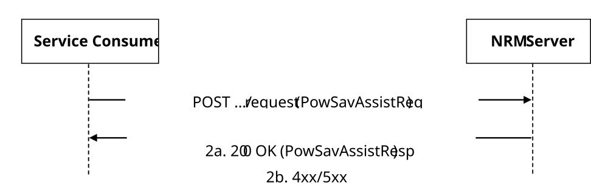

# 5.5.5 SS_ValUeConfiguration API

5.5.5.1 Service Description

The SS_ValUeConfiguration service exposed by the NRM Server allows a service consumer to:

> \- request power saving assistance.

## 5.5.5.2 Service Operations

5.5.5.2.1 Introduction

The service operations defined for SS_ValUeConfiguration API are shown in the table 5.5.5.2.1-1.

**Table 5.5.5.2.1-1: SS_ValUeConfiguration Service Operations**

| **Service operation name**              | **Description**                                                    | **Initiated by** |
|-----------------------------------------|--------------------------------------------------------------------|------------------|
| SS_ValUeConfiguration_PowerSavingAssist | This service operation enables to request power saving assistance. | e.g., VAL Server |

### 5.5.5.2.2 SS_ValUeConfiguration_PowerSavingAssist

5.5.5.2.2.1 General

This service operation is used by a service consumer to request power saving assistance to the NRM Server (see also clause 14.3.15 of 3GPP°TS°23.434°\[2\]).

The following procedures are supported by the "SS_ValUeConfiguration_PowerSavingAssist" service operation:

> \- Power Saving Assistance Request.

5.5.5.2.2.2 Power Saving Assistance Request

Figure 5.5.5.2.2.2-1 depicts a scenario where a service consumer sends a request to the NRM Server to request Power Saving Assistance (see also clause 14.3.15.2 of 3GPP°TS°23.434°\[2\]).

**Figure 5.5.5.2.2.2-1: Power Saving Assistance Request Procedure**

> 1\. In order to request power saving assistance, the service consumer shall send an HTTP POST request to the NRM Server targeting the URI of the corresponding custom operation (i.e., "PowerSavingAssistRequest"), with the request body including the PowSavAssistReq data structure.
>
> 2\. Upon reception of the HTTP POST request message, the NRM Server shall check whether the service consumer is authorized to initiate such request and:
>
> a\. if the service consumer is authorized and upon successful processing of the request, the NRM Server shall respond with an HTTP "200 OK" status code including the PowSavAssistResp data structure; and
>
> b\. on failure, the appropriate HTTP status code indicating the error shall be returned and appropriate additional error information should be returned in the HTTP POST response body, as specified in clause 7.4.3.7.
