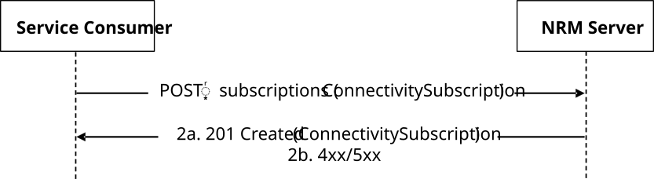
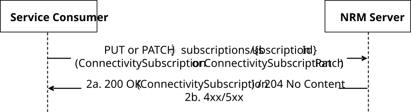
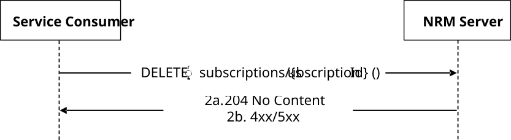
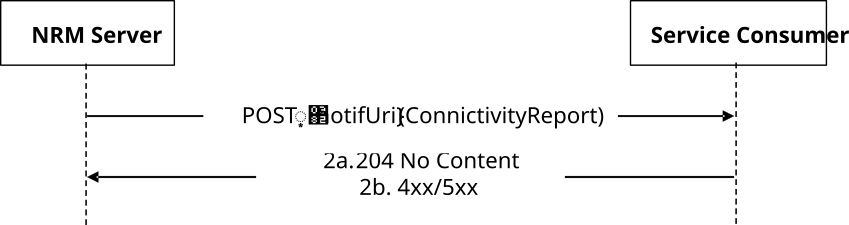

# 5.5.6 SS_MMetaConnectivityRequirements Service

## 5.5.6.1 Service Description

The SS_MMetaConnectivityRequirements Service, as defined in clause 14.3.9.2.3 in 3GPP TS 23.434 \[2\], allows VAL Server via NRM-S reference point:

> \- to subscribe with the network resource management (NRM) Server to the event for Mobile Metaverse (MMeta) connectivity requirements.

## 5.5.6.2 Service Operations

### 5.5.6.2.1 Introduction

The MMeta connectivity requirements operations defined for the SS_MMetaConnectivityRequirments API are shown in the table 5.5.6.2.1-1.

**Table 5.5.6.2.1-1: Operations of the SS_MMetaConnectivityRequirements API**

| **Service operation name** | **Description**                                                                                                                                | **Initiated by** |
|----------------------------|------------------------------------------------------------------------------------------------------------------------------------------------|------------------|
| Subscribe                  | This service operation is used by VAL Server to create, modify, and terminate subscription to connectivity requirements event from NRM Server. | VAL Server       |
| Notify                     | This service operation is used by NRM Server to Notify the VAL Server.                                                                         | NRM Server       |

### 5.5.6.2.2 Subscribe

#### 5.5.6.2.2.1 General

This service operation is used by the VAL Server to create, modify, and terminate subscription to connectivity requirements event from the NRM Server.

The following procedures are supported by the "Subscribe" service operation:

> \- VAL Server MMeta connectivity requirements subscription creation.
>
> \- VAL Server MMeta connectivity requirements subscription modification.
>
> \- VAL Server MMeta connectivity requirements subscription termination.

#### 5.5.6.2.2.2 VAL Server MMeta connectivity requirements subscription creation

Figure 5.5.6.2.2.2-1 depicts a scenario where a service consumer sends a request to the NRM Server to request the creation of a subscription to the event for MMeta connectivity requirements (see caluse 14.3.9.2.3 in 3GPP TS 23.434 \[2\]).

**Figure 5.5.6.2.2.2-1: Procedure for MMeta Connectivity Requirements Subscription Creation**

> 1\. To subscribe to the event for the connectivity requirements, the VAL Server shall send an HTTP POST request message to the NRM Server targeting the URI of the "Connectivity Requirements Subscriptions" resource as specified in clause 7.4.4.3. The request body shall include the ConnectivitySubscription data structure as defined in clause 7.4.4.6.2.2.
>
> 2a. Upon success, the NRM Server shall create a new "Individual Connectivity Requirements Subscription" resource and respond to the VAL server with an HTTP "201 Created" status code, including a Location header field containing the URI for the created "Individual Connectivity Requirements Subscription" resource and the response body including the ConnectivitySubscription data structure containing a representation of the created resource as defined in clause 7.4.4.6.2.2.
>
> 2b. On failure, the appropriate HTTP status code indicating the error shall be returned, and appropriate additional error information should be returned in the HTTP POST response body, as specified in clause 7.4.4.7.

#### 5.5.6.2.2.3 VAL Server MMeta connectivity requirements subscription modification

Figure 5.5.6.2.2.3-1 depicts a scenario where a service consumer sends a request to the NRM Server to request the modification of a subscription to the event for MMeta connectivity requirements (see caluse 14.3.9.2.3 in 3GPP TS 23.434 \[2\]).

**Figure 5.5.6.2.2.3-1: Procedure for MMeta Connectivity Requirements Subscription Modification**

> 1\. To completely update or partially modify the individual subscription to the event for the connectivity requirements from the NRM Server, the VAL Server shall send an HTTP PUT request message or an HTTP PATCH request message, respectively, to the NRM Server with {apiRoot}/ss-mmeta/\<apiVersion\>/subscriptions/{subscriptionId}as the Resource URI representing the individual subscription to connectivity requirements, with the request body including:
>
> \- if the HTTP PUT request is used, the ConnectivitySubscription data structure as defined in clause 7.4.4.6.2.2; or
>
> \- if the HTTP PATCH request is used, the ConnectivitySubscriptionPatch data structure as defined in clause 7.4.4.6.2.4.
>
> 2a. Upon success, the NRM Server shall update or modify the targeted "Individual Connectivity Requirements Subscription" resource and respond to the VAL server with:
>
> \- an HTTP "200 OK" status code, including the response body ConnectivitySubscription data structure as defined in clause 7.4.4.6.2.2, containing a representation of the updated or modified resource; or
>
> \- an HTTP "204 No Content" status code.
>
> 2b. On failure, the appropriate HTTP status code indicating the error shall be returned and appropriate additional error information should be returned in the HTTP PUT/PATCH response body, as specified in clause 7.4.4.7.

#### 5.5.6.2.2.4 VAL Server MMeta connectivity requirements subscription termination

Figure 5.5.6.2.2.4-1 depicts a scenario where a service consumer sends a request to the NRM Server to request the termination of a subscription to the event for MMeta connectivity requirements (see caluse 14.3.9.2.3 in 3GPP TS 23.434 \[2\]).

**Figure 5.5.6.2.2.4-1: Procedure for MMeta Connectivity Requirements Subscription Termination**

> 1\. To terminate the individual subscription to the event for the connectivity requirements from the NRM Server, the VAL Server shall send an HTTP DELETE request message to the NRM Server with {apiRoot}/ss-mmeta/\<apiVersion\>/subscriptions/{subscriptionId}as the Resource URI representing the individual subscription to connectivity requirements.
>
> 2a. Upon success, the NRM Server shall respond with "204 No Content" status code to the VAL Server as a successful response to terminate the individual subscription to the event for the connectivity requirements.
>
> 2b. On failure, the appropriate HTTP status code indicating the error shall be returned and appropriate additional error information should be returned in the HTTP DELETE response body, as specified in clause 7.4.4.7.

### 5.5.6.2.3 Notify

#### 5.5.6.2.3.1 General

This service operation is used by the NRM Server to notify the NRM Server.

The following procedures are supported by the "Notify" service operation:

> \- NRM Server MMeta connectivity requirements notification.

#### 5.5.6.2.3.2 NRM Server MMeta connectivity requirements notification

Figure 5.5.6.2.3.2-1 depicts a scenario where the NRM Server sends a request to notify a service consumer with the subscription to the event for MMeta connectivity requirements (see caluse 14.3.9.2.3 in 3GPP TS 23.434 \[2\]).

**Figure 5.5.6.2.3.2-1: Procedure for MMeta Connectivity Requirements Notification**

> 1\. To notify a service consumer with the subscription to the event for MMeta connectivity requirements, the NRM Server shall send an HTTP POST request message to the service consumer with the request URI set to "{notifUri}", where the "notifUri" variable is set to the value received from the service consumer during the creation/update of the corresponding MMeta connectivity requirements subscription using the procedures defined in clause 5.5.6.2.2.2, and the request body including the ConnectivityReport data structure as defined in clause 7.4.4.6.2.3.
>
> 2a. Upon success, the service consumer shall respond to the NRM Server with a "204 No Content" status code.

2b. On failure, the appropriate HTTP status code indicating the error shall be returned, and appropriate additional error information should be returned in the HTTP POST response body, as specified in clause 7.4.4.7.
