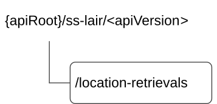

# 7.1.2 SS_LocationAreaInfoRetrieval API

## 7.1.2.1 API URI

The request URI used in each HTTP request from the VAL server towards the location management server shall have the structure as defined in clause 6.5 with the following clarifications:

\- The \<apiName\> shall be "ss-lair".

\- The \<apiVersion\> shall be "v1".

\- The \<apiSpecificSuffixes\> shall be set as described in clause 7.1.2.2.

## 7.1.2.2 Resources

### 7.1.2.2.1 Overview

This clause describes the structure for the Resource URIs and the resources and methods used for the service.

Figure 7.1.2.2.1-1 depicts the resource URIs structure for the SS_LocationAreaInfoRetrieval API.

Figure 7.1.2.2.1-1: Resource URI structure of the SS_LocationAreaInfoRetrieval API

Table 7.1.2.2.1-1 provides an overview of the resources and applicable HTTP methods.

Table 7.1.2.2.1-1: Resources and methods overview

| Resource name        | Resource URI         | HTTP method or custom operation | Description                                                                            |
|----------------------|----------------------|---------------------------------|----------------------------------------------------------------------------------------|
| Location Information | /location-retrievals | GET                             | Obtains the UE(s) information in an application defined proximity range of a location. |

### 7.1.2.2.2 Resource: Location Information

#### 7.1.2.2.2.1 Description

The Location Information resource represents the collection of UE(s) location information at the location management server.

#### 7.1.2.2.2.2 Resource Definition

Resource URI: **{apiRoot}/ss-lair/\<apiVersion\>/location-retrievals**

This resource shall support the resource URI variables defined in the table 7.1.2.2.2.2-1.

Table 7.1.2.2.2.2-1: Resource URI variables for this resource

| Name    | Data Type | Definition          |
|---------|-----------|---------------------|
| apiRoot | string    | See clause 7.1.2.1. |

#### 7.1.2.2.2.3 Resource Standard Methods

##### 7.1.2.2.2.3.1 GET

This operation obtains the UE(s) information in an application defined proximity range of a location. This method shall support the URI query parameters specified in table 7.1.2.2.2.3.1-1.

Table 7.1.2.2.2.3.1-1: URI query parameters supported by the GET method on this resource

<table>
<colgroup>
<col style="width: 12%" />
<col style="width: 14%" />
<col style="width: 3%" />
<col style="width: 9%" />
<col style="width: 36%" />
<col style="width: 24%" />
</colgroup>
<tbody>
<tr class="odd">
<td>Name</td>
<td>Data type</td>
<td>P</td>
<td>Cardinality</td>
<td>Description</td>
<td>Applicability</td>
</tr>
<tr class="even">
<td>location-info</td>
<td>LocationInfo</td>
<td>M</td>
<td>1</td>
<td>Location information around which the UE(s) information is requested. (NOTE)</td>
<td></td>
</tr>
<tr class="odd">
<td>val-svc-area-id</td>
<td>ValSvcAreaId</td>
<td>O</td>
<td>0..1</td>
<td>Contains the identifier of the VAL service area around which the UE(s) information is requested. (NOTE)</td>
<td>ValSrvArea</td>
</tr>
<tr class="even">
<td>range</td>
<td>Float</td>
<td>M</td>
<td>1</td>
<td>
The range information over which the UE(s) information is required, expressed in meters.

Minimum = 0
</td>
<td></td>
</tr>
<tr class="odd">
<td colspan="6">NOTE: If the "ValSrvArea" feature is supported and the "val-svc-area-id" query parameter is provided, then the LM server shall ignore the "location-info" query parameter.</td>
</tr>
</tbody>
</table>

This method shall support the request data structures specified in table 7.1.2.2.2.3.1-2 and the response data structures and response codes specified in table 7.1.2.2.2.3.1-3.

Table 7.1.2.2.2.3.1-2: Data structures supported by the GET Request Body on this resource

|           |     |             |             |
|-----------|-----|-------------|-------------|
| Data type | P   | Cardinality | Description |
| n/a       |     |             |             |

Table 7.1.2.2.2.3.1-3: Data structures supported by the GET Response Body on this resource

<table>
<colgroup>
<col style="width: 16%" />
<col style="width: 9%" />
<col style="width: 14%" />
<col style="width: 19%" />
<col style="width: 39%" />
</colgroup>
<tbody>
<tr class="odd">
<td>Data type</td>
<td>P</td>
<td>Cardinality</td>
<td>
Response

codes
</td>
<td>Description</td>
</tr>
<tr class="even">
<td>array(LMInformation)</td>
<td>O</td>
<td>1..N</td>
<td>200 OK</td>
<td>The UE(s) information in an application defined proximity range of a location</td>
</tr>
<tr class="odd">
<td>n/a</td>
<td></td>
<td></td>
<td>307 Temporary Redirect</td>
<td>
Temporary redirection, during resource retrieval. The response shall include a Location header field containing an alternative URI of the resource located in an alternative location management server.

Redirection handling is described in clause 5.2.10 of 3GPP TS 29.122 [3].
</td>
</tr>
<tr class="even">
<td>n/a</td>
<td></td>
<td></td>
<td>308 Permanent Redirect</td>
<td>
Permanent redirection, during resource retrieval. The response shall include a Location header field containing an alternative URI of the resource located in an alternative location management server.

Redirection handling is described in clause 5.2.10 of 3GPP TS 29.122 [3].
</td>
</tr>
<tr class="odd">
<td colspan="5">NOTE: The mandatory HTTP error status codes for the GET method listed in table 5.2.6-1 of 3GPP TS 29.122 [3] also apply.</td>
</tr>
</tbody>
</table>

Table 7.1.2.2.2.3.1-4: Headers supported by the 307 Response Code on this resource

|          |           |     |             |                                                                                          |
|----------|-----------|-----|-------------|------------------------------------------------------------------------------------------|
| Name     | Data type | P   | Cardinality | Description                                                                              |
| Location | string    | M   | 1           | An alternative URI of the resource located in an alternative location management server. |

Table 7.1.2.2.2.3.1-5: Headers supported by the 308 Response Code on this resource

|          |           |     |             |                                                                                          |
|----------|-----------|-----|-------------|------------------------------------------------------------------------------------------|
| Name     | Data type | P   | Cardinality | Description                                                                              |
| Location | string    | M   | 1           | An alternative URI of the resource located in an alternative location management server. |

#### 7.1.2.2.2.4 Resource Custom Operations

None.

## 7.1.2.3 Notifications

None.

## 7.1.2.4 Data Model

### 7.1.2.4.1 General

This clause specifies the application data model supported by the API. Data types listed in clause 6.2 apply to this API.

Table 7.1.2.4.1-1 specifies the data types defined specifically for the SS_LocationAreaInfoRetrieval API service.

Table 7.1.2.4.1-1: SS_LocationAreaInfoRetrieval API specific Data Types

| Data type | Section defined | Description | Applicability |
|-----------|-----------------|-------------|---------------|
|           |                 |             |               |

Table 7.1.2.4.1-2 specifies data types re-used by the SS_LocationAreaInfoRetrieval API service.

Table 7.1.2.4.1-2: Re-used Data Types

| Data type     | Reference             | Comments                                                                     | Applicability |
|---------------|-----------------------|------------------------------------------------------------------------------|---------------|
| Float         | 3GPP TS 29.571 \[21\] | Used to represent the value of the range.                                    |               |
| LMInformation | 7.5.1.4.2.8           | Used to represent the location information for a VAL User ID or a VAL UE ID. |               |
| LocationInfo  | 3GPP TS 29.122 \[3\]  | Used to represent the location information.                                  |               |
| ValSvcAreaId  | Clause 7.1.3.4.3.2    | Used to represent the VAL service area identifier.                           | ValSrvArea    |

### 7.1.2.4.2 Structured Data Types

None.

### 7.1.2.4.3 Simple data types and enumerations

None.

## 7.1.2.5 Error Handling

### 7.1.2.5.1 General

HTTP error handling shall be supported as specified in clause 6.7.

In addition, the requirements in the following clauses shall apply.

### 7.1.2.5.2 Protocol Errors

In this Release of the specification, there are no additional protocol errors applicable for the SS_LocationAreaInfoRetrieval API.

### 7.1.2.5.3 Application Errors

The application errors defined for SS_LocationAreaInfoRetrieval API are listed in table 7.1.2.5.3-1.

Table 7.1.2.5.3-1: Application errors

| Application Error | HTTP status code | Description | Applicability |
|-------------------|------------------|-------------|---------------|
|                   |                  |             |               |

## 7.1.2.6 Feature Negotiation

General feature negotiation procedures are defined in clause 6.8.

Table 7.1.2.6-1: Supported Features

<table>
<colgroup>
<col style="width: 16%" />
<col style="width: 23%" />
<col style="width: 60%" />
</colgroup>
<thead>
<tr class="header">
<th>Feature number</th>
<th>Feature Name</th>
<th>Description</th>
</tr>
</thead>
<tbody>
<tr class="odd">
<td>1</td>
<td>ValSrvArea</td>
<td>
This feature indicates the support of VAL service area ID functionality as part of the enhancements to SEAL.

The following functionalities are supported:

- Support the usage of the VAL service area identifier to identify a VAL service area.
</td>
</tr>
</tbody>
</table>
