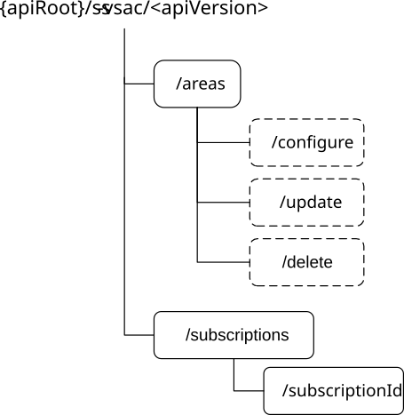

# 7.1.3.2.1 Overview

This clause describes the structure for the Resource URIs and the resources and methods used for the service.

Figure 7.1.3.2.1-1 depicts the resource URIs structure for the SS_VALServiceAreaConfiguration API.

Figure 7.1.3.2.1-1: Resource URI structure of the SS_VALServiceAreaConfiguration API

Table 7.1.3.2.1-1 provides an overview of the resources and applicable HTTP methods.

Table 7.1.3.2.1-1: Resources and methods overview

| Resource name                                   | Resource URI                    | HTTP method or custom operation | Description                                                                                                     |
|-------------------------------------------------|---------------------------------|---------------------------------|-----------------------------------------------------------------------------------------------------------------|
| VAL Service Areas                               | /areas                          | GET                             | Obtain the VAL service area(s) according to the provided filtering criteria.                                    |
|                                                 | /areas/configure                | Configure                       | Configure VAL service area(s).                                                                                  |
|                                                 | /areas/update                   | Update                          | Update existing VAL service area(s).                                                                            |
|                                                 | /areas/delete                   | Delete                          | Delete existing VAL service area(s).                                                                            |
| VAL Service Area Change Subscriptions           | /subscriptions                  | POST                            | Create a new VAL service area change event(s) subscription.                                                     |
| Individual VAL Service Area Change Subscription | /subscriptions/{subscriptionId} | GET                             | Retrieve the individual VAL service area change event(s) subscription resource according to the subscriptionId. |
|                                                 |                                 | DELETE                          | Delete an existing VAL service area change event(s) subscription resource according to the subscriptionId.      |
