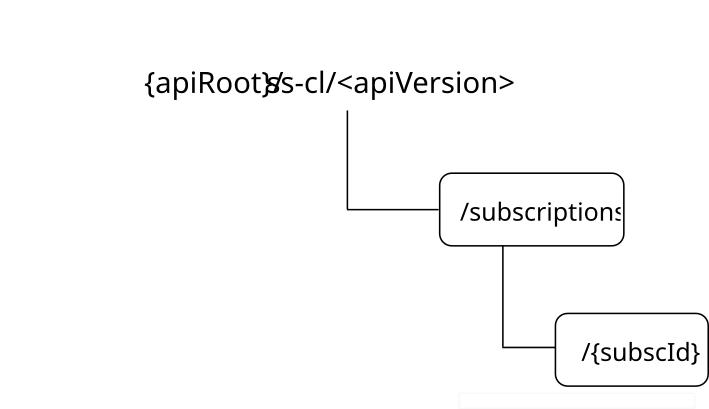

# 7.1.5.3 Resources

## 7.1.5.3.1 Overview

This clause describes the structure for the Resource URIs and the resources and methods used for the service.

Figure 7.1.5.3.1-1 depicts the resource URIs structure for the SS_ConfirmLocation API.

Figure 7.1.5.3.1-1: Resource URIs structure of the SS_ConfirmLocation API

Table 7.1.5.3.1-1 provides an overview of the resources and applicable HTTP methods for the SS_ConfirmLocation API.

Table 7.1.5.3.1-1: Resources and methods overview

| Resource name                                         | Resource URI             | HTTP method or custom operation | Description                                                                                               |
|-------------------------------------------------------|--------------------------|---------------------------------|-----------------------------------------------------------------------------------------------------------|
| Location Confirmation Service Subscriptions           | /subscriptions           | POST                            | Request the creation of a Location Confirmation Service Subscription.                                     |
| Individual Location Confirmation Service Subscription | /subscriptions/{subscId} | GET                             | Retrieve an existing "Individual Location Confirmation Service Subscription" resource.                    |
|                                                       |                          | PUT                             | Request the update of an existing "Individual Location Confirmation Service Subscription" resource.       |
|                                                       |                          | PATCH                           | Request the modification of an existing "Individual Location Confirmation Service Subscription" resource. |
|                                                       |                          | DELETE                          | Request the deletion of an existing "Individual Location Confirmation Service Subscription" resource.     |

## 7.1.5.3.2 Resource: Location Confirmation Service Subscriptions

### 7.1.5.3.2.1 Description

This resource represents the collection of Location Confirmation Service Subscriptions managed by the LM Server.

### 7.1.5.3.2.2 Resource Definition

Resource URI: **{apiRoot}/ss-cl/\<apiVersion\>/subscriptions**

This resource shall support the resource URI variables defined in table 7.1.5.3.2.2-1.

Table 7.1.5.3.2.2-1: Resource URI variables for this resource

| Name    | Data type | Definition          |
|---------|-----------|---------------------|
| apiRoot | string    | See clause 7.1.5.1. |

### 7.1.5.3.2.3 Resource Standard Methods

#### 7.1.5.3.2.3.1 POST

The HTTP POST method allows a service consumer to request the creation of a Location Confirmation Service Subscription at the LM Server.

This method shall support the URI query parameters specified in table 7.1.5.3.2.3.1-1.

Table 7.1.5.3.2.3.1-1: URI query parameters supported by the POST method on this resource

|      |           |     |             |             |               |
|------|-----------|-----|-------------|-------------|---------------|
| Name | Data type | P   | Cardinality | Description | Applicability |
| n/a  |           |     |             |             |               |

This method shall support the request data structures specified in table 7.1.5.3.2.3.1-2 and the response data structures and response codes specified in table 7.1.5.3.2.3.1-3.

Table 7.1.5.3.2.3.1-2: Data structures supported by the POST Request Body on this resource

|                 |     |             |                                                                                                    |
|-----------------|-----|-------------|----------------------------------------------------------------------------------------------------|
| Data type       | P   | Cardinality | Description                                                                                        |
| LocConfirmSubsc | M   | 1           | Represents the parameters to request the creation of a Location Confirmation Service Subscription. |

Table 7.1.5.3.2.3.1-3: Data structures supported by the POST Response Body on this resource

<table>
<colgroup>
<col style="width: 19%" />
<col style="width: 4%" />
<col style="width: 11%" />
<col style="width: 13%" />
<col style="width: 51%" />
</colgroup>
<tbody>
<tr class="odd">
<td>Data type</td>
<td>P</td>
<td>Cardinality</td>
<td>
Response

codes
</td>
<td>Description</td>
</tr>
<tr class="even">
<td>LocConfirmSubsc</td>
<td>M</td>
<td>1</td>
<td>201 Created</td>
<td>
Successful case. The Location Confirmation Service Subscription is successfully created and a representation of the created "Individual Location Confirmation Service Subscription" resource shall be returned.

An HTTP "Location" header that contains the URI of the created resource shall also be included.
</td>
</tr>
<tr class="odd">
<td colspan="5">NOTE: The mandatory HTTP error status codes for the HTTP POST method listed in table 5.2.6-1 of 3GPP TS 29.122 [3] shall also apply.</td>
</tr>
</tbody>
</table>

Table 7.1.5.3.2.3.1-4: Headers supported by the 201 Response Code on this resource

<table>
<colgroup>
<col style="width: 16%" />
<col style="width: 11%" />
<col style="width: 5%" />
<col style="width: 11%" />
<col style="width: 54%" />
</colgroup>
<tbody>
<tr class="odd">
<td>Name</td>
<td>Data type</td>
<td>P</td>
<td>Cardinality</td>
<td>Description</td>
</tr>
<tr class="even">
<td>Location</td>
<td>string</td>
<td>M</td>
<td>1</td>
<td>
Contains the URI of the newly created resource, according to the structure:

{apiRoot}/ss-cl/&lt;apiVersion&gt;/subscriptions/{subscId}
</td>
</tr>
</tbody>
</table>

### 7.1.5.3.2.4 Resource Custom Operations

There are no resource custom operations defined for this resource in this release of the specification.

## 7.1.5.3.3 Resource: Individual Location Confirmation Service Subscription

### 7.1.5.3.3.1 Description

This resource represents a Location Confirmation Service Subscription managed by the LM Server.

### 7.1.5.3.3.2 Resource Definition

Resource URI: **{apiRoot}/ss-cl/\<apiVersion\>/subscriptions/{subscId}**

This resource shall support the resource URI variables defined in table 7.1.5.3.3.2-1.

Table 7.1.5.3.3.2-1: Resource URI variables for this resource

| Name    | Data type | Definition                                                                                         |
|---------|-----------|----------------------------------------------------------------------------------------------------|
| apiRoot | string    | See clause 7.1.5.1.                                                                                |
| subscId | string    | Represents the identifier of the "Individual Location Confirmation Service Subscription" resource. |

### 7.1.5.3.3.3 Resource Standard Methods

#### 7.1.5.3.3.3.1 GET

The HTTP GET method allows a service consumer to retrieve an existing "Individual Location Confirmation Service Subscription" resource at the LM Server.

This method shall support the URI query parameters specified in table 7.1.5.3.3.3.1-1.

Table 7.1.5.3.3.3.1-1: URI query parameters supported by the GET method on this resource

|      |           |     |             |             |               |
|------|-----------|-----|-------------|-------------|---------------|
| Name | Data type | P   | Cardinality | Description | Applicability |
| n/a  |           |     |             |             |               |

This method shall support the request data structures specified in table 7.1.5.3.3.3.1-2 and the response data structures and response codes specified in table 7.1.5.3.3.3.1-3.

Table 7.1.5.3.3.3.1-2: Data structures supported by the GET Request Body on this resource

|           |     |             |             |
|-----------|-----|-------------|-------------|
| Data type | P   | Cardinality | Description |
| n/a       |     |             |             |

Table 7.1.5.3.3.3.1-3: Data structures supported by the GET Response Body on this resource

<table>
<colgroup>
<col style="width: 19%" />
<col style="width: 4%" />
<col style="width: 11%" />
<col style="width: 14%" />
<col style="width: 50%" />
</colgroup>
<tbody>
<tr class="odd">
<td>Data type</td>
<td>P</td>
<td>Cardinality</td>
<td>
Response

codes
</td>
<td>Description</td>
</tr>
<tr class="even">
<td>LocConfirmSubsc</td>
<td>M</td>
<td>1</td>
<td>200 OK</td>
<td>Successful case. The requested "Individual Location Confirmation Service Subscription" resource shall be returned.</td>
</tr>
<tr class="odd">
<td>n/a</td>
<td></td>
<td></td>
<td>307 Temporary Redirect</td>
<td>
Temporary redirection.

The response shall include a Location header field containing an alternative URI of the resource located in an alternative LM Server.

Redirection handling is described in clause 5.2.10 of 3GPP TS 29.122 [3].
</td>
</tr>
<tr class="even">
<td>n/a</td>
<td></td>
<td></td>
<td>308 Permanent Redirect</td>
<td>
Permanent redirection.

The response shall include a Location header field containing an alternative URI of the resource located in an alternative LM Server.

Redirection handling is described in clause 5.2.10 of 3GPP TS 29.122 [3].
</td>
</tr>
<tr class="odd">
<td colspan="5">NOTE: The mandatory HTTP error status codes for the HTTP GET method listed in table 5.2.6-1 of 3GPP TS 29.122 [3] shall also apply.</td>
</tr>
</tbody>
</table>

Table 7.1.5.3.3.3.1-4: Headers supported by the 307 Response Code on this resource

|          |           |     |             |                                                                                  |
|----------|-----------|-----|-------------|----------------------------------------------------------------------------------|
| Name     | Data type | P   | Cardinality | Description                                                                      |
| Location | string    | M   | 1           | Contains an alternative URI of the resource located in an alternative LM Server. |

Table 7.1.5.3.3.3.1-5: Headers supported by the 308 Response Code on this resource

|          |           |     |             |                                                                                  |
|----------|-----------|-----|-------------|----------------------------------------------------------------------------------|
| Name     | Data type | P   | Cardinality | Description                                                                      |
| Location | string    | M   | 1           | Contains an alternative URI of the resource located in an alternative LM Server. |

#### 7.1.5.3.3.3.2 PUT

The HTTP PUT method allows a service consumer to request the update of an existing "Individual Location Confirmation Service Subscription" resource at the LM Server.

This method shall support the URI query parameters specified in table 7.1.5.3.3.3.2-1.

Table 7.1.5.3.3.3.2-1: URI query parameters supported by the PUT method on this resource

|      |           |     |             |             |               |
|------|-----------|-----|-------------|-------------|---------------|
| Name | Data type | P   | Cardinality | Description | Applicability |
| n/a  |           |     |             |             |               |

This method shall support the request data structures specified in table 7.1.5.3.3.3.2-2 and the response data structures and response codes specified in table 7.1.5.3.3.3.2-3.

Table 7.1.5.3.3.3.2-2: Data structures supported by the PUT Request Body on this resource

|                 |     |             |                                                                                                                |
|-----------------|-----|-------------|----------------------------------------------------------------------------------------------------------------|
| Data type       | P   | Cardinality | Description                                                                                                    |
| LocConfirmSubsc | M   | 1           | Represents the updated representation of the "Individual Location Confirmation Service Subscription" resource. |

Table 7.1.5.3.3.3.2-3: Data structures supported by the PUT Response Body on this resource

<table>
<colgroup>
<col style="width: 19%" />
<col style="width: 4%" />
<col style="width: 11%" />
<col style="width: 14%" />
<col style="width: 50%" />
</colgroup>
<tbody>
<tr class="odd">
<td>Data type</td>
<td>P</td>
<td>Cardinality</td>
<td>
Response

codes
</td>
<td>Description</td>
</tr>
<tr class="even">
<td>LocConfirmSubsc</td>
<td>M</td>
<td>1</td>
<td>200 OK</td>
<td>Successful case. The "Individual Location Confirmation Service Subscription" resource is successfully updated and a representation of the updated resource shall be returned in the response body.</td>
</tr>
<tr class="odd">
<td>n/a</td>
<td></td>
<td></td>
<td>204 No Content</td>
<td>Successful case. The "Individual Location Confirmation Service Subscription" resource is successfully updated and no content is returned in the response body.</td>
</tr>
<tr class="even">
<td>n/a</td>
<td></td>
<td></td>
<td>307 Temporary Redirect</td>
<td>
Temporary redirection.

The response shall include a Location header field containing an alternative URI of the resource located in an alternative LM Server.

Redirection handling is described in clause 5.2.10 of 3GPP TS 29.122 [3].
</td>
</tr>
<tr class="odd">
<td>n/a</td>
<td></td>
<td></td>
<td>308 Permanent Redirect</td>
<td>
Permanent redirection.

The response shall include a Location header field containing an alternative URI of the resource located in an alternative LM Server.

Redirection handling is described in clause 5.2.10 of 3GPP TS 29.122 [3].
</td>
</tr>
<tr class="even">
<td colspan="5">NOTE: The mandatory HTTP error status codes for the HTTP PUT method listed in table 5.2.6-1 of 3GPP TS 29.122 [3] shall also apply.</td>
</tr>
</tbody>
</table>

Table 7.1.5.3.3.3.2-4: Headers supported by the 307 Response Code on this resource

|          |           |     |             |                                                                                  |
|----------|-----------|-----|-------------|----------------------------------------------------------------------------------|
| Name     | Data type | P   | Cardinality | Description                                                                      |
| Location | string    | M   | 1           | Contains an alternative URI of the resource located in an alternative LM Server. |

Table 7.1.5.3.3.3.2-5: Headers supported by the 308 Response Code on this resource

|          |           |     |             |                                                                                  |
|----------|-----------|-----|-------------|----------------------------------------------------------------------------------|
| Name     | Data type | P   | Cardinality | Description                                                                      |
| Location | string    | M   | 1           | Contains an alternative URI of the resource located in an alternative LM Server. |

#### 7.1.5.3.3.3.3 PATCH

The HTTP PATCH method allows a service consumer to request the modification of an existing "Individual Location Confirmation Service Subscription" resource at the LM Server.

This method shall support the URI query parameters specified in table 7.1.5.3.3.3.3-1.

Table 7.1.5.3.3.3.3-1: URI query parameters supported by the PATCH method on this resource

|      |           |     |             |             |               |
|------|-----------|-----|-------------|-------------|---------------|
| Name | Data type | P   | Cardinality | Description | Applicability |
| n/a  |           |     |             |             |               |

This method shall support the request data structures specified in table 7.1.5.3.3.3.3-2 and the response data structures and response codes specified in table 7.1.5.3.3.3.3-3.

Table 7.1.5.3.3.3.3-2: Data structures supported by the PATCH Request Body on this resource

|                      |     |             |                                                                                                                                |
|----------------------|-----|-------------|--------------------------------------------------------------------------------------------------------------------------------|
| Data type            | P   | Cardinality | Description                                                                                                                    |
| LocConfirmSubscPatch | M   | 1           | Represents the parameters to request the modification of the "Individual Location Confirmation Service Subscription" resource. |

Table 7.1.5.3.3.3.3-3: Data structures supported by the PATCH Response Body on this resource

<table>
<colgroup>
<col style="width: 19%" />
<col style="width: 4%" />
<col style="width: 11%" />
<col style="width: 14%" />
<col style="width: 50%" />
</colgroup>
<tbody>
<tr class="odd">
<td>Data type</td>
<td>P</td>
<td>Cardinality</td>
<td>
Response

codes
</td>
<td>Description</td>
</tr>
<tr class="even">
<td>LocConfirmSubsc</td>
<td>M</td>
<td>1</td>
<td>200 OK</td>
<td>Successful case. The "Individual Location Confirmation Service Subscription" resource is successfully modified and a representation of the updated resource shall be returned in the response body.</td>
</tr>
<tr class="odd">
<td>n/a</td>
<td></td>
<td></td>
<td>204 No Content</td>
<td>Successful case. The "Individual Location Confirmation Service Subscription" resource is successfully modified and no content is returned in the response body.</td>
</tr>
<tr class="even">
<td>n/a</td>
<td></td>
<td></td>
<td>307 Temporary Redirect</td>
<td>
Temporary redirection.

The response shall include a Location header field containing an alternative URI of the resource located in an alternative LM Server.

Redirection handling is described in clause 5.2.10 of 3GPP TS 29.122 [3].
</td>
</tr>
<tr class="odd">
<td>n/a</td>
<td></td>
<td></td>
<td>308 Permanent Redirect</td>
<td>
Permanent redirection.

The response shall include a Location header field containing an alternative URI of the resource located in an alternative LM Server.

Redirection handling is described in clause 5.2.10 of 3GPP TS 29.122 [3].
</td>
</tr>
<tr class="even">
<td colspan="5">NOTE: The mandatory HTTP error status codes for the HTTP PATCH method listed in table 5.2.6-1 of 3GPP TS 29.122 [3] shall also apply.</td>
</tr>
</tbody>
</table>

Table 7.1.5.3.3.3.3-4: Headers supported by the 307 Response Code on this resource

|          |           |     |             |                                                                                  |
|----------|-----------|-----|-------------|----------------------------------------------------------------------------------|
| Name     | Data type | P   | Cardinality | Description                                                                      |
| Location | string    | M   | 1           | Contains an alternative URI of the resource located in an alternative LM Server. |

Table 7.1.5.3.3.3.3-5: Headers supported by the 308 Response Code on this resource

|          |           |     |             |                                                                                  |
|----------|-----------|-----|-------------|----------------------------------------------------------------------------------|
| Name     | Data type | P   | Cardinality | Description                                                                      |
| Location | string    | M   | 1           | Contains an alternative URI of the resource located in an alternative LM Server. |

#### 7.1.5.3.3.3.4 DELETE

The HTTP DELETE method allows a service consumer to request the deletion of an existing "Individual Location Confirmation Service Subscription" resource at the LM Server.

This method shall support the URI query parameters specified in table 7.1.5.3.3.3.4-1.

Table 7.1.5.3.3.3.4-1: URI query parameters supported by the DELETE method on this resource

|      |           |     |             |             |               |
|------|-----------|-----|-------------|-------------|---------------|
| Name | Data type | P   | Cardinality | Description | Applicability |
| n/a  |           |     |             |             |               |

This method shall support the request data structures specified in table 7.1.5.3.3.3.4-2 and the response data structures and response codes specified in table 7.1.5.3.3.3.4-3.

Table 7.1.5.3.3.3.4-2: Data structures supported by the DELETE Request Body on this resource

|           |     |             |             |
|-----------|-----|-------------|-------------|
| Data type | P   | Cardinality | Description |
| n/a       |     |             |             |

Table 7.1.5.3.3.3.4-3: Data structures supported by the DELETE Response Body on this resource

<table>
<colgroup>
<col style="width: 17%" />
<col style="width: 4%" />
<col style="width: 11%" />
<col style="width: 14%" />
<col style="width: 51%" />
</colgroup>
<tbody>
<tr class="odd">
<td>Data type</td>
<td>P</td>
<td>Cardinality</td>
<td>
Response

codes
</td>
<td>Description</td>
</tr>
<tr class="even">
<td>n/a</td>
<td></td>
<td></td>
<td>204 No Content</td>
<td>Successful case. The "Individual Location Confirmation Service Subscription" resource is successfully deleted.</td>
</tr>
<tr class="odd">
<td>n/a</td>
<td></td>
<td></td>
<td>307 Temporary Redirect</td>
<td>
Temporary redirection.

The response shall include a Location header field containing an alternative URI of the resource located in an alternative LM Server.

Redirection handling is described in clause 5.2.10 of 3GPP TS 29.122 [3].
</td>
</tr>
<tr class="even">
<td>n/a</td>
<td></td>
<td></td>
<td>308 Permanent Redirect</td>
<td>
Permanent redirection.

The response shall include a Location header field containing an alternative URI of the resource located in an alternative LM Server.

Redirection handling is described in clause 5.2.10 of 3GPP TS 29.122 [3].
</td>
</tr>
<tr class="odd">
<td colspan="5">NOTE: The mandatory HTTP error status codes for the HTTP DELETE method listed in table 5.2.6-1 of 3GPP TS 29.122 [3] shall also apply.</td>
</tr>
</tbody>
</table>

Table 7.1.5.3.3.3.4-4: Headers supported by the 307 Response Code on this resource

|          |           |     |             |                                                                                  |
|----------|-----------|-----|-------------|----------------------------------------------------------------------------------|
| Name     | Data type | P   | Cardinality | Description                                                                      |
| Location | string    | M   | 1           | Contains an alternative URI of the resource located in an alternative LM Server. |

Table 7.1.5.3.3.3.4-5: Headers supported by the 308 Response Code on this resource

|          |           |     |             |                                                                                  |
|----------|-----------|-----|-------------|----------------------------------------------------------------------------------|
| Name     | Data type | P   | Cardinality | Description                                                                      |
| Location | string    | M   | 1           | Contains an alternative URI of the resource located in an alternative LM Server. |

### 7.1.5.3.3.4 Resource Custom Operations

There are no resource custom operations defined for this resource in this release of the specification.
