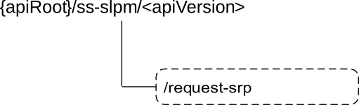

# 7.1.6.4 Custom Operations without associated resources

## 7.1.6.4.1 Overview

The structure of the custom operation URIs of the SS_SLPositioningManagement API is shown in Figure 7.1.6.4.1-1.

Figure 7.1.6.4.1-1 depicts the resource URIs structure for the SS_SLPositioningManagement API.

Figure 7.1.6.4.1-1: Custom operation URI structure of the SS_SLPositioningManagement API

Table 7.1.6.4.1-1 provides an overview of the custom operations and applicable HTTP methods defined for the SS_SLPositioningManagement API.

Table 7.1.6.4.1-1: Custom operations without associated resources

| Custom operation name              | Custom operation URI | Mapped HTTP method | Description                                    |
|------------------------------------|----------------------|--------------------|------------------------------------------------|
| SR Positioning Information Request | /request-srp         | POST               | Enables to request SR Positioning Information. |

The custom operations shall support the URI variables defined in table 7.1.6.4.1-2.

Table 7.1.6.4.1-2: URI variables for this custom operation

| Name    | Data type | Definition          |
|---------|-----------|---------------------|
| apiRoot | string    | See clause 7.1.6.1. |

## 7.1.6.4.2 Operation: SR Positioning Information Request

### 7.1.6.4.2.1 Description

This custom operation enables a service consumer to request SR based positioning information to the LM Server.

### 7.1.6.4.2.2 Operation Definition

This operation shall support the request data structures specified in table 7.1.6.4.2.2-1 and the response data structures and response codes specified in table 7.1.6.4.2.2-2.

Table 7.1.6.4.2.2-1: Data structures supported by the POST Request Body on this custom operation

|              |     |             |                                                  |
|--------------|-----|-------------|--------------------------------------------------|
| Data type    | P   | Cardinality | Description                                      |
| SrPosInfoReq | M   | 1           | Contains the SR Positioning Information Request. |

Table 7.1.6.4.2.2-2: Data structures supported by the POST Response Body on this custom operation

<table>
<colgroup>
<col style="width: 19%" />
<col style="width: 4%" />
<col style="width: 11%" />
<col style="width: 16%" />
<col style="width: 48%" />
</colgroup>
<tbody>
<tr class="odd">
<td>Data type</td>
<td>P</td>
<td>Cardinality</td>
<td>
Response

codes
</td>
<td>Description</td>
</tr>
<tr class="even">
<td>SrPosInfoResp</td>
<td>M</td>
<td>1</td>
<td>200 OK</td>
<td>Successful case. The Positioning Information Request is successfully received and processed, and the requested SR based positioning information is returned in the response body.</td>
</tr>
<tr class="odd">
<td>n/a</td>
<td></td>
<td></td>
<td>307 Temporary Redirect</td>
<td>
Temporary redirection.

The response shall include a Location header field containing an alternative URI representing the end point of an alternative LM Server.

Redirection handling is described in clause 5.2.10 of 3GPP TS 29.122 [3].
</td>
</tr>
<tr class="even">
<td>n/a</td>
<td></td>
<td></td>
<td>308 Permanent Redirect</td>
<td>
Permanent redirection.

The response shall include a Location header field containing an alternative URI representing the end point of an alternative LM Server.

Redirection handling is described in clause 5.2.10 of 3GPP TS 29.122 [3].
</td>
</tr>
<tr class="odd">
<td colspan="5">NOTE: The mandatory HTTP error status code for the HTTP POST method listed in table 5.2.6-1 of 3GPP TS 29.122 [3] shall also apply.</td>
</tr>
</tbody>
</table>

Table 7.1.6.4.2.2-3: Headers supported by the 307 Response Code on this custom operation

|          |           |     |             |                                                                                     |
|----------|-----------|-----|-------------|-------------------------------------------------------------------------------------|
| Name     | Data type | P   | Cardinality | Description                                                                         |
| Location | string    | M   | 1           | Contains an alternative URI representing the end point of an alternative LM Server. |

Table 7.1.6.4.2.2-4: Headers supported by the 308 Response Code on this custom operation

|          |           |     |             |                                                                                     |
|----------|-----------|-----|-------------|-------------------------------------------------------------------------------------|
| Name     | Data type | P   | Cardinality | Description                                                                         |
| Location | string    | M   | 1           | Contains an alternative URI representing the end point of an alternative LM Server. |
