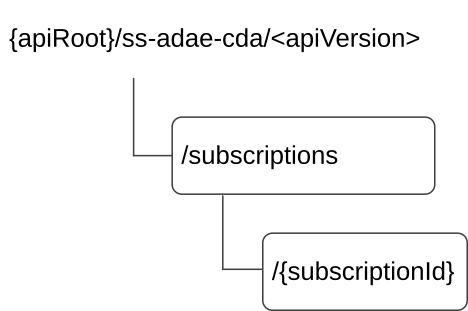

# 7.10.10.3 Resources

## 7.10.10.3.1 Overview

This clause describes the structure for the Resource URIs and the resources and methods used for the service.

Figure 7.10.10.3.1-1 depicts the resource URIs structure for the SS_ADAE_CollisionDetectionAnalytics.

Figure 7.10.10.3.1-1: Resource URI structure of the SS_ADAE_CollisionDetectionAnalytics

Table 7.10.10.3.1-1 provides an overview of the resources and applicable HTTP methods.

Table 7.10.10.3.1-1: Resources and methods overview

| Resource name                                         | Resource URI                    | HTTP method | Description                                                                  |
|-------------------------------------------------------|---------------------------------|-------------|------------------------------------------------------------------------------|
| Collision Detection Analytics Subscriptions           | /subscriptions                  | POST        | Create an "Individual Collision Detection Analytics Subscription" resource.  |
| Individual Collision Detection Analytics Subscription | /subscriptions/{subscriptionId} | GET         | Read the "Individual Collision Detection Analytics Subscription" resource.   |
|                                                       |                                 | PUT         | Update the "Individual Collision Detection Analytics Subscription" resource. |
|                                                       |                                 | PATCH       | Modify the "Individual Collision Detection Analytics Subscription" resource. |
|                                                       |                                 | DELETE      | Remove the "Individual Collision Detection Analytics Subscription" resource. |

## 7.10.10.3.2 Resource: Collision Detection Analytics Subscriptions

### 7.10.10.3.2.1 Description

The "Collision Detection Analytics Subscriptions" resource collection represents the collision detection analytics subscriptions.

### 7.10.10.3.2.2 Resource Definition

Resource URI: **{apiRoot}/ss-adae-cda/\<apiVersion\>/subscriptions**

This resource shall support the resource URI variables defined in the table 7.10.10.3.2.2-1.

Table 7.10.10.3.2.2-1: Resource URI variables for this resource

| Name    | Data Type | Definition            |
|---------|-----------|-----------------------|
| apiRoot | string    | See clause 7.10.10.1. |

### 7.10.10.3.2.3 Resource Standard Methods

#### 7.10.10.3.2.3.1 POST

This method to subscribe to the event of the UE-to-UE session performance analytics and shall support the URI query parameters specified in table 7.10.10.3.2.3.1-1.

Table 7.10.10.3.2.3.1-1: URI query parameters supported by the POST method on this resource

| Name | Data type | P   | Cardinality | Description |
|------|-----------|-----|-------------|-------------|
| n/a  |           |     |             |             |

This method shall support the request data structures specified in table 7.10.10.3.2.3.1-2 and the response data structures and response codes specified in table 7.10.10.3.2.3.1-3.

Table 7.10.10.3.2.3.1-2: Data structures supported by the POST Request Body on this resource

| Data type             | P   | Cardinality | Description                                        |
|-----------------------|-----|-------------|----------------------------------------------------|
| CollisionDetectionSub | M   | 1           | Subscription to the collision detection analytics. |

Table 7.10.10.3.2.3.1-3: Data structures supported by the POST Response Body on this resource

<table>
<colgroup>
<col style="width: 20%" />
<col style="width: 4%" />
<col style="width: 12%" />
<col style="width: 13%" />
<col style="width: 49%" />
</colgroup>
<thead>
<tr class="header">
<th>Data type</th>
<th>P</th>
<th>Cardinality</th>
<th>
Response

codes
</th>
<th>Description</th>
</tr>
</thead>
<tbody>
<tr class="odd">
<td>CollisionDetectionSub</td>
<td>M</td>
<td>1</td>
<td>201 Created</td>
<td>Subscription to the collision detection analytics is created.</td>
</tr>
<tr class="even">
<td colspan="5">NOTE: The mandatory HTTP error status codes for the POST method listed in table 5.2.6-1 of 3GPP TS 29.122 [3] shall also apply.</td>
</tr>
</tbody>
</table>

Table 7.10.10.3.2.3.1-4: Headers supported by the 201 Response Code on this resource

| Name     | Data type | P   | Cardinality | Description                                                                                                                                     |
|----------|-----------|-----|-------------|-------------------------------------------------------------------------------------------------------------------------------------------------|
| Location | string    | M   | 1           | Contains the URI of the newly created resource, according to the structure: {apiRoot}/ss-adae-cda/\<apiVersion\>/subscriptions/{subscriptionId} |

### 7.10.10.3.2.4 Resource Custom Operations

None.

## 7.10.10.3.3 Resource: Individual Collision Detection Analytics Subscription

### 7.10.10.3.3.1 Description

### 7.10.10.3.3.2 Resource Definition

Resource URI: {**apiRoot**}/**ss-adae-cda**/\<**apiVersion**\>/**subscriptions**/{**subscriptionId**}

This resource shall support the resource URI variables defined in table 7.10.10.3.3.2-1.

Table 7.10.10.3.3.2-1: Resource URI variables for this resource

| Name           | Data Type | Definition                                                                                |
|----------------|-----------|-------------------------------------------------------------------------------------------|
| apiRoot        | string    | See clause 7.10.10.1.                                                                     |
| subscriptionId | string    | Represents the identifier of the "Individual Collision Detection Analytics Subscription". |

### 7.10.10.3.3.3 Resource Standard Methods

#### 7.10.10.3.3.3.1 GET

This operation reads the "Individual Collision Detection Analytics Subscription" resource. This method shall support the URI query parameters specified in table 7.10.10.3.3.3.1-1.

Table 7.10.10.3.3.3.1-1: URI query parameters supported by the GET method on this resource

|      |           |     |             |             |
|------|-----------|-----|-------------|-------------|
| Name | Data type | P   | Cardinality | Description |
|      |           |     |             |             |

This method shall support the request data structures specified in table 7.10.10.3.3.3.1-2 and the response data structures and response codes specified in table 7.10.10.3.3.3.1-3.

Table 7.10.10.3.3.3.1-2: Data structures supported by the GET Request Body on this resource

|           |     |             |             |
|-----------|-----|-------------|-------------|
| Data type | P   | Cardinality | Description |
| n/a       |     |             |             |

Table 7.10.10.3.3.3.1-3: Data structures supported by the GET Response Body on this resource

<table>
<colgroup>
<col style="width: 16%" />
<col style="width: 9%" />
<col style="width: 14%" />
<col style="width: 19%" />
<col style="width: 39%" />
</colgroup>
<tbody>
<tr class="odd">
<td>Data type</td>
<td>P</td>
<td>Cardinality</td>
<td>
Response

codes
</td>
<td>Description</td>
</tr>
<tr class="even">
<td>CollisionDetectionSub</td>
<td>M</td>
<td>1</td>
<td>200 OK</td>
<td>The requested "Individual Collision Detection Analytics Subscription" resource is returned.</td>
</tr>
<tr class="odd">
<td>n/a</td>
<td></td>
<td></td>
<td>307 Temporary Redirect</td>
<td>
Temporary redirection. The response shall include a Location header field containing an alternative URI of the resource located in an alternative ADAE server.

Redirection handling is described in clause 5.2.10 of 3GPP TS 29.122 [3].
</td>
</tr>
<tr class="even">
<td>n/a</td>
<td></td>
<td></td>
<td>308 Permanent Redirect</td>
<td>
Permanent redirection. The response shall include a Location header field containing an alternative URI of the resource located in an alternative ADAE server.

Redirection handling is described in clause 5.2.10 of 3GPP TS 29.122 [3].
</td>
</tr>
<tr class="odd">
<td colspan="5">NOTE: The mandatory HTTP error status codes for the GET method listed in table 5.2.6-1 of 3GPP TS 29.122 [3] shall also apply.</td>
</tr>
</tbody>
</table>

Table 7.10.10.3.3.3.1-4: Headers supported by the 307 Response Code on this resource

|          |           |     |             |                                                                           |
|----------|-----------|-----|-------------|---------------------------------------------------------------------------|
| Name     | Data type | P   | Cardinality | Description                                                               |
| Location | string    | M   | 1           | An alternative URI of the resource located in an alternative ADAE server. |

Table 7.10.10.3.3.3.1-5: Headers supported by the 308 Response Code on this resource

|          |           |     |             |                                                                           |
|----------|-----------|-----|-------------|---------------------------------------------------------------------------|
| Name     | Data type | P   | Cardinality | Description                                                               |
| Location | string    | M   | 1           | An alternative URI of the resource located in an alternative ADAE server. |

#### 7.10.10.3.3.3.2 DELETE

This operation deletes the "Individual Collision Detection Analytics Subscription" resource. This method shall support the URI query parameters specified in table 7.10.10.3.3.3.2-1.

Table 7.10.10.3.3.3.2-1: URI query parameters supported by the DELETE method on this resource

|      |           |     |             |             |
|------|-----------|-----|-------------|-------------|
| Name | Data type | P   | Cardinality | Description |
| n/a  |           |     |             |             |

This method shall support the request data structures specified in table 7.10.10.3.3.3.2-2 and the response data structures and response codes specified in table 7.10.10.3.3.3.2-3.

Table 7.10.10.3.3.3.2-2: Data structures supported by the DELETE Request Body on this resource

|           |     |             |             |
|-----------|-----|-------------|-------------|
| Data type | P   | Cardinality | Description |
| n/a       |     |             |             |

Table 7.10.10.3.3.3.2-3: Data structures supported by the DELETE Response Body on this resource

<table>
<colgroup>
<col style="width: 16%" />
<col style="width: 9%" />
<col style="width: 14%" />
<col style="width: 19%" />
<col style="width: 39%" />
</colgroup>
<tbody>
<tr class="odd">
<td>Data type</td>
<td>P</td>
<td>Cardinality</td>
<td>
Response

codes
</td>
<td>Description</td>
</tr>
<tr class="even">
<td>n/a</td>
<td></td>
<td></td>
<td>204 No Content</td>
<td>The "Individual Collision Detection Analytics Subscription" resource matching the subscriptionId is deleted.</td>
</tr>
<tr class="odd">
<td>n/a</td>
<td></td>
<td></td>
<td>307 Temporary Redirect</td>
<td>
Temporary redirection. The response shall include a Location header field containing an alternative URI of the resource located in an alternative ADAE Server.

Redirection handling is described in clause 5.2.10 of 3GPP TS 29.122 [3].
</td>
</tr>
<tr class="even">
<td>n/a</td>
<td></td>
<td></td>
<td>308 Permanent Redirect</td>
<td>
Permanent redirection. The response shall include a Location header field containing an alternative URI of the resource located in an alternative ADAE Server.

Redirection handling is described in clause 5.2.10 of 3GPP TS 29.122 [3].
</td>
</tr>
<tr class="odd">
<td colspan="5">NOTE: The mandatory HTTP error status codes for the DELETE method listed in table 5.2.6-1 of 3GPP TS 29.122 [3] also apply.</td>
</tr>
</tbody>
</table>

Table 7.10.10.3.3.3.2-4: Headers supported by the 307 Response Code on this resource

|          |           |     |             |                                                                           |
|----------|-----------|-----|-------------|---------------------------------------------------------------------------|
| Name     | Data type | P   | Cardinality | Description                                                               |
| Location | string    | M   | 1           | An alternative URI of the resource located in an alternative ADAE Server. |

Table 7.10.10.3.3.3.2-5: Headers supported by the 308 Response Code on this resource

|          |           |     |             |                                                                           |
|----------|-----------|-----|-------------|---------------------------------------------------------------------------|
| Name     | Data type | P   | Cardinality | Description                                                               |
| Location | string    | M   | 1           | An alternative URI of the resource located in an alternative ADAE server. |

#### 7.10.10.3.3.3.3 PUT

This method enables to update the "Individual Collision Detection Analytics Subscription" resource.

This method shall support the URI query parameters specified in table 7.10.10.3.3.3.3-1.

Table 7.10.10.3.3.3.3-1: URI query parameters supported by the PUT method on this resource

|      |           |     |             |             |
|------|-----------|-----|-------------|-------------|
| Name | Data type | P   | Cardinality | Description |
| n/a  |           |     |             |             |

This method shall support the request data structures specified in table 7.10.10.3.3.3.3-2 and the response data structures and response codes specified in table 7.10.10.3.3.3.3-3.

Table 7.10.10.3.3.3.3-2: Data structures supported by the PUT Request Body on this resource

|                       |     |             |                                                                                                              |
|-----------------------|-----|-------------|--------------------------------------------------------------------------------------------------------------|
| Data type             | P   | Cardinality | Description                                                                                                  |
| CollisionDetectionSub | M   | 1           | Contains the updated representation of the "Individual Collision Detection Analytics Subscription" resource. |

Table 7.10.10.3.3.3.3-3: Data structures supported by the PUT Response Body on this resource

<table>
<colgroup>
<col style="width: 16%" />
<col style="width: 9%" />
<col style="width: 14%" />
<col style="width: 19%" />
<col style="width: 39%" />
</colgroup>
<tbody>
<tr class="odd">
<td>Data type</td>
<td>P</td>
<td>Cardinality</td>
<td>
Response

codes
</td>
<td>Description</td>
</tr>
<tr class="even">
<td>CollisionDetectionSub</td>
<td>M</td>
<td>1</td>
<td>200 OK</td>
<td>Successful case. The "Individual Collision Detection Analytics Subscription" resource is successfully updated, and the representation of the updated resource is returned in the response body.</td>
</tr>
<tr class="odd">
<td>n/a</td>
<td></td>
<td></td>
<td>204 No Content</td>
<td>Successful case. The "Individual Collision Detection Analytics Subscription" resource is successfully updated and no content is returned in the response body.</td>
</tr>
<tr class="even">
<td>n/a</td>
<td></td>
<td></td>
<td>307 Temporary Redirect</td>
<td>
Temporary redirection.

The response shall include a Location header field containing an alternative URI of the resource located in an alternative ADAE Server.

Redirection handling is described in clause 5.2.10 of 3GPP TS 29.122 [3].
</td>
</tr>
<tr class="odd">
<td>n/a</td>
<td></td>
<td></td>
<td>308 Permanent Redirect</td>
<td>
Permanent redirection.

The response shall include a Location header field containing an alternative URI of the resource located in an alternative ADAE Server.

Redirection handling is described in clause 5.2.10 of 3GPP TS 29.122 [3].
</td>
</tr>
<tr class="even">
<td colspan="5">NOTE: The mandatory HTTP error status codes for the HTTP PUT method listed in table 5.2.6-1 of 3GPP TS 29.122 [3] shall also apply.</td>
</tr>
</tbody>
</table>

Table 7.10.10.3.3.3.3-4: Headers supported by the 307 Response Code on this resource

|          |           |     |             |                                                                                    |
|----------|-----------|-----|-------------|------------------------------------------------------------------------------------|
| Name     | Data type | P   | Cardinality | Description                                                                        |
| Location | string    | M   | 1           | Contains an alternative URI of the resource located in an alternative ADAE Server. |

Table 7.10.10.3.3.3.3-5: Headers supported by the 308 Response Code on this resource

|          |           |     |             |                                                                                    |
|----------|-----------|-----|-------------|------------------------------------------------------------------------------------|
| Name     | Data type | P   | Cardinality | Description                                                                        |
| Location | string    | M   | 1           | Contains an alternative URI of the resource located in an alternative ADAE Server. |

#### 7.10.10.3.3.3.4 PATCH

This method modifies the "Individual Collision Detection Analytics Subscription" resource.

This method shall support the URI query parameters specified in table 7.10.10.3.3.3.4-1.

Table 7.10.10.3.3.3.4-1: URI query parameters supported by the PATCH method on this resource

| Name | Data type | P   | Cardinality | Description |
|------|-----------|-----|-------------|-------------|
| n/a  |           |     |             |             |

This method shall support the request data structures specified in table 7.10.10.3.3.3.4-2 and the response data structures and response codes specified in table 7.10.10.3.3.3.4-3.

Table 7.10.10.3.3.3.4-2: Data structures supported by the PATCH Request Body on this resource

| Data type                  | P   | Cardinality | Description                                                                                         |
|----------------------------|-----|-------------|-----------------------------------------------------------------------------------------------------|
| CollisionDetectionSubPatch | M   | 1           | Contains the modifications to the "Individual Collision Detection Analytics Subscription" resource. |

Table 7.10.10.3.3.3.4-3: Data structures supported by the PATCH Response Body on this resource

<table>
<colgroup>
<col style="width: 21%" />
<col style="width: 3%" />
<col style="width: 11%" />
<col style="width: 10%" />
<col style="width: 53%" />
</colgroup>
<thead>
<tr class="header">
<th>Data type</th>
<th>P</th>
<th>Cardinality</th>
<th>
Response

codes
</th>
<th>Description</th>
</tr>
</thead>
<tbody>
<tr class="odd">
<td>CollisionDetectionSub</td>
<td>M</td>
<td>1</td>
<td>200 OK</td>
<td>Successful case. The "Individual Collision Detection Analytics Subscription" resource is successfully modified, and a representation of the updated resource is returned in the response.</td>
</tr>
<tr class="even">
<td>n/a</td>
<td></td>
<td></td>
<td>204 No Content</td>
<td>Successful case. The "Individual Collision Detection Analytics Subscription" resource is successfully modified and no content is returned in the response body.</td>
</tr>
<tr class="odd">
<td>n/a</td>
<td></td>
<td></td>
<td>307 Temporary Redirect</td>
<td>
Temporary redirection.

The response shall include a Location header field containing an alternative URI of the resource located in an alternative ADAE Server.

Redirection handling is described in clause 5.2.10 of 3GPP TS 29.122 [3].
</td>
</tr>
<tr class="even">
<td>n/a</td>
<td></td>
<td></td>
<td>308 Permanent Redirect</td>
<td>
Permanent redirection.

The response shall include a Location header field containing an alternative URI of the resource located in an alternative ADAES server.

Redirection handling is described in clause 5.2.10 of 3GPP TS 29.122 [3].
</td>
</tr>
<tr class="odd">
<td colspan="5">NOTE: The mandatory HTTP error status codes for the HTTP PATCH method listed in table 5.2.6-1 of 3GPP TS 29.122 [3] shall also apply.</td>
</tr>
</tbody>
</table>

Table 7.10.10.3.3.3.4-4: Headers supported by the 307 Response Code on this resource

|          |           |     |             |                                                                                    |
|----------|-----------|-----|-------------|------------------------------------------------------------------------------------|
| Name     | Data type | P   | Cardinality | Description                                                                        |
| Location | string    | M   | 1           | Contains an alternative URI of the resource located in an alternative ADAE server. |

Table 7.10.10.3.3.3.4-5: Headers supported by the 308 Response Code on this resource

|          |           |     |             |                                                                                    |
|----------|-----------|-----|-------------|------------------------------------------------------------------------------------|
| Name     | Data type | P   | Cardinality | Description                                                                        |
| Location | string    | M   | 1           | Contains an alternative URI of the resource located in an alternative ADAE server. |

### 7.10.10.3.3.4 Resource Custom Operations

None.
