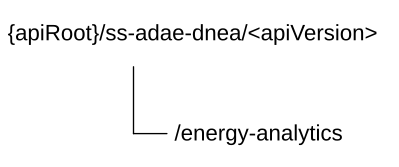

# 7.10.15 SS_ADAE_DN_energy_analytics API

## 7.10.15.1 Introduction

The SS_ADAE_DN_energy_analytics service shall use the SS_ADAE_DN_energy_analytics API.

The API URI of the SS_ADAE_DN_energy_analytics API shall be:

**{apiRoot}/\<apiName\>/\<apiVersion\>**

The request URIs used in HTTP requests shall have the Resource URI structure defined in clause 6.5, i.e.:

**{apiRoot}/\<apiName\>/\<apiVersion\>/\<apiSpecificSuffixes\>**

with the following components:

\- The {apiRoot} shall be set as described in clause 6.5.

\- The \<apiName\> shall be "ss-adae-dnea".

\- The \<apiVersion\> shall be "v1".

\- The \<apiSpecificSuffixes\> shall be set as described in clause 7.10.15.3.

NOTE: When 3GPP TS 29.122 \[3\] is referenced for the common protocol and interface aspects for API definition in the clauses under clause 7.10.15, the service producer (e.g. ADAE Server) takes the role of the SCEF and the service consumer (i.e. ADAE service consumer, e.g. VAL server) takes the role of the SCS/AS.

## 7.10.15.2 Usage of HTTP and common API related aspects

The provisions of clause 6.3 shall apply for the SS_ADAE_DN_energy_analytics API.

## 7.10.15.3 Resources

### 7.10.15.3.1 Overview

This clause describes the structure for the Resource URIs and the resources and methods used for the service.

Figure 7.10.15.3.1-1 depicts the resource URIs structure for the SS_ADAE_DN_energy_analytics Service API.

Figure 7.10.15.3.1-1: Resource URI structure of the SS_ADAE_DN_energy_analytics Service API

Table 7.10.15.3.1-1 provides an overview of the resources and applicable HTTP methods.

Table 7.10.15.3.1-1: Resources and methods overview

| Resource purpose/name    | Resource URI (relative path after API URI) | HTTP method or custom operation | Description (service operation)                                           |
|--------------------------|--------------------------------------------|---------------------------------|---------------------------------------------------------------------------|
| ADAE DN Energy Analytics | /energy-analytics                          | GET                             | Request the ADAE DN Energy Analytics according to the filtering criteria. |

### 7.10.15.3.2 Resource: ADAE DN Energy Analytics

#### 7.10.15.3.2.1 Description

The "ADAE DN Energy Analytics" resource represents the ADAE DN Energy Analytics.

#### 7.10.15.3.2.2 Resource Definition

Resource URI: **{apiRoot}/ss-adae-dnea/\<apiVersion\>/energy-analytics**

This resource shall support the resource URI variables defined in the table 7.10.15.3.2.2-1.

Table 7.10.15.3.2.2-1: Resource URI variables for this resource

| Name    | Data Type | Definition            |
|---------|-----------|-----------------------|
| apiRoot | string    | See clause 7.10.15.1. |

#### 7.10.15.3.2.3 Resource Standard Methods

##### 7.10.15.3.2.3.1 GET

This method shall support the URI query parameters specified in table 7.10.15.3.2.3.1-1.

Table 7.10.15.3.2.3.1-1: URI query parameters supported by the GET method on this resource

<table style="width:100%;">
<colgroup>
<col style="width: 11%" />
<col style="width: 17%" />
<col style="width: 17%" />
<col style="width: 2%" />
<col style="width: 11%" />
<col style="width: 39%" />
</colgroup>
<thead>
<tr class="header">
<th>Name</th>
<th></th>
<th>Data type</th>
<th>P</th>
<th>Cardinality</th>
<th>Description</th>
</tr>
</thead>
<tbody>
<tr class="odd">
<td>filt-criteria</td>
<td></td>
<td>DNEnergyAnalytics</td>
<td>M</td>
<td>1</td>
<td>Represents the ADAE DN Energy Analytics filtering criteria.</td>
</tr>
<tr class="even">
<td>supported-features</td>
<td></td>
<td>SupportedFeatures</td>
<td>C</td>
<td>0..1</td>
<td>
Contains supported features information, used to negotiate the applicability of optional features as defined in clause 7.10.15.8.

This query parameter shall be present only if feature negotiation needs to take place.
</td>
</tr>
</tbody>
</table>

This method shall support the request data structures specified in table 7.10.15.3.2.3.1-2 and the response data structures and response codes specified in table 7.10.15.3.2.3.1-3.

Table 7.10.15.3.2.3.1-2: Data structures supported by the GET Request Body on this resource

| Data type | P   | Cardinality | Description |
|-----------|-----|-------------|-------------|
| n/a       |     |             |             |

Table 7.10.15.3.2.3.1-3: Data structures supported by the GET Response Body on this resource

<table>
<colgroup>
<col style="width: 21%" />
<col style="width: 3%" />
<col style="width: 11%" />
<col style="width: 13%" />
<col style="width: 50%" />
</colgroup>
<thead>
<tr class="header">
<th>Data type</th>
<th>P</th>
<th>Cardinality</th>
<th>
Response

codes
</th>
<th>Description</th>
</tr>
</thead>
<tbody>
<tr class="odd">
<td>DNEnergyAnalytics</td>
<td>M</td>
<td>1</td>
<td>200 OK</td>
<td>Successful case. The response body contains energy efficiently and consumption analytics.</td>
</tr>
<tr class="even">
<td>n/a</td>
<td></td>
<td></td>
<td>307 Temporary Redirect</td>
<td>
Temporary redirection.

The response shall include a Location header field containing an alternative target URI of the resource located in an alternative ADAE Server.

Redirection handling is described in clause 5.2.10 of 3GPP TS 29.122 [3].
</td>
</tr>
<tr class="odd">
<td>n/a</td>
<td></td>
<td></td>
<td>308 Permanent Redirect</td>
<td>
Permanent redirection.

The response shall include a Location header field containing an alternative target URI of the resource located in an alternative ADAE Server.

Redirection handling is described in clause 5.2.10 of 3GPP TS 29.122 [3].
</td>
</tr>
<tr class="even">
<td colspan="5">NOTE: The mandatory HTTP error status codes for the HTTP GET method listed in table 5.2.6-1 of 3GPP TS 29.122 [3] shall also apply.</td>
</tr>
</tbody>
</table>

Table 7.10.15.3.2.3.1-4: Headers supported by the 307 Response Code on this resource

| Name     | Data type | P   | Cardinality | Description                                                                        |
|----------|-----------|-----|-------------|------------------------------------------------------------------------------------|
| Location | string    | M   | 1           | Contains an alternative URI of the resource located in an alternative ADAE Server. |

Table 7.10.15.3.2.3.1-5: Headers supported by the 308 Response Code on this resource

| Name     | Data type | P   | Cardinality | Description                                                                        |
|----------|-----------|-----|-------------|------------------------------------------------------------------------------------|
| Location | string    | M   | 1           | Contains an alternative URI of the resource located in an alternative ADAE Server. |

#### 7.10.15.3.2.4 Resource Custom Operations

There are no resource custom operations defined for this resource in this release of the specification.

## 7.10.15.4 Custom Operations without associated resources

There are no custom operations without associated resources in the present release of the document.

## 7.10.15.5 Notifications

There are no notifications in the present release of the document.

## 7.10.15.6 Data Model

### 7.10.15.6.1 General

This clause specifies the application data model supported by the API.

Table 7.10.15.6.1-1 specifies the data types defined for the SS_ADAE_DN_energy_analytics API.

Table 7.10.15.6.1-1: SS_ADAE_DN_energy_analytics API specific Data Types

| Data type         | Section defined | Description                                    | Applicability |
|-------------------|-----------------|------------------------------------------------|---------------|
| AnalyticsEventId  | 7.10.15.6.3.3   | Represents the analytics even identity.        |               |
| DNEnergyAnalytics | 7.10.15.6.2.2   | Represents the energy analytics for a DN.      |               |
| EnergyMetrics     | 7.10.15.6.2.3   | Represents the metrics of the energy for a DN. |               |

Table 7.10.15.6.1-2 specifies data types re-used by the SS_ADAE_DN_energy_analytics API from other specifications, including a reference to their respective specifications, and when needed, a short description of their use within the SS_ADAE_DN_energy_analytics API.

Table 7.10.15.6.1-2: SS_ADAE_DN_energy_analytics API Re-used Data Types

| Data type             | Reference             | Comments                                                                                                      | Applicability |
|-----------------------|-----------------------|---------------------------------------------------------------------------------------------------------------|---------------|
| AnalyticsType         | Clause 7.10.1.4.2.6   | Identifies type of the analytics.                                                                             |               |
| Dnai                  | 3GPP TS 29.571 \[21\] | Identifies a user plane access to one or more DN(s).                                                          |               |
| Dnn                   | 3GPP TS 29.571 \[21\] | Identifies a DNN.                                                                                             |               |
| LocationArea5G        | 3GPP TS 29.122 \[3\]  | Represents location information.                                                                              |               |
| TimeWindow            | 3GPP TS 29.122 \[3\]  | Represents a time interval.                                                                                   |               |
| ReportingRequirements | Clause 7.4.2.4.2.5    | Identifies the requirements for the energy analytics reporting.                                               |               |
| SupportedFeatures     | 3GPP TS 29.571 \[21\] | Represents the list of supported feature(s) and used to negotiate the applicability of the optional features. |               |
| Uinteger              | 3GPP TS 29.571 \[21\] | Used to represent integer attributes within measurement data.                                                 |               |

### 7.10.15.6.2 Structured data types

#### 7.10.15.6.2.1 Introduction

This clause defines the structures to be used in resource representations.

#### 7.10.15.6.2.2 Type: DNEnergyAnalytics

Table 7.10.15.6.2.2-1: Definition of type DNEnergyAnalytics

<table>
<colgroup>
<col style="width: 16%" />
<col style="width: 14%" />
<col style="width: 4%" />
<col style="width: 11%" />
<col style="width: 38%" />
<col style="width: 13%" />
</colgroup>
<thead>
<tr class="header">
<th>Attribute name</th>
<th>Data type</th>
<th>P</th>
<th>Cardinality</th>
<th>Description</th>
<th>Applicability</th>
</tr>
</thead>
<tbody>
<tr class="odd">
<td>analyticsId</td>
<td>AnalyticsEventId</td>
<td>M</td>
<td>1</td>
<td>Represents the identity of the analytics event.</td>
<td></td>
</tr>
<tr class="even">
<td>analyticsType</td>
<td>AnalyticsType</td>
<td>M</td>
<td>1</td>
<td>Represents the type of the analytics event.</td>
<td></td>
</tr>
<tr class="odd">
<td>dnai</td>
<td>Dnai</td>
<td>C</td>
<td>0..1</td>
<td>Represents the Data Network Access Identifier of user plane access to DN(s) which the subscription applies. (NOTE 1)</td>
<td></td>
</tr>
<tr class="even">
<td>dnn</td>
<td>Dnn</td>
<td>C</td>
<td>0..1</td>
<td>Represents the target DNN which the subscription applies. (NOTE 1)</td>
<td></td>
</tr>
<tr class="odd">
<td>energyMetrics</td>
<td>EnergyMetrics</td>
<td>O</td>
<td>0..1</td>
<td>
In the request, represents the necessary metrics for predicting the energy efficiency and consumption.

In the response, represents the predicted metrics of the energy efficiency and consumption.
</td>
<td></td>
</tr>
<tr class="even">
<td>profileCriteria</td>
<td>string</td>
<td>O</td>
<td>0..1</td>
<td>The characteristics of the data producers to be used. (NOTE 2)</td>
<td></td>
</tr>
<tr class="odd">
<td>confLevel</td>
<td>Uinteger</td>
<td>C</td>
<td>0..1</td>
<td>
Indicates the preferred confidence level of the prediction.

This attribute shall be provided if the "analyticsType" attribute in the request is set to "PREDICTIVE".

Minimum = 0. Maximum = 100.
</td>
<td></td>
</tr>
<tr class="even">
<td>area</td>
<td>LocationArea5G</td>
<td>O</td>
<td>0..1</td>
<td>Represents the area of interest.</td>
<td></td>
</tr>
<tr class="odd">
<td>timeVal</td>
<td>TimeWindow</td>
<td>O</td>
<td>0..1</td>
<td>Represents the time validity of the request.</td>
<td></td>
</tr>
<tr class="even">
<td>reportReqs</td>
<td>ReportingRequirements</td>
<td>O</td>
<td>0..1</td>
<td>Represents the reporting requirements.</td>
<td></td>
</tr>
<tr class="odd">
<td colspan="6">NOTE 1: At least one of the attributes, either "dnai" or "dnn", shall be present.</td>
</tr>
<tr class="even">
<td colspan="6">NOTE 2: The format of this attribute is not specified in this release of the specification and is up to implementation.</td>
</tr>
</tbody>
</table>

#### 7.10.15.6.2.3 Type: EnergyMetrics

Table 7.10.15.6.2.3-1: Definition of type EnergyMetrics

| Attribute name | Data type | P   | Cardinality | Description                                                                                                                                      | Applicability |
|----------------|-----------|-----|-------------|--------------------------------------------------------------------------------------------------------------------------------------------------|---------------|
| powUseEffect   | Uinteger  | O   | 0..1        | Represents Power Usage Effectiveness (PUE) which measures the ratio of total facility energy consumption to the energy consumed by IT equipment. |               |
| specEnergyCons | Uinteger  | O   | 0..1        | Represents Specific Energy Consumption (SEC) which measures the energy consumed in kilowatt-hours (kWh).                                         |               |

### 7.10.15.6.3 Simple data types and enumerations

#### 7.10.15.6.3.1 Introduction

This clause defines simple data types and enumerations that can be referenced from data structures defined in the previous clauses.

#### 7.10.15.6.3.2 Simple data types

The simple data types defined in table 7.10.15.6.3.2-1 shall be supported.

Table 7.10.15.6.3.2-1: Simple data types

|           |                 |             |               |
|-----------|-----------------|-------------|---------------|
| Type Name | Type Definition | Description | Applicability |
|           |                 |             |               |

#### 7.10.15.6.3.3 Enumeration: AnalyticsEventId

The enumeration AnalyticsEventId represents the identity of analytics event. It shall comply with the provisions defined in table 7.10.15.6.3.3-1.

Table 7.10.15.6.3.3-1: Enumeration AnalyticsEventId

| Enumeration value          | Description                            | Applicability |
|----------------------------|----------------------------------------|---------------|
| EDGE_PERFORMANCE_ANALYTICS | Analytics are for edge performance     |               |
| EDGE_PLATFORM_ANALYTICS    | Analytics are for edge platform.       |               |
| DN_ENERGY_ANALYTICS        | Analytics are for data network energy. |               |
| EAS_ANALYTICS              | Analytics are for EAS.                 |               |

### 7.10.15.6.4 Data types describing alternative data types or combinations of data types

There are no data types describing alternative data types and combinations of data types in this release of the specification.

### 7.10.15.6.5 Binary data

There are no binary data defined in this release of the specification.

## 7.10.15.7 Error Handling

### 7.10.15.7.1 General

For the SS_ADAE_DN_energy_analytics API, error handling shall be supported as specified in clause 6.7.

In addition, the requirements in the following clauses are applicable for the SS_ADAE_DN_energy_analytics API.

### 7.10.15.7.2 Protocol Errors

No specific procedures for the SS_ADAE_DN_energy_analytics API are specified.

### 7.10.15.7.3 Application Errors

The application errors defined for SS_ADAE_DN_energy_analytics API are listed in table 7.10.15.7.3-1.

Table 7.10.15.7.3-1: Application errors

| Application Error | HTTP status code | Description | Applicability |
|-------------------|------------------|-------------|---------------|
|                   |                  |             |               |

## 7.10.15.8 Feature Negotiation

The optional features in table 7.10.15.8-1 are defined for the SS_ADAE_DN_energy_analytics API. They shall be negotiated using the extensibility mechanism defined in clause 6.8.

Table 7.10.15.8-1: Supported Features

| Feature number | Feature Name | Description |
|----------------|--------------|-------------|
|                |              |             |

## 7.10.15.9 Security

The provisions of clause 9 shall apply for the SS_ADAE_DN_energy_analytics API.
