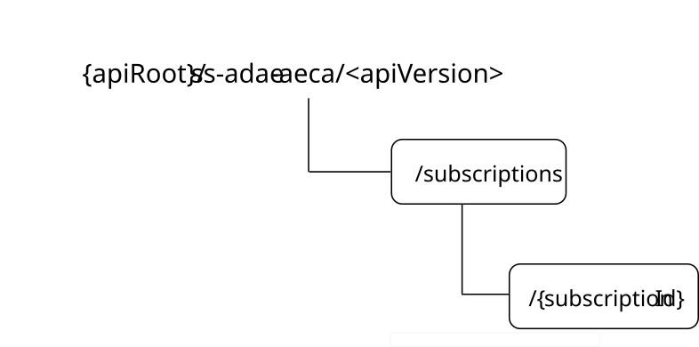

# 7.10.16 SS_ADAE_AIMLEnergyConsumptionAnalytics

7.10.16.1 Introduction

The SS_ADAE_AIMLEnergyConsumptionAnalytics service shall use the SS_ADAE_AIMLEnergyConsumptionAnalytics API.

The API URI of the SS_ADAE_AIMLEnergyConsumptionAnalytics API shall be:

**{apiRoot}/\<apiName\>/\<apiVersion\>**

The request URIs used in HTTP requests shall have the Resource URI structure defined in clause 6.5, i.e.:

**{apiRoot}/\<apiName\>/\<apiVersion\>/\<apiSpecificSuffixes\>**

with the following components:

> \- The {apiRoot} shall be set as described in clause 6.5.
>
> \- The \<apiName\> shall be "ss-adae-aeca".
>
> \- The \<apiVersion\> shall be "v1".
>
> \- The \<apiSpecificSuffixes\> shall be set as described in clause 7.10.16.3.
>
> NOTE: When 3GPP TS 29.122 \[3\] is referenced for the common protocol and interface aspects for API definition in the clauses under clause 7.10.16, the ADAE Server takes the role of the SCEF and the service consumer takes the role of the SCS/AS.

7.10.16.2 Usage of HTTP and common API related aspects

The provisions of clause 6.3 shall apply for the SS_ADAE_AIMLEnergyConsumptionAnalytics API.

7.10.16.3 Resources

7.10.16.3.1 Overview

This clause describes the structure for the Resource URIs and the resources and methods used for the service.

Figure 7.10.16.3.1-1 depicts the resource URIs structure for the SS_ADAE_AIMLEnergyConsumptionAnalytics.

**Figure 7.10.16.3.1-1: Resource URI structure of the SS_ADAE_AIMLEnergyConsumptionAnalytics**

Table 7.10.16.3.1-1 provides an overview of the resources and applicable HTTP methods.

**Table 7.10.16.3.1-1: Resources and methods overview**

| **Resource name**                                         | **Resource URI**                | **HTTP method** | **Description**                                                                            |
|-----------------------------------------------------------|---------------------------------|-----------------|--------------------------------------------------------------------------------------------|
| AIML Energy Consumption Analytics Subscriptions           | /subscriptions                  | POST            | Create an "Individual AIML Energy Consumption Analytics Subscription" resource.            |
| Individual AIML Energy Consumption Analytics Subscription | /subscriptions/{subscriptionId} | GET             | Read the "Individual AIML Energy Consumption Analytics Subscription" resource.             |
|                                                           |                                 | PUT             | Fully update the "Individual AIML Energy Consumption Analytics Subscription" resource.     |
|                                                           |                                 | PATCH           | Partially modify the "Individual AIML Energy Consumption Analytics Subscription" resource. |
|                                                           |                                 | DELETE          | Remove the "Individual AIML Energy Consumption Analytics Subscription" resource.           |

7.10.16.3.2 Resource: AIML Energy Consumption Analytics Subscriptions

7.10.16.3.2.1 Description

The AIML Energy Consumption Analytics Subscriptions to the event of the AIML Energy Consumption Analytics.

7.10.16.3.2.2 Resource Definition

Resource URI: **{apiRoot}/ss-adae-aeca/\<apiVersion\>/subscriptions**

This resource shall support the resource URI variables defined in the table 7.10.16.3.2.2-1.

**Table 7.10.16.3.2.2-1: Resource URI variables for this resource**

| **Name** | **Data Type** | **Definition**        |
|----------|---------------|-----------------------|
| apiRoot  | string        | See clause 7.10.16.1. |

7.10.16.3.2.3 Resource Standard Methods

7.10.16.3.2.3.1 POST

This method to subscribe to the event of the AIML Energy Consumption Analytics and shall support the URI query parameters specified in table 7.10.16.3.2.3.1-1.

**Table 7.10.16.3.2.3.1-1: URI query parameters supported by the POST method on this resource**

| **Name** | **Data type** | **P** | **Cardinality** | **Description** |
|----------|---------------|-------|-----------------|-----------------|
| n/a      |               |       |                 |                 |

This method shall support the request data structures specified in table 7.10.16.3.2.3.1-2 and the response data structures and response codes specified in table 7.10.16.3.2.3.1-3.

**Table 7.10.16.3.2.3.1-2: Data structures supported by the POST Request Body on this resource**

| **Data type**  | **P** | **Cardinality** | **Description**                                        |
|----------------|-------|-----------------|--------------------------------------------------------|
| AimlEngConpSub | M     | 1               | Subscription to the AIML Energy Consumption Analytics. |

**Table 7.10.16.3.2.3.1-3: Data structures supported by the POST Response Body on this resource**

<table>
<colgroup>
<col style="width: 20%" />
<col style="width: 4%" />
<col style="width: 12%" />
<col style="width: 13%" />
<col style="width: 49%" />
</colgroup>
<thead>
<tr class="header">
<th><strong>Data type</strong></th>
<th><strong>P</strong></th>
<th><strong>Cardinality</strong></th>
<th>
<strong>Response</strong>

<strong>codes</strong>
</th>
<th><strong>Description</strong></th>
</tr>
</thead>
<tbody>
<tr class="odd">
<td>AimlEngConpSub</td>
<td>M</td>
<td>1</td>
<td>201 Created</td>
<td>The "Individual AIML Energy Consumption Analytics Subscription" resource is created.</td>
</tr>
<tr class="even">
<td>AimlEngConpResp</td>
<td>M</td>
<td>1</td>
<td>200 OK</td>
<td>The requested AIML Energy Consumption Analytics information is returned.</td>
</tr>
<tr class="odd">
<td colspan="5">NOTE: The mandatory HTTP error status codes for the POST method listed in table 5.2.6-1 of 3GPP TS 29.122 [3] shall also apply.</td>
</tr>
</tbody>
</table>

**Table 7.10.16.3.2.3.1-4: Headers supported by the 201 Response Code on this resource**

| **Name** | **Data type** | **P** | **Cardinality** | **Description**                                                                                                                                  |
|----------|---------------|-------|-----------------|--------------------------------------------------------------------------------------------------------------------------------------------------|
| Location | string        | M     | 1               | Contains the URI of the newly created resource, according to the structure: {apiRoot}/ss-adae-aeca/\<apiVersion\>/subscriptions/{subscriptionId} |

7.10.16.3.2.4 Resource Custom Operations

None.

7.10.16.3.3 Resource: Individual AIML Energy Consumption Analytics Subscription

7.10.16.3.3.1 Description

7.10.16.3.3.2 Resource Definition

Resource URI: {**apiRoot**}/**ss-adae-aeca**/\<**apiVersion**\>/**subscriptions**/{**subscriptionId**}

This resource shall support the resource URI variables defined in table 7.10.16.3.3.2-1.

**Table 7.10.16.3.3.2-1: Resource URI variables for this resource**

| **Name**       | **Data Type** | **Definition**                                                                                         |
|----------------|---------------|--------------------------------------------------------------------------------------------------------|
| apiRoot        | string        | See clause 7.10.16.1.                                                                                  |
| subscriptionId | string        | Represents the identifier of the "Individual AIML Energy Consumption Analytics Subscription" resource. |

7.10.16.3.3.3 Resource Standard Methods

7.10.16.3.3.3.1 GET

This operation reads the "Individual AIML Energy Consumption Analytics Subscription" resource. This method shall support the URI query parameters specified in table 7.10.16.3.3.3.1-1.

**Table 7.10.16.3.3.3.1-1: URI query parameters supported by the GET method on this resource**

|          |               |       |                 |                 |
|----------|---------------|-------|-----------------|-----------------|
| **Name** | **Data type** | **P** | **Cardinality** | **Description** |
|          |               |       |                 |                 |

This method shall support the request data structures specified in table 7.10.16.3.3.3.1-2 and the response data structures and response codes specified in table 7.10.16.3.3.3.1-3.

**Table 7.10.16.3.3.3.1-2: Data structures supported by the GET Request Body on this resource**

|               |       |                 |                 |
|---------------|-------|-----------------|-----------------|
| **Data type** | **P** | **Cardinality** | **Description** |
| n/a           |       |                 |                 |

**Table 7.10.16.3.3.3.1-3: Data structures supported by the GET Response Body on this resource**

<table>
<colgroup>
<col style="width: 16%" />
<col style="width: 9%" />
<col style="width: 14%" />
<col style="width: 19%" />
<col style="width: 39%" />
</colgroup>
<tbody>
<tr class="odd">
<td><strong>Data type</strong></td>
<td><strong>P</strong></td>
<td><strong>Cardinality</strong></td>
<td>
<strong>Response</strong>

<strong>codes</strong>
</td>
<td><strong>Description</strong></td>
</tr>
<tr class="even">
<td>AimlEngConpSub</td>
<td>M</td>
<td>1</td>
<td>200 OK</td>
<td>The requested "Individual AIML Energy Consumption Analytics Subscription" resource is returned.</td>
</tr>
<tr class="odd">
<td>n/a</td>
<td></td>
<td></td>
<td>307 Temporary Redirect</td>
<td>
Temporary redirection. The response shall include a Location header field containing an alternative URI of the resource located in an alternative ADAE server.

Redirection handling is described in clause 5.2.10 of 3GPP TS 29.122 [3].
</td>
</tr>
<tr class="even">
<td>n/a</td>
<td></td>
<td></td>
<td>308 Permanent Redirect</td>
<td>
Permanent redirection. The response shall include a Location header field containing an alternative URI of the resource located in an alternative ADAE server.

Redirection handling is described in clause 5.2.10 of 3GPP TS 29.122 [3].
</td>
</tr>
<tr class="odd">
<td colspan="5">NOTE: The mandatory HTTP error status codes for the GET method listed in table 5.2.6-1 of 3GPP TS 29.122 [3] shall also apply.</td>
</tr>
</tbody>
</table>

**Table 7.10.16.3.3.3.1-4: Headers supported by the 307 Response Code on this resource**

|          |               |       |                 |                                                                           |
|----------|---------------|-------|-----------------|---------------------------------------------------------------------------|
| **Name** | **Data type** | **P** | **Cardinality** | **Description**                                                           |
| Location | string        | M     | 1               | An alternative URI of the resource located in an alternative ADAE server. |

**Table 7.10.16.3.3.3.1-5: Headers supported by the 308 Response Code on this resource**

|          |               |       |                 |                                                                           |
|----------|---------------|-------|-----------------|---------------------------------------------------------------------------|
| **Name** | **Data type** | **P** | **Cardinality** | **Description**                                                           |
| Location | string        | M     | 1               | An alternative URI of the resource located in an alternative ADAE server. |

7.10.16.3.3.3.2 DELETE

This operation deletes "Individual AIML Energy Consumption Analytics Subscription" resource. This method shall support the URI query parameters specified in table 7.10.16.3.3.3.2-1.

**Table 7.10.16.3.3.3.2-1: URI query parameters supported by the DELETE method on this resource**

|          |               |       |                 |                 |
|----------|---------------|-------|-----------------|-----------------|
| **Name** | **Data type** | **P** | **Cardinality** | **Description** |
| n/a      |               |       |                 |                 |

This method shall support the request data structures specified in table 7.10.16.3.3.3.2-2 and the response data structures and response codes specified in table 7.10.16.3.3.3.2-3.

**Table 7.10.16.3.3.3.2-2: Data structures supported by the DELETE Request Body on this resource**

|               |       |                 |                 |
|---------------|-------|-----------------|-----------------|
| **Data type** | **P** | **Cardinality** | **Description** |
| n/a           |       |                 |                 |

**Table 7.10.16.3.3.3.2-3: Data structures supported by the DELETE Response Body on this resource**

<table>
<colgroup>
<col style="width: 16%" />
<col style="width: 9%" />
<col style="width: 14%" />
<col style="width: 19%" />
<col style="width: 39%" />
</colgroup>
<tbody>
<tr class="odd">
<td><strong>Data type</strong></td>
<td><strong>P</strong></td>
<td><strong>Cardinality</strong></td>
<td>
<strong>Response</strong>

<strong>codes</strong>
</td>
<td><strong>Description</strong></td>
</tr>
<tr class="even">
<td>n/a</td>
<td></td>
<td></td>
<td>204 No Content</td>
<td>The "Individual AIML Energy Consumption Analytics Subscription" resource matching the subscriptionId is deleted.</td>
</tr>
<tr class="odd">
<td>n/a</td>
<td></td>
<td></td>
<td>307 Temporary Redirect</td>
<td>
Temporary redirection. The response shall include a Location header field containing an alternative URI of the resource located in an alternative ADAE Server.

Redirection handling is described in clause 5.2.10 of 3GPP TS 29.122 [3].
</td>
</tr>
<tr class="even">
<td>n/a</td>
<td></td>
<td></td>
<td>308 Permanent Redirect</td>
<td>
Permanent redirection. The response shall include a Location header field containing an alternative URI of the resource located in an alternative ADAE Server.

Redirection handling is described in clause 5.2.10 of 3GPP TS 29.122 [3].
</td>
</tr>
<tr class="odd">
<td colspan="5">NOTE: The mandatory HTTP error status codes for the DELETE method listed in table 5.2.6-1 of 3GPP TS 29.122 [3] also apply.</td>
</tr>
</tbody>
</table>

**Table 7.10.16.3.3.3.2-4: Headers supported by the 307 Response Code on this resource**

|          |               |       |                 |                                                                           |
|----------|---------------|-------|-----------------|---------------------------------------------------------------------------|
| **Name** | **Data type** | **P** | **Cardinality** | **Description**                                                           |
| Location | string        | M     | 1               | An alternative URI of the resource located in an alternative ADAE Server. |

**Table 7.10.16.3.3.3.2-5: Headers supported by the 308 Response Code on this resource**

|          |               |       |                 |                                                                           |
|----------|---------------|-------|-----------------|---------------------------------------------------------------------------|
| **Name** | **Data type** | **P** | **Cardinality** | **Description**                                                           |
| Location | string        | M     | 1               | An alternative URI of the resource located in an alternative ADAE server. |

7.10.16.3.3.3.3 PUT

This method enables to fully update the "Individual AIML Energy Consumption Analytics Subscription" resource.

This method shall support the URI query parameters specified in table 7.10.16.3.3.3.3-1.

**Table 7.10.16.3.3.3.3-1: URI query parameters supported by the PUT method on this resource**

|          |               |       |                 |                 |
|----------|---------------|-------|-----------------|-----------------|
| **Name** | **Data type** | **P** | **Cardinality** | **Description** |
| n/a      |               |       |                 |                 |

This method shall support the request data structures specified in table 7.10.16.3.3.3.3-2 and the response data structures and response codes specified in table 7.10.16.3.3.3.3-3.

**Table 7.10.16.3.3.3.3-2: Data structures supported by the PUT Request Body on this resource**

|                |       |                 |                                                                                                                  |
|----------------|-------|-----------------|------------------------------------------------------------------------------------------------------------------|
| **Data type**  | **P** | **Cardinality** | **Description**                                                                                                  |
| AimlEngConpSub | M     | 1               | Contains the updated representation of the "Individual AIML Energy Consumption Analytics Subscription" resource. |

**Table 7.10.16.3.3.3.3-3: Data structures supported by the PUT Response Body on this resource**

<table>
<colgroup>
<col style="width: 16%" />
<col style="width: 9%" />
<col style="width: 14%" />
<col style="width: 19%" />
<col style="width: 39%" />
</colgroup>
<tbody>
<tr class="odd">
<td><strong>Data type</strong></td>
<td><strong>P</strong></td>
<td><strong>Cardinality</strong></td>
<td>
<strong>Response</strong>

<strong>codes</strong>
</td>
<td><strong>Description</strong></td>
</tr>
<tr class="even">
<td>AimlEngConpSub</td>
<td>M</td>
<td>1</td>
<td>200 OK</td>
<td>Successful case. The "Individual AIML Energy Consumption Analytics Subscription" resource is successfully updated, and the representation of the updated resource is returned in the response body.</td>
</tr>
<tr class="odd">
<td>n/a</td>
<td></td>
<td></td>
<td>204 No Content</td>
<td>Successful case. The "Individual AIML Energy Consumption Analytics Subscription" resource is successfully updated and no content is returned in the response body.</td>
</tr>
<tr class="even">
<td>n/a</td>
<td></td>
<td></td>
<td>307 Temporary Redirect</td>
<td>
Temporary redirection.

The response shall include a Location header field containing an alternative URI of the resource located in an alternative ADAE Server.

Redirection handling is described in clause 5.2.10 of 3GPP TS 29.122 [3].
</td>
</tr>
<tr class="odd">
<td>n/a</td>
<td></td>
<td></td>
<td>308 Permanent Redirect</td>
<td>
Permanent redirection.

The response shall include a Location header field containing an alternative URI of the resource located in an alternative ADAE Server.

Redirection handling is described in clause 5.2.10 of 3GPP TS 29.122 [3].
</td>
</tr>
<tr class="even">
<td colspan="5">NOTE: The mandatory HTTP error status codes for the HTTP PUT method listed in table 5.2.6-1 of 3GPP TS 29.122 [3] shall also apply.</td>
</tr>
</tbody>
</table>

**Table 7.10.16.3.3.3.3-4: Headers supported by the 307 Response Code on this resource**

|          |               |       |                 |                                                                                    |
|----------|---------------|-------|-----------------|------------------------------------------------------------------------------------|
| **Name** | **Data type** | **P** | **Cardinality** | **Description**                                                                    |
| Location | string        | M     | 1               | Contains an alternative URI of the resource located in an alternative ADAE Server. |

**Table 7.10.16.3.3.3.3-5: Headers supported by the 308 Response Code on this resource**

|          |               |       |                 |                                                                                    |
|----------|---------------|-------|-----------------|------------------------------------------------------------------------------------|
| **Name** | **Data type** | **P** | **Cardinality** | **Description**                                                                    |
| Location | string        | M     | 1               | Contains an alternative URI of the resource located in an alternative ADAE Server. |

7.10.16.3.3.3.4 PATCH

This method partially modifies the "Individual AIML Energy Consumption Analytics Subscription" resource.

This method shall support the URI query parameters specified in table 7.10.16.3.3.3.4-1.

**Table 7.10.16.3.3.3.4-1: URI query parameters supported by the PATCH method on this resource**

| **Name** | **Data type** | **P** | **Cardinality** | **Description** |
|----------|---------------|-------|-----------------|-----------------|
| n/a      |               |       |                 |                 |

This method shall support the request data structures specified in table 7.10.16.3.3.3.4-2 and the response data structures and response codes specified in table 7.10.16.3.3.3.4-3.

**Table 7.10.16.3.3.3.4-2: Data structures supported by the PATCH Request Body on this resource**

| **Data type**       | **P** | **Cardinality** | **Description**                                                                                                       |
|---------------------|-------|-----------------|-----------------------------------------------------------------------------------------------------------------------|
| AimlEngConpSubPatch | M     | 1               | Contains the modifications to be applied to the "Individual AIML Energy Consumption Analytics Subscription" resource. |

**Table 7.10.16.3.3.3.4-3: Data structures supported by the PATCH Response Body on this resource**

<table>
<colgroup>
<col style="width: 21%" />
<col style="width: 3%" />
<col style="width: 11%" />
<col style="width: 10%" />
<col style="width: 53%" />
</colgroup>
<thead>
<tr class="header">
<th><strong>Data type</strong></th>
<th><strong>P</strong></th>
<th><strong>Cardinality</strong></th>
<th>
<strong>Response</strong>

<strong>codes</strong>
</th>
<th><strong>Description</strong></th>
</tr>
</thead>
<tbody>
<tr class="odd">
<td>AimlEngConpSub</td>
<td>M</td>
<td>1</td>
<td>200 OK</td>
<td>Successful case. The "Individual AIML Energy Consumption Analytics Subscription" resource is successfully modified, and a representation of the updated resource is returned in the response.</td>
</tr>
<tr class="even">
<td>n/a</td>
<td></td>
<td></td>
<td>204 No Content</td>
<td>Successful case. The “Individual AIML Energy Consumption Analytics Subscription” resource is successfully modified and no content is returned in the response body.</td>
</tr>
<tr class="odd">
<td>n/a</td>
<td></td>
<td></td>
<td>307 Temporary Redirect</td>
<td>
Temporary redirection.

The response shall include a Location header field containing an alternative URI of the resource located in an alternative ADAE Server.

Redirection handling is described in clause 5.2.10 of 3GPP TS 29.122 [3].
</td>
</tr>
<tr class="even">
<td>n/a</td>
<td></td>
<td></td>
<td>308 Permanent Redirect</td>
<td>
Permanent redirection.

The response shall include a Location header field containing an alternative URI of the resource located in an alternative ADAES server.

Redirection handling is described in clause 5.2.10 of 3GPP TS 29.122 [3].
</td>
</tr>
<tr class="odd">
<td colspan="5">NOTE: The mandatory HTTP error status codes for the HTTP PATCH method listed in table 5.2.6-1 of 3GPP TS 29.122 [3] shall also apply.</td>
</tr>
</tbody>
</table>

**Table 7.10.16.3.3.3.4-4: Headers supported by the 307 Response Code on this resource**

|          |               |       |                 |                                                                                    |
|----------|---------------|-------|-----------------|------------------------------------------------------------------------------------|
| **Name** | **Data type** | **P** | **Cardinality** | **Description**                                                                    |
| Location | string        | M     | 1               | Contains an alternative URI of the resource located in an alternative ADAE server. |

**Table 7.10.16.3.3.3.4-5: Headers supported by the 308 Response Code on this resource**

|          |               |       |                 |                                                                                    |
|----------|---------------|-------|-----------------|------------------------------------------------------------------------------------|
| **Name** | **Data type** | **P** | **Cardinality** | **Description**                                                                    |
| Location | string        | M     | 1               | Contains an alternative URI of the resource located in an alternative ADAE server. |

7.10.16.3.3.4 Resource Custom Operations

None.

7.10.16.4 Custom Operations without associated resources

There are no custom operations without associated resources defined for this API in this release of the specification.

7.10.16.5 Notifications

7.10.16.5.1 General

Notifications shall comply to clause 6.6.

**Table 7.10.16.5.1-1: Notifications overview**

<table>
<colgroup>
<col style="width: 33%" />
<col style="width: 27%" />
<col style="width: 17%" />
<col style="width: 22%" />
</colgroup>
<thead>
<tr class="header">
<th><strong>Notification</strong></th>
<th><strong>Callback URI</strong></th>
<th><strong>HTTP method or custom operation</strong></th>
<th>
<strong>Description</strong>

<strong>(service operation)</strong>
</th>
</tr>
</thead>
<tbody>
<tr class="odd">
<td>AIML Energy Consumption Analytics Notification</td>
<td>{notifUri}</td>
<td>POST</td>
<td>Notification on AIML Energy Consumption Analytics.</td>
</tr>
</tbody>
</table>

7.10.16.5.2 AIML Energy Consumption Analytics Notification

7.10.16.5.2.1 Description

AIML Energy Consumption Analytics Notification is to notify on the event of AIML Energy Consumption Analytics.

7.10.16.5.2.2 Notification definition

The POST method shall be used for the event notification and the callback URI shall be the one provided by the consumer during the subscription to the event.

Callback URI: **{notifUri}**

This method shall support the URI query parameters specified in table 7.10.16.5.2.2-1.

**Table 7.10.16.5.2.2-1: URI query parameters supported by the POST method on this resource**

| **Name** | **Data type** | **P** | **Cardinality** | **Description** |
|----------|---------------|-------|-----------------|-----------------|
| n/a      |               |       |                 |                 |

This method shall support the request data structures specified in table 7.10.16.5.2.2-2 and the response data structures and response codes specified in table 7.10.16.5.2.2-3.

**Table 7.10.16.5.2.2-2: Data structures supported by the POST Request Body on this resource**

| **Data type**    | **P** | **Cardinality** | **Description**                                                |
|------------------|-------|-----------------|----------------------------------------------------------------|
| AimlEngConpNotif | M     | 1               | Notification information of AIML Energy Consumption Analytics. |

**Table 7.10.16.5.2.2-3: Data structures supported by the POST Response Body on this resource**

<table>
<colgroup>
<col style="width: 16%" />
<col style="width: 4%" />
<col style="width: 12%" />
<col style="width: 15%" />
<col style="width: 51%" />
</colgroup>
<thead>
<tr class="header">
<th><strong>Data type</strong></th>
<th><strong>P</strong></th>
<th><strong>Cardinality</strong></th>
<th><strong>Response codes</strong></th>
<th><strong>Description</strong></th>
</tr>
</thead>
<tbody>
<tr class="odd">
<td>n/a</td>
<td></td>
<td></td>
<td>204 No Content</td>
<td>Notification for the AIML Energy Consumption Analytics is accepted.</td>
</tr>
<tr class="even">
<td>n/a</td>
<td></td>
<td></td>
<td>307 Temporary Redirect</td>
<td>
Temporary redirection, during notification.

The response shall include a Location header field containing an alternative URI representing the end point of an alternative notification destination where the notification should be sent.

Redirection handling is described in clause 5.2.10 of 3GPP TS 29.122 [3].
</td>
</tr>
<tr class="odd">
<td>n/a</td>
<td></td>
<td></td>
<td>308 Permanent Redirect</td>
<td>
Permanent redirection, during notification.

The response shall include a Location header field containing an alternative URI representing the end point of an alternative notification destination where the notification should be sent.

Redirection handling is described in clause 5.2.10 of 3GPP TS 29.122 [3].
</td>
</tr>
<tr class="even">
<td colspan="5">NOTE: The mandatory HTTP error status codes for the POST method listed in table 5.2.7.1-1 of 3GPP TS 29.122 [3] shall also apply.</td>
</tr>
</tbody>
</table>

**Table 7.10.16.5.2.2-4: Headers supported by the 307 Response Code on this resource**

|          |               |       |                 |                                                                                                                                               |
|----------|---------------|-------|-----------------|-----------------------------------------------------------------------------------------------------------------------------------------------|
| **Name** | **Data type** | **P** | **Cardinality** | **Description**                                                                                                                               |
| Location | string        | M     | 1               | An alternative URI representing the end point of an alternative notification destination towards which the notification should be redirected. |

**Table 7.10.16.5.2.2-5: Headers supported by the 308 Response Code on this resource**

|          |               |       |                 |                                                                                                                                               |
|----------|---------------|-------|-----------------|-----------------------------------------------------------------------------------------------------------------------------------------------|
| **Name** | **Data type** | **P** | **Cardinality** | **Description**                                                                                                                               |
| Location | string        | M     | 1               | An alternative URI representing the end point of an alternative notification destination towards which the notification should be redirected. |

7.10.16.6 Data Model

7.10.16.6.1 General

This clause specifies the application data model supported by the API. Data types listed in clause 6.2 apply to this API.

Table 7.10.16.6.1-1 specifies the data types defined specifically for the SS_ADAE_AIMLEnergyConsumptionAnalytics service.

**Table 7.10.16.6.1-1: SS_ADAE_AIMLEnergyConsumptionAnalytics specific Data Types**

| **Data type**         | **Section defined** | **Description**                                                                                 | **Applicability** |
|-----------------------|---------------------|-------------------------------------------------------------------------------------------------|-------------------|
| AimlEngConpSub        | 7.10.16.6.2.2       | Represents the AIML Energy Consumption Analytics subscription data.                             |                   |
| AimlEngConpSubPatch   | 7.10.16.6.2.3       | Represents the requested modifications to a the AIML Energy Consumption Analytics subscription. |                   |
| AimlEngConpNotif      | 7.10.16.6.2.4       | Represents the AIML Energy Consumption Analytics notification.                                  |                   |
| AimlEngConpResp       | 7.10.16.6.2.7       | Represents the AIML Energy Consumption Analytics response.                                      |                   |
| EnergyConsumption     | 7.10.16.6.2.6       | Represents the AIML Energy Consumption range.                                                   |                   |
| EnergyConsumptionInfo | 7.10.16.6.2.5       | Represents the AIML Energy Consumption Information.                                             |                   |

Table 7.10.16.6.1-2 specifies data types re-used by the SS_ADAE_AIMLEnergyConsumptionAnalytics service:

**Table 7.10.16.6.1-2: Re-used Data Types**

| **Data type**        | **Reference**         | **Comments**                                                  | **Applicability** |
|----------------------|-----------------------|---------------------------------------------------------------|-------------------|
| AnalyticsType        | Clause 7.10.1.4.2.6   | Represents the type of analytics.                             |                   |
| DataProducerProfile  | Clause 7.10.8.5.2.12  | Represents the data producer profile.                         |                   |
| LocationArea5G       | 3GPP TS 29.122 \[3\]  | Represents location information.                              |                   |
| EnergyInfo           | 3GPP TS 29.122 \[3\]  | Represents the Energy consumption.                            |                   |
| ReportingInformation | 3GPP TS 29.523 \[20\] | Indicates the reporting requirements.                         |                   |
| SupportedFeatures    | 3GPP TS 29.571 \[21\] | Used to negotiate the supported optional features of the API. |                   |
| TimeWindow           | 3GPP TS 29.122 \[3\]  | Indicates the time window.                                    |                   |
| Uinteger             | 3GPP TS 29.571 \[21\] | Represents an unsigned integer.                               |                   |
| Uri                  | 3GPP TS 29.122 \[3\]  | Indicate the notification URI.                                |                   |
| MLModelUsage         | 3GPP TS 29.482 \[48\] | Represents the ML Model usage.                                |                   |
| ValTargetUe          | Clause 7.3.1.4.2.3    | Represents the identifier of a VAL UE or VAL user.            |                   |

7.10.16.6.2 Structured data types

7.10.16.6.2.1 Introduction

This clause defines the structures to be used in resource representations.

7.10.16.6.2.2 Type: AimlEngConpSub

**Table 7.10.16.6.2.2-1: Definition of type AimlEngConpSub**

<table style="width:100%;">
<colgroup>
<col style="width: 16%" />
<col style="width: 15%" />
<col style="width: 3%" />
<col style="width: 11%" />
<col style="width: 38%" />
<col style="width: 13%" />
</colgroup>
<thead>
<tr class="header">
<th><strong>Attribute name</strong></th>
<th><strong>Data type</strong></th>
<th><strong>P</strong></th>
<th><strong>Cardinality</strong></th>
<th><strong>Description</strong></th>
<th><strong>Applicability</strong></th>
</tr>
</thead>
<tbody>
<tr class="odd">
<td>notifUri</td>
<td>Uri</td>
<td>M</td>
<td>1</td>
<td>Represents the notification URI.</td>
<td></td>
</tr>
<tr class="even">
<td>analyticsType</td>
<td>AnalyticsType</td>
<td>M</td>
<td>1</td>
<td>Represents the type of the AIML Energy Consumption Analytics.</td>
<td></td>
</tr>
<tr class="odd">
<td>mlModelId</td>
<td>string</td>
<td>M</td>
<td>1</td>
<td>Represents the ML Model identifier.</td>
<td></td>
</tr>
<tr class="even">
<td>aimlOps</td>
<td>array(MLModelUsage)</td>
<td>M</td>
<td>1..N</td>
<td>Represents the desired AI/ML operations (e.g., ML model training, inference).</td>
<td></td>
</tr>
<tr class="odd">
<td>calcMeth</td>
<td>string</td>
<td>M</td>
<td>1</td>
<td>Represents an energy calculation method.</td>
<td></td>
</tr>
<tr class="even">
<td>valUeIds</td>
<td>array(ValTargetUe)</td>
<td>O</td>
<td>1..N</td>
<td>A list of identities of one or more VAL UEs for which the analytics subscription applies.</td>
<td></td>
</tr>
<tr class="odd">
<td>dataProdIds</td>
<td>array(string)</td>
<td>O</td>
<td>1..N</td>
<td>Represents list of data producer identifier(s).</td>
<td></td>
</tr>
<tr class="even">
<td>profiles</td>
<td>array(DataProducerProfile)</td>
<td>C</td>
<td>1..N</td>
<td>
Represent the data producer profile criteria.

This attribute shall be provided if "dataProdIds" is provided.
</td>
<td></td>
</tr>
<tr class="odd">
<td>confLevel</td>
<td>Uinteger</td>
<td>C</td>
<td>0..1</td>
<td>
Indicates the preferred accuracy level prediction.

This attribute shall be provided if the "analyticsType" attribute in the request is set to "PREDICTIVE".

Minimum = 0, Maximum = 100.
</td>
<td></td>
</tr>
<tr class="even">
<td>area</td>
<td>LocationArea5G</td>
<td>O</td>
<td>0..1</td>
<td>The geographical or service area to which the analytics subscription is applied.</td>
<td></td>
</tr>
<tr class="odd">
<td>timeValidity</td>
<td>TimeWindow</td>
<td>O</td>
<td>0..1</td>
<td>The time interval as the start time and end time, to which the subscription is applied.</td>
<td></td>
</tr>
<tr class="even">
<td>repReq</td>
<td>ReportingInformation</td>
<td>O</td>
<td>0..1</td>
<td>Represents the reporting requirements of the subscription.</td>
<td></td>
</tr>
<tr class="odd">
<td>suppFeat</td>
<td>SupportedFeatures</td>
<td>C</td>
<td>0..1</td>
<td>
Contains the list of supported feature(s) among the ones defined in clause 7.10.16.8.

This attribute shall be present only if feature negotiation needs to take place.
</td>
<td></td>
</tr>
</tbody>
</table>

7.10.16.6.2.3 Type: AimlEngConpSubPatch

**Table 7.10.16.6.2.3-1: Definition of type AimlEngConpSubPatch**

<table style="width:100%;">
<colgroup>
<col style="width: 16%" />
<col style="width: 15%" />
<col style="width: 3%" />
<col style="width: 11%" />
<col style="width: 38%" />
<col style="width: 13%" />
</colgroup>
<thead>
<tr class="header">
<th><strong>Attribute name</strong></th>
<th><strong>Data type</strong></th>
<th><strong>P</strong></th>
<th><strong>Cardinality</strong></th>
<th><strong>Description</strong></th>
<th><strong>Applicability</strong></th>
</tr>
</thead>
<tbody>
<tr class="odd">
<td>notifUri</td>
<td>Uri</td>
<td>O</td>
<td>0..1</td>
<td>Represents the notification URI.</td>
<td></td>
</tr>
<tr class="even">
<td>mlModelId</td>
<td>string</td>
<td>O</td>
<td>0..1</td>
<td>Represents the ML Model identifier.</td>
<td></td>
</tr>
<tr class="odd">
<td>aimlOps</td>
<td>array(MLModelUsage)</td>
<td>O</td>
<td>1..N</td>
<td>Represents the desired AI/ML operations (e.g., ML model training, inference).</td>
<td></td>
</tr>
<tr class="even">
<td>calcMeth</td>
<td>string</td>
<td>O</td>
<td>0..1</td>
<td>Represents an energy calculation method.</td>
<td></td>
</tr>
<tr class="odd">
<td>valUeIds</td>
<td>array(ValTargetUe)</td>
<td>O</td>
<td>1..N</td>
<td>A list of identities of one or more VAL UEs for which the analytics subscription applies.</td>
<td></td>
</tr>
<tr class="even">
<td>dataProdIds</td>
<td>array(string)</td>
<td>O</td>
<td>1..N</td>
<td>Represents list of data producer identifier(s).</td>
<td></td>
</tr>
<tr class="odd">
<td>profiles</td>
<td>array(DataProducerProfile)</td>
<td>C</td>
<td>1..N</td>
<td>
Represent the data producer profile criteria.

This attribute shall be provided if "dataProdIds" is provided.
</td>
<td></td>
</tr>
<tr class="even">
<td>confLevel</td>
<td>Uinteger</td>
<td>O</td>
<td>0..1</td>
<td>Indicates the preferred accuracy level prediction.</td>
<td></td>
</tr>
<tr class="odd">
<td>area</td>
<td>LocationArea5G</td>
<td>O</td>
<td>0..1</td>
<td>The geographical or service area to which the analytics subscription is applied.</td>
<td></td>
</tr>
<tr class="even">
<td>timeValidity</td>
<td>TimeWindow</td>
<td>O</td>
<td>0..1</td>
<td>The time interval as the start time and end time, to which the subscription is applied.</td>
<td></td>
</tr>
<tr class="odd">
<td>repReq</td>
<td>ReportingInformation</td>
<td>O</td>
<td>0..1</td>
<td>Represents the reporting requirements of the subscription.</td>
<td></td>
</tr>
</tbody>
</table>

7.10.16.6.2.4 Type: AimlEngConpNotif

**Table 7.10.16.6.2.4-1: Definition of type AimlEngConpNotif**

<table style="width:100%;">
<colgroup>
<col style="width: 16%" />
<col style="width: 15%" />
<col style="width: 3%" />
<col style="width: 11%" />
<col style="width: 38%" />
<col style="width: 13%" />
</colgroup>
<thead>
<tr class="header">
<th><strong>Attribute name</strong></th>
<th><strong>Data type</strong></th>
<th><strong>P</strong></th>
<th><strong>Cardinality</strong></th>
<th><strong>Description</strong></th>
<th><strong>Applicability</strong></th>
</tr>
</thead>
<tbody>
<tr class="odd">
<td>engConpInfos</td>
<td>array(EnergyConsumptionInfo)</td>
<td>M</td>
<td>1...N</td>
<td>Represents the analytics output of energy consumption information.</td>
<td></td>
</tr>
<tr class="even">
<td>timeValidity</td>
<td>TimeWindow</td>
<td>O</td>
<td>0..1</td>
<td>Represents the valid time interval of the analytics.</td>
<td></td>
</tr>
<tr class="odd">
<td>confLevel</td>
<td>Uinteger</td>
<td>C</td>
<td>0..1</td>
<td>
Indicates the achieved confidence of the prediction.

This attribute shall be provided if the "analyticsType" attribute in the request is set to "PREDICTIVE".

Minimum = 0. Maximum = 100.
</td>
<td></td>
</tr>
</tbody>
</table>

7.10.16.6.2.5 EnergyConsumptionInfo

**Table 7.10.16.6.2.5-1: Definition of type EnergyConsumptionInfo**

| **Attribute name** | **Data type**      | **P** | **Cardinality** | **Description**                                                                       | **Applicability** |
|--------------------|--------------------|-------|-----------------|---------------------------------------------------------------------------------------|-------------------|
| aimlOp             | MLModelUsage       | M     | 1               | Represents an AI/ML operation.                                                        |                   |
| valUeIds           | array(ValTargetUe) | O     | 1..N            | Represents the list of VAL UEs.                                                       |                   |
| procCaps           | array(string)      | M     | 1..N            | Represents the processing capability for the VAL UE(s) (via the "valUes" attribute).  |                   |
| engConp            | EnergyConsumption  | O     | 0..1            | Represents the range of energy consumption values for performing the AI/ML operation. |                   |

7.10.16.6.2.6 Type: EnergyConsumption

**Table 7.10.16.6.2.6-1: Definition of type EnergyConsumption**

| **Attribute name**                                        | **Data type** | **P** | **Cardinality** | **Description**                           | **Applicability** |
|-----------------------------------------------------------|---------------|-------|-----------------|-------------------------------------------|-------------------|
| maxConp                                                   | EnergyInfo    | C     | 0..1            | Indicates the maximum energy consumption. |                   |
| aveConp                                                   | EnergyInfo    | C     | 0..1            | Indicates the average energy consumption. |                   |
| minConp                                                   | EnergyInfo    | C     | 0..1            | Indicates the minimum energy consumption. |                   |
| NOTE: At least one of these attributes shall be provided. |               |       |                 |                                           |                   |

7.10.16.6.2.7 Type: AimlEngConpResp

**Table 7.10.16.6.2.7-1: Definition of type AimlEngConpResp**

<table style="width:100%;">
<colgroup>
<col style="width: 16%" />
<col style="width: 15%" />
<col style="width: 3%" />
<col style="width: 11%" />
<col style="width: 38%" />
<col style="width: 13%" />
</colgroup>
<thead>
<tr class="header">
<th><strong>Attribute name</strong></th>
<th><strong>Data type</strong></th>
<th><strong>P</strong></th>
<th><strong>Cardinality</strong></th>
<th><strong>Description</strong></th>
<th><strong>Applicability</strong></th>
</tr>
</thead>
<tbody>
<tr class="odd">
<td>reports</td>
<td>array(AimlEngConpNotif)</td>
<td>M</td>
<td>1..N</td>
<td>Represents the AIML Energy Consumption Analytics reports.</td>
<td></td>
</tr>
<tr class="even">
<td>suppFeat</td>
<td>SupportedFeatures</td>
<td>C</td>
<td>0..1</td>
<td>
Used to negotiate the applicability of optional features as defined in clause 7.10.16.8.

This attribute shall be present only if feature negotiation needs to take place.
</td>
<td></td>
</tr>
</tbody>
</table>

7.10.16.6.3 Simple data types and enumerations

7.10.16.6.3.1 Introduction

This clause defines simple data types and enumerations that can be referenced from data structures defined in the previous clauses.

7.10.16.6.3.2 Simple data types

The simple data types defined in table 7.10.16.6.3.2-1 shall be supported.

**Table 7.10.16.6.3.2-1: Simple data types**

|               |                     |                 |                   |
|---------------|---------------------|-----------------|-------------------|
| **Type Name** | **Type Definition** | **Description** | **Applicability** |
|               |                     |                 |                   |

7.10.16.7 Error Handling

7.10.16.7.1 General

For the SS_ADAE_AIMLEnergyConsumptionAnalytics API, error handling shall be supported as specified in clause 6.7.

In addition, the requirements in the following clauses are applicable for the SS_ADAE_AIMLEnergyConsumptionAnalytics API.

7.10.16.7.2 Protocol Errors

No specific protocol errors for the SS_ADAE_AIMLEnergyConsumptionAnalytics API are specified.

7.10.16.7.3 Application Errors

The application errors defined for SS_ADAE_AIMLEnergyConsumptionAnalytics are listed in table 7.10.16.7.3-1.

**Table 7.10.16.7.3-1: Application errors**

| **Application Error** | **HTTP status code** | **Description** | **Applicability** |
|-----------------------|----------------------|-----------------|-------------------|
|                       |                      |                 |                   |

7.10.16.8 Feature Negotiation

The optional features in table 7.10.16.8-1 are defined for the SS_ADAE_AIMLEnergyConsumptionAnalytics API. They shall be negotiated using the extensibility mechanism defined in clause 6.8.

**Table 7.10.16.8-1: Supported Features**

| **Feature number** | **Feature Name** | **Description** |
|--------------------|------------------|-----------------|
|                    |                  |                 |

7.10.16.9 Security

The provisions of clause 9 shall apply for the SS_ADAE_AIMLEnergyConsumptionAnalytics API.
