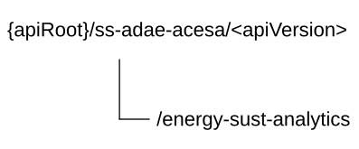

# 7.10.17 SS_ADAE_AIMLEClientEnergySustainabilityAnalytics API

7.10.17.1 Introduction

The SS_ADAE_AIMLE_Client_Energy_Sustainability_Analytics service (as specified in 3GPP°TS°23.436°\[38\]) shall use the SS_ADAE_AIMLEClientEnergySustainabilityAnalytics API.

The API URI of the SS_ADAE_AIMLEClientEnergySustainabilityAnalytics API shall be:

**{apiRoot}/\<apiName\>/\<apiVersion\>**

The request URIs used in HTTP requests shall have the Resource URI structure defined in clause 6.5, i.e.:

**{apiRoot}/\<apiName\>/\<apiVersion\>/\<apiSpecificSuffixes\>**

with the following components:

> \- The {apiRoot} shall be set as described in clause 6.5.
>
> \- The \<apiName\> shall be "ss-adae-acesa".
>
> \- The \<apiVersion\> shall be "v1".
>
> \- The \<apiSpecificSuffixes\> shall be set as described in clause 7.10.17.3.
>
> NOTE: When 3GPP TS 29.122 \[3\] is referenced for the common protocol and interface aspects for API definition in the clauses under clause 7.10.17, the service producer (e.g. ADAE Server) takes the role of the SCEF and the service consumer (i.e. ADAE service consumer, e.g. VAL server) takes the role of the SCS/AS.

7.10.17.2 Usage of HTTP and common API related aspects

The provisions of clause 6.3 shall apply for the SS_ADAE_AIMLEClientEnergySustainabilityAnalytics API.

7.10.17.3 Resources

7.10.17.3.1 Overview

This clause describes the structure for the Resource URIs and the resources and methods used for the service.

Figure 7.10.17.3.1-1 depicts the resource URIs structure for the SS_ADAE_AIMLEClientEnergySustainabilityAnalytics API.

**Figure 7.10.17.3.1-1: Resource URI structure of the SS_ADAE_AIMLEClientEnergySustainabilityAnalytics API**

Table 7.10.17.3.1-1 provides an overview of the resources and applicable HTTP methods.

**Table 7.10.17.3.1-1: Resources and methods overview**

| **Resource purpose/name**                         | **Resource URI (relative path after API URI)** | **HTTP method or custom operation** | **Description (service operation)**                       |
|---------------------------------------------------|------------------------------------------------|-------------------------------------|-----------------------------------------------------------|
| ADAE AIMLE Client Energy Sustainability Analytics | /energy-sust-analytics                         | GET                                 | Request the AIMLE Client Energy Sustainability Analytics. |

7.10.17.3.2 Resource: AIMLE Client Energy Sustainability Analytics

7.10.17.3.2.1 Description

The resource represents the AIMLE Client Energy Sustainability Analytics.

7.10.17.3.2.2 Resource Definition

Resource URI: **{apiRoot}/ss-adae-acesa/\<apiVersion\>/energy-sust-analytics**

This resource shall support the resource URI variables defined in the table 7.10.17.3.2.2-1.

**Table 7.10.17.3.2.2-1: Resource URI variables for this resource**

| **Name** | **Data Type** | **Definition**        |
|----------|---------------|-----------------------|
| apiRoot  | string        | See clause 7.10.17.1. |

7.10.17.3.2.3 Resource Standard Methods

7.10.17.3.2.3.1 GET

This method shall support the URI query parameters specified in table 7.10.17.3.2.3.1-1.

**Table 7.10.17.3.2.3.1-1: URI query parameters supported by the GET method on this resource**

<table>
<colgroup>
<col style="width: 17%" />
<col style="width: 24%" />
<col style="width: 5%" />
<col style="width: 11%" />
<col style="width: 40%" />
</colgroup>
<thead>
<tr class="header">
<th><strong>Name</strong></th>
<th><strong>Data type</strong></th>
<th><strong>P</strong></th>
<th><strong>Cardinality</strong></th>
<th><strong>Description</strong></th>
</tr>
</thead>
<tbody>
<tr class="odd">
<td>filt-criteria</td>
<td>AimleClientEnergySustReq</td>
<td>M</td>
<td>1</td>
<td>Represents the filtering criteria for AIMLE Client Energy Sustainability Analytics.</td>
</tr>
<tr class="even">
<td>supported-features</td>
<td>SupportedFeatures</td>
<td>C</td>
<td>0..1</td>
<td>
Contains supported features information, used to negotiate the applicability of optional features as defined in clause 7.10.17.8.

This query parameter shall be present only if feature negotiation needs to take place.
</td>
</tr>
</tbody>
</table>

This method shall support the request data structures specified in table 7.10.17.3.2.3.1-2 and the response data structures and response codes specified in table 7.10.17.3.2.3.1-3.

**Table 7.10.17.3.2.3.1-2: Data structures supported by the GET Request Body on this resource**

| **Data type** | **P** | **Cardinality** | **Description** |
|---------------|-------|-----------------|-----------------|
| n/a           |       |                 |                 |

**Table 7.10.17.3.2.3.1-3: Data structures supported by the GET Response Body on this resource**

<table>
<colgroup>
<col style="width: 25%" />
<col style="width: 3%" />
<col style="width: 11%" />
<col style="width: 10%" />
<col style="width: 48%" />
</colgroup>
<thead>
<tr class="header">
<th><strong>Data type</strong></th>
<th><strong>P</strong></th>
<th><strong>Cardinality</strong></th>
<th>
<strong>Response</strong>

<strong>codes</strong>
</th>
<th><strong>Description</strong></th>
</tr>
</thead>
<tbody>
<tr class="odd">
<td>AimleClientEnergySustResp</td>
<td>M</td>
<td>1</td>
<td>200 OK</td>
<td>Successful case. The response body contains AIMLE Client Energy Sustainability Analytics.</td>
</tr>
<tr class="even">
<td>n/a</td>
<td></td>
<td></td>
<td>307 Temporary Redirect</td>
<td>
Temporary redirection.

The response shall include a Location header field containing an alternative target URI of the resource located in an alternative ADAE Server.

Redirection handling is described in clause 5.2.10 of 3GPP TS 29.122 [3].
</td>
</tr>
<tr class="odd">
<td>n/a</td>
<td></td>
<td></td>
<td>308 Permanent Redirect</td>
<td>
Permanent redirection.

The response shall include a Location header field containing an alternative target URI of the resource located in an alternative ADAE Server.

Redirection handling is described in clause 5.2.10 of 3GPP TS 29.122 [3].
</td>
</tr>
<tr class="even">
<td colspan="5">NOTE: The mandatory HTTP error status codes for the HTTP GET method listed in table 5.2.6-1 of 3GPP TS 29.122 [3] shall also apply.</td>
</tr>
</tbody>
</table>

**Table 7.10.17.3.2.3.1-4: Headers supported by the 307 Response Code on this resource**

| **Name** | **Data type** | **P** | **Cardinality** | **Description**                                                                    |
|----------|---------------|-------|-----------------|------------------------------------------------------------------------------------|
| Location | string        | M     | 1               | Contains an alternative URI of the resource located in an alternative ADAE Server. |

**Table 7.10.17.3.2.3.1-5: Headers supported by the 308 Response Code on this resource**

| **Name** | **Data type** | **P** | **Cardinality** | **Description**                                                                    |
|----------|---------------|-------|-----------------|------------------------------------------------------------------------------------|
| Location | string        | M     | 1               | Contains an alternative URI of the resource located in an alternative ADAE Server. |

7.10.17.3.2.4 Resource Custom Operations

There are no resource custom operations defined for this resource in this release of the specification.

7.10.17.4 Custom Operations without associated resources

There are no custom operations without associated resources in the present release of the document.

7.10.17.5 Notifications

There are no notifications in the present release of the document.

7.10.17.6 Data Model

7.10.17.6.1 General

This clause specifies the application data model supported by the API.

Table 7.10.17.6.1-1 specifies the data types defined for the SS_ADAE_AIMLECilentEnergySustainablityAnalytics API.

**Table 7.10.17.6.1-1: SS_ADAE_AIMLECilentEnergySustainablityAnalytics API specific Data Types**

| **Data type**                 | **Section defined** | **Description**                                                       | **Applicability** |
|-------------------------------|---------------------|-----------------------------------------------------------------------|-------------------|
| AimleClientEnergySustReq      | 7.10.17.6.2.2       | Represents the AIMLE Client Energy Sustainability Analytics Request.  |                   |
| AimleClientEnergySustResp     | 7.10.17.6.2.3       | Represents the AIMLE Client Energy Sustainability Analytics Response. |                   |
| EnergySustainabilityAnalytics | 7.10.17.6.2.4       | Represents the AIMLE Client Energy Sustainability Analytics result.   |                   |

Table 7.10.17.6.1-2 specifies data types re-used by the SS_ADAE_AIMLECilentEnergySustainablityAnalytics API from other specifications, including a reference to their respective specifications, and when needed, a short description of their use within the SS_ADAE_AIMLECilentEnergySustainablityAnalytics API.

**Table 7.10.17.6.1-2: SS_ADAE_AIMLECilentEnergySustainablityAnalytics API Re-used Data Types**

| **Data type**         | **Reference**         | **Comments**                                                                                                  | **Applicability** |
|-----------------------|-----------------------|---------------------------------------------------------------------------------------------------------------|-------------------|
| AnalyticsType         | Clause 7.10.1.4.2.6   | Identifies type of the analytics.                                                                             |                   |
| LocationArea5G        | 3GPP TS 29.122 \[3\]  | Represents location information.                                                                              |                   |
| DataCollectionReq     | Clause 7.10.13.6.2.4  | Represents the data collection requirements.                                                                  |                   |
| ReportingRequirements | Clause 7.4.2.4.2.5    | Identifies the requirements for the energy analytics reporting.                                               |                   |
| SupportedFeatures     | 3GPP TS 29.571 \[21\] | Represents the list of supported feature(s) and used to negotiate the applicability of the optional features. |                   |
| Uinteger              | 3GPP TS 29.571 \[21\] | Used to represent integer attributes within measurement data.                                                 |                   |
| ValTargetUe           | Clause 7.3.1.4.2.3    | Represents a VAL User or a VAL UE.                                                                            |                   |
| ValUeAddrInfo         | Clause 7.4.1.4.2.30   | Represents VAL UE address information.                                                                        |                   |
| UeMobility            | 3GPP TS 29.520 \[33\] | Represents the UE Mobility and route information.                                                             |                   |

7.10.17.6.2 Structured data types

7.10.17.6.2.1 Introduction

This clause defines the structures to be used in resource representations.

7.10.17.6.2.2 Type: AimleClientEnergySustReq

**Table 7.10.17.6.2.2-1: Definition of type AimleClientEnergySustReq**

<table>
<colgroup>
<col style="width: 16%" />
<col style="width: 14%" />
<col style="width: 4%" />
<col style="width: 11%" />
<col style="width: 38%" />
<col style="width: 13%" />
</colgroup>
<thead>
<tr class="header">
<th><strong>Attribute name</strong></th>
<th><strong>Data type</strong></th>
<th><strong>P</strong></th>
<th><strong>Cardinality</strong></th>
<th><strong>Description</strong></th>
<th><strong>Applicability</strong></th>
</tr>
</thead>
<tbody>
<tr class="odd">
<td>analyticsType</td>
<td>AnalyticsType</td>
<td>M</td>
<td>1</td>
<td>Represents the type of the analytics event.</td>
<td></td>
</tr>
<tr class="even">
<td>valUeIds</td>
<td>array(ValTargetUe)</td>
<td>C</td>
<td>1..N</td>
<td>A list of identities of one or more VAL UEs for which the analytics subscription applies. (NOTE)</td>
<td></td>
</tr>
<tr class="odd">
<td>valAddrInfos</td>
<td>array(ValUeAddrInfo)</td>
<td>C</td>
<td>1..N</td>
<td>Contains the VAL UE address(es). (NOTE)</td>
<td></td>
</tr>
<tr class="even">
<td>srvId</td>
<td>string</td>
<td>O</td>
<td>0..1</td>
<td>Represents the identifier of the VAL or AIMLE service for which the subscription applies</td>
<td></td>
</tr>
<tr class="odd">
<td>ueMobs</td>
<td>map(UeMobility)</td>
<td>O</td>
<td>1..N</td>
<td>
Contains the mobility and route information of the target VAL UE(s).

The key of the map shall be set to the value of the identifier of the VAL UE (among either the ones provided within the "valUeIds" attribute or the VAL UE address identified by the "valAddrInfos" attribute) to which the mobility and route information provided within the map value is related.
</td>
<td></td>
</tr>
<tr class="even">
<td>dataColReq</td>
<td>DataCollectionReq</td>
<td>O</td>
<td>0..1</td>
<td>Represents data collection requirements.</td>
<td></td>
</tr>
<tr class="odd">
<td>confLevel</td>
<td>Uinteger</td>
<td>C</td>
<td>0..1</td>
<td>
Indicates the preferred confidence level of the prediction.

This attribute shall be provided if the "analyticsType" attribute in the request is set to "PREDICTIVE".

Minimum = 0. Maximum = 100.
</td>
<td></td>
</tr>
<tr class="even">
<td>area</td>
<td>LocationArea5G</td>
<td>O</td>
<td>0..1</td>
<td>Represents the area of interest.</td>
<td></td>
</tr>
<tr class="odd">
<td>reportReqs</td>
<td>ReportingRequirements</td>
<td>O</td>
<td>0..1</td>
<td>Represents the reporting requirements.</td>
<td></td>
</tr>
<tr class="even">
<td colspan="6">NOTE: At least one of the attributes shall be present.</td>
</tr>
</tbody>
</table>

7.10.17.6.2.3 Type: AimleClientEnergySustResp

**Table 7.10.17.6.2.3-1: Definition of type AimleClientEnergySustResp**

<table>
<colgroup>
<col style="width: 16%" />
<col style="width: 14%" />
<col style="width: 4%" />
<col style="width: 11%" />
<col style="width: 38%" />
<col style="width: 13%" />
</colgroup>
<thead>
<tr class="header">
<th><strong>Attribute name</strong></th>
<th><strong>Data type</strong></th>
<th><strong>P</strong></th>
<th><strong>Cardinality</strong></th>
<th><strong>Description</strong></th>
<th><strong>Applicability</strong></th>
</tr>
</thead>
<tbody>
<tr class="odd">
<td>analyticsOutput</td>
<td>array(EnergySustainabilityAnalytics)</td>
<td>M</td>
<td>1..N</td>
<td>Contains the AIMLE Client Energy Sustainability Analytics data.</td>
<td></td>
</tr>
<tr class="even">
<td>valUeIds</td>
<td>array(ValTargetUe)</td>
<td>O</td>
<td>1..N</td>
<td>A list of identities of one or more VAL UEs for which the analytics subscription applies.</td>
<td></td>
</tr>
<tr class="odd">
<td>confLevel</td>
<td>Uinteger</td>
<td>O</td>
<td>0..1</td>
<td>
Indicates the achieved confidence level for prediction.

This attribute may be provided only if the "analyticsType" attribute in the request is set to "PREDICTIVE".

Minimum = 0. Maximum = 100.
</td>
<td></td>
</tr>
</tbody>
</table>

7.10.17.6.2.4 Type: EnergySustainabilityAnalytics

**Table 7.10.17.6.2.4-1: Definition of type EnergySustainabilityAnalytics**

<table>
<colgroup>
<col style="width: 16%" />
<col style="width: 14%" />
<col style="width: 4%" />
<col style="width: 11%" />
<col style="width: 38%" />
<col style="width: 13%" />
</colgroup>
<thead>
<tr class="header">
<th><strong>Attribute name</strong></th>
<th><strong>Data type</strong></th>
<th><strong>P</strong></th>
<th><strong>Cardinality</strong></th>
<th><strong>Description</strong></th>
<th><strong>Applicability</strong></th>
</tr>
</thead>
<tbody>
<tr class="odd">
<td>sustInd</td>
<td>boolean</td>
<td>O</td>
<td>0..1</td>
<td>
Indicates whether the energy consumption is sustainable for the service.

When present, it shall be set as follows:

- "true": sustainable.

- "false": not sustainable.

- Default value when omitted is "false".
</td>
<td></td>
</tr>
<tr class="even">
<td>reco</td>
<td>string</td>
<td>M</td>
<td>1</td>
<td>Indicates a recommendation on whether the AIMLE client is applicable or suitable for the AI/ML task</td>
<td></td>
</tr>
</tbody>
</table>

7.10.17.6.3 Simple data types and enumerations

7.10.17.6.3.1 Introduction

This clause defines simple data types and enumerations that can be referenced from data structures defined in the previous clauses.

7.10.17.6.3.2 Simple data types

none.

7.10.17.7 Error Handling

7.10.17.7.1 General

For the SS_ADAE_AIMLEClientEnergySustainabilityAnalytics API, error handling shall be supported as specified in clause 6.7.

In addition, the requirements in the following clauses are applicable for the SS_ADAE_AIMLEClientEnergySustainabilityAnalytics API.

7.10.17.7.2 Protocol Errors

No specific procedures for the SS_ADAE_AIMLEClientEnergySustainabilityAnalytics API are specified.

7.10.17.7.3 Application Errors

The application errors defined for SS_ADAE_AIMLEClientEnergySustainabilityAnalytics API are listed in table 7.10.17.7.3-1.

**Table 7.10.17.7.3-1: Application errors**

| **Application Error** | **HTTP status code** | **Description** | **Applicability** |
|-----------------------|----------------------|-----------------|-------------------|
|                       |                      |                 |                   |

7.10.17.8 Feature Negotiation

The optional features in table 7.10.17.8-1 are defined for the SS_ADAE_AIMLEClientEnergySustainabilityAnalytics API. They shall be negotiated using the extensibility mechanism defined in clause 6.8.

**Table 7.10.17.8-1: Supported Features**

| **Feature number** | **Feature Name** | **Description** |
|--------------------|------------------|-----------------|
|                    |                  |                 |

7.10.17.9 Security

The provisions of clause 9 shall apply for the SS_ADAE_AIMLEClientEnergySustainabilityAnalytics API.
