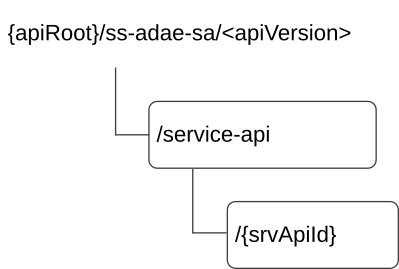

# 7.10.5 SS_ADAE_ServiceApiAnalytics API

## 7.10.5.1 API URI

The SS_ADAE_ServiceApiAnalytics service shall use the SS_ADAE_ServiceApiAnalytics API.

The request URIs used in HTTP requests from the VAL server towards the ADAE server shall have the Resource URI structure as defined in clause 6.5 with the following clarifications:

\- The \<apiName\> shall be "ss-adae-sa".

\- The \<apiVersion\> shall be "v1".

\- The \<apiSpecificSuffixes\> shall be set as described in clause 7.10.5.2.

## 7.10.5.2 Resources

### 7.10.5.2.1 Overview

This clause describes the structure for the Resource URIs and the resources and methods used for the service.

Figure 7.10.5.2.1-1 depicts the resource URIs structure for the SS_ADAE_ServiceApiAnalytics API.

Figure 7.10.5.2.1-1: Resource URI structure of the SS_ADAE_ServiceApiAnalytics API

Table 7.10.5.2.1-1 provides an overview of the resources and applicable HTTP methods.

Table 7.10.5.2.1-1: Resources and methods overview

| Resource name                             | Resource URI            | HTTP method | Description                                                                                |
|-------------------------------------------|-------------------------|-------------|--------------------------------------------------------------------------------------------|
| Service API event subscription            | /service-api            | POST        | Subscription to the event of the service API analytics.                                    |
| Individual service API event subscription | /service-api/{srvApiId} | GET         | Request the retrieval of an existing "Individual service API event subscription" resource. |
|                                           |                         | DELETE      | Request the deletion of an existing "Individual service API event subscription" resource.  |

### 7.10.5.2.2 Resource: Service API event subscription

#### 7.10.5.2.2.1 Description

Subscription to the event of the service API analytics.

#### 7.10.5.2.2.2 Resource Definition

Resource URI: **{apiRoot}/ss-adae-sa/\<apiVersion\>/service-api**

This resource shall support the resource URI variables defined in the table 7.10.5.2.2.2-1.

Table 7.10.5.2.2.2-1: Resource URI variables for this resource

| Name    | Data Type | Definition     |
|---------|-----------|----------------|
| apiRoot | string    | See clause 6.5 |

#### 7.10.5.2.2.3 Resource Standard Methods

##### 7.10.5.2.2.3.1 POST

This method to subscribe to the event of the service API analytics and shall support the URI query parameters specified in table 7.10.5.2.2.3.1-1.

Table 7.10.5.2.2.3.1-1: URI query parameters supported by the POST method on this resource

| Name | Data type | P   | Cardinality | Description |
|------|-----------|-----|-------------|-------------|
| n/a  |           |     |             |             |

This method shall support the request data structures specified in table 7.10.5.2.2.3.1-2 and the response data structures and response codes specified in table 7.10.5.2.2.3.1-3.

Table 7.10.5.2.2.3.1-2: Data structures supported by the POST Request Body on this resource

| Data type | P   | Cardinality | Description                                      |
|-----------|-----|-------------|--------------------------------------------------|
| SrvApiSub | M   | 1           | Subscription to the service API analytics event. |

Table 7.10.5.2.2.3.1-3: Data structures supported by the POST Response Body on this resource

<table>
<colgroup>
<col style="width: 16%" />
<col style="width: 4%" />
<col style="width: 12%" />
<col style="width: 14%" />
<col style="width: 51%" />
</colgroup>
<thead>
<tr class="header">
<th>Data type</th>
<th>P</th>
<th>Cardinality</th>
<th>
Response

codes
</th>
<th>Description</th>
</tr>
</thead>
<tbody>
<tr class="odd">
<td>SrvApiSub</td>
<td>M</td>
<td>1</td>
<td>201 Created</td>
<td>Subscription to the service API analytics is created.</td>
</tr>
<tr class="even">
<td colspan="5">NOTE: The mandatory HTTP error status codes for the POST method listed in table 5.2.6-1 of 3GPP TS 29.122 [3] also apply.</td>
</tr>
</tbody>
</table>

Table 7.10.5.2.2.3.1-4: Headers supported by the 201 Response Code on this resource

| Name     | Data type | P   | Cardinality | Description                                                                                                                            |
|----------|-----------|-----|-------------|----------------------------------------------------------------------------------------------------------------------------------------|
| Location | string    | M   | 1           | Contains the URI of the newly created resource, according to the structure: {apiRoot}/ss-adae-sa/\<apiVersion\>/service-api/{srvApiId} |

#### 7.10.5.2.2.4 Resource Custom Operations

None.

### 7.10.5.2.3 Resource: Individual service API event subscription

7.10.5.2.3.1 Description

The Individual service API event subscription resource represents an individual event subscription of a service consumer to the Service API analytics of the ADAE server.

#### 7.10.5.2.3.2 Resource Definition

Resource URI: **{apiRoot}/ss-adae-laa/\<apiVersion\>/service-api/{srvApiId}**

This resource shall support the resource URI variables defined in the table 7.10.5.2.3.2-1.

Table 7.10.5.2.3.2-1: Resource URI variables for this resource

| Name     | Data Type | Definition                                   |
|----------|-----------|----------------------------------------------|
| apiRoot  | string    | See clause 6.5                               |
| srvApiId | string    | Identifies an Individual Events Subscription |

#### 7.10.5.2.3.3 Resource Standard Methods

##### 7.10.5.2.3.3.1 GET

This operation retrieves an Individual service API event subscription resource. This method shall support the URI query parameters specified in table 7.10.5.2.3.3.1-1.

Table 7.10.5.2.3.3.1-1: URI query parameters supported by the GET method on this resource

|      |           |     |             |             |
|------|-----------|-----|-------------|-------------|
| Name | Data type | P   | Cardinality | Description |
| n/a  |           |     |             |             |

This method shall support the request data structures specified in table 7.10.5.2.3.3.1-2 and the response data structures and response codes specified in table 7.10.5.2.3.3.1-3.

Table 7.10.5.2.3.3.1-2: Data structures supported by the GET Request Body on this resource

|           |     |             |             |
|-----------|-----|-------------|-------------|
| Data type | P   | Cardinality | Description |
| n/a       |     |             |             |

Table 7.10.5.2.3.3.1-3: Data structures supported by the GET Response Body on this resource

<table>
<colgroup>
<col style="width: 16%" />
<col style="width: 9%" />
<col style="width: 14%" />
<col style="width: 19%" />
<col style="width: 39%" />
</colgroup>
<tbody>
<tr class="odd">
<td>Data type</td>
<td>P</td>
<td>Cardinality</td>
<td>
Response

codes
</td>
<td>Description</td>
</tr>
<tr class="even">
<td>SrvApiSub</td>
<td>M</td>
<td>1</td>
<td>200 OK</td>
<td>The requested Individual service API event subscription is returned.</td>
</tr>
<tr class="odd">
<td>n/a</td>
<td></td>
<td></td>
<td>307 Temporary Redirect</td>
<td>
Temporary redirection. The response shall include a Location header field containing an alternative URI of the resource located in an alternative server.

Redirection handling is described in clause 5.2.10 of 3GPP TS 29.122 [3].
</td>
</tr>
<tr class="even">
<td>n/a</td>
<td></td>
<td></td>
<td>308 Permanent Redirect</td>
<td>
Permanent redirection. The response shall include a Location header field containing an alternative URI of the resource located in an alternative server.

Redirection handling is described in clause 5.2.10 of 3GPP TS 29.122 [3].
</td>
</tr>
<tr class="odd">
<td colspan="5">NOTE: The mandatory HTTP error status codes for the GET method listed in table 5.2.6-1 of 3GPP TS 29.122 [3] also apply.</td>
</tr>
</tbody>
</table>

Table 7.10.5.2.3.3.1-4: Headers supported by the 307 Response Code on this resource

|          |           |     |             |                                                                      |
|----------|-----------|-----|-------------|----------------------------------------------------------------------|
| Name     | Data type | P   | Cardinality | Description                                                          |
| Location | string    | M   | 1           | An alternative URI of the resource located in an alternative server. |

Table 7.10.5.2.3.3.1-5: Headers supported by the 308 Response Code on this resource

|          |           |     |             |                                                                      |
|----------|-----------|-----|-------------|----------------------------------------------------------------------|
| Name     | Data type | P   | Cardinality | Description                                                          |
| Location | string    | M   | 1           | An alternative URI of the resource located in an alternative server. |

##### 7.10.5.2.3.3.2 DELETE

This method shall support the URI query parameters specified in table 7.10.5.2.3.3.2-1.

Table 7.10.5.2.3.3.2-1: URI query parameters supported by the DELETE method on this resource

| Name | Data type | P   | Cardinality | Description |
|------|-----------|-----|-------------|-------------|
| n/a  |           |     |             |             |

This method shall support the request data structures specified in table 7.10.5.2.3.3.2-2 and the response data structures and response codes specified in table 7.10.5.2.3.3.2-3.

Table 7.10.5.2.3.3.2-2: Data structures supported by the DELETE Request Body on this resource

| Data type | P   | Cardinality | Description |
|-----------|-----|-------------|-------------|
| n/a       |     |             |             |

Table 7.10.5.2.3.3.2-3: Data structures supported by the DELETE Response Body on this resource

<table>
<colgroup>
<col style="width: 16%" />
<col style="width: 4%" />
<col style="width: 12%" />
<col style="width: 11%" />
<col style="width: 54%" />
</colgroup>
<thead>
<tr class="header">
<th>Data type</th>
<th>P</th>
<th>Cardinality</th>
<th>
Response

codes
</th>
<th>Description</th>
</tr>
</thead>
<tbody>
<tr class="odd">
<td>n/a</td>
<td></td>
<td></td>
<td>204 No Content</td>
<td>The individual subscription is deleted.</td>
</tr>
<tr class="even">
<td>n/a</td>
<td></td>
<td></td>
<td>307 Temporary Redirect</td>
<td>
Temporary redirection, during resource deletion. The response shall include a Location header field containing an alternative URI of the resource located in an alternative server.

Redirection handling is described in clause 5.2.10 of 3GPP TS 29.122 [3].
</td>
</tr>
<tr class="odd">
<td>n/a</td>
<td></td>
<td></td>
<td>308 Permanent Redirect</td>
<td>
Permanent redirection, during resource deletion. The response shall include a Location header field containing an alternative URI of the resource located in an alternative server.

Redirection handling is described in clause 5.2.10 of 3GPP TS 29.122 [3].
</td>
</tr>
<tr class="even">
<td colspan="5">NOTE: The mandatory HTTP error status codes for the DELETE method listed in table 5.2.6-1 of 3GPP TS 29.122 [3] also apply.</td>
</tr>
</tbody>
</table>

Table 7.10.5.2.3.3.2-4: Headers supported by the 307 Response Code on this resource

|          |           |     |             |                                                                      |
|----------|-----------|-----|-------------|----------------------------------------------------------------------|
| Name     | Data type | P   | Cardinality | Description                                                          |
| Location | string    | M   | 1           | An alternative URI of the resource located in an alternative server. |

Table 7.10.5.2.3.3.2-5: Headers supported by the 308 Response Code on this resource

|          |           |     |             |                                                                      |
|----------|-----------|-----|-------------|----------------------------------------------------------------------|
| Name     | Data type | P   | Cardinality | Description                                                          |
| Location | string    | M   | 1           | An alternative URI of the resource located in an alternative server. |

#### 7.10.5.2.3.4 Resource Custom Operations

None.

## 7.10.5.3 Notifications

### 7.10.5.3.1 General

Table 7.10.5.3.1-1: Notifications overview

<table>
<colgroup>
<col style="width: 33%" />
<col style="width: 27%" />
<col style="width: 17%" />
<col style="width: 22%" />
</colgroup>
<thead>
<tr class="header">
<th>Notification</th>
<th>Callback URI</th>
<th>HTTP method or custom operation</th>
<th>
Description

(service operation)
</th>
</tr>
</thead>
<tbody>
<tr class="odd">
<td>Service API event notification</td>
<td>{notifUri}</td>
<td>POST</td>
<td>Notification on the service API analytics</td>
</tr>
</tbody>
</table>

### 7.10.5.3.2 Service API event notification

#### 7.10.5.3.2.1 Description

Service API event notification is to notify on the event of the service API analytics.

#### 7.10.5.3.2.2 Notification definition

The POST method shall be used for the event notification and the callback URI shall be the one provided by the consumer during the subscription to the event.

Callback URI: **{notifUri}**

This method shall support the URI query parameters specified in table 7.10.5.3.2.2-1.

Table 7.10.5.3.2.2-1: URI query parameters supported by the POST method on this resource

| Name | Data type | P   | Cardinality | Description |
|------|-----------|-----|-------------|-------------|
| n/a  |           |     |             |             |

If the notification is on the service API analytics, this method shall support the request data structures specified in table 7.10.5.3.2.2-2 and the response data structures and response codes specified in table 7.10.5.3.2.2-3.

Table 7.10.5.3.2.2-2: Data structures supported by the POST Request Body on this resource

| Data type   | P   | Cardinality | Description                                            |
|-------------|-----|-------------|--------------------------------------------------------|
| SrvApiNotif | M   | 1           | Notification information of the service API analytics. |

Table 7.10.5.3.2.2-3: Data structures supported by the POST Response Body on this resource

<table>
<colgroup>
<col style="width: 20%" />
<col style="width: 4%" />
<col style="width: 12%" />
<col style="width: 16%" />
<col style="width: 46%" />
</colgroup>
<thead>
<tr class="header">
<th>Data type</th>
<th>P</th>
<th>Cardinality</th>
<th>Response codes</th>
<th>Description</th>
</tr>
</thead>
<tbody>
<tr class="odd">
<td>n/a</td>
<td></td>
<td></td>
<td>204 No Content</td>
<td>Notification for the service API analytics event is accepted.</td>
</tr>
<tr class="even">
<td>n/a</td>
<td></td>
<td></td>
<td>307 Temporary Redirect</td>
<td>
Temporary redirection, during notification.

The response shall include a Location header field containing an alternative URI representing the end point of an alternative notification destination where the notification should be sent.

Redirection handling is described in clause 5.2.10 of 3GPP TS 29.122 [3].
</td>
</tr>
<tr class="odd">
<td>n/a</td>
<td></td>
<td></td>
<td>308 Permanent Redirect</td>
<td>
Permanent redirection, during notification.

The response shall include a Location header field containing an alternative URI representing the end point of an alternative notification destination where the notification should be sent.

Redirection handling is described in clause 5.2.10 of 3GPP TS 29.122 [3].
</td>
</tr>
<tr class="even">
<td colspan="5">NOTE: The mandatory HTTP error status codes for the POST method listed in table 5.2.6-1 of 3GPP TS 29.122 [3] also apply.</td>
</tr>
</tbody>
</table>

Table 7.10.5.3.2.2-4: Headers supported by the 307 Response Code on this resource

|          |           |     |             |                                                                                                                                               |
|----------|-----------|-----|-------------|-----------------------------------------------------------------------------------------------------------------------------------------------|
| Name     | Data type | P   | Cardinality | Description                                                                                                                                   |
| Location | string    | M   | 1           | An alternative URI representing the end point of an alternative notification destination towards which the notification should be redirected. |

Table 7.10.5.3.2.2-5: Headers supported by the 308 Response Code on this resource

|          |           |     |             |                                                                                                                                               |
|----------|-----------|-----|-------------|-----------------------------------------------------------------------------------------------------------------------------------------------|
| Name     | Data type | P   | Cardinality | Description                                                                                                                                   |
| Location | string    | M   | 1           | An alternative URI representing the end point of an alternative notification destination towards which the notification should be redirected. |

## 7.10.5.4 Data Model

### 7.10.5.4.1 General

This clause specifies the application data model supported by the API. Data types listed in clause 6.2 apply to this API.

Table 7.10.5.4.1-1 specifies the data types defined specifically for the SS_ADAE_ServiceApiAnalytics API service.

Table 7.10.5.4.1-1: SS_ADAE_ServiceApiAnalytics API specific Data Types

| Data type   | Section defined | Description                                                  | Applicability |
|-------------|-----------------|--------------------------------------------------------------|---------------|
| SrvApiNotif | 7.10.5.4.2.3    | Notification information of the service API analytics event. |               |
| SrvApiSub   | 7.10.5.4.2.2    | Subscription to the service API analytics event.             |               |

Table 7.10.5.4.1-2 specifies data types re-used by the SS_ADAE_ServiceApiAnalytics API service:

Table 7.10.5.4.1-2: Re-used Data Types

<table>
<colgroup>
<col style="width: 19%" />
<col style="width: 19%" />
<col style="width: 42%" />
<col style="width: 18%" />
</colgroup>
<thead>
<tr class="header">
<th>Data type</th>
<th>Reference</th>
<th>Comments</th>
<th>Applicability</th>
</tr>
</thead>
<tbody>
<tr class="odd">
<td>AnalyticsType</td>
<td>Clause 7.10.1.4.2.6</td>
<td>Type of analytics for the event of the VAL application performance analytics.</td>
<td></td>
</tr>
<tr class="even">
<td>LocationArea5G</td>
<td>3GPP TS 29.122 [3]</td>
<td>Represents location information.</td>
<td></td>
</tr>
<tr class="odd">
<td>ReportingInformation</td>
<td>3GPP TS 29.523 [20]</td>
<td>
Used to indicate the reporting requirement, only the following information are applicable for SEAL:

- immRep

- notifMethod

- maxReportNbr

- monDur

- repPeriod
</td>
<td></td>
</tr>
<tr class="even">
<td>SupportedFeatures</td>
<td>3GPP TS 29.571 [21]</td>
<td>Represents the supported features.</td>
<td></td>
</tr>
<tr class="odd">
<td>TimeWindow</td>
<td>3GPP TS 29.122 [3]</td>
<td>Represents a time window.</td>
<td></td>
</tr>
<tr class="even">
<td>Uinteger</td>
<td>3GPP TS 29.571 [21]</td>
<td>Represents an unsigned integer.</td>
<td></td>
</tr>
<tr class="odd">
<td>Uri</td>
<td>3GPP TS 29.122 [3]</td>
<td>Represents a URI.</td>
<td></td>
</tr>
</tbody>
</table>

### 7.10.5.4.2 Structured data types

#### 7.10.5.4.2.1 Introduction

This clause defines the data structures to be used in resource representations of this service.

#### 7.10.5.4.2.2 Type: SrvApiSub

Table 7.10.5.4.2.2-1: Definition of type SrvApiSub

<table>
<colgroup>
<col style="width: 16%" />
<col style="width: 14%" />
<col style="width: 4%" />
<col style="width: 11%" />
<col style="width: 38%" />
<col style="width: 13%" />
</colgroup>
<thead>
<tr class="header">
<th>Attribute name</th>
<th>Data type</th>
<th>P</th>
<th>Cardinality</th>
<th>Description</th>
<th>Applicability</th>
</tr>
</thead>
<tbody>
<tr class="odd">
<td>notifUri</td>
<td>Uri</td>
<td>M</td>
<td>1</td>
<td>Represents the notification URI.</td>
<td></td>
</tr>
<tr class="even">
<td>analyticsType</td>
<td>AnalyticsType</td>
<td>M</td>
<td>1</td>
<td>Identifies the type of the service API analytics.</td>
<td></td>
</tr>
<tr class="odd">
<td>eventCriteria</td>
<td>string</td>
<td>M</td>
<td>1</td>
<td>Criteria matching the service API analytics event.</td>
<td></td>
</tr>
<tr class="even">
<td>serviceApiName</td>
<td>string</td>
<td>C</td>
<td>0..1</td>
<td>The Service API name. (NOTE)</td>
<td></td>
</tr>
<tr class="odd">
<td>serviceApiType</td>
<td>string</td>
<td>C</td>
<td>0..1</td>
<td>The Service API type. (NOTE)</td>
<td></td>
</tr>
<tr class="even">
<td>area</td>
<td>LocationArea5G</td>
<td>O</td>
<td>0..1</td>
<td>The geographical or service area to which the service API analytics subscription is applied.</td>
<td></td>
</tr>
<tr class="odd">
<td>timeValidity</td>
<td>TimeWindow</td>
<td>O</td>
<td>0..1</td>
<td>The time validity of the service API analytics subscription.</td>
<td></td>
</tr>
<tr class="even">
<td>timeHorizon</td>
<td>TimeWindow</td>
<td>O</td>
<td>0..1</td>
<td>Time horizon for the predictions.</td>
<td></td>
</tr>
<tr class="odd">
<td>repReq</td>
<td>ReportingInformation</td>
<td>O</td>
<td>0..1</td>
<td>Represents the reporting requirement of the service API analytics subscription.</td>
<td></td>
</tr>
<tr class="even">
<td>suppFeat</td>
<td>SupportedFeatures</td>
<td>C</td>
<td>0..1</td>
<td>
Contains the list of supported feature(s) among the ones defined in clause 7.10.5.6.

This attribute shall be present only when feature negotiation needs to take place.
</td>
<td></td>
</tr>
<tr class="odd">
<td colspan="6">NOTE: Only one of these attributes shall be provided.</td>
</tr>
</tbody>
</table>

#### 7.10.5.4.2.3 Type: SrvApiNotif

Table 7.10.5.4.2.3-1: Definition of type SrvApiNotif

<table style="width:100%;">
<colgroup>
<col style="width: 16%" />
<col style="width: 15%" />
<col style="width: 3%" />
<col style="width: 11%" />
<col style="width: 38%" />
<col style="width: 13%" />
</colgroup>
<thead>
<tr class="header">
<th>Attribute name</th>
<th>Data type</th>
<th>P</th>
<th>Cardinality</th>
<th>Description</th>
<th>Applicability</th>
</tr>
</thead>
<tbody>
<tr class="odd">
<td>requestorId</td>
<td>string</td>
<td>M</td>
<td>1</td>
<td>The identifier of the requestor of these analytics.</td>
<td></td>
</tr>
<tr class="even">
<td>output</td>
<td>string</td>
<td>M</td>
<td>1</td>
<td>
Service API analytics for prediction or statistics depending on the type.

(NOTE)
</td>
<td></td>
</tr>
<tr class="odd">
<td>area</td>
<td>LocationArea5G</td>
<td>O</td>
<td>0..1</td>
<td>The geographical or service area to which the service API analytics subscription is applied.</td>
<td></td>
</tr>
<tr class="even">
<td>confLevel</td>
<td>Uinteger</td>
<td>C</td>
<td>0..1</td>
<td>
Indicates the achieved confidence level in the case of prediction. This attribute shall be provided if the "analyticsType" is set to "PREDICTIVE".

Minimum = 0. Maximum = 100.
</td>
<td></td>
</tr>
<tr class="odd">
<td colspan="6">NOTE: The content of "output" attribute is not defined in this Release of the specification.</td>
</tr>
</tbody>
</table>

### 7.10.5.4.3 Simple data types and enumerations

#### 7.10.5.4.3.1 Introduction

This clause defines simple data types and enumerations that can be referenced from data structures defined in the previous clauses.

#### 7.10.5.4.3.2 Simple data types

None.

## 7.10.5.5 Error Handling

### 7.10.5.5.1 General

HTTP error handling shall be supported as specified in clause 6.7.

In addition, the requirements in the following clauses shall apply.

### 7.10.5.5.2 Protocol Errors

In this release of the specification, there are no additional protocol errors applicable for the SS_ADAE_ServiceApiAnalytics API.

### 7.10.5.5.3 Application Errors

The application errors defined for SS_ADAE_ServiceApiAnalytics API are listed in table 7.10.5.5.3-1.

Table 7.10.5.5.3-1: Application errors

| Application Error | HTTP status code | Description | Applicability |
|-------------------|------------------|-------------|---------------|
|                   |                  |             |               |

## 7.10.5.6 Feature Negotiation

General feature negotiation procedures are defined in clause 6.8. Table 7.10.5.6-1 lists the supported features for SS_ADAE_ServiceApiAnalytics API.

Table 7.10.5.6-1: Supported Features

| Feature number | Feature Name | Description |
|----------------|--------------|-------------|
|                |              |             |
