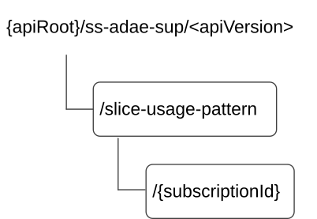

# 7.10.6 SS_ADAE_SliceUsagePatternAnalytics API

## 7.10.6.1 API URI

The SS_ADAE_SliceUsagePatternAnalytics service shall use the SS_ADAE_SliceUsagePatternAnalytics API.

The request URIs used in HTTP requests from the service consumer towards the ADAE server shall have the Resource URI structure as defined in clause 6.5 with the following clarifications:

\- The \<apiName\> shall be "ss-adae-sup".

\- The \<apiVersion\> shall be "v1".

\- The \<apiSpecificSuffixes\> shall be set as described in clause 7.10.6.2.

## 7.10.6.2 Resources

### 7.10.6.2.1 Overview

This clause describes the structure for the Resource URIs and the resources and methods used for the service.

Figure 7.10.6.2.1-1 depicts the resource URIs structure for the SS_ADAE_SliceUsagePatternAnalytics API.

Figure 7.10.6.2.1-1: Resource URI structure of the SS_ADAE_SliceUsagePatternAnalytics API

Table 7.10.6.2.1-1 provides an overview of the resources and applicable HTTP methods.

Table 7.10.6.2.1-1: Resources and methods overview

| Resource name                                     | Resource URI                          | HTTP method | Description                                                                                                                       |
|---------------------------------------------------|---------------------------------------|-------------|-----------------------------------------------------------------------------------------------------------------------------------|
| Slice usage pattern event subscription            | /slice-usage-pattern                  | POST        | Subscriptions to the event of the slice usage pattern analytics                                                                   |
| Individual slice usage pattern event subscription | /slice-usage-pattern/{subscriptionId} | GET         | Request the retrieval of an existing "Individual slice usage pattern event subscription" resource identified by {subscriptionId}. |
|                                                   |                                       | DELETE      | Request the deletion of an existing "Individual slice usage pattern event subscription" resource identified by {subscriptionId}.  |

### 7.10.6.2.2 Resource: Slice usage pattern event subscriptions

#### 7.10.6.2.2.1 Description

Slice usage pattern event subscriptions to the event of the slice usage pattern analytics.

#### 7.10.6.2.2.2 Resource Definition

Resource URI: **{apiRoot}/ss-adae-sup/\<apiVersion\>/slice-usage-pattern**

This resource shall support the resource URI variables defined in the table 7.10.6.2.2.2-1.

Table 7.10.6.2.2.2-1: Resource URI variables for this resource

| Name    | Data Type | Definition     |
|---------|-----------|----------------|
| apiRoot | string    | See clause 6.5 |

#### 7.10.6.2.2.3 Resource Standard Methods

##### 7.10.6.2.2.3.1 POST

This method is used to subscribe to the event of the slice usage pattern analytics and shall support the URI query parameters specified in table 7.10.6.2.2.3.1-1.

Table 7.10.6.2.2.3.1-1: URI query parameters supported by the POST method on this resource

| Name | Data type | P   | Cardinality | Description |
|------|-----------|-----|-------------|-------------|
| n/a  |           |     |             |             |

This method shall support the request data structures specified in table 7.10.6.2.2.3.1-2 and the response data structures and response codes specified in table 7.10.6.2.2.3.1-3.

Table 7.10.6.2.2.3.1-2: Data structures supported by the POST Request Body on this resource

| Data type | P   | Cardinality | Description                                              |
|-----------|-----|-------------|----------------------------------------------------------|
| SUPSub    | M   | 1           | Subscription to the slice usage pattern analytics event. |

Table 7.10.6.2.2.3.1-3: Data structures supported by the POST Response Body on this resource

<table>
<colgroup>
<col style="width: 16%" />
<col style="width: 4%" />
<col style="width: 12%" />
<col style="width: 14%" />
<col style="width: 51%" />
</colgroup>
<thead>
<tr class="header">
<th>Data type</th>
<th>P</th>
<th>Cardinality</th>
<th>
Response

codes
</th>
<th>Description</th>
</tr>
</thead>
<tbody>
<tr class="odd">
<td>SUPSub</td>
<td>M</td>
<td>1</td>
<td>201 Created</td>
<td>Subscription to the slice usage pattern analytics is created.</td>
</tr>
<tr class="even">
<td colspan="5">NOTE: The mandatory HTTP error status codes for the POST method listed in table 5.2.6-1 of 3GPP TS 29.122 [3] also apply.</td>
</tr>
</tbody>
</table>

Table 7.10.6.2.2.3.1-4: Headers supported by the 201 Response Code on this resource

| Name     | Data type | P   | Cardinality | Description                                                                                                                                           |
|----------|-----------|-----|-------------|-------------------------------------------------------------------------------------------------------------------------------------------------------|
| Location | string    | M   | 1           | Contains the URI of the newly created resource, according to the structure: {apiRoot}/ss-adae-sup/\<apiVersion\>/slice-usage-pattern/{subscriptionId} |

#### 7.10.6.2.2.4 Resource Custom Operations

None.

### 7.10.6.2.3 Resource: Individual slice usage pattern event subscription

#### 7.10.6.2.3.1 Description

The Individual Slice usage pattern event subscription resource represents an individual event subscription of a service consumer to the slice usage pattern analytics of the ADAE server.

#### 7.10.6.2.3.2 Resource Definition

Resource URI: **{apiRoot}/ss-adae-sup/\<apiVersion\>/slice-usage-pattern/{subscriptionId}**

This resource shall support the resource URI variables defined in the table 7.10.6.2.3.2-1.

Table 7.10.6.2.3.2-1: Resource URI variables for this resource

| Name           | Data Type | Definition                                   |
|----------------|-----------|----------------------------------------------|
| apiRoot        | string    | See clause 6.5                               |
| subscriptionId | string    | Identifies an Individual Events Subscription |

#### 7.10.6.2.3.3 Resource Standard Methods

##### 7.10.6.2.3.3.1 GET

This operation retrieves an individual slice usage pattern event subscription resource. This method shall support the URI query parameters specified in table 7.10.6.2.3.3.1-1.

Table 7.10.6.2.3.3.1-1: URI query parameters supported by the GET method on this resource

|      |           |     |             |             |
|------|-----------|-----|-------------|-------------|
| Name | Data type | P   | Cardinality | Description |
| n/a  |           |     |             |             |

This method shall support the request data structures specified in table 7.10.6.2.3.3.1-2 and the response data structures and response codes specified in table 7.10.6.2.3.3.1-3.

Table 7.10.6.2.3.3.1-2: Data structures supported by the GET Request Body on this resource

|           |     |             |             |
|-----------|-----|-------------|-------------|
| Data type | P   | Cardinality | Description |
| n/a       |     |             |             |

Table 7.10.6.2.3.3.1-3: Data structures supported by the GET Response Body on this resource

<table>
<colgroup>
<col style="width: 16%" />
<col style="width: 9%" />
<col style="width: 14%" />
<col style="width: 19%" />
<col style="width: 39%" />
</colgroup>
<tbody>
<tr class="odd">
<td>Data type</td>
<td>P</td>
<td>Cardinality</td>
<td>
Response

codes
</td>
<td>Description</td>
</tr>
<tr class="even">
<td>SUPSub</td>
<td>M</td>
<td>1</td>
<td>200 OK</td>
<td>The requested individual slice usage pattern subscription is returned.</td>
</tr>
<tr class="odd">
<td>n/a</td>
<td></td>
<td></td>
<td>307 Temporary Redirect</td>
<td>
Temporary redirection. The response shall include a Location header field containing an alternative URI of the resource located in an alternative server.

Redirection handling is described in clause 5.2.10 of 3GPP TS 29.122 [3].
</td>
</tr>
<tr class="even">
<td>n/a</td>
<td></td>
<td></td>
<td>308 Permanent Redirect</td>
<td>
Permanent redirection. The response shall include a Location header field containing an alternative URI of the resource located in an alternative server.

Redirection handling is described in clause 5.2.10 of 3GPP TS 29.122 [3].
</td>
</tr>
<tr class="odd">
<td colspan="5">NOTE: The mandatory HTTP error status codes for the GET method listed in table 5.2.6-1 of 3GPP TS 29.122 [3] also apply.</td>
</tr>
</tbody>
</table>

Table 7.10.6.2.3.3.1-4: Headers supported by the 307 Response Code on this resource

|          |           |     |             |                                                                      |
|----------|-----------|-----|-------------|----------------------------------------------------------------------|
| Name     | Data type | P   | Cardinality | Description                                                          |
| Location | string    | M   | 1           | An alternative URI of the resource located in an alternative server. |

Table 7.10.6.2.3.3.1-5: Headers supported by the 308 Response Code on this resource

|          |           |     |             |                                                                      |
|----------|-----------|-----|-------------|----------------------------------------------------------------------|
| Name     | Data type | P   | Cardinality | Description                                                          |
| Location | string    | M   | 1           | An alternative URI of the resource located in an alternative server. |

##### 7.10.6.2.3.3.2 DELETE

This method shall support the URI query parameters specified in table 7.10.6.2.3.3.2-1.

Table 7.10.6.2.3.3.2-1: URI query parameters supported by the DELETE method on this resource

| Name | Data type | P   | Cardinality | Description |
|------|-----------|-----|-------------|-------------|
| n/a  |           |     |             |             |

This method shall support the request data structures specified in table 7.10.6.2.3.3.2-2 and the response data structures and response codes specified in table 7.10.6.2.3.3.2-3.

Table 7.10.6.2.3.3.2-2: Data structures supported by the DELETE Request Body on this resource

| Data type | P   | Cardinality | Description |
|-----------|-----|-------------|-------------|
| n/a       |     |             |             |

Table 7.10.6.2.3.3.2-3: Data structures supported by the DELETE Response Body on this resource

<table>
<colgroup>
<col style="width: 16%" />
<col style="width: 4%" />
<col style="width: 12%" />
<col style="width: 11%" />
<col style="width: 54%" />
</colgroup>
<thead>
<tr class="header">
<th>Data type</th>
<th>P</th>
<th>Cardinality</th>
<th>
Response

codes
</th>
<th>Description</th>
</tr>
</thead>
<tbody>
<tr class="odd">
<td>n/a</td>
<td></td>
<td></td>
<td>204 No Content</td>
<td>The individual subscription is deleted.</td>
</tr>
<tr class="even">
<td>n/a</td>
<td></td>
<td></td>
<td>307 Temporary Redirect</td>
<td>
Temporary redirection, during resource deletion. The response shall include a Location header field containing an alternative URI of the resource located in an alternative server.

Redirection handling is described in clause 5.2.10 of 3GPP TS 29.122 [3].
</td>
</tr>
<tr class="odd">
<td>n/a</td>
<td></td>
<td></td>
<td>308 Permanent Redirect</td>
<td>
Permanent redirection, during resource deletion. The response shall include a Location header field containing an alternative URI of the resource located in an alternative server.

Redirection handling is described in clause 5.2.10 of 3GPP TS 29.122 [3].
</td>
</tr>
<tr class="even">
<td colspan="5">NOTE: The mandatory HTTP error status codes for the DELETE method listed in table 5.2.6-1 of 3GPP TS 29.122 [3] also apply.</td>
</tr>
</tbody>
</table>

Table 7.10.6.2.3.3.2-4: Headers supported by the 307 Response Code on this resource

|          |           |     |             |                                                                      |
|----------|-----------|-----|-------------|----------------------------------------------------------------------|
| Name     | Data type | P   | Cardinality | Description                                                          |
| Location | string    | M   | 1           | An alternative URI of the resource located in an alternative server. |

Table 7.10.6.2.3.3.2-5: Headers supported by the 308 Response Code on this resource

|          |           |     |             |                                                                      |
|----------|-----------|-----|-------------|----------------------------------------------------------------------|
| Name     | Data type | P   | Cardinality | Description                                                          |
| Location | string    | M   | 1           | An alternative URI of the resource located in an alternative server. |

#### 7.10.6.2.3.4 Resource Custom Operations

None.

## 7.10.6.3 Notifications

### 7.10.6.3.1 General

Table 7.10.6.3.1-1: Notifications overview

<table>
<colgroup>
<col style="width: 33%" />
<col style="width: 27%" />
<col style="width: 17%" />
<col style="width: 22%" />
</colgroup>
<thead>
<tr class="header">
<th>Notification</th>
<th>Callback URI</th>
<th>HTTP method or custom operation</th>
<th>
Description

(service operation)
</th>
</tr>
</thead>
<tbody>
<tr class="odd">
<td>Slice usage pattern event notification</td>
<td>{notifUri}</td>
<td>POST</td>
<td>Notification on the slice usage pattern analytics</td>
</tr>
</tbody>
</table>

### 7.10.6.3.2 Slice usage pattern event notification

#### 7.10.6.3.2.1 Description

Slice usage pattern event notification is to notify on the event of the slice usage pattern analytics.

#### 7.10.6.3.2.2 Notification definition

The POST method shall be used for the event notification and the callback URI shall be the one provided by the consumer during the subscription to the event.

Callback URI: **{notifUri}**

This method shall support the URI query parameters specified in table 7.10.6.3.2.2-1.

Table 7.10.6.3.2.2-1: URI query parameters supported by the POST method on this resource

| Name | Data type | P   | Cardinality | Description |
|------|-----------|-----|-------------|-------------|
| n/a  |           |     |             |             |

This method shall support the request data structures specified in table 7.10.6.3.2.2-2 and the response data structures and response codes specified in table 7.10.6.3.2.2-3.

Table 7.10.6.3.2.2-2: Data structures supported by the POST Request Body on this resource

| Data type | P   | Cardinality | Description                                                   |
|-----------|-----|-------------|---------------------------------------------------------------|
| SUPNotif  | M   | 1           | Notification information of the slice usage pattern analytics |

Table 7.10.6.3.2.2-3: Data structures supported by the POST Response Body on this resource

<table>
<colgroup>
<col style="width: 20%" />
<col style="width: 4%" />
<col style="width: 12%" />
<col style="width: 16%" />
<col style="width: 46%" />
</colgroup>
<thead>
<tr class="header">
<th>Data type</th>
<th>P</th>
<th>Cardinality</th>
<th>Response codes</th>
<th>Description</th>
</tr>
</thead>
<tbody>
<tr class="odd">
<td>n/a</td>
<td></td>
<td></td>
<td>204 No Content</td>
<td>Notification for the slice usage pattern analytics event is accepted.</td>
</tr>
<tr class="even">
<td>n/a</td>
<td></td>
<td></td>
<td>307 Temporary Redirect</td>
<td>
Temporary redirection, during notification. The response shall include a Location header field containing an alternative URI representing the end point of an alternative notification destination where the notification should be sent.

Redirection handling is described in clause 5.2.10 of 3GPP TS 29.122 [3].
</td>
</tr>
<tr class="odd">
<td>n/a</td>
<td></td>
<td></td>
<td>308 Permanent Redirect</td>
<td>
Permanent redirection, during notification. The response shall include a Location header field containing an alternative URI representing the end point of an alternative notification destination where the notification should be sent.

Redirection handling is described in clause 5.2.10 of 3GPP TS 29.122 [3].
</td>
</tr>
<tr class="even">
<td colspan="5">NOTE: The mandatory HTTP error status codes for the POST method listed in table 5.2.6-1 of 3GPP TS 29.122 [3] also apply.</td>
</tr>
</tbody>
</table>

Table 7.10.6.3.2.2-4: Headers supported by the 307 Response Code on this resource

|          |           |     |             |                                                                                                                                               |
|----------|-----------|-----|-------------|-----------------------------------------------------------------------------------------------------------------------------------------------|
| Name     | Data type | P   | Cardinality | Description                                                                                                                                   |
| Location | string    | M   | 1           | An alternative URI representing the end point of an alternative notification destination towards which the notification should be redirected. |

Table 7.10.6.3.2.2-5: Headers supported by the 308 Response Code on this resource

|          |           |     |             |                                                                                                                                               |
|----------|-----------|-----|-------------|-----------------------------------------------------------------------------------------------------------------------------------------------|
| Name     | Data type | P   | Cardinality | Description                                                                                                                                   |
| Location | string    | M   | 1           | An alternative URI representing the end point of an alternative notification destination towards which the notification should be redirected. |

## 7.10.6.4 Data Model

### 7.10.6.4.1 General

This clause specifies the application data model supported by the API. Data types listed in clause 6.2 apply to this API.

Table 7.10.6.4.1-1 specifies the data types defined specifically for the SS_ADAE_SliceUsagePatternAnalytics API service.

Table 7.10.6.4.1-1: SS_ADAE_SliceUsagePatternAnalytics API specific Data Types

| Data type | Section defined | Description                                                          | Applicability |
|-----------|-----------------|----------------------------------------------------------------------|---------------|
| SUPNotif  | 7.10.6.4.2.3    | Notification information of the slice usage pattern analytics event. |               |
| SUPSub    | 7.10.6.4.2.2    | Subscription to the slice usage pattern analytics event.             |               |

Table 7.10.6.4.1-2 specifies data types re-used by the SS_ADAE_SliceUsagePatternAnalytics API service:

Table 7.10.6.4.1-2: Re-used Data Types

<table>
<colgroup>
<col style="width: 20%" />
<col style="width: 20%" />
<col style="width: 39%" />
<col style="width: 18%" />
</colgroup>
<thead>
<tr class="header">
<th>Data type</th>
<th>Reference</th>
<th>Comments</th>
<th>Applicability</th>
</tr>
</thead>
<tbody>
<tr class="odd">
<td>AnalyticsType</td>
<td>Clause 7.10.1.4.2.6</td>
<td>Represents the type of analytics.</td>
<td></td>
</tr>
<tr class="even">
<td>Dnn</td>
<td>3GPP TS 29.571 [21]</td>
<td>Identifies a DNN.</td>
<td></td>
</tr>
<tr class="odd">
<td>LocationArea5G</td>
<td>3GPP TS 29.122 [3]</td>
<td>Represents location information.</td>
<td></td>
</tr>
<tr class="even">
<td>ReportingInformation</td>
<td>3GPP TS 29.523 [20]</td>
<td>
Used to indicate the reporting requirement, only the following information are applicable for SEAL:

- immRep

- notifMethod

- maxReportNbr

- monDur

- repPeriod
</td>
<td></td>
</tr>
<tr class="odd">
<td>Snssai</td>
<td>3GPP TS 29.571 [21]</td>
<td>Identifies the S-NSSAI.</td>
<td></td>
</tr>
<tr class="even">
<td>SupportedFeatures</td>
<td>3GPP TS 29.571 [21]</td>
<td>Supported features.</td>
<td></td>
</tr>
<tr class="odd">
<td>TimeWindow</td>
<td>3GPP TS 29.122 [3]</td>
<td>A time window.</td>
<td></td>
</tr>
<tr class="even">
<td>Uinteger</td>
<td>3GPP TS 29.571 [21]</td>
<td>Unsigned integer.</td>
<td></td>
</tr>
<tr class="odd">
<td>Uri</td>
<td>3GPP TS 29.122 [3]</td>
<td>Represents a URI.</td>
<td></td>
</tr>
<tr class="even">
<td>ValTargetUe</td>
<td>Clause 7.3.1.4.2.3</td>
<td>Indicate either VAL User ID or VAL UE ID.</td>
<td></td>
</tr>
</tbody>
</table>

### 7.10.6.4.2 Structured data types

#### 7.10.6.4.2.1 Introduction

This clause defines the structures to be used in resource representations.

#### 7.10.6.4.2.2 Type: SUPSub

Table 7.10.6.4.2.2-1: Definition of type SUPSub

<table style="width:100%;">
<colgroup>
<col style="width: 16%" />
<col style="width: 15%" />
<col style="width: 3%" />
<col style="width: 11%" />
<col style="width: 38%" />
<col style="width: 13%" />
</colgroup>
<thead>
<tr class="header">
<th>Attribute name</th>
<th>Data type</th>
<th>P</th>
<th>Cardinality</th>
<th>Description</th>
<th>Applicability</th>
</tr>
</thead>
<tbody>
<tr class="odd">
<td>notifUri</td>
<td>Uri</td>
<td>M</td>
<td>1</td>
<td>Represents the notification URI.</td>
<td></td>
</tr>
<tr class="even">
<td>analyticsType</td>
<td>AnalyticsType</td>
<td>M</td>
<td>1</td>
<td>Identifies the type of the slice usage pattern analytics. Only the "mode" attribute is applicable.</td>
<td></td>
</tr>
<tr class="odd">
<td>sliceId</td>
<td>Snssai</td>
<td>M</td>
<td>1</td>
<td>Identity of the network slice.</td>
<td></td>
</tr>
<tr class="even">
<td>dnn</td>
<td>Dnn</td>
<td>O</td>
<td>0..1</td>
<td>Associated target DNN.</td>
<td></td>
</tr>
<tr class="odd">
<td>valUeIds</td>
<td>array(ValTargetUe)</td>
<td>O</td>
<td>1..N</td>
<td>A list of identities of one or more VAL UEs, whose slice usage patterns are subscribed to.</td>
<td></td>
</tr>
<tr class="even">
<td>valServerId</td>
<td>string</td>
<td>O</td>
<td>0..1</td>
<td>If the consumer is different from the VAL server, this identifier represents the VAL server, to which the slice usage pattern analytics subscription is applied.</td>
<td></td>
</tr>
<tr class="odd">
<td>confLevel</td>
<td>Uinteger</td>
<td>O</td>
<td>0..1</td>
<td>
Indicates the preferred confidence level of the prediction.

Minimum = 0. Maximum = 100.
</td>
<td></td>
</tr>
<tr class="even">
<td>area</td>
<td>LocationArea5G</td>
<td>O</td>
<td>0..1</td>
<td>The geographical or service area, to which the slice usage pattern analytics subscription is applied.</td>
<td></td>
</tr>
<tr class="odd">
<td>timeValidity</td>
<td>TimeWindow</td>
<td>O</td>
<td>0..1</td>
<td>The time validity of the subscription.</td>
<td></td>
</tr>
<tr class="even">
<td>historicTimeInt</td>
<td>TimeWindow</td>
<td>C</td>
<td>0..1</td>
<td>The historic time interval as the start and the end time, to which the slice usage pattern analytics subscription is applied. This attribute shall be provided in case immediate reporting of statistics is requested.</td>
<td></td>
</tr>
<tr class="odd">
<td>repReq</td>
<td>ReportingInformation</td>
<td>O</td>
<td>0..1</td>
<td>Represents the reporting requirement of the slice usage pattern analytics subscription.</td>
<td></td>
</tr>
<tr class="even">
<td>immNotif</td>
<td>SUPNotif</td>
<td>C</td>
<td>0..1</td>
<td>Immediate notifications. It shall only be provided in the subscription request, if immediate reporting is requested and the outputs are available.</td>
<td></td>
</tr>
<tr class="odd">
<td>dataId</td>
<td>string</td>
<td>C</td>
<td>0..1</td>
<td>Identity of the slice usage statistics data which is to be collected. It shall be provided if immediate reporting of statistics is requested and may not be provided otherwise.</td>
<td></td>
</tr>
<tr class="even">
<td>valServiceId</td>
<td>string</td>
<td>C</td>
<td>0..1</td>
<td>The identifier of the VAL service, for which the request applies. It shall be provided if immediate reporting of statistics is requested and may not be provided otherwise.</td>
<td></td>
</tr>
<tr class="odd">
<td>suppFeat</td>
<td>SupportedFeatures</td>
<td>C</td>
<td>0..1</td>
<td>
Contains the list of supported feature(s) among the ones as defined in clause 7.10.6.6.

This attribute shall be present only when feature negotiation needs to take place.
</td>
<td></td>
</tr>
</tbody>
</table>

#### 7.10.6.4.2.3 Type: SUPNotif

Table 7.10.6.4.2.3-1: Definition of type SUPNotif

<table>
<colgroup>
<col style="width: 16%" />
<col style="width: 14%" />
<col style="width: 4%" />
<col style="width: 11%" />
<col style="width: 38%" />
<col style="width: 13%" />
</colgroup>
<thead>
<tr class="header">
<th>Attribute name</th>
<th>Data type</th>
<th>P</th>
<th>Cardinality</th>
<th>Description</th>
<th>Applicability</th>
</tr>
</thead>
<tbody>
<tr class="odd">
<td>output</td>
<td>string</td>
<td>M</td>
<td>1</td>
<td>
Slice usage pattern analytics.

The format is up to the implementation.
</td>
<td></td>
</tr>
<tr class="even">
<td>confLevel</td>
<td>Uinteger</td>
<td>C</td>
<td>0..1</td>
<td>
Indicates the achieved confidence level in the case of prediction. This attribute shall be provided if the "analyticsType" attribute in the subscription is set to "PREDICTIVE".

Minimum = 0. Maximum = 100.
</td>
<td></td>
</tr>
</tbody>
</table>

#### 7.10.6.4.2.4 Void

#### 7.10.6.4.2.5 Void

### 7.10.6.4.3 Simple data types and enumerations

#### 7.10.6.4.3.1 Introduction

This clause defines simple data types and enumerations that can be referenced from data structures defined in the previous clauses.

#### 7.10.6.4.3.2 Simple data types

None.

#### 7.10.6.4.3.3 Void

## 7.10.6.5 Error Handling

### 7.10.6.5.1 General

HTTP error handling shall be supported as specified in clause 6.7.

In addition, the requirements in the following clauses shall apply.

### 7.10.6.5.2 Protocol Errors

In this release of the specification, there are no additional protocol errors applicable for the SS_ADAE_SliceUsagePatternAnalytics API.

### 7.10.6.5.3 Application Errors

The application errors defined for SS_ADAE_SliceUsagePatternAnalytics API are listed in table 7.10.6.5.3-1.

Table 7.10.6.5.3-1: Application errors

| Application Error | HTTP status code | Description | Applicability |
|-------------------|------------------|-------------|---------------|
|                   |                  |             |               |

## 7.10.6.6 Feature Negotiation

General feature negotiation procedures are defined in clause 6.8. Table 7.10.6.6-1 lists the supported features for SS_ADAE_SliceUsagePatternAnalytics API.

Table 7.10.6.6-1: Supported Features

| Feature number | Feature Name | Description |
|----------------|--------------|-------------|
|                |              |             |
