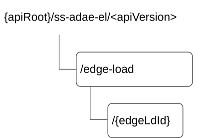

# 7.10.7.2 Resources

## 7.10.7.2.1 Overview

This clause describes the structure for the Resource URIs and the resources and methods used for the service.

Figure 7.10.7.2.1-1 depicts the resource URIs structure for the SS_ADAE_EdgeLoadAnalytics API.

Figure 7.10.7.2.1-1: Resource URI structure of the SS_ADAE_EdgeLoadAnalytics API

Table 7.10.7.2.1-1 provides an overview of the resources and applicable HTTP methods.

Table 7.10.7.2.1-1: Resources and methods overview

| Resource name                           | Resource URI          | HTTP method | Description                                                                                                                                                                                                     |
|-----------------------------------------|-----------------------|-------------|-----------------------------------------------------------------------------------------------------------------------------------------------------------------------------------------------------------------|
| Edge Load Event Subscription            | /edge-load            | POST        | Creates a new individual Event Subscription for edge load analytics.                                                                                                                                            |
| Individual Edge Load Event Subscription | /edge-load/{edgeLdId} | GET         | Retrieve an individual edge load analytics according to query parameter on the resource identified by {edgeLdId}. If there are no query parameter, fetch the whole edge load resource identified by {edgeLdId}. |
|                                         |                       | DELETE      | Deletes an individual Event Subscription identified by the {edgeLdId}.                                                                                                                                          |

## 7.10.7.2.2 Resource: Edge Load Event Subscription

### 7.10.7.2.2.1 Description

The edge load event subscription to the event of the edge load analytics.

### 7.10.7.2.2.2 Resource Definition

Resource URI: **{apiRoot}/ss-adae-el/\<apiVersion\>/edge-load**

This resource shall support the resource URI variables defined in the table 7.10.7.2.2.2-1.

Table 7.10.7.2.2.2-1: Resource URI variables for this resource

| Name    | Data Type | Definition      |
|---------|-----------|-----------------|
| apiRoot | string    | See clause 6.5. |

### 7.10.7.2.2.3 Resource Standard Methods

#### 7.10.7.2.2.3.1 POST

This method to subscribe to the event of the edge load analytics and shall support the URI query parameters specified in table 7.10.7.2.2.3.1-1.

Table 7.10.7.2.2.3.1-1: URI query parameters supported by the POST method on this resource

| Name | Data type | P   | Cardinality | Description |
|------|-----------|-----|-------------|-------------|
| n/a  |           |     |             |             |

This method shall support the request data structures specified in table 7.10.7.2.2.3.1-2 and the response data structures and response codes specified in table 7.10.7.2.2.3.1-3.

Table 7.10.7.2.2.3.1-2: Data structures supported by the POST Request Body on this resource

| Data type | P   | Cardinality | Description                                                                     |
|-----------|-----|-------------|---------------------------------------------------------------------------------|
| EdgeSub   | M   | 1           | Create a new individual Event Subscription to the event of edge load analytics. |

Table 7.10.7.2.2.3.1-3: Data structures supported by the POST Response Body on this resource

<table>
<colgroup>
<col style="width: 16%" />
<col style="width: 4%" />
<col style="width: 12%" />
<col style="width: 14%" />
<col style="width: 51%" />
</colgroup>
<thead>
<tr class="header">
<th>Data type</th>
<th>P</th>
<th>Cardinality</th>
<th>
Response

codes
</th>
<th>Description</th>
</tr>
</thead>
<tbody>
<tr class="odd">
<td>EdgeSub</td>
<td>M</td>
<td>1</td>
<td>201 Created</td>
<td>
Edge load Event Subscription resource created successfully.

The URI of the created resource shall be returned in the "Location" HTTP header.
</td>
</tr>
<tr class="even">
<td colspan="5">NOTE: The mandatory HTTP error status codes for the POST method listed in table 5.2.6-1 of 3GPP TS 29.122 [3] shall also apply.</td>
</tr>
</tbody>
</table>

Table 7.10.7.2.2.3.1-4: Headers supported by the 201 Response Code on this resource

| Name     | Data type | P   | Cardinality | Description                                                                                                                          |
|----------|-----------|-----|-------------|--------------------------------------------------------------------------------------------------------------------------------------|
| Location | string    | M   | 1           | Contains the URI of the newly created resource, according to the structure: {apiRoot}/ss-adae-el/\<apiVersion\>/edge-load/{edgeLdId} |

### 7.10.7.2.2.4 Resource Custom Operations

None.

## 7.10.7.2.3 Resource: Individual Edge Load Event Subscription

### 7.10.7.2.3.1 Description

The Individual Edge Load Event Subscription resource represents an individual event subscription of the edge load analytics.

### 7.10.7.2.3.2 Resource Definition

Resource URI: **{apiRoot}/ss-adae-el/\<apiVersion\>/edge-load/{edgeLdId}**

This resource shall support the resource URI variables defined in the table 7.10.7.2.3.2-1.

Table 7.10.7.2.3.2-1: Resource URI variables for this resource

| Name     | Data Type | Definition                                              |
|----------|-----------|---------------------------------------------------------|
| apiRoot  | string    | See clause 6.5.                                         |
| edgeLdId | string    | Identifies an Individual Edge Load Events Subscription. |

### 7.10.7.2.3.3 Resource Standard Methods

#### 7.10.7.2.3.3.1 GET

This operation reads the individual edge load subscription resource. This method shall support the URI query parameters specified in table 7.10.7.2.3.3.1-1.

Table 7.10.7.2.3.3.1-1: URI query parameters supported by the GET method on this resource

|      |           |     |             |             |
|------|-----------|-----|-------------|-------------|
| Name | Data type | P   | Cardinality | Description |
|      |           |     |             |             |

This method shall support the request data structures specified in table 7.10.7.2.3.3.1-2 and the response data structures and response codes specified in table 7.10.7.2.3.3.1-3.

Table 7.10.7.2.3.3.1-2: Data structures supported by the GET Request Body on this resource

|           |     |             |             |
|-----------|-----|-------------|-------------|
| Data type | P   | Cardinality | Description |
| n/a       |     |             |             |

Table 7.10.7.2.3.3.1-3: Data structures supported by the GET Response Body on this resource

<table>
<colgroup>
<col style="width: 16%" />
<col style="width: 9%" />
<col style="width: 14%" />
<col style="width: 19%" />
<col style="width: 39%" />
</colgroup>
<tbody>
<tr class="odd">
<td>Data type</td>
<td>P</td>
<td>Cardinality</td>
<td>
Response

codes
</td>
<td>Description</td>
</tr>
<tr class="even">
<td>EdgeSub</td>
<td>M</td>
<td>1</td>
<td>200 OK</td>
<td>The requested individual edge load subscription is returned.</td>
</tr>
<tr class="odd">
<td>n/a</td>
<td></td>
<td></td>
<td>307 Temporary Redirect</td>
<td>
Temporary redirection. The response shall include a Location header field containing an alternative URI of the resource located in an alternative ADAE server.

Redirection handling is described in clause 5.2.10 of 3GPP TS 29.122 [3].
</td>
</tr>
<tr class="even">
<td>n/a</td>
<td></td>
<td></td>
<td>308 Permanent Redirect</td>
<td>
Permanent redirection. The response shall include a Location header field containing an alternative URI of the resource located in an alternative ADAE server.

Redirection handling is described in clause 5.2.10 of 3GPP TS 29.122 [3].
</td>
</tr>
<tr class="odd">
<td colspan="5">NOTE: The mandatory HTTP error status codes for the GET method listed in table 5.2.6-1 of 3GPP TS 29.122 [3] shall also apply.</td>
</tr>
</tbody>
</table>

Table 7.10.7.2.3.3.1-4: Headers supported by the 307 Response Code on this resource

|          |           |     |             |                                                                           |
|----------|-----------|-----|-------------|---------------------------------------------------------------------------|
| Name     | Data type | P   | Cardinality | Description                                                               |
| Location | string    | M   | 1           | An alternative URI of the resource located in an alternative ADAE server. |

Table 7.10.7.2.3.3.1-5: Headers supported by the 308 Response Code on this resource

|          |           |     |             |                                                                           |
|----------|-----------|-----|-------------|---------------------------------------------------------------------------|
| Name     | Data type | P   | Cardinality | Description                                                               |
| Location | string    | M   | 1           | An alternative URI of the resource located in an alternative ADAE server. |

#### 7.10.7.2.3.3.2 DELETE

This method shall support the URI query parameters specified in table 7.10.7.2.3.3.2-1.

Table 7.10.7.2.3.3.2-1: URI query parameters supported by the DELETE method on this resource

| Name | Data type | P   | Cardinality | Description |
|------|-----------|-----|-------------|-------------|
| n/a  |           |     |             |             |

This method shall support the request data structures specified in table 7.10.7.2.3.3.2-2 and the response data structures and response codes specified in table 7.10.7.2.3.3.2-3.

Table 7.10.7.2.3.3.2-2: Data structures supported by the DELETE Request Body on this resource

| Data type | P   | Cardinality | Description |
|-----------|-----|-------------|-------------|
| n/a       |     |             |             |

Table 7.10.7.2.3.3.2-3: Data structures supported by the DELETE Response Body on this resource

<table>
<colgroup>
<col style="width: 16%" />
<col style="width: 4%" />
<col style="width: 12%" />
<col style="width: 11%" />
<col style="width: 54%" />
</colgroup>
<thead>
<tr class="header">
<th>Data type</th>
<th>P</th>
<th>Cardinality</th>
<th>
Response

codes
</th>
<th>Description</th>
</tr>
</thead>
<tbody>
<tr class="odd">
<td>n/a</td>
<td></td>
<td></td>
<td>204 No Content</td>
<td>The individual Edge Load Events Subscription matching the edgeLdId is deleted.</td>
</tr>
<tr class="even">
<td>n/a</td>
<td></td>
<td></td>
<td>307 Temporary Redirect</td>
<td>
Temporary redirection, during resource termination. The response shall include a Location header field containing an alternative URI of the resource located in an alternative ADAE server.

Redirection handling is described in clause 5.2.10 of 3GPP TS 29.122 [3].
</td>
</tr>
<tr class="odd">
<td>n/a</td>
<td></td>
<td></td>
<td>308 Permanent Redirect</td>
<td>
Permanent redirection, during resource termination. The response shall include a Location header field containing an alternative URI of the resource located in an alternative ADAE server.

Redirection handling is described in clause 5.2.10 of 3GPP TS 29.122 [3].
</td>
</tr>
<tr class="even">
<td colspan="5">NOTE: The mandatory HTTP error status codes for the DELETE method listed in table 5.2.6-1 of 3GPP TS 29.122 [3] also apply.</td>
</tr>
</tbody>
</table>

Table 7.10.7.2.3.3.2-4: Headers supported by the 307 Response Code on this resource

|          |           |     |             |                                                                           |
|----------|-----------|-----|-------------|---------------------------------------------------------------------------|
| Name     | Data type | P   | Cardinality | Description                                                               |
| Location | string    | M   | 1           | An alternative URI of the resource located in an alternative ADAE server. |

Table 7.10.7.2.3.3.2-5: Headers supported by the 308 Response Code on this resource

|          |           |     |             |                                                                           |
|----------|-----------|-----|-------------|---------------------------------------------------------------------------|
| Name     | Data type | P   | Cardinality | Description                                                               |
| Location | string    | M   | 1           | An alternative URI of the resource located in an alternative ADAE server. |

### 7.10.7.2.3.4 Resource Custom Operations

None.
