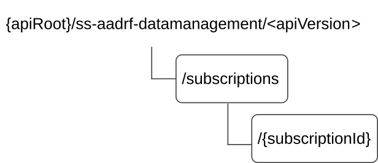

# 7.10.8.2 Resources

## 7.10.8.2.1 Overview

This clause describes the structure for the Resource URIs and the resources and methods used for the service.

Figure 7.10.8.2.1-1 depicts the resource URIs structure for the SS_AADRF_DataManagement API.

Figure 7.10.8.2.1-1: Resource URI structure of the SS_AADRF_DataManagement API

Table 7.10.8.2.1-1 provides an overview of the resources and applicable HTTP methods.

Table 7.10.8.2.1-1: Resources and methods overview

| Resource name                                  | Resource URI                    | HTTP method or custom operation | Description                                                                               |
|------------------------------------------------|---------------------------------|---------------------------------|-------------------------------------------------------------------------------------------|
| A-ADRF Data Management Subscriptions           | /subscriptions                  | POST                            | Creates a new Individual A-ADRF Data Management Subscription resource.                    |
| Individual A-ADRF Data Management Subscription | /subscriptions/{subscriptionId} | DELETE                          | Deletes an Individual A-ADRF Data Management Subscription identified by {subscriptionId}. |

## 7.10.8.2.2 Resource: A-ADRF Data Management Subscriptions

### 7.10.8.2.2.1 Description

The A-ADRF Data Management Subscriptions resource represents all the subscriptions stored at A-ADRF. The resource allows an NF service consumer to create a new Individual A-ADRF Data Management Subscription resource.

### 7.10.8.2.2.2 Resource Definition

Resource URI: **{apiRoot}/ss-aadrf-datamanagement/\<apiVersion\>/subscriptions**

This resource shall support the resource URI variables defined in the table 7.10.8.2.2.2-1.

Table 7.10.8.2.2.2-1: Resource URI variables for this resource

| Name    | Data Type | Definition      |
|---------|-----------|-----------------|
| apiRoot | string    | See clause 6.5. |

### 7.10.8.2.2.3 Resource Standard Methods

#### 7.10.8.2.2.3.1 POST

This method shall support the URI query parameters specified in table 7.10.8.2.2.3.1-1.

Table 7.10.8.2.2.3.1-1: URI query parameters supported by the POST method on this resource

|      |           |     |             |             |
|------|-----------|-----|-------------|-------------|
| Name | Data type | P   | Cardinality | Description |
| n/a  |           |     |             |             |

This method shall support the request data structures specified in table 7.10.8.2.2.3.1-2 and the response data structures and response codes specified in table 7.10.8.2.2.3.1-3.

Table 7.10.8.2.2.3.1-2: Data structures supported by the POST Request Body on this resource

|               |     |             |                                                                       |
|---------------|-----|-------------|-----------------------------------------------------------------------|
| Data type     | P   | Cardinality | Description                                                           |
| DataManageSub | M   | 1           | Create a new Individual A-ADRF Data Management Subscription resource. |

Table 7.10.8.2.2.3.1-3: Data structures supported by the POST Response Body on this resource

<table>
<colgroup>
<col style="width: 28%" />
<col style="width: 3%" />
<col style="width: 12%" />
<col style="width: 10%" />
<col style="width: 45%" />
</colgroup>
<tbody>
<tr class="odd">
<td>Data type</td>
<td>P</td>
<td>Cardinality</td>
<td>
Response

codes
</td>
<td>Description</td>
</tr>
<tr class="even">
<td>DataManageSub</td>
<td>M</td>
<td>1</td>
<td>201 Created</td>
<td>The creation of an Individual A-ADRF Data Management Subscription resource is confirmed and a representation of that resource is returned.</td>
</tr>
<tr class="odd">
<td colspan="5">NOTE: The mandatory HTTP error status codes for the POST method listed in table 5.2.6-1 of 3GPP TS 29.122 [3] also apply.</td>
</tr>
</tbody>
</table>

Table 7.10.8.2.2.3.1-4: Headers supported by the 201 Response Code on this resource

|          |           |     |             |                                                                                                                                                             |
|----------|-----------|-----|-------------|-------------------------------------------------------------------------------------------------------------------------------------------------------------|
| Name     | Data type | P   | Cardinality | Description                                                                                                                                                 |
| Location | string    | M   | 1           | Contains the URI of the newly created resource, according to the structure: {apiRoot}/ss-aadrf-datamanagement/\<apiVersion\>/subscriptions/{subscriptionId} |

### 7.10.8.2.2.4 Resource Custom Operations

None in this release of the specification.

## 7.10.8.2.3 Resource: Individual A-ADRF Data Management Subscription

### 7.10.8.2.3.1 Description

The Individual A-ADRF Data Management Subscription resource represents a single subscription to the SS_AADRF_DataManagement Service at a given A-ADRF.

### 7.10.8.2.3.2 Resource definition

Resource URI: **{apiRoot}/ss-aadrf-datamanagement/\<apiVersion\>/subscriptions/{subscriptionId}**

The \<apiVersion\> shall be set as described in clause 7.10.8.2.3.2-1.

This resource shall support the resource URI variables defined in table 7.10.8.2.3.2-1.

Table 7.10.8.2.3.2-1: Resource URI variables for this resource

|                |           |                                                                   |
|----------------|-----------|-------------------------------------------------------------------|
| Name           | Data type | Definition                                                        |
| apiRoot        | string    | See clause 6.5.                                                   |
| subscriptionId | string    | Identifies a subscription to the SS_AADRF_DataManagement Service. |

### 7.10.8.2.3.3 Resource Standard Methods

#### 7.10.8.2.3.3.1 DELETE

This method shall support the URI query parameters specified in table 7.10.8.2.3.3.1-1.

Table 7.10.8.2.3.3.1-1: URI query parameters supported by the DELETE method on this resource

|      |           |     |             |             |
|------|-----------|-----|-------------|-------------|
| Name | Data type | P   | Cardinality | Description |
| n/a  |           |     |             |             |

This method shall support the request data structures specified in table 7.10.8.2.3.3.1-2 and the response data structures and response codes specified in table 7.10.8.2.3.3.1-3.

Table 7.10.8.2.3.3.1-2: Data structures supported by the DELETE Request Body on this resource

|           |     |             |             |
|-----------|-----|-------------|-------------|
| Data type | P   | Cardinality | Description |
| n/a       |     |             |             |

Table 7.10.8.2.3.3.1-3: Data structures supported by the DELETE Response Body on this resource

<table>
<colgroup>
<col style="width: 26%" />
<col style="width: 2%" />
<col style="width: 11%" />
<col style="width: 10%" />
<col style="width: 48%" />
</colgroup>
<tbody>
<tr class="odd">
<td>Data type</td>
<td>P</td>
<td>Cardinality</td>
<td>
Response

codes
</td>
<td>Description</td>
</tr>
<tr class="even">
<td>n/a</td>
<td></td>
<td></td>
<td>204 No Content</td>
<td>Successful case: The Individual A-ADRF Data Management Subscription resource matching the subscriptionId was deleted.</td>
</tr>
<tr class="odd">
<td>RedirectResponse</td>
<td>O</td>
<td>0..1</td>
<td>307 Temporary Redirect</td>
<td>
Temporary redirection, during resource termination. The response shall include a Location header field containing an alternative URI of the resource located in an alternative A-ADRF.

Redirection handling is described in clause 5.2.10 of 3GPP TS 29.122 [3].
</td>
</tr>
<tr class="even">
<td>RedirectResponse</td>
<td>O</td>
<td>0..1</td>
<td>308 Permanent Redirect</td>
<td>
Permanent redirection, during resource termination. The response shall include a Location header field containing an alternative URI of the resource located in an alternative A-ADRF.

Redirection handling is described in clause 5.2.10 of 3GPP TS 29.122 [3].
</td>
</tr>
<tr class="odd">
<td colspan="5">NOTE: The mandatory HTTP error status codes for the DELETE method listed in table 5.2.6-1 of 3GPP TS 29.122 [3] also apply.</td>
</tr>
</tbody>
</table>

Table 7.10.8.2.3.3.1-4: Headers supported by the 307 Response Code on this resource

|          |           |     |             |                                                                      |
|----------|-----------|-----|-------------|----------------------------------------------------------------------|
| Name     | Data type | P   | Cardinality | Description                                                          |
| Location | string    | M   | 1           | An alternative URI of the resource located in an alternative A-ADRF. |

Table 7.10.8.2.3.3.1-5: Headers supported by the 308 Response Code on this resource

|          |           |     |             |                                                                           |
|----------|-----------|-----|-------------|---------------------------------------------------------------------------|
| Name     | Data type | P   | Cardinality | Description                                                               |
| Location | string    | M   | 1           | An alternative URI of the resource located in an alternative server-ADRF. |

### 7.10.8.2.3.4 Resource Custom Operations

None in this release of the specification.
