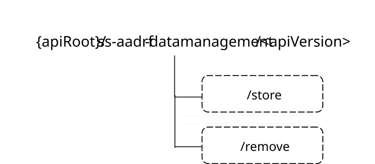

# 7.10.8.3 Custom Operations without associated resources

7.10.8.3.1 Overview

The structure of the custom operation URIs of the SS_AADRF_DataManagement API is shown in Figure 7.10.8.3.1-1.

**Figure 7.10.8.3.1-1: Custom operation URI structure of the SS_AADRF_DataManagement API**

Table 7.10.8.3.1-1 provides an overview of the custom operations and applicable HTTP methods defined for the SS_AADRF_DataManagement API.

**Table 7.10.8.3.1-1: Custom operations without associated resources**

| **Custom operation name** | **Custom operation URI** | **Mapped HTTP method** | **Description**                                     |
|---------------------------|--------------------------|------------------------|-----------------------------------------------------|
| Store                     | /store                   | POST                   | Enables a service consumer to request data storage. |
| Remove                    | /remove                  | POST                   | Enables a service consumer to request data removal. |

The custom operations shall support the URI variables defined in table 7.10.8.3.1-2.

**Table 7.10.8.3.1-2: URI variables for this custom operation**

| **Name** | **Data type** | **Definition**       |
|----------|---------------|----------------------|
| apiRoot  | string        | See clause 7.10.8.1. |

## 7.10.8.3.2 Operation: Store

### 7.10.8.3.2.1 Description

The custom operation enables a service consumer to request the data storage at A-ADRF.

### 7.10.8.3.2.2 Operation Definition

This operation shall support the request data structures specified in table 7.10.8.3.2.2-1 and the response data structures and response codes specified in table 7.10.8.3.2.2-2.

Table 7.10.8.3.2.2-1: Data structures supported by the POST Request Body on this resource

|              |     |             |                                                  |
|--------------|-----|-------------|--------------------------------------------------|
| Data type    | P   | Cardinality | Description                                      |
| DataStoreReq | M   | 1           | Contains the parameters to request data storage. |

Table 7.10.8.3.2.2-2: Data structures supported by the POST Response Body on this resource

<table>
<colgroup>
<col style="width: 16%" />
<col style="width: 4%" />
<col style="width: 12%" />
<col style="width: 14%" />
<col style="width: 51%" />
</colgroup>
<tbody>
<tr class="odd">
<td>Data type</td>
<td>P</td>
<td>Cardinality</td>
<td>
Response

codes
</td>
<td>Description</td>
</tr>
<tr class="even">
<td>DataStoreResp</td>
<td>1</td>
<td>M</td>
<td>200 OK</td>
<td>Successful case. The data storage request is successfully received and processed.</td>
</tr>
<tr class="odd">
<td>n/a</td>
<td></td>
<td></td>
<td>307 Temporary Redirect</td>
<td>
Temporary redirection.

The response shall include a Location header field containing an alternative target URI located in an alternative A-ADRF.

Redirection handling is described in clause 5.2.10 of 3GPP TS 29.122 [2].
</td>
</tr>
<tr class="even">
<td>n/a</td>
<td></td>
<td></td>
<td>308 Permanent Redirect</td>
<td>
Permanent redirection.

The response shall include a Location header field containing an alternative target URI located in an alternative A-ADRF.

Redirection handling is described in clause 5.2.10 of 3GPP TS 29.122 [2]
</td>
</tr>
<tr class="odd">
<td colspan="5">NOTE: The mandatory HTTP error status codes for the HTTP POST method listed in table 5.2.6-1 of 3GPP TS 29.122 [3] shall also apply.</td>
</tr>
</tbody>
</table>

Table 7.10.8.3.2.2-3: Headers supported by the 307 Response Code on this resource

|          |           |     |             |                                                                      |
|----------|-----------|-----|-------------|----------------------------------------------------------------------|
| Name     | Data type | P   | Cardinality | Description                                                          |
| Location | string    | M   | 1           | Contains an alternative target URI located in an alternative A-ADRF. |

Table 7.10.8.3.2.2-4: Headers supported by the 308 Response Code on this resource

|          |           |     |             |                                                                      |
|----------|-----------|-----|-------------|----------------------------------------------------------------------|
| Name     | Data type | P   | Cardinality | Description                                                          |
| Location | string    | M   | 1           | Contains an alternative target URI located in an alternative A-ADRF. |

## 7.10.8.3.3 Operation: Remove

### 7.10.8.3.3.1 Description

The custom operation enables a service consumer to request the data removal at A-ADRF.

### 7.10.8.3.3.2 Operation Definition

This operation shall support the request data structures specified in table 7.10.8.3.3.2-1 and the response data structures and response codes specified in table 7.10.8.3.3.2-2.

Table 7.10.8.3.3.2-1: Data structures supported by the POST Request Body on this resource

|                |     |             |                                                  |
|----------------|-----|-------------|--------------------------------------------------|
| Data type      | P   | Cardinality | Description                                      |
| DataRemovalReq | M   | 1           | Contains the parameters to request data removal. |

Table 7.10.8.3.3.2-2: Data structures supported by the POST Response Body on this resource

<table>
<colgroup>
<col style="width: 16%" />
<col style="width: 4%" />
<col style="width: 12%" />
<col style="width: 14%" />
<col style="width: 51%" />
</colgroup>
<tbody>
<tr class="odd">
<td>Data type</td>
<td>P</td>
<td>Cardinality</td>
<td>
Response

codes
</td>
<td>Description</td>
</tr>
<tr class="even">
<td>DataRemovalResp</td>
<td>1</td>
<td>M</td>
<td>200 OK</td>
<td>Successful case. The data removal request is successfully received and processed.</td>
</tr>
<tr class="odd">
<td>n/a</td>
<td></td>
<td></td>
<td>307 Temporary Redirect</td>
<td>
Temporary redirection.

The response shall include a Location header field containing an alternative target URI located in an alternative A-ADRF.

Redirection handling is described in clause 5.2.10 of 3GPP TS 29.122 [2].
</td>
</tr>
<tr class="even">
<td>n/a</td>
<td></td>
<td></td>
<td>308 Permanent Redirect</td>
<td>
Permanent redirection.

The response shall include a Location header field containing an alternative target URI located in an alternative A-ADRF.

Redirection handling is described in clause 5.2.10 of 3GPP TS 29.122 [2]
</td>
</tr>
<tr class="odd">
<td colspan="5">NOTE: The mandatory HTTP error status codes for the HTTP POST method listed in table 5.2.6-1 of 3GPP TS 29.122 [3] shall also apply.</td>
</tr>
</tbody>
</table>

Table 7.10.8.3.3.2-3: Headers supported by the 307 Response Code on this resource

|          |           |     |             |                                                                      |
|----------|-----------|-----|-------------|----------------------------------------------------------------------|
| Name     | Data type | P   | Cardinality | Description                                                          |
| Location | string    | M   | 1           | Contains an alternative target URI located in an alternative A-ADRF. |

Table 7.10.8.3.3.2-4: Headers supported by the 308 Response Code on this resource

|          |           |     |             |                                                                      |
|----------|-----------|-----|-------------|----------------------------------------------------------------------|
| Name     | Data type | P   | Cardinality | Description                                                          |
| Location | string    | M   | 1           | Contains an alternative target URI located in an alternative A-ADRF. |
