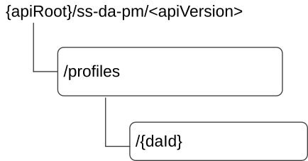

# 7.13.1.3 Resources

## 7.13.1.3.1 Overview

This clause describes the structure for the Resource URIs and the resources and methods used for the service.

Figure 7.13.1.3.1-1 depicts the resource URIs structure for the SS_DAProfileManagement API.

Figure 7.13.1.3.1-1: Resource URI structure of the SS_DAProfileManagement API

Table 7.13.1.3.1-1 provides an overview of the resources and applicable HTTP methods.

Table 7.13.1.3.1-1: Resources and methods overview

| Resource name         | Resource URI     | HTTP method or custom operation | Description                                              |
|-----------------------|------------------|---------------------------------|----------------------------------------------------------|
| DA Profiles           | /profiles        | POST                            | Create a new Individual DA profile.                      |
| Individual DA Profile | /profiles/{daId} | GET                             | Retrieves an Individual DA profile identified by {daId}. |
|                       |                  | PUT                             | Updates an Individual DA profile {daId}.                 |
|                       |                  | PATCH                           | Partially modifies an Individual DA profile {daId}.      |
|                       |                  | DELETE                          | Delete an Individual DA profile {daId}.                  |

## 7.13.1.3.2 Resource: DA Profiles

### 7.13.1.3.2.1 Description

The resource allows the VAL server to request to create a new individual DA profile at the DA server.

### 7.13.1.3.2.2 Resource Definition

Resource URI: **{apiRoot}/ss-da-pm/\<apiVersion\>/profiles**

This resource shall support the resource URI variables defined in the table 7.13.1.3.2.2-1.

Table 7.13.1.3.2.2-1: Resource URI variables for this resource

| Name    | Data Type | Definition          |
|---------|-----------|---------------------|
| apiRoot | string    | See clause 7.13.1.1 |

### 7.13.1.3.2.3 Resource Standard Methods

#### 7.13.1.3.2.3.1 POST

This method shall support the URI query parameters specified in table 7.13.1.3.2.3.1-1.

Table 7.13.1.3.2.3.1-1: URI query parameters supported by the POST method on this resource

|      |           |     |             |             |
|------|-----------|-----|-------------|-------------|
| Name | Data type | P   | Cardinality | Description |
| n/a  |           |     |             |             |

This method shall support the request data structures specified in table 7.13.1.3.2.3.1-2 and the response data structures and response codes specified in table 7.13.1.3.2.3.1-3.

Table 7.13.1.3.2.3.1-2: Data structures supported by the POST Request Body on this resource

|                     |     |             |                   |
|---------------------|-----|-------------|-------------------|
| Data type           | P   | Cardinality | Description       |
| DigitalAssetProfile | M   | 1           | Create DA profile |

Table 7.13.1.3.2.3.1-3: Data structures supported by the POST Response Body on this resource

<table>
<colgroup>
<col style="width: 16%" />
<col style="width: 9%" />
<col style="width: 14%" />
<col style="width: 19%" />
<col style="width: 39%" />
</colgroup>
<tbody>
<tr class="odd">
<td>Data type</td>
<td>P</td>
<td>Cardinality</td>
<td>
Response

codes
</td>
<td>Description</td>
</tr>
<tr class="even">
<td>DigitalAssetProfile</td>
<td>M</td>
<td>1</td>
<td>201 Created</td>
<td>DA profile is created successfully.</td>
</tr>
<tr class="odd">
<td colspan="5">NOTE: The mandatory HTTP error status codes for the POST method listed in table 5.2.6-1 of 3GPP TS 29.122 [3] also apply.</td>
</tr>
</tbody>
</table>

Table 7.13.1.3.2.3.1-4: Headers supported by the 201 Response Code on this resource

|          |           |     |             |                                                                                                                               |
|----------|-----------|-----|-------------|-------------------------------------------------------------------------------------------------------------------------------|
| Name     | Data type | P   | Cardinality | Description                                                                                                                   |
| Location | string    | M   | 1           | Contains the URI of the newly created resource, according to the structure: {apiRoot}/ss-da-pm/\<apiVersion\>/profiles/{daId} |

### 7.13.1.3.2.4 Resource Custom Operations

None.

## 7.13.1.3.3 Resource: Individual DA profile

### 7.13.1.3.3.1 Description

The resource represents an individual DA Profile that is created at the DA server.

### 7.13.1.3.3.2 Resource Definition

Resource URI: **{apiRoot}/ss-da-pm/\<apiVersion\>/profiles/{daId}**

This resource shall support the resource URI variables defined in the table 7.13.1.3.3.2-1.

Table 7.13.1.3.3.2-1: Resource URI variables for this resource

| Name    | Data Type | Definition                                    |
|---------|-----------|-----------------------------------------------|
| apiRoot | string    | See clause 7.13.1.1.                          |
| daId    | string    | Represents an individual DA Profile resource. |

### 7.13.1.3.3.3 Resource Standard Methods

#### 7.13.1.3.3.3.1 GET

This operation retrieves an individual DA profile. This method shall support the URI query parameters specified in table 7.13.1.3.3.3.1-1.

Table 7.13.1.3.3.3.1-1: URI query parameters supported by the GET method on this resource

|      |           |     |             |             |
|------|-----------|-----|-------------|-------------|
| Name | Data type | P   | Cardinality | Description |
| n/a  |           |     |             |             |

This method shall support the request data structures specified in table 7.13.1.3.3.3.1-2 and the response data structures and response codes specified in table 7.13.1.3.3.3.1-3.

Table 7.13.1.3.3.3.1-2: Data structures supported by the GET Request Body on this resource

|           |     |             |             |
|-----------|-----|-------------|-------------|
| Data type | P   | Cardinality | Description |
| n/a       |     |             |             |

Table 7.13.1.3.3.3.1-3: Data structures supported by the GET Response Body on this resource

<table>
<colgroup>
<col style="width: 16%" />
<col style="width: 9%" />
<col style="width: 14%" />
<col style="width: 19%" />
<col style="width: 39%" />
</colgroup>
<tbody>
<tr class="odd">
<td>Data type</td>
<td>P</td>
<td>Cardinality</td>
<td>
Response

codes
</td>
<td>Description</td>
</tr>
<tr class="even">
<td>DigitalAssetProfile</td>
<td>M</td>
<td>1</td>
<td>200 OK</td>
<td>Successful case. The requested "Individual DA profile” is retrieved.</td>
</tr>
<tr class="odd">
<td>n/a</td>
<td></td>
<td></td>
<td>307 Temporary Redirect</td>
<td>
Temporary redirection, during resource retrieval. The response shall include a Location header field containing an alternative URI of the resource located in an alternative DA server.

Redirection handling is described in clause 5.2.10 of 3GPP TS 29.122 [3].
</td>
</tr>
<tr class="even">
<td>n/a</td>
<td></td>
<td></td>
<td>308 Permanent Redirect</td>
<td>
Permanent redirection, during resource retrieval. The response shall include a Location header field containing an alternative URI of the resource located in an alternative DA server.

Redirection handling is described in clause 5.2.10 of 3GPP TS 29.122 [3].
</td>
</tr>
<tr class="odd">
<td colspan="5">NOTE: The mandatory HTTP error status codes for the GET method listed in table 5.2.6-1 of 3GPP TS 29.122 [3] also apply.</td>
</tr>
</tbody>
</table>

Table 7.13.1.3.3.3.1-4: Headers supported by the 307 Response Code on this resource

|          |           |     |             |                                                                         |
|----------|-----------|-----|-------------|-------------------------------------------------------------------------|
| Name     | Data type | P   | Cardinality | Description                                                             |
| Location | string    | M   | 1           | An alternative URI of the resource located in an alternative DA server. |

Table 7.13.1.3.3.3.1-5: Headers supported by the 308 Response Code on this resource

|          |           |     |             |                                                                         |
|----------|-----------|-----|-------------|-------------------------------------------------------------------------|
| Name     | Data type | P   | Cardinality | Description                                                             |
| Location | string    | M   | 1           | An alternative URI of the resource located in an alternative DA server. |

#### 7.13.1.3.3.3.2 PUT

This operation updates the individual digital asset profile. This method shall support the URI query parameters specified in table 7.13.1.3.3.3.2-1.

Table 7.13.1.3.3.3.2-1: URI query parameters supported by the PUT method on this resource

|      |           |     |             |             |
|------|-----------|-----|-------------|-------------|
| Name | Data type | P   | Cardinality | Description |
| n/a  |           |     |             |             |

This method shall support the request data structures specified in table 7.13.1.3.3.3.2-2 and the response data structures and response codes specified in table 7.13.1.3.3.3.2-3.

Table 7.13.1.3.3.3.2-2: Data structures supported by the PUT Request Body on this resource

|                     |     |             |                                    |
|---------------------|-----|-------------|------------------------------------|
| Data type           | P   | Cardinality | Description                        |
| DigitalAssetProfile | M   | 1           | Updated details of the DA profile. |

Table 7.13.1.3.3.3.2-3: Data structures supported by the PUT Response Body on this resource

<table>
<colgroup>
<col style="width: 16%" />
<col style="width: 9%" />
<col style="width: 14%" />
<col style="width: 19%" />
<col style="width: 39%" />
</colgroup>
<tbody>
<tr class="odd">
<td>Data type</td>
<td>P</td>
<td>Cardinality</td>
<td>
Response

codes
</td>
<td>Description</td>
</tr>
<tr class="even">
<td>DigitalAssetProfile</td>
<td>M</td>
<td>1</td>
<td>200 OK</td>
<td>The DA profile is updated successfully and the updated DA profile returned in the response.</td>
</tr>
<tr class="odd">
<td>n/a</td>
<td></td>
<td></td>
<td>204 No Content</td>
<td>The DA profile updated successfully.</td>
</tr>
<tr class="even">
<td>n/a</td>
<td></td>
<td></td>
<td>307 Temporary Redirect</td>
<td>
Temporary redirection, during resource modification. The response shall include a Location header field containing an alternative URI of the resource located in an alternative DA server.

Redirection handling is described in clause 5.2.10 of 3GPP TS 29.122 [3].
</td>
</tr>
<tr class="odd">
<td>n/a</td>
<td></td>
<td></td>
<td>308 Permanent Redirect</td>
<td>
Permanent redirection, during resource modification. The response shall include a Location header field containing an alternative URI of the resource located in an alternative DA server.

Redirection handling is described in clause 5.2.10 of 3GPP TS 29.122 [3].
</td>
</tr>
<tr class="even">
<td colspan="5">NOTE: The mandatory HTTP error status codes for the PUT method listed in table 5.2.6-1 of 3GPP TS 29.122 [3] also apply.</td>
</tr>
</tbody>
</table>

Table 7.13.1.3.3.3.2-4: Headers supported by the 307 Response Code on this resource

|          |           |     |             |                                                                         |
|----------|-----------|-----|-------------|-------------------------------------------------------------------------|
| Name     | Data type | P   | Cardinality | Description                                                             |
| Location | string    | M   | 1           | An alternative URI of the resource located in an alternative DA server. |

Table 7.13.1.3.3.3.2-5: Headers supported by the 308 Response Code on this resource

|          |           |     |             |                                                                         |
|----------|-----------|-----|-------------|-------------------------------------------------------------------------|
| Name     | Data type | P   | Cardinality | Description                                                             |
| Location | string    | M   | 1           | An alternative URI of the resource located in an alternative DA server. |

#### 7.13.1.3.3.3.3 PATCH

This method shall support the URI query parameters specified in table 7.13.1.3.3.3.3-1.

Table 7.13.1.3.3.3.3-1: URI query parameters supported by the PATCH method on this resource

| Name | Data type | P   | Cardinality | Description |
|------|-----------|-----|-------------|-------------|
| n/a  |           |     |             |             |

This method shall support the request data structures specified in table 7.13.1.3.3.3.3-2 and the response data structures and response codes specified in table 7.13.1.3.3.3.3-3.

Table 7.13.1.3.3.3.3-2: Data structures supported by the PATCH Request Body on this resource

| Data type                | P   | Cardinality | Description                                                                     |
|--------------------------|-----|-------------|---------------------------------------------------------------------------------|
| DigitalAssetProfilePatch | M   | 1           | Contains the modifications to be applied to the Individual DA Profile resource. |

Table 7.13.1.3.3.3.3-3: Data structures supported by the PATCH Response Body on this resource

<table>
<colgroup>
<col style="width: 24%" />
<col style="width: 3%" />
<col style="width: 11%" />
<col style="width: 10%" />
<col style="width: 50%" />
</colgroup>
<thead>
<tr class="header">
<th>Data type</th>
<th>P</th>
<th>Cardinality</th>
<th>
Response

codes
</th>
<th>Description</th>
</tr>
</thead>
<tbody>
<tr class="odd">
<td>DigitalAssetProfile</td>
<td>M</td>
<td>1</td>
<td>200 OK</td>
<td>Individual DA Profile resource is modified successfully, and representation of the modified Individual DA Profile resource is returned.</td>
</tr>
<tr class="even">
<td>n/a</td>
<td></td>
<td></td>
<td>204 No Content</td>
<td>The Individual DA Profile resource is modified successfully.</td>
</tr>
<tr class="odd">
<td>n/a</td>
<td></td>
<td></td>
<td>307 Temporary Redirect</td>
<td>
Temporary redirection.

The response shall include a Location header field containing an alternative URI of the resource located in an alternative SEAL server.

Redirection handling is described in clause 5.2.10 of 3GPP TS 29.122 [3].
</td>
</tr>
<tr class="even">
<td>n/a</td>
<td></td>
<td></td>
<td>308 Permanent Redirect</td>
<td>
Permanent redirection.

The response shall include a Location header field containing an alternative URI of the resource located in an alternative SEAL server.

Redirection handling is described in clause 5.2.10 of 3GPP TS 29.122 [3].
</td>
</tr>
<tr class="odd">
<td colspan="5">NOTE: The mandatory HTTP error status codes for the PATCH method listed in table 5.2.6-1 of 3GPP TS 29.122 [3] also apply.</td>
</tr>
</tbody>
</table>

Table 7.13.1.3.3.3.3-4: Headers supported by the 307 Response Code on this resource

|          |           |     |             |                                                                           |
|----------|-----------|-----|-------------|---------------------------------------------------------------------------|
| Name     | Data type | P   | Cardinality | Description                                                               |
| Location | String    | M   | 1           | An alternative URI of the resource located in an alternative SEAL server. |

Table 7.13.1.3.3.3.3-5: Headers supported by the 308 Response Code on this resource

|          |           |     |             |                                                                           |
|----------|-----------|-----|-------------|---------------------------------------------------------------------------|
| Name     | Data type | P   | Cardinality | Description                                                               |
| Location | String    | M   | 1           | An alternative URI of the resource located in an alternative SEAL server. |

#### 7.13.1.3.3.3.4 DELETE

This operation deletes the individual Digital asset profile. This method shall support the URI query parameters specified in table 7.13.1.3.3.3.4-1.

Table 7.13.1.3.3.3.4-1: URI query parameters supported by the DELETE method on this resource

|      |           |     |             |             |
|------|-----------|-----|-------------|-------------|
| Name | Data type | P   | Cardinality | Description |
| n/a  |           |     |             |             |

This method shall support the request data structures specified in table 7.13.1.3.3.3.4-2 and the response data structures and response codes specified in table 7.13.1.3.3.3.4-3.

Table 7.13.1.3.3.3.4-2: Data structures supported by the DELETE Request Body on this resource

|           |     |             |             |
|-----------|-----|-------------|-------------|
| Data type | P   | Cardinality | Description |
| n/a       |     |             |             |

Table 7.13.1.3.3.3.4-3: Data structures supported by the DELETE Response Body on this resource

<table>
<colgroup>
<col style="width: 16%" />
<col style="width: 9%" />
<col style="width: 14%" />
<col style="width: 19%" />
<col style="width: 39%" />
</colgroup>
<tbody>
<tr class="odd">
<td>Data type</td>
<td>P</td>
<td>Cardinality</td>
<td>
Response

codes
</td>
<td>Description</td>
</tr>
<tr class="even">
<td>n/a</td>
<td></td>
<td></td>
<td>204 No Content</td>
<td>The individual configuration matching the Digital asset identity is deleted.</td>
</tr>
<tr class="odd">
<td>n/a</td>
<td></td>
<td></td>
<td>307 Temporary Redirect</td>
<td>
Temporary redirection, during resource termination. The response shall include a Location header field containing an alternative URI of the resource located in an alternative DA server.

Redirection handling is described in clause 5.2.10 of 3GPP TS 29.122 [3].
</td>
</tr>
<tr class="even">
<td>n/a</td>
<td></td>
<td></td>
<td>308 Permanent Redirect</td>
<td>
Permanent redirection, during resource termination. The response shall include a Location header field containing an alternative URI of the resource located in an alternative DA server.

Redirection handling is described in clause 5.2.10 of 3GPP TS 29.122 [3].
</td>
</tr>
<tr class="odd">
<td colspan="5">NOTE: The mandatory HTTP error status codes for the DELETE method listed in table 5.2.6-1 of 3GPP TS 29.122 [3] also apply.</td>
</tr>
</tbody>
</table>

Table 7.13.1.3.3.3.4-4: Headers supported by the 307 Response Code on this resource

|          |           |     |             |                                                                         |
|----------|-----------|-----|-------------|-------------------------------------------------------------------------|
| Name     | Data type | P   | Cardinality | Description                                                             |
| Location | String    | M   | 1           | An alternative URI of the resource located in an alternative DA server. |

Table 7.13.1.3.3.3.4-5: Headers supported by the 308 Response Code on this resource

|          |           |     |             |                                                                         |
|----------|-----------|-----|-------------|-------------------------------------------------------------------------|
| Name     | Data type | P   | Cardinality | Description                                                             |
| Location | String    | M   | 1           | An alternative URI of the resource located in an alternative DA server. |

### 7.13.1.3.3.4 Resource Custom Operations

None.
