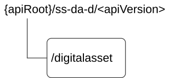

# 7.13.2 SS_DADiscovery Service API

## 7.13.2.1 Introduction

The SS_DADiscovery service shall use the SS_DADiscovery API.

The API URI of the SS_DADiscovery API shall be:

**{apiRoot}/\<apiName\>/\<apiVersion\>**

The request URIs used in HTTP requests shall have the Resource URI structure defined in clause 6.5, i.e.:

**{apiRoot}/\<apiName\>/\<apiVersion\>/\<apiSpecificSuffixes\>**

with the following components:

\- The {apiRoot} shall be set as described in clause 6.5.

\- The \<apiName\> shall be "ss-da-d".

\- The \<apiVersion\> shall be "v1".

\- The \<apiSpecificSuffixes\> shall be set as described in clause 7.13.2.3.

NOTE: When 3GPP TS 29.122 \[2\] is referenced for the common protocol and interface aspects for API definition in the clauses under clause 7.13.2, the DA server takes the role of the SCEF and the service consumer takes the role of the SCS/AS.

7.13.2.2 Usage of HTTP and common API related aspects

The provisions of clause 6.3 shall apply for the SS_DADiscovery API.

## 7.13.2.3 Resources

### 7.13.2.3.1 Overview

This clause describes the structure for the Resource URIs and the resources and methods used for the service.

Figure 7.13.2.3.1-1 depicts the resource URIs structure for the SS_DADiscovery API.

Figure 7.13.2.3.1-1: Resource URI structure of the SS_DADiscovery API

Table 7.13.2.3.1-1 provides an overview of the resources and applicable HTTP methods.

Table 7.13.2.3.1-1: Resources and methods overview

| Resource name | Resource URI  | HTTP method or custom operation | Description                      |
|---------------|---------------|---------------------------------|----------------------------------|
| DA assets     | /digitalasset | GET                             | Discover Digital asset profiles. |

### 7.13.2.3.2 Resource: Digital Asset

#### 7.13.2.3.2.1 Description

This resource represents the collection of Digital asset managed by the DA Server.

#### 7.13.2.3.2.2 Resource Definition

Resource URI: **{apiRoot}/ss-da-d/\<apiVersion\>/digitalasset**

This resource shall support the resource URI variables defined in the table 7.13.2.3.2.2-1.

Table 7.13.2.3.2.2-1: Resource URI variables for this resource

| Name    | Data Type | Definition          |
|---------|-----------|---------------------|
| apiRoot | string    | See clause 7.13.2.1 |

#### 7.13.2.3.2.3 Resource Standard Methods

##### 7.13.2.3.2.3.1 GET

This operation allows a service consumer to discover digital assets in DA Server. This method shall support the URI query parameters specified in table 7.13.2.3.2.3.1-1.

Table 7.13.2.3.2.3.1-1: URI query parameters supported by the GET method on this resource

<table>
<colgroup>
<col style="width: 16%" />
<col style="width: 18%" />
<col style="width: 4%" />
<col style="width: 12%" />
<col style="width: 47%" />
</colgroup>
<thead>
<tr class="header">
<th>Name</th>
<th>Data type</th>
<th>P</th>
<th>Cardinality</th>
<th>Description</th>
</tr>
</thead>
<tbody>
<tr class="odd">
<td>allowed-users</td>
<td>array(AllowedUser)</td>
<td>C</td>
<td>1..N</td>
<td>
Contains the list of allowed users

(NOTE 1)
</td>
</tr>
<tr class="even">
<td>da-desc</td>
<td>string</td>
<td>O</td>
<td>0..1</td>
<td>
Contains the description of the DA.

(NOTE 1)
</td>
</tr>
<tr class="odd">
<td>da-ids</td>
<td>array(DaId)</td>
<td>C</td>
<td>1..N</td>
<td>
Contains the identifier(s) of the targeted DA(s).

(NOTE 1)
</td>
</tr>
<tr class="even">
<td>da-name</td>
<td>string</td>
<td>C</td>
<td>0..1</td>
<td>
Contains the DA name.

(NOTE 1)
</td>
</tr>
<tr class="odd">
<td>da-owner-id</td>
<td>DigitalAssetOwnerId</td>
<td>C</td>
<td>0..1</td>
<td>
Contains the DA owner

(NOTE 1)
</td>
</tr>
<tr class="even">
<td>da-type</td>
<td>DigitalAssetType</td>
<td>C</td>
<td>0..1</td>
<td>
Contains the DA type

(NOTE 1)
</td>
</tr>
<tr class="odd">
<td>spatial-condt</td>
<td>SpatialCondition</td>
<td>C</td>
<td>0..1</td>
<td>
Contains the Spatial conditions for the DA.

(NOTE 1)
</td>
</tr>
<tr class="even">
<td>val-target-ue</td>
<td>ValTargetUe</td>
<td>C</td>
<td>0..1</td>
<td>
Contains either VAL User ID or VAL UE ID.

(NOTE 1)
</td>
</tr>
<tr class="odd">
<td>supp-feats</td>
<td>SupportedFeatures</td>
<td>C</td>
<td>0..1</td>
<td>
Contains the list of supported feature(s) among the ones defined in clause 7.13.2.7.

This attribute shall be present only when feature negotiation is required.
</td>
</tr>
<tr class="even">
<td colspan="5">NOTE 1: At least one of these query parameters shall be present.</td>
</tr>
</tbody>
</table>

This method shall support the request data structures specified in table 7.13.2.3.2.3.1-2 and the response data structures and response codes specified in table 7.13.2.3.2.3.1-3.

Table 7.13.2.3.2.3.1-2: Data structures supported by the GET Request Body on this resource

| Data type | P   | Cardinality | Description |
|-----------|-----|-------------|-------------|
| n/a       |     |             |             |

Table 7.13.2.3.2.3.1-3: Data structures supported by the GET Response Body on this resource

<table>
<colgroup>
<col style="width: 16%" />
<col style="width: 9%" />
<col style="width: 14%" />
<col style="width: 19%" />
<col style="width: 39%" />
</colgroup>
<thead>
<tr class="header">
<th>Data type</th>
<th>P</th>
<th>Cardinality</th>
<th>
Response

codes
</th>
<th>Description</th>
</tr>
</thead>
<tbody>
<tr class="odd">
<td>DaDiscResp</td>
<td>M</td>
<td>1</td>
<td>200 OK</td>
<td>Successful case. DA details matching the query filter criteria shall be returned.</td>
</tr>
<tr class="even">
<td>n/a</td>
<td></td>
<td></td>
<td>307 Temporary Redirect</td>
<td>
Temporary redirection, during resource retrieval. The response shall include a Location header field containing an alternative URI of the resource located in an alternative DA server.

Redirection handling is described in clause 5.2.10 of 3GPP TS 29.122 [3].
</td>
</tr>
<tr class="odd">
<td>n/a</td>
<td></td>
<td></td>
<td>308 Permanent Redirect</td>
<td>
Permanent redirection, during resource retrieval. The response shall include a Location header field containing an alternative URI of the resource located in an alternative DA server.

Redirection handling is described in clause 5.2.10 of 3GPP TS 29.122 [3].
</td>
</tr>
<tr class="even">
<td colspan="5">NOTE: The mandatory HTTP error status codes for the GET method listed in table 5.2.6-1 of 3GPP TS 29.122 [3] also apply.</td>
</tr>
</tbody>
</table>

Table 7.13.2.3.2.3.1-4: Headers supported by the 307 Response Code on this resource

| Name     | Data type | P   | Cardinality | Description                                                             |
|----------|-----------|-----|-------------|-------------------------------------------------------------------------|
| Location | string    | M   | 1           | An alternative URI of the resource located in an alternative DA server. |

Table 7.13.2.3.2.3.1-5: Headers supported by the 308 Response Code on this resource

| Name     | Data type | P   | Cardinality | Description                                                             |
|----------|-----------|-----|-------------|-------------------------------------------------------------------------|
| Location | string    | M   | 1           | An alternative URI of the resource located in an alternative DA server. |

#### 7.13.2.3.2.4 Resource Custom Operations

None.

## 7.13.2.4 Custom Operations without associated resources

There are no custom operations without associated resources defined for this API in this release of the specification.

## 7.13.2.5 Notifications

There are no notification defined in this release of the specification.

## 7.13.2.6 Data Model

### 7.13.2.6.1 General

This clause specifies the application data model supported by the API. Data types listed in clause 6.2 apply to this API.

Table 7.13.2.6.1-1 specifies the data types defined for the SS_DADiscovery API.

Table 7.13.2.6.1-1: SS_DADiscovery API specific Data Types

| Data type    | Clause defined | Description                          | Applicability |
|--------------|----------------|--------------------------------------|---------------|
| DaDiscResp   | 7.13.2.6.2.2   | Represents the DA discovery response |               |
| DaDiscResult | 7.13.2.6.2.3   | Represents the DA discovery result   |               |
| DaStatus     | 7.13.2.6.3.3   | Represents the DA status             |               |

Table 7.13.2.6.1-2 specifies data types re-used by the SS_DADiscovery API from other specifications, including a reference to their respective specifications, and when needed, a short description of their use within the SS_DADiscovery API.

Table 7.13.2.6.1-2: SS_DADiscovery API Re-used Data Types

| Data type           | Reference             | Comments                                                                                                       | Applicability |
|---------------------|-----------------------|----------------------------------------------------------------------------------------------------------------|---------------|
| AllowedUser         | 7.13.1.6.2.5          | Represents the list of users allowed to access the digital asset.                                              |               |
| DaId                | 7.13.1.6.3.2          | Represents the identifier of the DA.                                                                           |               |
| DigitalAssetOwnerId | 7.13.1.6.3.2          | Represents the identity of the digital asset owner.                                                            |               |
| DigitalAssetType    | 7.13.1.6.3.3          | Represents the different type of digital assets e.g. avatar, wallet, etc                                       |               |
| SpatialCondition    | 7.13.1.6.2.6          | Represents the spatial conditions (e.g. locations) where this digital asset profile is allowed to be accessed. |               |
| SupportedFeatures   | 3GPP TS 29.571 \[21\] | Used to negotiate the applicability of optional features defined in table 7.13.2.6-1.                          |               |
| Uri                 | 3GPP TS 29.122 \[3\]  | Represents a URI.                                                                                              |               |
| ValTargetUe         | 7.3.1.4.2.3           | Represents a VAL User or a VAL UE.                                                                             |               |

### 7.13.2.6.2 Structured data types

#### 7.13.2.6.2.1 Introduction

This clause defines the structures to be used in resource representations.

#### 7.13.2.6.2.2 Type: DaDiscResp

Table 7.13.2.6.2.2-1: Definition of type DaDiscResp

<table>
<colgroup>
<col style="width: 14%" />
<col style="width: 10%" />
<col style="width: 4%" />
<col style="width: 14%" />
<col style="width: 42%" />
<col style="width: 13%" />
</colgroup>
<thead>
<tr class="header">
<th>Attribute name</th>
<th>Data type</th>
<th>P</th>
<th>Cardinality</th>
<th>Description</th>
<th>Applicability</th>
</tr>
</thead>
<tbody>
<tr class="odd">
<td>results</td>
<td>array(DaDiscResult)</td>
<td>M</td>
<td>0..N</td>
<td>
Contains the profile(s) of the dgital asset(s) matching the provided discovery filter criteria.

If there are no digital asset(s) matching the provided discovery filter criteria, an empty array shall be returned within this attribute.
</td>
<td></td>
</tr>
<tr class="even">
<td>suppFeat</td>
<td>SupportedFeatures</td>
<td>C</td>
<td>0..1</td>
<td>
Contains the list of supported feature(s) among the ones defined in clause 6.1.2.8.

This attribute shall be present only when feature negotiation is required.
</td>
<td></td>
</tr>
</tbody>
</table>

#### 7.13.2.6.2.3 Type: DaDiscResult

Table 7.13.2.6.2.3-1: Definition of type DaDiscResult

<table>
<colgroup>
<col style="width: 14%" />
<col style="width: 10%" />
<col style="width: 4%" />
<col style="width: 14%" />
<col style="width: 42%" />
<col style="width: 13%" />
</colgroup>
<thead>
<tr class="header">
<th>Attribute name</th>
<th>Data type</th>
<th>P</th>
<th>Cardinality</th>
<th>Description</th>
<th>Applicability</th>
</tr>
</thead>
<tbody>
<tr class="odd">
<td>daDesc</td>
<td>string</td>
<td>O</td>
<td>0..1</td>
<td>Contains the description of the digital asset.</td>
<td></td>
</tr>
<tr class="even">
<td>daId</td>
<td>DaId</td>
<td>C</td>
<td>0..1</td>
<td>
Contains the identifier of the digital asset.

(NOTE 1)
</td>
<td></td>
</tr>
<tr class="odd">
<td>daName</td>
<td>string</td>
<td>C</td>
<td>0..1</td>
<td>
Contains the name of the digital asset matching the discovery criteria

(NOTE 1)
</td>
<td></td>
</tr>
<tr class="even">
<td>daStatus</td>
<td>DaStatus</td>
<td>M</td>
<td>1</td>
<td>Contains the status of the digital asset.</td>
<td></td>
</tr>
<tr class="odd">
<td>uri</td>
<td>Uri</td>
<td>O</td>
<td>0..1</td>
<td>A URL of the service provider the digital asset is associated with.</td>
<td></td>
</tr>
<tr class="even">
<td colspan="6">NOTE 1: At least one of these query parameters shall be present.</td>
</tr>
</tbody>
</table>

### 7.13.2.6.3 Simple data types and enumerations

#### 7.13.2.6.3.1 Introduction

This clause defines simple data types and enumerations that are referenced from data structures defined in the previous clauses. In addition, data types and enumerations defined in clause 6.2.1 can be referenced.

#### 7.13.2.6.3.2 Simple data types

The simple data types defined in table 7.13.2.6.3.2-1 shall be supported.

Table 7.13.2.6.3.2-1: Simple data types

| Type Name | Type Definition | Description | Applicability |
|-----------|-----------------|-------------|---------------|
|           |                 |             |               |

#### 7.13.2.6.3.3 Enumeration: DaStatus

The enumeration DaStatus represents the status of the digital user. It shall comply with the provisions defined in table 7.13.2.6.3.3-1.

Table 7.13.2.6.3.3-1: Enumeration DaStatus

| Enumeration value | Description                                   | Applicability |
|-------------------|-----------------------------------------------|---------------|
| IN_USE            | Indicates that the digital asset is in use    |               |
| ARCHIVED          | Indicates that the digital asset is Archived. |               |

## 7.13.2.7 Error Handling

### 7.13.2.7.1 General

HTTP error handling shall be supported as specified in clause 6.7.

In addition, the requirements in the following clauses shall apply.

### 7.13.2.7.2 Protocol Errors

In this Release of the specification, there are no additional protocol errors applicable for the SS_DADiscovery API.

### 7.13.2.7.3 Application Errors

The application errors defined for SS_DADiscovery API are listed in table 7.13.2.7.3-1.

Table 7.13.2.7.3-1: Application errors

| Application Error | HTTP status code | Description | Applicability |
|-------------------|------------------|-------------|---------------|
|                   |                  |             |               |

## 7.13.2.8 Feature negotiation

The optional features in table 7.13.2.8-1 are defined for the SS_DADiscovery API. They shall be negotiated using the extensibility mechanism defined in clause 5.2.7 of 3GPP TS 29.122 \[2\].

Table 7.13.2.8-1: Supported Features

| Feature number | Feature Name | Description |
|----------------|--------------|-------------|
|                |              |             |

## 7.13.2.9 Security

The provisions of clause 9 shall apply for the SS_DADiscovery API.
