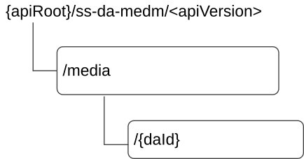

# 7.13.3 SS_DAMediaManagement Service API

## 7.13.3.1 Introduction

The SS_DAMediaManagement service shall use the SS_DAMediaManagement API.

The API URI of the SS_DAMediaManagement API shall be:

**{apiRoot}/\<apiName\>/\<apiVersion\>**

The request URIs used in HTTP requests shall have the Resource URI structure defined in clause 6.5, i.e.:

**{apiRoot}/\<apiName\>/\<apiVersion\>/\<apiSpecificSuffixes\>**

with the following components:

\- The {apiRoot} shall be set as described in clause 6.5.

\- The \<apiName\> shall be "ss-da-medm".

\- The \<apiVersion\> shall be "v1".

\- The \<apiSpecificSuffixes\> shall be set as described in clause 7.13.3.3.

NOTE: When 3GPP TS 29.122 \[2\] is referenced for the common protocol and interface aspects for API definition in the clauses under clause 7.13.3, the DA server takes the role of the SCEF and the service consumer takes the role of the SCS/AS.

7.13.3.2 Usage of HTTP and common API related aspects

The provisions of clause 6.3 shall apply for the SS_DAMediaManagement API.

## 7.13.3.3 Resources

### 7.13.3.3.1 Overview

This clause describes the structure for the Resource URIs and the resources and methods used for the service.

Figure 7.13.3.3.1-1 depicts the resource URIs structure for the SS_DAMediaManagement API.

Figure 7.13.3.3.1-1: Resource URI structure of the SS_DAMediaManagement API

Table 7.13.3.3.1-1 provides an overview of the resources and applicable HTTP methods.

Table 7.13.3.3.1-1: Resources and methods overview

| Resource name       | Resource URI  | HTTP method or custom operation | Description                                                     |
|---------------------|---------------|---------------------------------|-----------------------------------------------------------------|
| DA medias           | /media        | POST                            | Upload the individual DA media information.                     |
| Individual DA media | /media/{daId} | GET                             | Download the Individual DA media identified by {daId}.          |
|                     |               | PUT                             | Updates an Individual DA media identified by {daId}.            |
|                     |               | PATCH                           | Partially modifies an Individual DA media identified by {daId}. |
|                     |               | DELETE                          | Delete an Individual DA media identified by {daId}.             |

### 7.13.3.3.2 Resource: DA medias

#### 7.13.3.3.2.1 Description

The resource allows the VAL server to request to upload the new individual DA media at the DA server.

#### 7.13.3.3.2.2 Resource Definition

Resource URI: **{apiRoot}/ss-da-medm/\<apiVersion\>/media**

This resource shall support the resource URI variables defined in the table 7.13.3.3.2.2-1.

Table 7.13.3.3.2.2-1: Resource URI variables for this resource

| Name    | Data Type | Definition          |
|---------|-----------|---------------------|
| apiRoot | string    | See clause 7.13.3.1 |

#### 7.13.3.3.2.3 Resource Standard Methods

##### 7.13.3.3.2.3.1 POST

This method shall support the URI query parameters specified in table 7.13.3.3.2.3.1-1.

Table 7.13.3.3.2.3.1-1: URI query parameters supported by the POST method on this resource

|      |           |     |             |             |
|------|-----------|-----|-------------|-------------|
| Name | Data type | P   | Cardinality | Description |
| n/a  |           |     |             |             |

This method shall support the request data structures specified in table 7.13.3.3.2.3.1-2 and the response data structures and response codes specified in table 7.13.3.3.2.3.1-3.

Table 7.13.3.3.2.3.1-2: Data structures supported by the POST Request Body on this resource

|                   |     |             |                   |
|-------------------|-----|-------------|-------------------|
| Data type         | P   | Cardinality | Description       |
| DigitalAssetMedia | M   | 1           | DA media request. |

Table 7.13.3.3.2.3.1-3: Data structures supported by the POST Response Body on this resource

<table>
<colgroup>
<col style="width: 16%" />
<col style="width: 9%" />
<col style="width: 14%" />
<col style="width: 19%" />
<col style="width: 39%" />
</colgroup>
<tbody>
<tr class="odd">
<td>Data type</td>
<td>P</td>
<td>Cardinality</td>
<td>
Response

codes
</td>
<td>Description</td>
</tr>
<tr class="even">
<td>DigitalAssetMedia</td>
<td>M</td>
<td>1</td>
<td>201 Created</td>
<td>DA media is created successfully.</td>
</tr>
<tr class="odd">
<td colspan="5">NOTE: The mandatory HTTP error status codes for the POST method listed in table 5.2.6-1 of 3GPP TS 29.122 [3] also apply.</td>
</tr>
</tbody>
</table>

Table 7.13.3.3.2.3.1-4: Headers supported by the 201 Response Code on this resource

|          |           |     |             |                                                                                                                              |
|----------|-----------|-----|-------------|------------------------------------------------------------------------------------------------------------------------------|
| Name     | Data type | P   | Cardinality | Description                                                                                                                  |
| Location | string    | M   | 1           | Contains the URI of the newly created resource, according to the structure: {apiRoot}/ss-da-medm/\<apiVersion\>/media/{daId} |

#### 7.13.3.3.2.4 Resource Custom Operations

None.

### 7.13.3.3.3 Resource: Individual DA media

#### 7.13.3.3.3.1 Description

The resource represents an individual DA media information that is uploaded at the DA server.

#### 7.13.3.3.3.2 Resource Definition

Resource URI: **{apiRoot}/ss-da-medm/\<apiVersion\>/media/{daId}**

This resource shall support the resource URI variables defined in the table 7.13.3.3.3.2-1.

Table 7.13.3.3.3.2-1: Resource URI variables for this resource

| Name    | Data Type | Definition                                  |
|---------|-----------|---------------------------------------------|
| apiRoot | string    | See clause 7.13.3.1.                        |
| daId    | string    | Represents an individual DA media resource. |

#### 7.13.3.3.3.3 Resource Standard Methods

##### 7.13.3.3.3.3.1 GET

This operation download an individual DA media information. This method shall support the URI query parameters specified in table 7.13.3.3.3.3.1-1.

Table 7.13.3.3.3.3.1-1: URI query parameters supported by the GET method on this resource

|      |           |     |             |             |
|------|-----------|-----|-------------|-------------|
| Name | Data type | P   | Cardinality | Description |
| n/a  |           |     |             |             |

This method shall support the request data structures specified in table 7.13.3.3.3.3.1-2 and the response data structures and response codes specified in table 7.13.3.3.3.3.1-3.

Table 7.13.3.3.3.3.1-2: Data structures supported by the GET Request Body on this resource

|           |     |             |             |
|-----------|-----|-------------|-------------|
| Data type | P   | Cardinality | Description |
| n/a       |     |             |             |

Table 7.13.3.3.3.3.1-3: Data structures supported by the GET Response Body on this resource

<table>
<colgroup>
<col style="width: 16%" />
<col style="width: 9%" />
<col style="width: 14%" />
<col style="width: 19%" />
<col style="width: 39%" />
</colgroup>
<tbody>
<tr class="odd">
<td>Data type</td>
<td>P</td>
<td>Cardinality</td>
<td>
Response

codes
</td>
<td>Description</td>
</tr>
<tr class="even">
<td>DigitalAssetMedia</td>
<td>M</td>
<td>1</td>
<td>200 OK</td>
<td>Successful case. The requested "Individual DA media is retrieved..</td>
</tr>
<tr class="odd">
<td>n/a</td>
<td></td>
<td></td>
<td>307 Temporary Redirect</td>
<td>
Temporary redirection, during resource retrieval. The response shall include a Location header field containing an alternative URI of the resource located in an alternative DA server.

Redirection handling is described in clause 5.2.10 of 3GPP TS 29.122 [3].
</td>
</tr>
<tr class="even">
<td>n/a</td>
<td></td>
<td></td>
<td>308 Permanent Redirect</td>
<td>
Permanent redirection, during resource retrieval. The response shall include a Location header field containing an alternative URI of the resource located in an alternative DA server.

Redirection handling is described in clause 5.2.10 of 3GPP TS 29.122 [3].
</td>
</tr>
<tr class="odd">
<td colspan="5">NOTE: The mandatory HTTP error status codes for the GET method listed in table 5.2.6-1 of 3GPP TS 29.122 [3] also apply.</td>
</tr>
</tbody>
</table>

Table 7.13.3.3.3.3.1-4: Headers supported by the 307 Response Code on this resource

|          |           |     |             |                                                                         |
|----------|-----------|-----|-------------|-------------------------------------------------------------------------|
| Name     | Data type | P   | Cardinality | Description                                                             |
| Location | string    | M   | 1           | An alternative URI of the resource located in an alternative DA server. |

Table 7.13.3.3.3.3.1-5: Headers supported by the 308 Response Code on this resource

|          |           |     |             |                                                                         |
|----------|-----------|-----|-------------|-------------------------------------------------------------------------|
| Name     | Data type | P   | Cardinality | Description                                                             |
| Location | string    | M   | 1           | An alternative URI of the resource located in an alternative DA server. |

##### 7.13.3.3.3.3.2 PUT

This operation updates the individual digital asset media. This method shall support the URI query parameters specified in table 7.13.3.3.3.3.2-1.

Table 7.13.3.3.3.3.2-1: URI query parameters supported by the PUT method on this resource

|      |           |     |             |             |
|------|-----------|-----|-------------|-------------|
| Name | Data type | P   | Cardinality | Description |
| n/a  |           |     |             |             |

This method shall support the request data structures specified in table 7.13.3.3.3.3.2-2 and the response data structures and response codes specified in table 7.13.3.3.3.3.2-3.

Table 7.13.3.3.3.3.2-2: Data structures supported by the PUT Request Body on this resource

|                   |     |             |                                  |
|-------------------|-----|-------------|----------------------------------|
| Data type         | P   | Cardinality | Description                      |
| DigitalAssetMedia | M   | 1           | Updated details of the DA media. |

Table 7.13.3.3.3.3.2-3: Data structures supported by the PUT Response Body on this resource

<table>
<colgroup>
<col style="width: 16%" />
<col style="width: 9%" />
<col style="width: 14%" />
<col style="width: 19%" />
<col style="width: 39%" />
</colgroup>
<tbody>
<tr class="odd">
<td>Data type</td>
<td>P</td>
<td>Cardinality</td>
<td>
Response

codes
</td>
<td>Description</td>
</tr>
<tr class="even">
<td>DigitalAssetMedia</td>
<td>M</td>
<td>1</td>
<td>200 OK</td>
<td>The DA media is updated successfully and the updated DA media returned in the response.</td>
</tr>
<tr class="odd">
<td>n/a</td>
<td></td>
<td></td>
<td>204 No Content</td>
<td>The DA media updated successfully.</td>
</tr>
<tr class="even">
<td>n/a</td>
<td></td>
<td></td>
<td>307 Temporary Redirect</td>
<td>
Temporary redirection, during resource modification. The response shall include a Location header field containing an alternative URI of the resource located in an alternative DA server.

Redirection handling is described in clause 5.2.10 of 3GPP TS 29.122 [3].
</td>
</tr>
<tr class="odd">
<td>n/a</td>
<td></td>
<td></td>
<td>308 Permanent Redirect</td>
<td>
Permanent redirection, during resource modification. The response shall include a Location header field containing an alternative URI of the resource located in an alternative DA server.

Redirection handling is described in clause 5.2.10 of 3GPP TS 29.122 [3].
</td>
</tr>
<tr class="even">
<td colspan="5">NOTE: The mandatory HTTP error status codes for the PUT method listed in table 5.2.6-1 of 3GPP TS 29.122 [3] also apply.</td>
</tr>
</tbody>
</table>

Table 7.13.3.3.3.3.2-4: Headers supported by the 307 Response Code on this resource

|          |           |     |             |                                                                         |
|----------|-----------|-----|-------------|-------------------------------------------------------------------------|
| Name     | Data type | P   | Cardinality | Description                                                             |
| Location | string    | M   | 1           | An alternative URI of the resource located in an alternative DA server. |

Table 7.13.3.3.3.3.2-5: Headers supported by the 308 Response Code on this resource

|          |           |     |             |                                                                         |
|----------|-----------|-----|-------------|-------------------------------------------------------------------------|
| Name     | Data type | P   | Cardinality | Description                                                             |
| Location | string    | M   | 1           | An alternative URI of the resource located in an alternative DA server. |

##### 7.13.3.3.3.3.3 PATCH

This method shall support the URI query parameters specified in table 7.13.3.3.3.3.3-1.

Table 7.13.3.3.3.3.3-1: URI query parameters supported by the PATCH method on this resource

| Name | Data type | P   | Cardinality | Description |
|------|-----------|-----|-------------|-------------|
| n/a  |           |     |             |             |

This method shall support the request data structures specified in table 7.13.3.3.3.3.3-2 and the response data structures and response codes specified in table 7.13.3.3.3.3.3-3.

Table 7.13.3.3.3.3.3-2: Data structures supported by the PATCH Request Body on this resource

| Data type              | P   | Cardinality | Description                                                                   |
|------------------------|-----|-------------|-------------------------------------------------------------------------------|
| DigitalAssetMediaPatch | M   | 1           | Contains the modifications to be applied to the Individual DA media resource. |

Table 7.13.3.3.3.3.3-3: Data structures supported by the PATCH Response Body on this resource

<table>
<colgroup>
<col style="width: 24%" />
<col style="width: 3%" />
<col style="width: 11%" />
<col style="width: 10%" />
<col style="width: 50%" />
</colgroup>
<thead>
<tr class="header">
<th>Data type</th>
<th>P</th>
<th>Cardinality</th>
<th>
Response

codes
</th>
<th>Description</th>
</tr>
</thead>
<tbody>
<tr class="odd">
<td>DigitalAssetMedia</td>
<td>M</td>
<td>1</td>
<td>200 OK</td>
<td>Individual DA media resource is modified successfully, and representation of the modified Individual DA media resource is returned.</td>
</tr>
<tr class="even">
<td>n/a</td>
<td></td>
<td></td>
<td>204 No Content</td>
<td>The Individual DA media resource is modified successfully.</td>
</tr>
<tr class="odd">
<td>n/a</td>
<td></td>
<td></td>
<td>307 Temporary Redirect</td>
<td>
Temporary redirection.

The response shall include a Location header field containing an alternative URI of the resource located in an alternative SEAL server.

Redirection handling is described in clause 5.2.10 of 3GPP TS 29.122 [3].
</td>
</tr>
<tr class="even">
<td>n/a</td>
<td></td>
<td></td>
<td>308 Permanent Redirect</td>
<td>
Permanent redirection.

The response shall include a Location header field containing an alternative URI of the resource located in an alternative SEAL server.

Redirection handling is described in clause 5.2.10 of 3GPP TS 29.122 [3].
</td>
</tr>
<tr class="odd">
<td colspan="5">NOTE: The mandatory HTTP error status codes for the PATCH method listed in table 5.2.6-1 of 3GPP TS 29.122 [3] also apply.</td>
</tr>
</tbody>
</table>

Table 7.13.3.3.3.3.3-4: Headers supported by the 307 Response Code on this resource

|          |           |     |             |                                                                           |
|----------|-----------|-----|-------------|---------------------------------------------------------------------------|
| Name     | Data type | P   | Cardinality | Description                                                               |
| Location | String    | M   | 1           | An alternative URI of the resource located in an alternative SEAL server. |

Table 7.13.3.3.3.3.3-5: Headers supported by the 308 Response Code on this resource

|          |           |     |             |                                                                           |
|----------|-----------|-----|-------------|---------------------------------------------------------------------------|
| Name     | Data type | P   | Cardinality | Description                                                               |
| Location | String    | M   | 1           | An alternative URI of the resource located in an alternative SEAL server. |

##### 7.13.3.3.3.3.4 DELETE

This operation deletes the individual Digital asset media. This method shall support the URI query parameters specified in table 7.13.3.3.3.3.4-1.

Table 7.13.3.3.3.3.4-1: URI query parameters supported by the DELETE method on this resource

|      |           |     |             |             |
|------|-----------|-----|-------------|-------------|
| Name | Data type | P   | Cardinality | Description |
| n/a  |           |     |             |             |

This method shall support the request data structures specified in table 7.13.3.3.3.3.4-2 and the response data structures and response codes specified in table 7.13.3.3.3.3.4-3.

Table 7.13.3.3.3.3.4-2: Data structures supported by the DELETE Request Body on this resource

|           |     |             |             |
|-----------|-----|-------------|-------------|
| Data type | P   | Cardinality | Description |
| n/a       |     |             |             |

Table 7.13.3.3.3.3.4-3: Data structures supported by the DELETE Response Body on this resource

<table>
<colgroup>
<col style="width: 16%" />
<col style="width: 9%" />
<col style="width: 14%" />
<col style="width: 19%" />
<col style="width: 39%" />
</colgroup>
<tbody>
<tr class="odd">
<td>Data type</td>
<td>P</td>
<td>Cardinality</td>
<td>
Response

codes
</td>
<td>Description</td>
</tr>
<tr class="even">
<td>n/a</td>
<td></td>
<td></td>
<td>204 No Content</td>
<td>The individual configuration matching the Digital asset identity is deleted.</td>
</tr>
<tr class="odd">
<td>n/a</td>
<td></td>
<td></td>
<td>307 Temporary Redirect</td>
<td>
Temporary redirection, during resource termination. The response shall include a Location header field containing an alternative URI of the resource located in an alternative DA server.

Redirection handling is described in clause 5.2.10 of 3GPP TS 29.122 [3].
</td>
</tr>
<tr class="even">
<td>n/a</td>
<td></td>
<td></td>
<td>308 Permanent Redirect</td>
<td>
Permanent redirection, during resource termination. The response shall include a Location header field containing an alternative URI of the resource located in an alternative DA server.

Redirection handling is described in clause 5.2.10 of 3GPP TS 29.122 [3].
</td>
</tr>
<tr class="odd">
<td colspan="5">NOTE: The mandatory HTTP error status codes for the DELETE method listed in table 5.2.6-1 of 3GPP TS 29.122 [3] also apply.</td>
</tr>
</tbody>
</table>

Table 7.13.3.3.3.3.4-4: Headers supported by the 307 Response Code on this resource

|          |           |     |             |                                                                         |
|----------|-----------|-----|-------------|-------------------------------------------------------------------------|
| Name     | Data type | P   | Cardinality | Description                                                             |
| Location | String    | M   | 1           | An alternative URI of the resource located in an alternative DA server. |

Table 7.13.3.3.3.3.4-5: Headers supported by the 308 Response Code on this resource

|          |           |     |             |                                                                         |
|----------|-----------|-----|-------------|-------------------------------------------------------------------------|
| Name     | Data type | P   | Cardinality | Description                                                             |
| Location | String    | M   | 1           | An alternative URI of the resource located in an alternative DA server. |

#### 7.13.3.3.3.4 Resource Custom Operations

None.

## 7.13.3.4 Custom Operations without associated resources

There are no custom operations without associated resources defined for this API in this release of the specification.

## 7.13.3.5 Notifications

There are no notification defined in this release of the specification.

## 7.13.3.6 Data Model

### 7.13.3.6.1 General

This clause specifies the application data model supported by the API. Data types listed in clause 6.2 apply to this API.

Table 7.13.3.6.1-1 specifies the data types defined for the SS_DAMediaManagement API.

Table 7.13.3.6.1-1: SS_DAMediaManagement API specific Data Types

| Data type              | Clause defined | Description                                                                                                    | Applicability |
|------------------------|----------------|----------------------------------------------------------------------------------------------------------------|---------------|
| DaMediaInfo            | 7.13.3.6.2.4   | Represents the Information related to digital asset media (e.g. URI where the media is stored).                |               |
| DigitalAssetMedia      | 7.13.3.6.2.2   | Represents the DA media.                                                                                       |               |
| DigitalAssetMediaPatch | 7.13.3.6.2.3   | Represents the requested modifications to the DA media. Used to partially update Individual DA media resource. |               |

Table 7.13.3.6.1-2 specifies data types re-used by the SS_DAMediaManagement API from other specifications, including a reference to their respective specifications, and when needed, a short description of their use within the SS_DAMediaManagement API.

Table 7.13.3.6.1-2: SS_DAMediaManagement API Re-used Data Types

| Data type         | Reference             | Comments                                                                              | Applicability |
|-------------------|-----------------------|---------------------------------------------------------------------------------------|---------------|
| SupportedFeatures | 3GPP TS 29.571 \[21\] | Used to negotiate the applicability of optional features defined in table 7.13.3.6-1. |               |
| Uri               | 3GPP TS 29.122 \[3\]  | Represents a URI.                                                                     |               |

### 7.13.3.6.2 Structured data types

#### 7.13.3.6.2.1 Introduction

This clause defines the structures to be used in resource representations.

#### 7.13.3.6.2.2 Type: DigitalAssetMedia

Table 7.13.3.6.2.2-1: Definition of type DigitalAssetMedia

<table>
<colgroup>
<col style="width: 14%" />
<col style="width: 14%" />
<col style="width: 3%" />
<col style="width: 8%" />
<col style="width: 38%" />
<col style="width: 20%" />
</colgroup>
<thead>
<tr class="header">
<th>Attribute name</th>
<th>Data type</th>
<th>P</th>
<th>Cardinality</th>
<th>Description</th>
<th>Applicability</th>
</tr>
</thead>
<tbody>
<tr class="odd">
<td>daId</td>
<td>DaId</td>
<td>C</td>
<td>0..1</td>
<td>
Represents the identifier of the digital asset.

This attribute shall be present only in the response to a Digital Asset media creation request.
</td>
<td></td>
</tr>
<tr class="even">
<td>daMediaInfo</td>
<td>array(DaMediaInfo)</td>
<td>O</td>
<td>1..N</td>
<td>Represents the Information related to digital asset media (e.g. URI where the media is stored).</td>
<td></td>
</tr>
<tr class="odd">
<td>suppFeat</td>
<td>SupportedFeatures</td>
<td>C</td>
<td>0..1</td>
<td>
Used to negotiate the applicability of optional features as defined in clause 7.13.3.6.

This attribute shall be present in the create request only if feature negotiation needs to take place.
</td>
<td></td>
</tr>
<tr class="even">
<td>valServerId</td>
<td>string</td>
<td>C</td>
<td>0..1</td>
<td>
Represents the VAL server identifier.

This attribute shall be present only in the response to a Digital Asset media creation or update request.
</td>
<td></td>
</tr>
</tbody>
</table>

#### 7.13.3.6.2.3 Type: DigitalAssetMediaPatch

Table 7.13.3.6.2.3-1: Definition of type DigitalAssetMediaPatch

<table>
<colgroup>
<col style="width: 14%" />
<col style="width: 14%" />
<col style="width: 3%" />
<col style="width: 8%" />
<col style="width: 38%" />
<col style="width: 20%" />
</colgroup>
<thead>
<tr class="header">
<th>Attribute name</th>
<th>Data type</th>
<th>P</th>
<th>Cardinality</th>
<th>Description</th>
<th>Applicability</th>
</tr>
</thead>
<tbody>
<tr class="odd">
<td>daMediaInfo</td>
<td>array(DaMediaInfo)</td>
<td>O</td>
<td>1..N</td>
<td>Represents the Information related to digital asset media (e.g. URI where the media is stored).</td>
<td></td>
</tr>
<tr class="even">
<td>valServerId</td>
<td>string</td>
<td>C</td>
<td>0..1</td>
<td>
Represents the VAL server identifier.

This attribute shall be present only in the response to a Digital Asset media creation or update request.
</td>
<td></td>
</tr>
</tbody>
</table>

#### 7.13.3.6.2.4 Type: DaMediaInfo

Table 7.13.3.6.2.4-1: Definition of type DaMediaInfo

| Attribute name                                          | Data type | P   | Cardinality | Description                                            | Applicability |
|---------------------------------------------------------|-----------|-----|-------------|--------------------------------------------------------|---------------|
| uri                                                     | Uri       | C   | 0..1        | Represents the URI where DA media is stored. (NOTE)    |               |
| object                                                  | string    | C   | 0..1        | Represents the DA Media object (e.g. JPG file). (NOTE) |               |
| NOTE: At least one of these attributes shall be present |           |     |             |                                                        |               |

### 7.13.3.6.3 Simple data types and enumerations

#### 7.13.3.6.3.1 Introduction

This clause defines simple data types and enumerations that are referenced from data structures defined in the previous clauses. In addition, data types and enumerations defined in clause 6.2.1 can be referenced.

#### 7.13.3.6.3.2 Simple data types

The simple data types defined in table 7.13.3.6.3.2-1 shall be supported.

Table 7.13.3.6.3.2-1: Simple data types

|           |                 |                                                 |               |
|-----------|-----------------|-------------------------------------------------|---------------|
| Type Name | Type Definition | Description                                     | Applicability |
| DaId      | string          | Represents the identifier of the digital asset. |               |

## 7.13.3.7 Error Handling

### 7.13.3.7.1 General

HTTP error handling shall be supported as specified in clause 6.7.

In addition, the requirements in the following clauses shall apply.

### 7.13.3.7.2 Protocol Errors

In this Release of the specification, there are no additional protocol errors applicable for the SS_DAMediaManagement API.

### 7.13.3.7.3 Application Errors

The application errors defined for SS_DAMediaManagement API are listed in table 7.13.3.7.3-1.

Table 7.13.3.7.3-1: Application errors

| Application Error | HTTP status code | Description | Applicability |
|-------------------|------------------|-------------|---------------|
|                   |                  |             |               |

## 7.13.3.8 Feature negotiation

The optional features in table 7.13.3.8-1 are defined for the SS_DAMediaManagement API. They shall be negotiated using the extensibility mechanism defined in clause 5.2.7 of 3GPP TS 29.122 \[2\].

Table 7.13.3.8-1: Supported Features

| Feature number | Feature Name | Description |
|----------------|--------------|-------------|
|                |              |             |

## 7.13.3.9 Security

The provisions of clause 9 shall apply for the SS_DAMediaManagement API.
