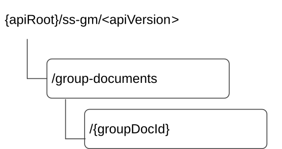

# 7.2.1.2 Resources

## 7.2.1.2.1 Overview

This clause describes the structure for the Resource URIs and the resources and methods used for the service.

Figure 7.2.1.2.1-1 depicts the resource URIs structure for the SS_GroupManagement API.

Figure 7.2.1.2.1-1: Resource URI structure of the SS_GroupManagement API

Table 7.2.1.2.1-1 provides an overview of the resources and applicable HTTP methods.

Table 7.2.1.2.1-1: Resources and methods overview

| Resource name                 | Resource URI                  | HTTP method or custom operation | Description                                                                                                                                                                                                                                                   |
|-------------------------------|-------------------------------|---------------------------------|---------------------------------------------------------------------------------------------------------------------------------------------------------------------------------------------------------------------------------------------------------------|
| VAL Group Documents           | /group-documents              | POST                            | Create a new VAL group document.                                                                                                                                                                                                                              |
|                               |                               | GET                             | Retrieve VAL group documents according to the query parameters. If there are no query parameters, do not fetch any VAL group document.                                                                                                                        |
| Individual VAL Group Document | /group-documents/{groupDocId} | GET                             | Retrieve an individual VAL group's membership and configuration information according to query parameter on the resource identified by {groupDocId}. If there are no query parameter, fetch the whole VAL group document resource identified by {groupDocId}. |
|                               |                               | PUT                             | Update an individual VAL group's membership and configuration information identified by {groupDocId}.                                                                                                                                                         |
|                               |                               | PATCH                           | Partially update an individual VAL group's membership and configuration information identified by {groupDocId}                                                                                                                                                |
|                               |                               | DELETE                          | Deletes an individual VAL group's membership and configuration information identified by {groupDocId}.                                                                                                                                                        |

## 7.2.1.2.2 Resource: VAL Group Documents

### 7.2.1.2.2.1 Description

The VAL Group Documents resource represents all the VAL group documents that are created at a given group management server.

### 7.2.1.2.2.2 Resource Definition

Resource URI: **{apiRoot}/ss-gm/\<apiVersion\>/group-documents**

This resource shall support the resource URI variables defined in the table 7.2.1.2.2.2-1.

Table 7.2.1.2.2.2-1: Resource URI variables for this resource

| Name    | Data Type | Definition          |
|---------|-----------|---------------------|
| apiRoot | string    | See clause 7.2.1.1. |

### 7.2.1.2.2.3 Resource Standard Methods

#### 7.2.1.2.2.3.1 POST

This method shall support the URI query parameters specified in table 7.2.1.2.2.3.1-1.

Table 7.2.1.2.2.3.1-1: URI query parameters supported by the POST method on this resource

|      |           |     |             |             |
|------|-----------|-----|-------------|-------------|
| Name | Data type | P   | Cardinality | Description |
| n/a  |           |     |             |             |

This method shall support the request data structures specified in table 7.2.1.2.2.3.1-2 and the response data structures and response codes specified in table 7.2.1.2.2.3.1-3.

Table 7.2.1.2.2.3.1-2: Data structures supported by the POST Request Body on this resource

|                  |     |             |                                                    |
|------------------|-----|-------------|----------------------------------------------------|
| Data type        | P   | Cardinality | Description                                        |
| VALGroupDocument | M   | 1           | Details of the VAL group that needs to be created, |

Table 7.2.1.2.2.3.1-3: Data structures supported by the POST Response Body on this resource

<table>
<colgroup>
<col style="width: 16%" />
<col style="width: 9%" />
<col style="width: 14%" />
<col style="width: 19%" />
<col style="width: 39%" />
</colgroup>
<tbody>
<tr class="odd">
<td>Data type</td>
<td>P</td>
<td>Cardinality</td>
<td>
Response

codes
</td>
<td>Description</td>
</tr>
<tr class="even">
<td>VALGroupDocument</td>
<td>M</td>
<td>1</td>
<td>201 Created</td>
<td>
VAL group created successfully.

The URI of the created resource shall be returned in the "Location" HTTP header.
</td>
</tr>
<tr class="odd">
<td colspan="5">NOTE: The mandatory HTTP error status codes for the POST method listed in table 5.2.6-1 of 3GPP TS 29.122 [3] also apply.</td>
</tr>
</tbody>
</table>

Table 7.2.1.2.2.3.1-4: Headers supported by the 201 Response Code on this resource

|          |           |     |             |                                                                                                                                         |
|----------|-----------|-----|-------------|-----------------------------------------------------------------------------------------------------------------------------------------|
| Name     | Data type | P   | Cardinality | Description                                                                                                                             |
| Location | string    | M   | 1           | Contains the URI of the newly created resource, according to the structure: {apiRoot}/ss-gm/\<apiVersion\>/group-documents/{groupDocId} |

#### 7.2.1.2.2.3.2 GET

This operation retrieves VAL group documents satisfying filter criteria. This method shall support the URI query parameters specified in table 7.2.1.2.2.3.2-1.

Table 7.2.1.2.2.3.2-1: URI query parameters supported by the GET method on this resource

|                |           |     |             |                                     |
|----------------|-----------|-----|-------------|-------------------------------------|
| Name           | Data type | P   | Cardinality | Description                         |
| val-group-id   | string    | O   | 0..1        | String identifying the VAL group.   |
| val-service-id | string    | O   | 0..1        | String identifying the VAL service. |

This method shall support the request data structures specified in table 7.2.1.2.2.3.2-2 and the response data structures and response codes specified in table 7.2.1.2.2.3.2 -3.

Table 7.2.1.2.2.3.2-2: Data structures supported by the GET Request Body on this resource

|           |     |             |             |
|-----------|-----|-------------|-------------|
| Data type | P   | Cardinality | Description |
| n/a       |     |             |             |

Table 7.2.1.2.2.3.2-3: Data structures supported by the GET Response Body on this resource

<table>
<colgroup>
<col style="width: 16%" />
<col style="width: 9%" />
<col style="width: 14%" />
<col style="width: 19%" />
<col style="width: 39%" />
</colgroup>
<tbody>
<tr class="odd">
<td>Data type</td>
<td>P</td>
<td>Cardinality</td>
<td>
Response

codes
</td>
<td>Description</td>
</tr>
<tr class="even">
<td>array(VALGroupDocument)</td>
<td>M</td>
<td>0..N</td>
<td>200 OK</td>
<td>List of VAL group documents. This response shall include VAL group documents matching the query parameters provided in the request.</td>
</tr>
<tr class="odd">
<td>n/a</td>
<td></td>
<td></td>
<td>307 Temporary Redirect</td>
<td>
Temporary redirection, during resource retrieval. The response shall include a Location header field containing an alternative URI of the resource located in an alternative group management server.

Redirection handling is described in clause 5.2.10 of 3GPP TS 29.122 [3].
</td>
</tr>
<tr class="even">
<td>n/a</td>
<td></td>
<td></td>
<td>308 Permanent Redirect</td>
<td>
Permanent redirection, during resource retrieval. The response shall include a Location header field containing an alternative URI of the resource located in an alternative group management server.

Redirection handling is described in clause 5.2.10 of 3GPP TS 29.122 [3].
</td>
</tr>
<tr class="odd">
<td colspan="5">NOTE: The mandatory HTTP error status codes for the GET method listed in table 5.2.6-1 of 3GPP TS 29.122 [3] also apply.</td>
</tr>
</tbody>
</table>

Table 7.2.1.2.2.3.2-4: Headers supported by the 307 Response Code on this resource

|          |           |     |             |                                                                                       |
|----------|-----------|-----|-------------|---------------------------------------------------------------------------------------|
| Name     | Data type | P   | Cardinality | Description                                                                           |
| Location | string    | M   | 1           | An alternative URI of the resource located in an alternative group management server. |

Table 7.2.1.2.2.3.2-5: Headers supported by the 308 Response Code on this resource

|          |           |     |             |                                                                                       |
|----------|-----------|-----|-------------|---------------------------------------------------------------------------------------|
| Name     | Data type | P   | Cardinality | Description                                                                           |
| Location | string    | M   | 1           | An alternative URI of the resource located in an alternative group management server. |

### 7.2.1.2.2.4 Resource Custom Operations

None.

## 7.2.1.2.3 Resource: Individual VAL Group Document

### 7.2.1.2.3.1 Description

The Individual VAL Group Document resource represents an individual group document that is created at a given group management server.

### 7.2.1.2.3.2 Resource Definition

Resource URI: **{apiRoot}/ss-gm/\<apiVersion\>/group-documents/{groupDocId}**

This resource shall support the resource URI variables defined in the table 7.2.1.2.3.2-1.

Table 7.2.1.2.3.2-1: Resource URI variables for this resource

| Name       | Data Type | Definition                                        |
|------------|-----------|---------------------------------------------------|
| apiRoot    | string    | See clause 7.2.1.1.                               |
| groupDocId | string    | Represents an individual group document resource. |

### 7.2.1.2.3.3 Resource Standard Methods

#### 7.2.1.2.3.3.1 GET

This operation retrieves VAL group information satisfying filter criteria. This method shall support the URI query parameters specified in table 7.2.1.2.3.3.1-1.

Table 7.2.1.2.3.3.1-1: URI query parameters supported by the GET method on this resource

|                     |           |     |             |                                                                                                                                                         |
|---------------------|-----------|-----|-------------|---------------------------------------------------------------------------------------------------------------------------------------------------------|
| Name                | Data type | P   | Cardinality | Description                                                                                                                                             |
| group-members       | boolean   | O   | 0..1        | When set to 'true', it indicates the group management server to send the members list information of the VAL group. Set to false or omitted otherwise.  |
| group-configuration | boolean   | O   | 0..1        | When set to 'true', it indicates the group management server to send the configuration information of the VAL group. Set to false or omitted otherwise. |

This method shall support the request data structures specified in table 7.2.1.2.3.3.1-2 and the response data structures and response codes specified in table 7.2.1.2.3.3.1-3.

Table 7.2.1.2.3.3.1-2: Data structures supported by the GET Request Body on this resource

|           |     |             |             |
|-----------|-----|-------------|-------------|
| Data type | P   | Cardinality | Description |
| n/a       |     |             |             |

Table 7.2.1.2.3.3.1-3: Data structures supported by the GET Response Body on this resource

<table>
<colgroup>
<col style="width: 16%" />
<col style="width: 9%" />
<col style="width: 14%" />
<col style="width: 19%" />
<col style="width: 39%" />
</colgroup>
<tbody>
<tr class="odd">
<td>Data type</td>
<td>P</td>
<td>Cardinality</td>
<td>
Response

codes
</td>
<td>Description</td>
</tr>
<tr class="even">
<td>VALGroupDocument</td>
<td>M</td>
<td>1</td>
<td>200 OK</td>
<td>
The VAL group information based on the request from the VAL server.

This response shall include VAL group members list if group-members flag is set to true in the request, VAL group configuration information if the group-configuration flag is set to true in the request, VAL group identifier, whole VAL group document resource if both group-members and group-configuration flags are omitted/set to false in the request.
</td>
</tr>
<tr class="odd">
<td>n/a</td>
<td></td>
<td></td>
<td>307 Temporary Redirect</td>
<td>
Temporary redirection, during resource retrieval. The response shall include a Location header field containing an alternative URI of the resource located in an alternative group management server.

Redirection handling is described in clause 5.2.10 of 3GPP TS 29.122 [3].
</td>
</tr>
<tr class="even">
<td>n/a</td>
<td></td>
<td></td>
<td>308 Permanent Redirect</td>
<td>
Permanent redirection, during resource retrieval. The response shall include a Location header field containing an alternative URI of the resource located in an alternative group management server.

Redirection handling is described in clause 5.2.10 of 3GPP TS 29.122 [3].
</td>
</tr>
<tr class="odd">
<td colspan="5">NOTE: The mandatory HTTP error status codes for the GET method listed in table 5.2.6-1 of 3GPP TS 29.122 [3] also apply.</td>
</tr>
</tbody>
</table>

Table 7.2.1.2.3.3.1-4: Headers supported by the 307 Response Code on this resource

|          |           |     |             |                                                                                       |
|----------|-----------|-----|-------------|---------------------------------------------------------------------------------------|
| Name     | Data type | P   | Cardinality | Description                                                                           |
| Location | string    | M   | 1           | An alternative URI of the resource located in an alternative group management server. |

Table 7.2.1.2.3.3.1-5: Headers supported by the 308 Response Code on this resource

|          |           |     |             |                                                                                       |
|----------|-----------|-----|-------------|---------------------------------------------------------------------------------------|
| Name     | Data type | P   | Cardinality | Description                                                                           |
| Location | string    | M   | 1           | An alternative URI of the resource located in an alternative group management server. |

#### 7.2.1.2.3.3.2 PUT

This operation updates the VAL group document. This method shall support the URI query parameters specified in table 7.2.1.2.3.3.2-1.

Table 7.2.1.2.3.3.2-1: URI query parameters supported by the PUT method on this resource

|      |           |     |             |             |
|------|-----------|-----|-------------|-------------|
| Name | Data type | P   | Cardinality | Description |
| n/a  |           |     |             |             |

This method shall support the request data structures specified in table 7.2.1.2.3.3.2-2 and the response data structures and response codes specified in table 7.2.1.2.3.3.2-3.

Table 7.2.1.2.3.3.2-2: Data structures supported by the PUT Request Body on this resource

|                  |     |             |                                            |
|------------------|-----|-------------|--------------------------------------------|
| Data type        | P   | Cardinality | Description                                |
| VALGroupDocument | M   | 1           | Updated details of the VAL group document. |

Table 7.2.1.2.3.3.2-3: Data structures supported by the PUT Response Body on this resource

<table>
<colgroup>
<col style="width: 16%" />
<col style="width: 9%" />
<col style="width: 14%" />
<col style="width: 19%" />
<col style="width: 39%" />
</colgroup>
<tbody>
<tr class="odd">
<td>Data type</td>
<td>P</td>
<td>Cardinality</td>
<td>
Response

codes
</td>
<td>Description</td>
</tr>
<tr class="even">
<td>VALGroupDocument</td>
<td>M</td>
<td>1</td>
<td>200 OK</td>
<td>The VAL group document updated successfully and the updated VAL group document returned in the response.</td>
</tr>
<tr class="odd">
<td>n/a</td>
<td></td>
<td></td>
<td>204 No Content</td>
<td>The VAL group document updated successfully.</td>
</tr>
<tr class="even">
<td>n/a</td>
<td></td>
<td></td>
<td>307 Temporary Redirect</td>
<td>
Temporary redirection, during resource modification. The response shall include a Location header field containing an alternative URI of the resource located in an alternative group management server.

Redirection handling is described in clause 5.2.10 of 3GPP TS 29.122 [3].
</td>
</tr>
<tr class="odd">
<td>n/a</td>
<td></td>
<td></td>
<td>308 Permanent Redirect</td>
<td>
Permanent redirection, during resource modification. The response shall include a Location header field containing an alternative URI of the resource located in an alternative group management server.

Redirection handling is described in clause 5.2.10 of 3GPP TS 29.122 [3].
</td>
</tr>
<tr class="even">
<td colspan="5">NOTE: The mandatory HTTP error status codes for the PUT method listed in table 5.2.6-1 of 3GPP TS 29.122 [3] also apply.</td>
</tr>
</tbody>
</table>

Table 7.2.1.2.3.3.2-4: Headers supported by the 307 Response Code on this resource

|          |           |     |             |                                                                                       |
|----------|-----------|-----|-------------|---------------------------------------------------------------------------------------|
| Name     | Data type | P   | Cardinality | Description                                                                           |
| Location | string    | M   | 1           | An alternative URI of the resource located in an alternative group management server. |

Table 7.2.1.2.3.3.2-5: Headers supported by the 308 Response Code on this resource

|          |           |     |             |                                                                                       |
|----------|-----------|-----|-------------|---------------------------------------------------------------------------------------|
| Name     | Data type | P   | Cardinality | Description                                                                           |
| Location | string    | M   | 1           | An alternative URI of the resource located in an alternative group management server. |

#### 7.2.1.2.3.3.3 DELETE

This operation deletes the VAL group document. This method shall support the URI query parameters specified in table 7.2.1.2.3.3.3-1.

Table 7.2.1.2.3.3.3-1: URI query parameters supported by the DELETE method on this resource

|      |           |     |             |             |
|------|-----------|-----|-------------|-------------|
| Name | Data type | P   | Cardinality | Description |
| n/a  |           |     |             |             |

This method shall support the request data structures specified in table 7.2.1.2.3.3.3-2 and the response data structures and response codes specified in table 7.2.1.2.3.3.3-3.

Table 7.2.1.2.3.3.3-2: Data structures supported by the DELETE Request Body on this resource

|           |     |             |             |
|-----------|-----|-------------|-------------|
| Data type | P   | Cardinality | Description |
| n/a       |     |             |             |

Table 7.2.1.2.3.3.3-3: Data structures supported by the DELETE Response Body on this resource

<table>
<colgroup>
<col style="width: 16%" />
<col style="width: 9%" />
<col style="width: 14%" />
<col style="width: 19%" />
<col style="width: 39%" />
</colgroup>
<tbody>
<tr class="odd">
<td>Data type</td>
<td>P</td>
<td>Cardinality</td>
<td>
Response

codes
</td>
<td>Description</td>
</tr>
<tr class="even">
<td>n/a</td>
<td></td>
<td></td>
<td>204 No Content</td>
<td>The individual VAL group document matching the groupDocId is deleted.</td>
</tr>
<tr class="odd">
<td>n/a</td>
<td></td>
<td></td>
<td>307 Temporary Redirect</td>
<td>
Temporary redirection, during resource termination. The response shall include a Location header field containing an alternative URI of the resource located in an alternative group management server.

Redirection handling is described in clause 5.2.10 of 3GPP TS 29.122 [3].
</td>
</tr>
<tr class="even">
<td>n/a</td>
<td></td>
<td></td>
<td>308 Permanent Redirect</td>
<td>
Permanent redirection, during resource termination. The response shall include a Location header field containing an alternative URI of the resource located in an alternative group management server.

Redirection handling is described in clause 5.2.10 of 3GPP TS 29.122 [3].
</td>
</tr>
<tr class="odd">
<td colspan="5">NOTE: The mandatory HTTP error status codes for the DELETE method listed in table 5.2.6-1 of 3GPP TS 29.122 [3] also apply.</td>
</tr>
</tbody>
</table>

Table 7.2.1.2.3.3.3-4: Headers supported by the 307 Response Code on this resource

|          |           |     |             |                                                                                       |
|----------|-----------|-----|-------------|---------------------------------------------------------------------------------------|
| Name     | Data type | P   | Cardinality | Description                                                                           |
| Location | string    | M   | 1           | An alternative URI of the resource located in an alternative group management server. |

Table 7.2.1.2.3.3.3-5: Headers supported by the 308 Response Code on this resource

|          |           |     |             |                                                                                       |
|----------|-----------|-----|-------------|---------------------------------------------------------------------------------------|
| Name     | Data type | P   | Cardinality | Description                                                                           |
| Location | string    | M   | 1           | An alternative URI of the resource located in an alternative group management server. |

#### 7.2.1.2.3.3.4 PATCH

This method shall support the URI query parameters specified in table 7.2.1.2.3.3.4-1.

Table 7.2.1.2.3.3.4-1: URI query parameters supported by the PATCH method on this resource

| Name | Data type | P   | Cardinality | Description |
|------|-----------|-----|-------------|-------------|
| n/a  |           |     |             |             |

This method shall support the request data structures specified in table 7.2.1.2.3.3.4-2 and the response data structures and response codes specified in table 7.2.1.2.3.3.4-3.

Table 7.2.1.2.3.3.4-2: Data structures supported by the PATCH Request Body on this resource

| Data type             | P   | Cardinality | Description                                                                             |
|-----------------------|-----|-------------|-----------------------------------------------------------------------------------------|
| VALGroupDocumentPatch | M   | 1           | Contains the modifications to be applied to the Individual VAL Group Document resource. |

Table 7.2.1.2.3.3.4-3: Data structures supported by the PATCH Response Body on this resource

<table>
<colgroup>
<col style="width: 21%" />
<col style="width: 3%" />
<col style="width: 11%" />
<col style="width: 10%" />
<col style="width: 53%" />
</colgroup>
<thead>
<tr class="header">
<th>Data type</th>
<th>P</th>
<th>Cardinality</th>
<th>
Response

codes
</th>
<th>Description</th>
</tr>
</thead>
<tbody>
<tr class="odd">
<td>VALGroupDocument</td>
<td>M</td>
<td>1</td>
<td>200 OK</td>
<td>Individual VAL Group Document resource is modified successfully and representation of the modified VAL Group Document resource is returned.</td>
</tr>
<tr class="even">
<td>n/a</td>
<td></td>
<td></td>
<td>204 No Content</td>
<td>The Individual VAL Group Document resource is updated successfully.</td>
</tr>
<tr class="odd">
<td>n/a</td>
<td></td>
<td></td>
<td>307 Temporary Redirect</td>
<td>
Temporary redirection, during resource termination. The response shall include a Location header field containing an alternative URI of the resource located in an alternative SEAL server.

Redirection handling is described in clause 5.2.10 of 3GPP TS 29.122 [3].
</td>
</tr>
<tr class="even">
<td>n/a</td>
<td></td>
<td></td>
<td>308 Permanent Redirect</td>
<td>
Permanent redirection, during resource termination. The response shall include a Location header field containing an alternative URI of the resource located in an alternative SEAL server.

Redirection handling is described in clause 5.2.10 of 3GPP TS 29.122 [3].
</td>
</tr>
<tr class="odd">
<td colspan="5">NOTE: The mandatory HTTP error status codes for the PATCH method listed in table 5.2.6-1 of 3GPP TS 29.122 [3] also apply.</td>
</tr>
</tbody>
</table>

Table 7.2.1.2.3.3.4-4: Headers supported by the 307 Response Code on this resource

|          |           |     |             |                                                                           |
|----------|-----------|-----|-------------|---------------------------------------------------------------------------|
| Name     | Data type | P   | Cardinality | Description                                                               |
| Location | string    | M   | 1           | An alternative URI of the resource located in an alternative SEAL server. |

Table 7.2.1.2.3.3.4-5: Headers supported by the 308 Response Code on this resource

|          |           |     |             |                                                                           |
|----------|-----------|-----|-------------|---------------------------------------------------------------------------|
| Name     | Data type | P   | Cardinality | Description                                                               |
| Location | string    | M   | 1           | An alternative URI of the resource located in an alternative SEAL server. |

### 7.2.1.2.3.4 Resource Custom Operations

None.
