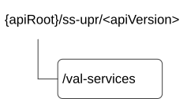

# 7.3.1 SS_UserProfileRetrieval API

## 7.3.1.1 API URI

The SS_UserProfileRetrieval service shall use the SS_UserProfileRetrieval API.

The request URIs used in HTTP requests from the VAL server towards the Configuration management server shall have the Resource URI structure as defined in clause 6.5 with the following clarifications:

\- The \<apiName\> shall be "ss-upr".

\- The \<apiVersion\> shall be "v1".

\- The \<apiSpecificSuffixes\> shall be set as described in clause 7.3.1.2.

## 7.3.1.2 Resources

### 7.3.1.2.1 Overview

This clause describes the structure for the Resource URIs and the resources and methods used for the service.

Figure 7.3.1.2.1-1 depicts the resource URIs structure for the SS_UserProfileRetrieval API.

Figure 7.3.1.2.1-1: Resource URI structure of the SS_UserProfileRetrieval API

Table 7.3.1.2.1-1 provides an overview of the resources and applicable HTTP methods.

Table 7.3.1.2.1-1: Resources and methods overview

| Resource name | Resource URI  | HTTP method or custom operation | Description                                        |
|---------------|---------------|---------------------------------|----------------------------------------------------|
| VAL Services  | /val-services | GET                             | Retrieve VAL User or VAL UE's profile information. |

### 7.3.1.2.2 Resource: VAL Services

#### 7.3.1.2.2.1 Description

The VAL Services resource represents all the VAL services that are created at a given configuration management server.

#### 7.3.1.2.2.2 Resource Definition

Resource URI: **{apiRoot}/ss-upr/\<apiVersion\>/val-services**

This resource shall support the resource URI variables defined in the table 7.3.1.2.2.2-1.

Table 7.3.1.2.2.2-1: Resource URI variables for this resource

| Name    | Data Type | Definition          |
|---------|-----------|---------------------|
| apiRoot | string    | See clause 7.3.1.1. |

#### 7.3.1.2.2.3 Resource Standard Methods

##### 7.3.1.2.2.3.1 GET

This operation retrieves VAL User or VAL UE profile information satisfying the filter criteria. This method shall support the URI query parameters specified in table 7.3.1.2.2.3.1-1.

Table 7.3.1.2.2.3.1-1: URI query parameters supported by the GET method on this resource

|                |             |     |             |                                   |
|----------------|-------------|-----|-------------|-----------------------------------|
| Name           | Data type   | P   | Cardinality | Description                       |
| val-tgt-ue     | ValTargetUe | M   | 1           | Identifying a VAL target UE.      |
| val-service-id | string      | O   | 0..1        | String identifying a VAL service. |

This method shall support the request data structures specified in table 7.3.1.2.2.3.1-2 and the response data structures and response codes specified in table 7.3.1.2.2.3.1 -3.

Table 7.3.1.2.2.3.1-2: Data structures supported by the GET Request Body on this resource

|           |     |             |             |
|-----------|-----|-------------|-------------|
| Data type | P   | Cardinality | Description |
| n/a       |     |             |             |

Table 7.3.1.2.2.3.1-3: Data structures supported by the GET Response Body on this resource

<table>
<colgroup>
<col style="width: 16%" />
<col style="width: 9%" />
<col style="width: 14%" />
<col style="width: 19%" />
<col style="width: 39%" />
</colgroup>
<tbody>
<tr class="odd">
<td>Data type</td>
<td>P</td>
<td>Cardinality</td>
<td>
Response

codes
</td>
<td>Description</td>
</tr>
<tr class="even">
<td>array(ProfileDoc)</td>
<td>M</td>
<td>0..N</td>
<td>200 OK</td>
<td>List of VAL User / VAL UE profile documents. This response shall include user profile information matching the query parameters provided in the request.</td>
</tr>
<tr class="odd">
<td>n/a</td>
<td></td>
<td></td>
<td>307 Temporary Redirect</td>
<td>
Temporary redirection, during resource retrieval. The response shall include a Location header field containing an alternative URI of the resource located in an alternative configuration management server.

Redirection handling is described in clause 5.2.10 of 3GPP TS 29.122 [3].
</td>
</tr>
<tr class="even">
<td>n/a</td>
<td></td>
<td></td>
<td>308 Permanent Redirect</td>
<td>
Permanent redirection, during resource retrieval. The response shall include a Location header field containing an alternative URI of the resource located in an alternative configuration management server.

Redirection handling is described in clause 5.2.10 of 3GPP TS 29.122 [3].
</td>
</tr>
<tr class="odd">
<td colspan="5">NOTE: The mandatory HTTP error status codes for the GET method listed in table 5.2.6-1 of 3GPP TS 29.122 [3] also apply.</td>
</tr>
</tbody>
</table>

Table 7.3.1.2.2.3.1-4: Headers supported by the 307 Response Code on this resource

|          |           |     |             |                                                                                               |
|----------|-----------|-----|-------------|-----------------------------------------------------------------------------------------------|
| Name     | Data type | P   | Cardinality | Description                                                                                   |
| Location | string    | M   | 1           | An alternative URI of the resource located in an alternative configuration management server. |

Table 7.3.1.2.2.3.1-5: Headers supported by the 308 Response Code on this resource

|          |           |     |             |                                                                                               |
|----------|-----------|-----|-------------|-----------------------------------------------------------------------------------------------|
| Name     | Data type | P   | Cardinality | Description                                                                                   |
| Location | string    | M   | 1           | An alternative URI of the resource located in an alternative configuration management server. |

#### 7.3.1.2.2.4 Resource Custom Operations

None.

## 7.3.1.3 Notifications

None.

## 7.3.1.4 Data Model

### 7.3.1.4.1 General

This clause specifies the application data model supported by the API. Data types listed in clause 6.2 apply to this API

Table 7.3.1.4.1-1 specifies the data types defined specifically for the SS_UserProfileRetrieval API service.

Table 7.3.1.4.1-1: SS_UserProfileRetrieval API specific Data Types

| Data type     | Section defined | Description                                                                                              | Applicability |
|---------------|-----------------|----------------------------------------------------------------------------------------------------------|---------------|
| ProfileDoc    | 7.3.1.4.2.2     | Represents the profile information associated with VAL user ID or VAL UE ID.                             |               |
| ValTargetUe   | 7.3.1.4.2.3     | Represents the information identifying a VAL user ID or VAL UE ID.                                       |               |
| ValTargetUeRm | 7.3.1.4.2.4     | Represents the same as the ValTargetUe data type but with the OpenAPI "nullable" property set to "true". |               |

Table 7.3.1.4.1-2 specifies data types re-used by the SS_UserProfileRetrieval API service.

Table 7.3.1.4.1-2: Re-used Data Types

| Data type | Reference | Comments | Applicability |
|-----------|-----------|----------|---------------|
| n/a       |           |          |               |

### 7.3.1.4.2 Structured data types

#### 7.3.1.4.2.1 Introduction

#### 7.3.1.4.2.2 Type: ProfileDoc

Table 7.3.1.4.2.2-1: Definition of type ProfileDoc

| Attribute name     | Data type   | P   | Cardinality | Description                                   | Applicability |
|--------------------|-------------|-----|-------------|-----------------------------------------------|---------------|
| profileInformation | string      | M   | 1           | Profile information associated with valTgtUe. |               |
| valTgtUe           | ValTargetUe | M   | 1           | Unique identifier of a VAL user or a VAL UE.  |               |

#### 7.3.1.4.2.3 Type: ValTargetUe

Table 7.3.1.4.2.3-1: Definition of type ValTargetUe

| Attribute name                                           | Data type | P   | Cardinality | Description                      | Applicability |
|----------------------------------------------------------|-----------|-----|-------------|----------------------------------|---------------|
| valUserId                                                | string    | O   | 0..1        | Unique identifier of a VAL user. |               |
| valUeId                                                  | string    | O   | 0..1        | Unique identifier of a VAL UE.   |               |
| NOTE: Either "valUserId" or "valUeId" shall be provided. |           |     |             |                                  |               |

#### 7.3.1.4.2.4 Type: ValTargetUeRm

This data type is defined in the same way as the "ValTargetUe" data type, but with the OpenAPI "nullable" preperty set to "true".

### 7.3.1.4.3 Simple data types and enumerations

None.

## 7.3.1.5 Error Handling

### 7.3.1.5.1 General

HTTP error handling shall be supported as specified in clause 6.7.

In addition, the requirements in the following clauses shall apply.

### 7.3.1.5.2 Protocol Errors

In this Release of the specification, there are no additional protocol errors applicable for the SS_UserProfileRetrieval API.

### 7.3.1.5.3 Application Errors

The application errors defined for SS_UserProfileRetrieval API are listed in table 7.3.1.5.3-1.

Table 7.3.1.5.3-1: Application errors

| Application Error | HTTP status code | Description | Applicability |
|-------------------|------------------|-------------|---------------|
|                   |                  |             |               |

## 7.3.1.6 Feature negotiation

General feature negotiation procedures are defined in clause 6.8.

Table 7.3.1.6-1: Supported Features

| Feature number | Feature Name | Description |
|----------------|--------------|-------------|
|                |              |             |
