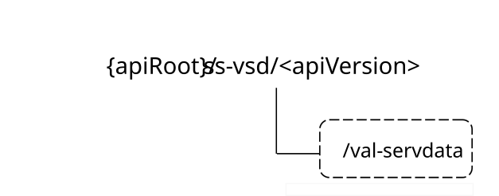

# 7.3.2 SS_VALServiceData API

## 7.3.2.1 API URI

The SS_VALServiceData service shall use the SS_VALServiceData API.

The API URI of the SS_VALServiceData API shall be:

**{apiRoot}/\<apiName\>/\<apiVersion\>**

The request URIs used in HTTP requests shall have the Resource URI structure as defined in clause 6.5, i.e.:

**{apiRoot}/\<apiName\>/\<apiVersion\>/\<apiSpecificSuffixes\>**

with the following components:

\- The {apiRoot} shall be set as described in clause 6.5.

\- The \<apiName\> shall be "ss-vsd".

\- The \<apiVersion\> shall be "v1".

\- The \<apiSpecificSuffixes\> shall be set as described in clause 7.3.1.2.

## 7.3.2.1A Usage of HTTP

The provisions of clause 6.3 shall apply for the SS_VALServiceData API.

## 7.3.2.2 Resources

### 7.3.2.2.1 Overview

This clause describes the structure for the Resource URIs and the resources and methods used for the service.

Figure 7.3.2.2.1-1 depicts the resource URIs structure for the SS_VALServiceData API.

Figure 7.3.2.2.1-1: Resource URI structure of the SS_VALServiceData API

Table 7.3.2.2.1-1 provides an overview of the resources and applicable HTTP methods.

Table 7.3.2.2.1-1: Resources and methods overview

| Resource name         | Resource URI  | HTTP method or custom operation | Description                                                                 |
|-----------------------|---------------|---------------------------------|-----------------------------------------------------------------------------|
| VAL Service Data Sets | /val-servdata | GET                             | Retrieve the VAL service data according to the provided query parameter(s). |

### 7.3.2.2.2 Resource: VAL Service Data Sets

#### 7.3.2.2.2.1 Description

This resource represents the collection of VAL Service Data resources managed by the CM Server.

#### 7.3.2.2.2.2 Resource Definition

Resource URI: **{apiRoot}/ss-vsd/\<apiVersion\>/val-servdata**

This resource shall support the resource URI variables defined in the table 7.3.2.2.2.2-1.

Table 7.3.2.2.2.2-1: Resource URI variables for this resource

| Name    | Data Type | Definition      |
|---------|-----------|-----------------|
| apiRoot | string    | See clause 6.5. |

#### 7.3.2.2.2.3 Resource Standard Methods

##### 7.3.2.2.2.3.1 GET

This operation retrieves the VAL service data satisfying the filter criteria. This method shall support the URI query parameters specified in table 7.3.2.2.2.3.1-1.

Table 7.3.2.2.2.3.1-1: URI query parameters supported by the GET method on this resource

<table>
<colgroup>
<col style="width: 16%" />
<col style="width: 18%" />
<col style="width: 4%" />
<col style="width: 12%" />
<col style="width: 47%" />
</colgroup>
<tbody>
<tr class="odd">
<td>Name</td>
<td>Data type</td>
<td>P</td>
<td>Cardinality</td>
<td>Description</td>
</tr>
<tr class="even">
<td>val-tgt-ues</td>
<td>array(string)</td>
<td>O</td>
<td>1..N</td>
<td>Identifying the list of the target VAL UE(s). (NOTE)</td>
</tr>
<tr class="odd">
<td>val-tgt-users</td>
<td>array(string)</td>
<td>O</td>
<td>1..N</td>
<td>Identifying the list of the target VAL user(s). (NOTE)</td>
</tr>
<tr class="even">
<td>val-service-ids</td>
<td>array(string)</td>
<td>O</td>
<td>1..N</td>
<td>Identifying the list of the target VAL service(s). (NOTE)</td>
</tr>
<tr class="odd">
<td>supp-feats</td>
<td>SupportedFeatures</td>
<td>C</td>
<td>0..1</td>
<td>
Contains the list of supported feature(s) among the ones defined in clause 7.3.2.7.

This query parameter shall be present only when feature negotiation needs to take place.
</td>
</tr>
<tr class="even">
<td colspan="5">NOTE: At least one of these query parameters shall be present, unless the request targets to retrieve all the VAL Service Data Sets managed by the CM Server.</td>
</tr>
</tbody>
</table>

This method shall support the request data structures specified in table 7.3.2.2.2.3.1-2 and the response data structures and response codes specified in table 7.3.2.2.2.3.1-3.

Table 7.3.2.2.2.3.1-2: Data structures supported by the GET Request Body on this resource

|           |     |             |             |
|-----------|-----|-------------|-------------|
| Data type | P   | Cardinality | Description |
| n/a       |     |             |             |

Table 7.3.2.2.2.3.1-3: Data structures supported by the GET Response Body on this resource

<table>
<colgroup>
<col style="width: 16%" />
<col style="width: 9%" />
<col style="width: 14%" />
<col style="width: 19%" />
<col style="width: 39%" />
</colgroup>
<tbody>
<tr class="odd">
<td>Data type</td>
<td>P</td>
<td>Cardinality</td>
<td>
Response

codes
</td>
<td>Description</td>
</tr>
<tr class="even">
<td>ValServDataResp</td>
<td>M</td>
<td>1</td>
<td>200 OK</td>
<td>Represents the requested VAL service data.</td>
</tr>
<tr class="odd">
<td>n/a</td>
<td></td>
<td></td>
<td>307 Temporary Redirect</td>
<td>
Temporary redirection, during resource retrieval. The response shall include a Location header field containing an alternative URI of the resource located in an alternative CM Server.

Redirection handling is described in clause 5.2.10 of 3GPP TS 29.122 [3].
</td>
</tr>
<tr class="even">
<td>n/a</td>
<td></td>
<td></td>
<td>308 Permanent Redirect</td>
<td>
Permanent redirection, during resource retrieval. The response shall include a Location header field containing an alternative URI of the resource located in an alternative CM Server.

Redirection handling is described in clause 5.2.10 of 3GPP TS 29.122 [3].
</td>
</tr>
<tr class="odd">
<td colspan="5">NOTE: The mandatory HTTP error status codes for the GET method listed in table 5.2.6-1 of 3GPP TS 29.122 [3] also apply.</td>
</tr>
</tbody>
</table>

Table 7.3.2.2.2.3.1-4: Headers supported by the 307 Response Code on this resource

|          |           |     |             |                                                                         |
|----------|-----------|-----|-------------|-------------------------------------------------------------------------|
| Name     | Data type | P   | Cardinality | Description                                                             |
| Location | string    | M   | 1           | An alternative URI of the resource located in an alternative CM Server. |

Table 7.3.2.2.2.3.1-5: Headers supported by the 308 Response Code on this resource

|          |           |     |             |                                                                         |
|----------|-----------|-----|-------------|-------------------------------------------------------------------------|
| Name     | Data type | P   | Cardinality | Description                                                             |
| Location | string    | M   | 1           | An alternative URI of the resource located in an alternative CM server. |

#### 7.3.2.2.2.4 Resource Custom Operations

There are no resource custom operations defined for this resource in this release of the specification.

## 7.3.2.3 Custom Operations without associated resources

There are no custom operations without associated resources defined for this API in this release of the specification.

## 7.3.2.4 Notifications

There are no notifications defined for this API in this release of the specification.

## 7.3.2.5 Data Model

### 7.3.2.5.1 General

This clause specifies the application data model supported by the API. Data types listed in clause 6.2 apply to this API.

Table 7.3.2.5.1-1 specifies the data types defined specifically for the SS_VALServiceData API service.

Table 7.3.2.5.1-1: SS_VALServiceData API specific Data Types

| Data type       | Section defined | Description                                                      | Applicability |
|-----------------|-----------------|------------------------------------------------------------------|---------------|
| ValServDataResp | 7.3.2.5.2.2     | Represents the response to a VAL service data retrieval request. |               |
| ValServiceData  | 7.3.2.5.2.3     | Represents the VAL service data.                                 |               |

Table 7.3.2.5.1-2 specifies data types re-used by the SS_VALServiceData API service.

Table 7.3.2.5.1-2: SS_VALServiceData re-used Data Types

| Data type         | Reference             | Comments                                                                                                      | Applicability |
|-------------------|-----------------------|---------------------------------------------------------------------------------------------------------------|---------------|
| SupportedFeatures | 3GPP TS 29.571 \[21\] | Represents the list of supported feature(s) and used to negotiate the applicability of the optional features. |               |
| ValTargetUe       | 7.3.1.4.2.3           | Used to indicate the VAL user ID or VAL UE ID.                                                                |               |

### 7.3.2.5.2 Structured data types

#### 7.3.2.5.2.1 Introduction

This clause defines the structures to be used in resource representations.

#### 7.3.2.5.2.2 Type: ValServDataResp

Table 7.3.2.5.2.2-1: Definition of type ValServDataResp

<table style="width:100%;">
<colgroup>
<col style="width: 14%" />
<col style="width: 11%" />
<col style="width: 4%" />
<col style="width: 13%" />
<col style="width: 41%" />
<col style="width: 15%" />
</colgroup>
<thead>
<tr class="header">
<th>Attribute name</th>
<th>Data type</th>
<th>P</th>
<th>Cardinality</th>
<th>Description</th>
<th>Applicability</th>
</tr>
</thead>
<tbody>
<tr class="odd">
<td>valServData</td>
<td>array(ValServiceData)</td>
<td>M</td>
<td>0..N</td>
<td>
Contains the requested VAL service data.

If an empty array is provided within this attribute, this means that no VAL service data set satisfies the provided query parameter(s) in the corresponding request.
</td>
<td></td>
</tr>
<tr class="even">
<td>suppFeats</td>
<td>SupportedFeatures</td>
<td>C</td>
<td>0..1</td>
<td>
Contains the list of supported features among the ones defined in clause 7.3.2.7.

This attribute shall be present only when feature negotiation needs to take place.
</td>
<td></td>
</tr>
</tbody>
</table>

#### 7.3.2.5.2.3 Type: ValServiceData

Table 7.3.2.5.2.3-1: Definition of type ValServiceData

| Attribute name  | Data type     | P   | Cardinality | Description                                                                                                              | Applicability |
|-----------------|---------------|-----|-------------|--------------------------------------------------------------------------------------------------------------------------|---------------|
| valTgtUe        | ValTargetUe   | M   | 1           | Contains the unique identifier of a VAL user or a VAL UE.                                                                |               |
| valServIds      | array(string) | M   | 1..N        | Contains the list of the VAL service(s) associated with the VAL user or VAL UE provided within the "valTgtUe" attribute. |               |
| valServSpecInfo | string        | O   | 0..1        | Contains the VAL service specific information.                                                                           |               |

### 7.3.2.5.3 Simple data types and enumerations

#### 7.3.2.5.3.1 Introduction

This clause defines simple data types and enumerations that can be referenced from data structures defined in the previous clauses.

#### 7.3.2.5.3.2 Simple data types

The simple data types defined in table 7.3.2.5.3.2-1 shall be supported.

Table 7.3.2.5.3.2-1: Simple data types

|           |             |
|-----------|-------------|
| Type name | Description |
|           |             |

### 7.3.2.5.4 Data types describing alternative data types or combinations of data types

There are no data types describing alternative data types or combinations of data types defined for this API in this release of the specification.

### 7.3.2.5.5 Binary data

#### 7.3.2.5.5.1 Binary Data Types

Table 7.3.2.5.5.1-1: Binary Data Types

| Name | Clause defined | Content type |
|------|----------------|--------------|
|      |                |              |

## 7.3.2.6 Error Handling

### 7.3.2.6.1 General

HTTP error handling shall be supported as specified in clause 6.7.

In addition, the requirements in the following clauses shall apply.

### 7.3.2.6.2 Protocol Errors

In this Release of the specification, there are no additional protocol errors applicable for the SS_VALServiceData API.

### 7.3.2.6.3 Application Errors

The application errors defined for SS_VALServiceData API are listed in table 7.3.2.6.3-1.

Table 7.3.2.6.3-1: Application errors

| Application Error | HTTP status code | Description | Applicability |
|-------------------|------------------|-------------|---------------|
|                   |                  |             |               |

## 7.3.2.7 Feature negotiation

The optional features in table 7.3.2.7-1 are defined for the SS_VALServiceData API. They shall be negotiated using the extensibility mechanism defined in clause 6.8.

Table 7.3.2.7-1: Supported Features

| Feature number | Feature Name | Description |
|----------------|--------------|-------------|
|                |              |             |
