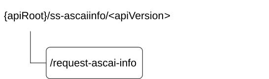

# 7.3.3 SS_ASCAIInfoRetrieval API

## 7.3.3.1 API URI

The SS_ASCAIInfoRetrieval service shall use the SS_ASCAIInfoRetrieval API.

The API URI of the SS_ASCAIInfoRetrieval API shall be:

**{apiRoot}/\<apiName\>/\<apiVersion\>**

The request URIs used in HTTP requests shall have the Resource URI structure as defined in clause 6.5, i.e.:

**{apiRoot}/\<apiName\>/\<apiVersion\>/\<apiSpecificSuffixes\>**

with the following components:

\- The {apiRoot} shall be set as described in clause 6.5.

\- The \<apiName\> shall be "ss-ascaiinfo".

\- The \<apiVersion\> shall be "v1".

\- The \<apiSpecificSuffixes\> shall be set as described in clause 7.3.3.2 and 7.3.3.3.

NOTE: When 3GPP TS 29.122 \[3\] is referenced for the common protocol and interface aspects for API definition in the clauses under clause 7.3.3, the CM Server takes the role of the SCEF and the service consumer takes the role of the SCS/AS.

## 7.3.3.2 Resources

There are no resources defined in this release of the specification.

## 7.3.3.3 Custom Operations without associated resources

### 7.3.3.3.1 Overview

The structure of the custom operation URIs of the SS_ASCAIInfoRetrieval API is shown in Figure 7.3.3.3.1-1.

Figure 7.3.3.3.1-1: Custom operation URI structure of the SS_ASCAIInfoRetrieval API

Table 7.3.3.3.1-1 provides an overview of the custom operations and applicable HTTP methods defined for the SS_ASCAIInfoRetrieval API.

Table 7.3.3.3.1-1: Custom operations without associated resources

| Custom operation name | Custom operation URI | Mapped HTTP method | Description                                                                                    |
|-----------------------|----------------------|--------------------|------------------------------------------------------------------------------------------------|
| RequestASCAIInfo      | /request-ascai-info  | POST               | Enables a service consumer to request Application Satellite Coverage Availability Information. |

The custom operations shall support the URI variables defined in table 7.3.3.3.1-2.

Table 7.3.3.3.1-2: URI variables for this custom operation

| Name    | Data type | Definition          |
|---------|-----------|---------------------|
| apiRoot | string    | See clause 7.3.3.1. |

### 7.3.3.3.2 Operation: RequestASCAIInfo

#### 7.3.3.3.2.1 Description

The custom operation enables a service consumer to request Application Satellite Coverage Availability Information.

#### 7.3.3.3.2.2 Operation Definition

This operation shall support the response data structures and response codes specified in tables 7.3.3.3.2.2-1 and 7.3.3.3.2.2-2.

Table 7.3.3.3.2.2-1: Data structures supported by the POST Request Body on this resource

|              |     |             |                                                                                             |
|--------------|-----|-------------|---------------------------------------------------------------------------------------------|
| Data type    | P   | Cardinality | Description                                                                                 |
| AscaiInfoReq | M   | 1           | Contains the parameters to request Application Satellite Coverage Availability Information. |

Table 7.3.3.3.2.2-2: Data structures supported by the POST Response Body on this resource

<table>
<colgroup>
<col style="width: 16%" />
<col style="width: 4%" />
<col style="width: 12%" />
<col style="width: 11%" />
<col style="width: 54%" />
</colgroup>
<tbody>
<tr class="odd">
<td>Data type</td>
<td>P</td>
<td>Cardinality</td>
<td>
Response

codes
</td>
<td>Description</td>
</tr>
<tr class="even">
<td>AscaiInfoResp</td>
<td>M</td>
<td>1</td>
<td>200 OK</td>
<td>Successful case. The requested Application Satellite Coverage Availability Information is returned in the response body.</td>
</tr>
<tr class="odd">
<td>n/a</td>
<td></td>
<td></td>
<td>307 Temporary Redirect</td>
<td>
Temporary redirection.

The response shall include a Location header field containing an alternative URI of the resource located in an alternative CM Server.

Redirection handling is described in clause 5.2.10 of 3GPP TS 29.122 [3].
</td>
</tr>
<tr class="even">
<td>n/a</td>
<td></td>
<td></td>
<td>308 Permanent Redirect</td>
<td>
Permanent redirection.

The response shall include a Location header field containing an alternative URI of the resource located in an alternative CM Server.

Redirection handling is described in clause 5.2.10 of 3GPP TS 29.122 [3].
</td>
</tr>
<tr class="odd">
<td colspan="5">NOTE: The manadatory HTTP error status codes for the HTTP POST method listed in table 5.2.6-1 of 3GPP TS 29.122 [3] shall also apply.</td>
</tr>
</tbody>
</table>

Table 7.3.3.3.2.2.1-3: Headers supported by the 307 Response Code on this resource

|          |           |     |             |                                                                                  |
|----------|-----------|-----|-------------|----------------------------------------------------------------------------------|
| Name     | Data type | P   | Cardinality | Description                                                                      |
| Location | string    | M   | 1           | Contains an alternative URI of the resource located in an alternative CM Server. |

Table 7.3.3.3.2.2.1-4: Headers supported by the 308 Response Code on this resource

|          |           |     |             |                                                                                  |
|----------|-----------|-----|-------------|----------------------------------------------------------------------------------|
| Name     | Data type | P   | Cardinality | Description                                                                      |
| Location | string    | M   | 1           | Contains an alternative URI of the resource located in an alternative CM Server. |

## 7.3.3.4 Notifications

There are no notifications defined for this API in this release of the specification.

## 7.3.3.5 Data Model

### 7.3.3.5.1 General

This clause specifies the application data model supported by the API. Data types listed in clause 6.2 apply to this API.

Table 7.3.3.5.1-1 specifies the data types defined specifically for the SS_ASCAIInfoRetrieval API service.

Table 7.3.3.5.1-1: SS_ASCAIInfoRetrieval API specific Data Types

| Data type      | Section defined | Description                                                                                                 | Applicability |
|----------------|-----------------|-------------------------------------------------------------------------------------------------------------|---------------|
| AscaiInfo      | 7.3.3.5.2.6     | Represents the Application Satellite Coverage Availability Information.                                     |               |
| AscaiInfoData  | 7.3.3.5.2.5     | Represents the Application Satellite Coverage Availability Information data.                                |               |
| AscaiInfoReq   | 7.3.3.5.2.2     | Represents the Application Satellite Coverage Availability Information request data.                        |               |
| AscaiInfoReqUe | 7.3.3.5.2.3     | Represents the Application Satellite Coverage Availability Information request data per target VAL UE/user. |               |
| AscaiInfoResp  | 7.3.3.5.2.4     | Represents the Application Satellite Coverage Availability Information response data.                       |               |

Table 7.3.3.5.1-2 specifies data types re-used by the SS_ASCAIInfoRetrieval API service.

Table 7.3.3.5.1-2: SS_ASCAIInfoRetrieval re-used Data Types

| Data type         | Reference             | Comments                                                                                                      | Applicability |
|-------------------|-----------------------|---------------------------------------------------------------------------------------------------------------|---------------|
| GeographicArea    | 3GPP TS 29.572 \[31   | Represents the geographical area.                                                                             |               |
| LocationInfo      | 3GPP TS 29.122 \[3\]  | Represents the location information.                                                                          |               |
| TimeWindow        | 3GPP TS 29.122 \[3\]  | Represents a time window.                                                                                     |               |
| RatType           | 3GPP TS 29.571 \[21   | Represents the RAT type.                                                                                      |               |
| SupportedFeatures | 3GPP TS 29.571 \[21\] | Represents the list of supported feature(s) and used to negotiate the applicability of the optional features. |               |
| ValTargetUe       | Clause 7.3.1.4.2.3    | Represents the identifier of a VAL UE or VAL user.                                                            |               |

### 7.3.3.5.2 Structured data types

#### 7.3.3.5.2.1 Introduction

This clause defines the structures to be used in resource representations.

#### 7.3.3.5.2.2 Type: AscaiInfoReq

Table 7.3.3.5.2.2-1: Definition of type AscaiInfoReq

<table style="width:100%;">
<colgroup>
<col style="width: 14%" />
<col style="width: 11%" />
<col style="width: 4%" />
<col style="width: 13%" />
<col style="width: 41%" />
<col style="width: 15%" />
</colgroup>
<thead>
<tr class="header">
<th>Attribute name</th>
<th>Data type</th>
<th>P</th>
<th>Cardinality</th>
<th>Description</th>
<th>Applicability</th>
</tr>
</thead>
<tbody>
<tr class="odd">
<td>ascaiReqs</td>
<td>array(AscaiInfoReqUe)</td>
<td>M</td>
<td>1..N</td>
<td>Contains the ASCAI request related information.</td>
<td></td>
</tr>
<tr class="even">
<td>suppFeat</td>
<td>SupportedFeatures</td>
<td>C</td>
<td>0..1</td>
<td>
Contains the list of supported feature(s) among the ones defined in clause 7.3.3.7.

This attribute shall be present only when feature negotiation is required.
</td>
<td></td>
</tr>
</tbody>
</table>

#### 7.3.3.5.2.3 Type: AscaiInfoReqUe

Table 7.3.3.5.2.3-1: Definition of type AscaiInfoReqUe

| Attribute name | Data type    | P   | Cardinality | Description                                                                       | Applicability |
|----------------|--------------|-----|-------------|-----------------------------------------------------------------------------------|---------------|
| valTgtUe       | ValTargetUe  | M   | 1           | Contains the identifier of the target VAL UE/user.                                |               |
| valSvcId       | string       | O   | 0..1        | Contains the identifier of the target VAL service.                                |               |
| satId          | string       | O   | 0..1        | Contains the identifier of the dedicated satellite for the requested VAL UE/user. |               |
| locInfo        | LocationInfo | O   | 0..1        | Contains the current location information for the requested VAL UE/user.          |               |

#### 7.3.3.5.2.4 Type: AscaiInfoResp

Table 7.3.3.5.2.4-1: Definition of type AscaiInfoResp

<table style="width:100%;">
<colgroup>
<col style="width: 14%" />
<col style="width: 11%" />
<col style="width: 4%" />
<col style="width: 13%" />
<col style="width: 41%" />
<col style="width: 15%" />
</colgroup>
<thead>
<tr class="header">
<th>Attribute name</th>
<th>Data type</th>
<th>P</th>
<th>Cardinality</th>
<th>Description</th>
<th>Applicability</th>
</tr>
</thead>
<tbody>
<tr class="odd">
<td>ascaiInfoData</td>
<td>array(AscaiInfoData)</td>
<td>M</td>
<td>0..N</td>
<td>
Contains the requested Application Satellite Coverage Availability Information data.

If there is no Application Satellite Coverage Availability Information data corresponding to the received parameters in the corresponding request, then an empty array is returned.
</td>
<td></td>
</tr>
<tr class="even">
<td>suppFeat</td>
<td>SupportedFeatures</td>
<td>C</td>
<td>0..1</td>
<td>
Contains the list of supported feature(s) among the ones defined in clause 7.3.3.7.

This attribute shall be present only when feature negotiation is required.
</td>
<td></td>
</tr>
</tbody>
</table>

#### 7.3.3.5.2.5 Type: AscaiInfoData

Table 7.3.3.5.2.5-1: Definition of type AscaiInfoData

| Attribute name | Data type        | P   | Cardinality | Description                                                                                                                             | Applicability |
|----------------|------------------|-----|-------------|-----------------------------------------------------------------------------------------------------------------------------------------|---------------|
| ascaiInfo      | array(AscaiInfo) | M   | 1..N        | Contains the requested Application Satellite Coverage Availability Information.                                                         |               |
| valTgtUe       | ValTargetUe      | M   | 1           | Contains the identifier of the requesting VAL UE/user.                                                                                  |               |
| valSvcId       | string           | O   | 0..1        | Contains the identifier of the concerned VAL service.                                                                                   |               |
| satId          | string           | O   | 0..1        | Contains the identifier of the satellite to which the provided Application Satellite Coverage Availability Information is related.      |               |
| locInfo        | LocationInfo     | O   | 0..1        | Contains the VAL UE/user location information to which the provided Application Satellite Coverage Availability Information is related. |               |

#### 7.3.3.5.2.6 Type: AscaiInfo

Table 7.3.3.5.2.6-1: Definition of type AscaiInfo

<table style="width:100%;">
<colgroup>
<col style="width: 14%" />
<col style="width: 11%" />
<col style="width: 4%" />
<col style="width: 13%" />
<col style="width: 41%" />
<col style="width: 15%" />
</colgroup>
<thead>
<tr class="header">
<th>Attribute name</th>
<th>Data type</th>
<th>P</th>
<th>Cardinality</th>
<th>Description</th>
<th>Applicability</th>
</tr>
</thead>
<tbody>
<tr class="odd">
<td>geoArea</td>
<td>GeographicArea</td>
<td>M</td>
<td>1</td>
<td>Contains the geographical area information where the satellite coverage is available.</td>
<td></td>
</tr>
<tr class="even">
<td>availTimeWnds</td>
<td>array(TimeWindow)</td>
<td>M</td>
<td>1..N</td>
<td>Contains the time period(s) during which the satellite coverage is available within the geographical area provided within the "geoArea" attribute.</td>
<td></td>
</tr>
<tr class="odd">
<td>availRatTypes</td>
<td>array(RatType)</td>
<td>O</td>
<td>1..N</td>
<td>
Contains the satellite RAT type(s) for which the satellite coverage is available.

Within the array elements of this attribute, only the satellite related RAT types are applicable.
</td>
<td></td>
</tr>
</tbody>
</table>

### 7.3.3.5.3 Simple data types and enumerations

#### 7.3.3.5.3.1 Introduction

This clause defines simple data types and enumerations that can be referenced from data structures defined in the previous clauses.

#### 7.3.3.5.3.2 Simple data types

The simple data types defined in table 7.3.3.5.3.2-1 shall be supported.

Table 7.3.3.5.3.2-1: Simple data types

|           |                 |             |               |
|-----------|-----------------|-------------|---------------|
| Type Name | Type Definition | Description | Applicability |
|           |                 |             |               |

### 7.3.3.5.4 Data types describing alternative data types or combinations of data types

There are no data types describing alternative data types or combinations of data types defined for this API in this release of the specification.

### 7.3.3.5.5 Binary data

#### 7.3.3.5.5.1 Binary Data Types

Table 7.3.3.5.5.1-1: Binary Data Types

| Name | Clause defined | Content type |
|------|----------------|--------------|
|      |                |              |

## 7.3.3.6 Error Handling

### 7.3.3.6.1 General

For the SS_ASCAIInfoRetrieval API, error handling shall be supported as specified in clause 6.7.

In addition, the requirements in the following clauses are applicable for the SS_ASCAIInfoRetrieval.

### 7.3.3.6.2 Protocol Errors

No specific procedures for the SS_ASCAIInfoRetrieval API are specified.

### 7.3.3.6.3 Application Errors

The application errors defined for SS_ASCAIInfoRetrieval API are listed in table 7.3.3.6.3-1.

Table 7.3.3.6.3-1: Application errors

| Application Error | HTTP status code | Description | Applicability |
|-------------------|------------------|-------------|---------------|
|                   |                  |             |               |

## 7.3.3.7 Feature negotiation

The optional features in table 7.3.3.7-1 are defined for the SS_ASCAIInfoRetrieval API. They shall be negotiated using the extensibility mechanism defined in clause 6.8.

Table 7.3.3.7-1: Supported Features

| Feature number | Feature Name | Description |
|----------------|--------------|-------------|
|                |              |             |
