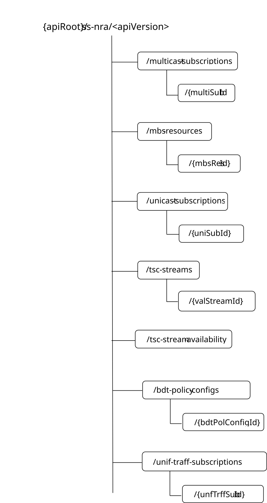

# 7.4.1.2.1 Overview

This clause describes the structure for the Resource URIs and the resources and methods used for the service.

Figure 7.4.1.2.1-1 depicts the resource URIs structure for the SS_NetworkResourceAdaptation API.

Figure 7.4.1.2.1-1: Resource URI structure of the SS_NetworkResourceAdaptation API

Table 7.4.1.2.1-1 provides an overview of the resources and applicable HTTP methods.

Table 7.4.1.2.1-1: Resources and methods overview

| Resource name                                   | Resource URI                             | HTTP method or custom operation | Description                                                                                         |
|-------------------------------------------------|------------------------------------------|---------------------------------|-----------------------------------------------------------------------------------------------------|
| Multicast Subscriptions                         | /multicast-subscriptions                 | POST                            | Create a new Individual Multicast Subscription resource.                                            |
| Individual Multicast Subscription               | /multicast-subscriptions/{multiSubId}    | GET                             | Read an Individual Multicast Subscription resource.                                                 |
|                                                 |                                          | DELETE                          | Remove an Individual Multicast Subscription resource.                                               |
| MBS Resources                                   | /mbs-resources                           | POST                            | Request the creation of an MBS resource.                                                            |
| Individual MBS Resource                         | /mbs-resources/{mbsResId}                | GET                             | Request the retrieval of an existing "Individual MBS Resource" resource.                            |
|                                                 |                                          | PUT                             | Request the update of an existing "Individual MBS Resource" resource.                               |
|                                                 |                                          | PATCH                           | Request the modification of an existing "Individual MBS Resource" resource.                         |
|                                                 |                                          | DELETE                          | Request the deletion of an existing "Individual MBS Resource" resource.                             |
|                                                 |                                          | Activate                        | Request the activation of an existing MBS Resource.                                                 |
|                                                 |                                          | Deactivate                      | Request the deactivation of an existing MBS Resource.                                               |
| Unicast Subscriptions                           | /unicast-subscriptions                   | POST                            | Create a new Individual Unicast Subscription resource.                                              |
| Individual Unicast Subscription                 | /unicast-subscriptions/{uniSubId}        | GET                             | Read an Individual Unicast Subscription resource.                                                   |
|                                                 |                                          | PUT                             | Update an Individual Unicast Subscription resource.                                                 |
|                                                 |                                          | PATCH                           | Modify an Individual Unicast Subscription resource.                                                 |
|                                                 |                                          | DELETE                          | Remove an Individual Unicast Subscription resource.                                                 |
| TSC Stream Availability                         | /tsc-stream-availability                 | GET                             | Retrieve TSC stream availability information.                                                       |
| TSC Streams                                     | /tsc-streams                             | GET                             | Retrieve TSC stream information.                                                                    |
| Individual TSC Stream                           | /tsc-streams/{valStreamId}               | GET                             | Read an Individual TSC stream resource.                                                             |
|                                                 |                                          | PUT                             | Create a new Individual TSC stream resource.                                                        |
|                                                 |                                          | DELETE                          | Remove an Individual TSC stream resource.                                                           |
|                                                 |                                          | GET                             | Read an Individual TSC stream resource.                                                             |
| BDT Policy Configurations                       | /bdt-policy-configs                      | POST                            | Create a new background data transfer policy configuration.                                         |
| Individual BDT Policy Configuration             | /bdt-policy-configs/{bdtPolConfigId}     | GET                             | Request the retrieval of an existing "Individual BDT Policy Configuration" resource.                |
|                                                 |                                          | PUT                             | Request the update of an existing "Individual BDT Policy Configuration" resource.                   |
|                                                 |                                          | PATCH                           | Request the modification of an existing "Individual BDT Policy Configuration" resource.             |
|                                                 |                                          | DELETE                          | Request the deletion of an existing "Individual BDT Policy Configuration" resource.                 |
| Unified Traffic Pattern Subscriptions           | /unif-traff-subscriptions                | POST                            | Create a new Unified Traffic Pattern Subscription.                                                  |
| Individual Unified Traffic Pattern Subscription | /unif-traff-subscriptions/{unfTrffSubId} | GET                             | Retrieve an existing "Individual Unified Traffic Pattern Subscription" resource.                    |
|                                                 |                                          | PUT                             | Request to update of an existing "Individual Unified Traffic Pattern Subscription" resource.        |
|                                                 |                                          | PATCH                           | Request the modification of an existing "Individual Unified Traffic Pattern Subscription" resource. |
|                                                 |                                          | DELETE                          | Request the deletion of an existing "Individual Unified Traffic Pattern Subscription" resource.     |
