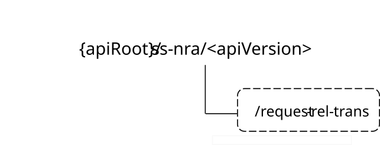

# 7.4.1.2A Custom Operations without associated resources

## 7.4.1.2A.1 Overview

The structure of the custom operation URIs of the SS_NetworkResourceAdaptation API is shown in Figure 7.4.1.2A.1-1.

Figure 7.4.1.2A.1-1: Custom operation URI structure of the SDD_Transmission API

Table 7.4.1.2A.1-1 provides an overview of the custom operations and applicable HTTP methods defined for the SS_NetworkResourceAdaptation API.

Table 7.4.1.2A.1-1: Custom operations without associated resources

| Custom operation name | Custom operation URI | Mapped HTTP method | Description                                                          |
|-----------------------|----------------------|--------------------|----------------------------------------------------------------------|
| RelTransRequest       | /request-rel-trans   | POST               | Enables a service consumer to request reliable transmission service. |

The custom operations shall support the URI variables defined in table 7.4.1.2A.1-2.

Table 7.4.1.2A.1-2: URI variables for this custom operation

| Name    | Data type | Definition          |
|---------|-----------|---------------------|
| apiRoot | string    | See clause 7.4.1.1. |

## 7.4.1.2A.2 Operation: RelTransRequest

### 7.4.1.2A.2.1 Description

The custom operation enables a service consumer to request reliable transmission service to the NRM Server.

### 7.4.1.2A.2.2 Operation Definition

This operation shall support the request data structures specified in table 7.4.1.2A.2.2-1 and the response data structures and response codes specified in table 7.4.1.2A.2.2-2.

Table 7.4.1.2A.2.2-1: Data structures supported by the POST Request Body on this resource

|             |     |             |                                                                   |
|-------------|-----|-------------|-------------------------------------------------------------------|
| Data type   | P   | Cardinality | Description                                                       |
| RelTransReq | M   | 1           | Contains the parameters to request reliable transmission service. |

Table 7.4.1.2A.2.2-2: Data structures supported by the POST Response Body on this resource

<table>
<colgroup>
<col style="width: 16%" />
<col style="width: 4%" />
<col style="width: 12%" />
<col style="width: 14%" />
<col style="width: 51%" />
</colgroup>
<tbody>
<tr class="odd">
<td>Data type</td>
<td>P</td>
<td>Cardinality</td>
<td>
Response

codes
</td>
<td>Description</td>
</tr>
<tr class="even">
<td>n/a</td>
<td></td>
<td></td>
<td>204 No Content</td>
<td>The reliable transmission service request is successfully received and processed.</td>
</tr>
<tr class="odd">
<td>n/a</td>
<td></td>
<td></td>
<td>307 Temporary Redirect</td>
<td>
Temporary redirection.

The response shall include a Location header field containing an alternative target URI located in an alternative NRM Server.

Redirection handling is described in clause 5.2.10 of 3GPP TS 29.122 [2].
</td>
</tr>
<tr class="even">
<td>n/a</td>
<td></td>
<td></td>
<td>308 Permanent Redirect</td>
<td>
Permanent redirection.

The response shall include a Location header field containing an alternative target URI located in an alternative NRM Server.

Redirection handling is described in clause 5.2.10 of 3GPP TS 29.122 [2]
</td>
</tr>
<tr class="odd">
<td colspan="5">NOTE: The manadatory HTTP error status codes for the HTTP POST method listed in table 5.2.6-1 of 3GPP TS 29.122 [3] shall also apply.</td>
</tr>
</tbody>
</table>

Table 7.4.1.2A.2.2-3: Headers supported by the 307 Response Code on this resource

|          |           |     |             |                                                                          |
|----------|-----------|-----|-------------|--------------------------------------------------------------------------|
| Name     | Data type | P   | Cardinality | Description                                                              |
| Location | string    | M   | 1           | Contains an alternative target URI located in an alternative NRM Server. |

Table 7.4.1.2A.2.2-4: Headers supported by the 308 Response Code on this resource

|          |           |     |             |                                                                          |
|----------|-----------|-----|-------------|--------------------------------------------------------------------------|
| Name     | Data type | P   | Cardinality | Description                                                              |
| Location | string    | M   | 1           | Contains an alternative target URI located in an alternative NRM Server. |
