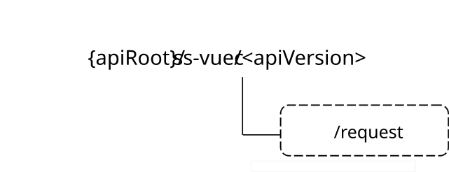

# 7.4.3 SS_ValUeConfiguration API

## 7.4.3.1 Introduction

The SS_ValUeConfiguration service shall use the SS_ValUeConfiguration API.

The API URI of the SS_ValUeConfiguration API shall be:

**{apiRoot}/\<apiName\>/\<apiVersion\>**

The request URIs used in HTTP requests shall have the Resource URI structure defined in clause 6.5, i.e.:

**{apiRoot}/\<apiName\>/\<apiVersion\>/\<apiSpecificSuffixes\>**

with the following components:

\- The {apiRoot} shall be set as described in clause 6.5.

\- The \<apiName\> shall be "ss-vuec".

\- The \<apiVersion\> shall be "v1".

\- The \<apiSpecificSuffixes\> shall be set as described in clauses 7.4.3.3 and 7.4.3.4.

## 7.4.3.2 Usage of HTTP

The provisions of clause 6.3 shall apply for the SS_ValUeConfiguration API.

## 7.4.3.3 Resources

There are no resources defined for this API in this release of the specification.

## 7.4.3.4 Custom Operations without associated resources

### 7.4.3.4.1 Overview

The structure of the custom operation URIs of the SS_ValUeConfiguration API is shown in Figure 7.4.3.4.1-1.

Figure 7.4.3.4.1-1: Custom operation URI structure of the SS_ValUeConfiguration API

Table 7.4.3.4.1-1 provides an overview of the custom operations and applicable HTTP methods defined for the SS_ValUeConfiguration API.

Table 7.4.3.4.1-1: Custom operations without associated resources

| Custom operation name    | Custom operation URI | Mapped HTTP method | Description                                                                      |
|--------------------------|----------------------|--------------------|----------------------------------------------------------------------------------|
| PowerSavingAssistRequest | /request             | POST               | Enables a service consumer to request power saving assistance to the NRM Server. |

The custom operations shall support the URI variables defined in table 7.4.3.4.1-2.

Table 7.4.3.4.1-2: URI variables for this custom operation

| Name    | Data type | Definition          |
|---------|-----------|---------------------|
| apiRoot | string    | See clause 7.4.3.1. |

### 7.4.3.4.2 Operation: PowerSavingAssistRequest

7.4.3.4.2.1 Description

The custom operation enables a service consumer to request power saving assistance to the NRM Server.

7.4.3.4.2.2 Operation Definition

This operation shall support the request data structures specified in table 7.4.3.4.2.2-1 and the response data structures and response codes specified in table 7.4.3.4.2.2-2.

**Table 7.4.3.4.2.2-1: Data structures supported by the POST Request Body on this resource**

| **Data type**   | **P** | **Cardinality** | **Description**                                             |
|-----------------|-------|-----------------|-------------------------------------------------------------|
| PowSavAssistReq | M     | 1               | Contains the parameters to request Power Saving Assistance. |

**Table 7.4.3.4.2.2-2: Data structures supported by the POST Response Body on this resource**

<table>
<colgroup>
<col style="width: 19%" />
<col style="width: 6%" />
<col style="width: 11%" />
<col style="width: 14%" />
<col style="width: 48%" />
</colgroup>
<thead>
<tr class="header">
<th><strong>Data type</strong></th>
<th><strong>P</strong></th>
<th><strong>Cardinality</strong></th>
<th>
<strong>Response</strong>

<strong>codes</strong>
</th>
<th><strong>Description</strong></th>
</tr>
</thead>
<tbody>
<tr class="odd">
<td>PowSavAssistResp</td>
<td>M</td>
<td>1</td>
<td>200 OK</td>
<td>Successful Case. The requested Power Saving Assistance request is successfully received and processed, and the outcome is returned in the response body.</td>
</tr>
<tr class="even">
<td>n/a</td>
<td></td>
<td></td>
<td>307 Temporary Redirect</td>
<td>
Temporary redirection.

The response shall include a Location header field containing an alternative target URI located in an alternative NRM Server.

Redirection handling is described in clause 5.2.10 of 3GPP TS 29.122 [3].
</td>
</tr>
<tr class="odd">
<td>n/a</td>
<td></td>
<td></td>
<td>308 Permanent Redirect</td>
<td>
Permanent redirection.

The response shall include a Location header field containing an alternative target URI located in an alternative NRM Server.

Redirection handling is described in clause 5.2.10 of 3GPP TS 29.122 [3]
</td>
</tr>
<tr class="even">
<td colspan="5">NOTE: The mandatory HTTP error status codes for the HTTP POST method listed in table 5.2.6-1 of 3GPP TS 29.122 [3] shall also apply.</td>
</tr>
</tbody>
</table>

**Table 7.4.3.4.2.2-3: Headers supported by the 307 Response Code on this custom operation**

| **Name** | **Data type** | **P** | **Cardinality** | **Description**                                                          |
|----------|---------------|-------|-----------------|--------------------------------------------------------------------------|
| Location | string        | M     | 1               | Contains an alternative target URI located in an alternative NRM Server. |

**Table 7.4.3.4.2.2-4: Headers supported by the 308 Response Code on this custom operation**

| **Name** | **Data type** | **P** | **Cardinality** | **Description**                                                          |
|----------|---------------|-------|-----------------|--------------------------------------------------------------------------|
| Location | string        | M     | 1               | Contains an alternative target URI located in an alternative NRM Server. |

## 7.4.3.5 Notifications

There are no notifications defined for this API in this release of the specification.

## 7.4.3.6 Data Model

7.4.3.6.1 General

This clause specifies the application data model supported by the API.

Table 7.4.3.6.1-1 specifies the data types defined specifically for the SS_ValUeConfiguration API service.

**Table 7.4.3.6.1-1: SS_ValUeConfiguration API specific Data Types**

| **Data type**    | **Section defined** | **Description**                                  | **Applicability** |
|------------------|---------------------|--------------------------------------------------|-------------------|
| PowSavAssistReq  | 7.4.3.6.2.2         | Represents the Power Saving Assistance Request.  |                   |
| PowSavAssistResp | 7.4.3.6.2.3         | Represents the Power Saving Assistance Response. |                   |
| PowSavConf       | 7.4.3.6.2.5         | Represents the Power Saving Configuration.       |                   |
| PowSavReqs       | 7.4.3.6.2.4         | Represents the Power Saving Requirements.        |                   |
| PowSavMode       | 7.4.3.6.3.3         | Represents the VAL UE(s) power saving mode.      |                   |

Table 7.4.3.6.1-2 specifies data types re-used by the SS_ValUeConfiguration API from other specifications, including a reference to their respective specifications, and when needed, a short description of their use within the SS_ValUeConfiguration API.

**Table 7.4.3.6.1-2: Re-used Data Types**

| **Data type**     | **Reference**         | **Comments**                                                                                                  | **Applicability** |
|-------------------|-----------------------|---------------------------------------------------------------------------------------------------------------|-------------------|
| SupportedFeatures | 3GPP TS 29.571 \[21\] | Represents the list of supported feature(s) and used to negotiate the applicability of the optional features. |                   |

### 7.4.3.6.2 Structured data types

#### 7.4.3.6.2.1 Introduction

This clause defines the data structures to be used in resource representations.

7.4.3.6.2.2 Type: PowSavAssistReq

**Table 7.4.3.6.2.2-1: Definition of type PowSavAssistReq**

<table>
<colgroup>
<col style="width: 14%" />
<col style="width: 14%" />
<col style="width: 4%" />
<col style="width: 11%" />
<col style="width: 41%" />
<col style="width: 13%" />
</colgroup>
<thead>
<tr class="header">
<th><strong>Attribute name</strong></th>
<th><strong>Data type</strong></th>
<th><strong>P</strong></th>
<th><strong>Cardinality</strong></th>
<th><strong>Description</strong></th>
<th><strong>Applicability</strong></th>
</tr>
</thead>
<tbody>
<tr class="odd">
<td>valUeIds</td>
<td>array(string)</td>
<td>C</td>
<td>1..N</td>
<td>
Contains the list of the identifier(s) of the target VAL UE(s).

(NOTE)
</td>
<td></td>
</tr>
<tr class="even">
<td>valUsers</td>
<td>array(string)</td>
<td>C</td>
<td>1..N</td>
<td>
Contains the list of the identifier(s) of the target VAL user(s).

(NOTE)
</td>
<td></td>
</tr>
<tr class="odd">
<td>valServId</td>
<td>string</td>
<td>M</td>
<td>1</td>
<td>Contains the identifier of the VAL Service.</td>
<td></td>
</tr>
<tr class="even">
<td>powSavReqs</td>
<td>PowSavReqs</td>
<td>M</td>
<td>1</td>
<td>Contains the desired power saving requirements to be enforced.</td>
<td></td>
</tr>
<tr class="odd">
<td>suppFeat</td>
<td>SupportedFeatures</td>
<td>C</td>
<td>0..1</td>
<td>
Contains the list of supported feature(s) among the ones defined in clause 7.4.3.8.

This attribute shall be present only when feature negotiation needs to take place.
</td>
<td></td>
</tr>
<tr class="even">
<td colspan="6">NOTE: These attributes are mutually exclusive and only one of them shall be present.</td>
</tr>
</tbody>
</table>

7.4.3.6.2.3 Type: PowSavAssistResp

**Table 7.4.3.6.2.3-1: Definition of type PowSavAssistResp**

<table>
<colgroup>
<col style="width: 14%" />
<col style="width: 14%" />
<col style="width: 4%" />
<col style="width: 11%" />
<col style="width: 41%" />
<col style="width: 13%" />
</colgroup>
<thead>
<tr class="header">
<th><strong>Attribute name</strong></th>
<th><strong>Data type</strong></th>
<th><strong>P</strong></th>
<th><strong>Cardinality</strong></th>
<th><strong>Description</strong></th>
<th><strong>Applicability</strong></th>
</tr>
</thead>
<tbody>
<tr class="odd">
<td>valUeIds</td>
<td>array(string)</td>
<td>C</td>
<td>1..N</td>
<td>
Contains the list of the identifier(s) of the VAL UE(s) for which the power saving configuration was enforced.

(NOTE)
</td>
<td></td>
</tr>
<tr class="even">
<td>valUsers</td>
<td>array(string)</td>
<td>C</td>
<td>1..N</td>
<td>
Contains the list of the identifier(s) of the VAL user(s) for which the power saving configuration was enforced.

(NOTE)
</td>
<td></td>
</tr>
<tr class="odd">
<td>powSavConf</td>
<td>PowSavConf</td>
<td>O</td>
<td>0..1</td>
<td>Contains the power saving configuration that was accepted and enforced.</td>
<td></td>
</tr>
<tr class="even">
<td>suppFeat</td>
<td>SupportedFeatures</td>
<td>C</td>
<td>0..1</td>
<td>
Contains the list of supported feature(s) among the ones defined in clause 7.4.3.8.

This attribute shall be present only when feature negotiation needs to take place.
</td>
<td></td>
</tr>
<tr class="odd">
<td colspan="6">NOTE: These attributes are mutually exclusive and only one of them shall be present.</td>
</tr>
</tbody>
</table>

7.4.3.6.2.4 Type: PowSavReqs

**Table 7.4.3.6.2.4-1: Definition of type PowSavReqs**

| **Attribute name** | **Data type** | **P** | **Cardinality** | **Description**                 | **Applicability** |
|--------------------|---------------|-------|-----------------|---------------------------------|-------------------|
| powSavMode         | PowSavMode    | M     | 1               | Contains the Power Saving Mode. |                   |

#### 7.4.3.6.2.5 Type: PowSavConf

Table 7.4.3.6.2.5-1: Definition of type PowSavConf

| Attribute name | Data type  | P   | Cardinality | Description                       | Applicability |
|----------------|------------|-----|-------------|-----------------------------------|---------------|
| powSavMode     | PowSavMode | M   | 1           | Represents the Power Saving Mode. |               |

### 7.4.3.6.3 Simple data types and enumerations

#### 7.4.3.6.3.1 Introduction

This clause defines simple data types and enumerations that can be referenced from data structures defined in the previous clauses.

7.4.3.6.3.2 Simple data types

The simple data types defined in table 7.4.3.6.3.2-1 shall be supported.

**Table 7.4.3.6.3.2-1: Simple data types**

| **Type Name** | **Type Definition** | **Description** | **Applicability** |
|---------------|---------------------|-----------------|-------------------|
|               |                     |                 |                   |

7.4.3.6.3.3 Enumeration: PowSavMode

The enumeration PowSavMode represents the VAL UE(s) power saving mode. It shall comply with the provisions defined in table 7.4.3.6.3.3-1.

**Table 7.4.3.6.3.3-1: Enumeration PowSavMode**

| **Enumeration value** | **Description**                                       | **Applicability** |
|-----------------------|-------------------------------------------------------|-------------------|
| POWER_SAVING          | Indicates that the power saving mode is power saving. |                   |
| BALANCED              | Indicates that the power saving mode is balanced.     |                   |
| PERFORMANCE           | Indicates that the power saving mode is performance.  |                   |

### 7.4.3.6.4 Data types describing alternative data types or combinations of data types

There are no data types describing alternative data types or combinations of data types defined for this API in this release of the specification.

7.4.3.6.5 Binary data

7.4.3.6.5.1 Binary Data Types

**Table 7.4.3.6.5.1-1: Binary Data Types**

| **Name** | **Clause defined** | **Content type** |
|----------|--------------------|------------------|
|          |                    |                  |

## 7.4.3.7 Error Handling

### 7.4.3.7.1 General

For the SS_ValUeConfiguration API, HTTP error responses shall be supported as specified in clause 6.7.

In addition, the requirements in the following clauses are applicable for the SS_ValUeConfiguration API.

### 7.4.3.7.2 Protocol Errors

No specific protocol errors for the SS_ValUeConfiguration API are specified.

7.4.3.7.3 Application Errors

The application errors defined for SS_ValUeConfiguration API are listed in table 7.4.3.7.3-1.

**Table 7.4.3.7.3-1: Application errors**

| **Application Error** | **HTTP status code** | **Description** | **Applicability** |
|-----------------------|----------------------|-----------------|-------------------|
|                       |                      |                 |                   |

7.4.3.8 Feature negotiation

The optional features listed in table 7.4.3.8-1 are defined for the SS_ValUeConfiguration API. They shall be negotiated using the extensibility mechanism defined clause 6.8.

**Table 7.4.3.8-1: Supported Features**

| **Feature number** | **Feature Name** | **Description** |
|--------------------|------------------|-----------------|
|                    |                  |                 |

## 7.4.3.9 Security

The provisions of clause 9 shall apply for the SS_ValUeConfiguration API.
