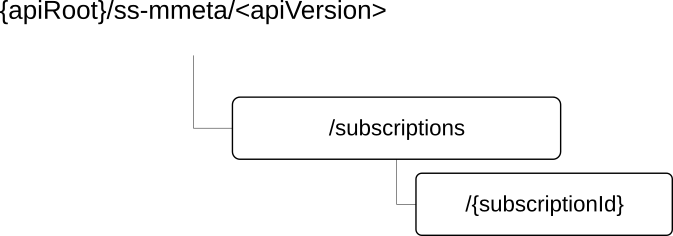

# 7.4.4.3 Resources

## 7.4.4.3.1 Overview

This clause describes the structure for the Resource URIs and the resources and methods used for the service.

Figure 7.4.4.3.1-1 depicts the resource URIs structure for the SS_MMetaConnectivityRequirements API.

**Figure 7.4.4.3.1-1: Resource URI structure of the SS_MMetaConnectivityRequirements API**

Table 7.4.4.3.1-1 provides an overview of the resources and applicable HTTP methods.

**Table 7.4.4.3.1-1: Resources and methods overview**

| **Resource name**                                 | **Resource URI**                | **HTTP method or custom operation** | **Description**                                                                   |
|---------------------------------------------------|---------------------------------|-------------------------------------|-----------------------------------------------------------------------------------|
| Connectivity Requirements Subscriptions           | /subscriptions                  | POST                                | Create individual connectivity requirements subscription resource.                |
| Individual Connectivity Requirements Subscription | /subscriptions/{subscriptionId} | GET                                 | Retrieve an existing individual connectivity requirements subscription resource.  |
|                                                   |                                 | PUT                                 | Update an existing individual connectivity requirements subscription resource.    |
|                                                   |                                 | PATCH                               | Modify an existing individual connectivity requirements subscription resource.    |
|                                                   |                                 | DELETE                              | Terminate an existing individual connectivity requirements subscription resource. |

## 7.4.4.3.2 Resource: Connectivity Requirements Subscriptions

### 7.4.4.3.2.1 Description

### 7.4.4.3.2.2 Resource Definition

Resource URI: {**apiRoot**}/**ss-mmeta**/\<**apiVersion**\>/**subscriptions**

This resource shall support the resource URI variables defined in table 7.4.4.3.2.2-1.

**Table 7.4.4.3.2.2-1: Resource URI variables for this resource**

| **Name** | **Data Type** | **Definition**      |
|----------|---------------|---------------------|
| apiRoot  | string        | See clause 7.4.4.1. |

### 7.4.4.3.2.3 Resource Standard Methods

7.4.4.3.2.3.1 POST

This method enables a VAL Server to request the creation of a connectivity requirements subscription at the NRM Server. This method shall support the URI query parameters specified in table 7.4.4.3.2.3.1-1.

**Table 7.4.4.3.2.3.1-1: URI query parameters supported by the POST method on this resource**

| **Name** | **Data type** | **P** | **Cardinality** | **Description** |
|----------|---------------|-------|-----------------|-----------------|
|          |               |       |                 |                 |

This method shall support the request data structures specified in table 7.4.4.3.2.3.1-2 and the response data structures and response codes specified in table 7.4.4.3.2.3.1-3.

**Table 7.4.4.3.2.3.1-2: Data structures supported by the POST Request Body on this resource**

| **Data type**            | **P** | **Cardinality** | **Description**                                                                                                 |
|--------------------------|-------|-----------------|-----------------------------------------------------------------------------------------------------------------|
| ConnectivitySubscription | M     | 1               | Contains the parameters to request the creation of the mobile metaverse connectivity requirements subscription. |

**Table 7.4.4.3.2.3.1-3: Data structures supported by the POST Response Body on this resource**

<table>
<colgroup>
<col style="width: 22%" />
<col style="width: 8%" />
<col style="width: 13%" />
<col style="width: 17%" />
<col style="width: 37%" />
</colgroup>
<thead>
<tr class="header">
<th><strong>Data type</strong></th>
<th><strong>P</strong></th>
<th><strong>Cardinality</strong></th>
<th>
<strong>Response</strong>

<strong>codes</strong>
</th>
<th><strong>Description</strong></th>
</tr>
</thead>
<tbody>
<tr class="odd">
<td>ConnectivitySubscription</td>
<td>M</td>
<td>1</td>
<td>201 Created</td>
<td>
Successful case. The requested individual connectivity requirement subscription resource is successfully created and a representation of the created resource is returned in the response body.

An HTTP "Location" header that contains the URI of the created resource shall also be included.
</td>
</tr>
<tr class="even">
<td colspan="5">NOTE: The mandatory HTTP error status codes for the POST method listed in table 5.2.6-1 of 3GPP TS 29.122 [3] shall also apply.</td>
</tr>
</tbody>
</table>

**Table 7.4.4.3.2.3.1-4: Headers supported by the 201 Response Code on this resource**

| **Name** | **Data type** | **P** | **Cardinality** | **Description**                                                                                                                              |
|----------|---------------|-------|-----------------|----------------------------------------------------------------------------------------------------------------------------------------------|
| Location | string        | M     | 1               | Contains the URI of the newly created resource, according to the structure: {apiRoot}/ss-mmeta/\<apiVersion\>/subscriptions/{subscriptionId} |

### 7.4.4.3.2.4 Resource Custom Operations

There are no resource custom operations defined for this resource in this release of the specification.

## 7.4.4.3.3 Resource: Individual Connectivity Requirements Subscription

### 7.4.4.3.3.1 Description

### 7.4.4.3.3.2 Resource Definition

Resource URI: **{apiRoot}/ss-mmeta/\<apiVersion\>/subscriptions/{subscriptionId}**

This resource shall support the resource URI variables defined in table 7.4.4.3.3.2-1.

**Table 7.4.4.3.3.2-1: Resource URI variables for this resource**

| **Name**       | **Data Type** | **Definition**                          |
|----------------|---------------|-----------------------------------------|
| apiRoot        | string        | See clause 7.4.4.1                      |
| subscriptionId | string        | The individual subscription identifier. |

### 7.4.4.3.3.3 Resource Standard Methods

7.4.4.3.3.3.1 GET

**Table 7.4.4.3.3.3.1-1: URI query parameters supported by the GET method on this resource**

| **Name** | **Data type** | **P** | **Cardinality** | **Description** |
|----------|---------------|-------|-----------------|-----------------|
| n/a      |               |       |                 |                 |

This method shall support the request data structures specified in table 7.4.4.3.3.3.1-2 and the response data structures and response codes specified in table 7.4.4.3.3.3.1-3.

**Table 7.4.4.3.3.3.1-2: Data structures supported by the GET Request Body on this resource**

| **Data type** | **P** | **Cardinality** | **Description** |
|---------------|-------|-----------------|-----------------|
| n/a           |       |                 |                 |

**Table 7.4.4.3.3.3.1-3: Data structures supported by the GET Response Body on this resource**

<table>
<colgroup>
<col style="width: 22%" />
<col style="width: 8%" />
<col style="width: 13%" />
<col style="width: 17%" />
<col style="width: 38%" />
</colgroup>
<thead>
<tr class="header">
<th><strong>Data type</strong></th>
<th><strong>P</strong></th>
<th><strong>Cardinality</strong></th>
<th>
<strong>Response</strong>

<strong>codes</strong>
</th>
<th><strong>Description</strong></th>
</tr>
</thead>
<tbody>
<tr class="odd">
<td>ConnectivitySubscription</td>
<td>M</td>
<td>1</td>
<td>200 OK</td>
<td>Successful case. The requested "Individual connectivity requirement subscription" resource shall be returned.</td>
</tr>
<tr class="even">
<td>n/a</td>
<td></td>
<td></td>
<td>307 Temporary Redirect</td>
<td>
Temporary redirection, during resource retrieval.

The response shall include a Location header field containing an alternative URI of the resource located in an alternative NRM Server.

Redirection handling is described in clause 5.2.10 of 3GPP TS 29.122 [3].
</td>
</tr>
<tr class="odd">
<td>n/a</td>
<td></td>
<td></td>
<td>308 Permanent Redirect</td>
<td>
Permanent redirection, during resource retrieval.

The response shall include a Location header field containing an alternative URI of the resource located in an alternative NRM Server.

Redirection handling is described in clause 5.2.10 of 3GPP TS 29.122 [3].
</td>
</tr>
<tr class="even">
<td colspan="5">NOTE: The mandatory HTTP error status codes for the GET method listed in table 5.2.6-1 of 3GPP TS 29.122 [3] shall also apply.</td>
</tr>
</tbody>
</table>

**Table 7.4.4.3.3.3.1-4: Headers supported by the 307 Response Code on this resource**

| **Name** | **Data type** | **P** | **Cardinality** | **Description**                                                          |
|----------|---------------|-------|-----------------|--------------------------------------------------------------------------|
| Location | string        | M     | 1               | An alternative URI of the resource located in an alternative NRM Server. |

**Table 7.4.4.3.3.3.1-5: Headers supported by the 308 Response Code on this resource**

| **Name** | **Data type** | **P** | **Cardinality** | **Description**                                                          |
|----------|---------------|-------|-----------------|--------------------------------------------------------------------------|
| Location | string        | M     | 1               | An alternative URI of the resource located in an alternative NRM Server. |

7.4.4.3.3.3.2 PUT

**Table 7.4.4.3.3.3.2-1: URI query parameters supported by the PUT method on this resource**

| **Name** | **Data type** | **P** | **Cardinality** | **Description** |
|----------|---------------|-------|-----------------|-----------------|
| n/a      |               |       |                 |                 |

This method shall support the request data structures specified in table 7.4.4.3.3.3.2-2 and the response data structures and response codes specified in table 7.4.4.3.3.3.2-3.

**Table 7.4.4.3.3.3.2-2: Data structures supported by the PUT Request Body on this resource**

| **Data type**            | **P** | **Cardinality** | **Description**                                                                                            |
|--------------------------|-------|-----------------|------------------------------------------------------------------------------------------------------------|
| ConnectivitySubscription | M     | 1               | Represents the updated representation of the "Individual Connectivity Requirements Subscription" resource. |

**Table 7.4.4.3.3.3.2-3: Data structures supported by the PUT Response Body on this resource**

<table>
<colgroup>
<col style="width: 22%" />
<col style="width: 8%" />
<col style="width: 11%" />
<col style="width: 20%" />
<col style="width: 38%" />
</colgroup>
<thead>
<tr class="header">
<th><strong>Data type</strong></th>
<th><strong>P</strong></th>
<th><strong>Cardinality</strong></th>
<th>
<strong>Response</strong>

<strong>codes</strong>
</th>
<th><strong>Description</strong></th>
</tr>
</thead>
<tbody>
<tr class="odd">
<td>ConnectivitySubscription</td>
<td>M</td>
<td>1</td>
<td>200 OK</td>
<td>Successful case. The "Individual Connectivity Requirements Subscription" resource is successfully updated and a representation of the updated resource is returned in the response body.</td>
</tr>
<tr class="even">
<td>n/a</td>
<td></td>
<td></td>
<td>204 No Content</td>
<td>Successful case. The "Individual Connectivity Requirements Subscription" resource is successfully updated and no content is returned in the response body.</td>
</tr>
<tr class="odd">
<td>n/a</td>
<td></td>
<td></td>
<td>307 Temporary Redirect</td>
<td>
Temporary redirection during the source update.

The response shall include a Location header field containing an alternative URI of the resource located in an alternative NRM Server.

Redirection handling is described in clause 5.2.10 of 3GPP TS 29.122 [3].
</td>
</tr>
<tr class="even">
<td>n/a</td>
<td></td>
<td></td>
<td>308 Permanent Redirect</td>
<td>
Permanent redirection during the source update.

The response shall include a Location header field containing an alternative URI of the resource located in an alternative NRM Server.

Redirection handling is described in clause 5.2.10 of 3GPP TS 29.122 [3].
</td>
</tr>
<tr class="odd">
<td colspan="5">NOTE: The mandatory HTTP error status codes for the HTTP PUT method listed in table 5.2.6-1 of 3GPP TS 29.122 [3] shall also apply.</td>
</tr>
</tbody>
</table>

**Table 7.4.4.3.3.3.2-4: Headers supported by the 307 Response Code on this resource**

| **Name** | **Data type** | **P** | **Cardinality** | **Description**                                                                   |
|----------|---------------|-------|-----------------|-----------------------------------------------------------------------------------|
| Location | string        | M     | 1               | Contains an alternative URI of the resource located in an alternative NRM Server. |

**Table 7.4.4.3.3.3.2-5: Headers supported by the 308 Response Code on this resource**

| **Name** | **Data type** | **P** | **Cardinality** | **Description**                                                                   |
|----------|---------------|-------|-----------------|-----------------------------------------------------------------------------------|
| Location | string        | M     | 1               | Contains an alternative URI of the resource located in an alternative NRM Server. |

7.4.4.3.3.3.3 PATCH

**Table 7.4.4.3.3.3.3-1: URI query parameters supported by the PATCH method on this resource**

| **Name** | **Data type** | **P** | **Cardinality** | **Description** |
|----------|---------------|-------|-----------------|-----------------|
| n/a      |               |       |                 |                 |

This method shall support the request data structures specified in table 7.4.4.3.3.3.3-2 and the response data structures and response codes specified in table 7.4.4.3.3.3.3-3.

**Table 7.4.4.3.3.3.3-2: Data structures supported by the PATCH Request Body on this resource**

| **Data type**                 | **P** | **Cardinality** | **Description**                                                                                          |
|-------------------------------|-------|-----------------|----------------------------------------------------------------------------------------------------------|
| ConnectivitySubscriptionPatch | M     | 1               | Represents the modified parameters for the "Individual Connectivity Requirements Subscription" resource. |

**Table 7.4.4.3.3.3.3-3: Data structures supported by the PATCH Response Body on this resource**

<table>
<colgroup>
<col style="width: 22%" />
<col style="width: 8%" />
<col style="width: 11%" />
<col style="width: 20%" />
<col style="width: 38%" />
</colgroup>
<thead>
<tr class="header">
<th><strong>Data type</strong></th>
<th><strong>P</strong></th>
<th><strong>Cardinality</strong></th>
<th>
<strong>Response</strong>

<strong>codes</strong>
</th>
<th><strong>Description</strong></th>
</tr>
</thead>
<tbody>
<tr class="odd">
<td>ConnectivitySubscription</td>
<td>M</td>
<td>1</td>
<td>200 OK</td>
<td>Successful case. The "Individual Connectivity Requirements Subscription" resource is successfully modified and a representation of the updated resource is returned in the response body.</td>
</tr>
<tr class="even">
<td>n/a</td>
<td></td>
<td></td>
<td>204 No Content</td>
<td>Successful case. The "Individual Connectivity Requirements Subscription" resource is successfully modified and no content is returned in the response body.</td>
</tr>
<tr class="odd">
<td>n/a</td>
<td></td>
<td></td>
<td>307 Temporary Redirect</td>
<td>
Temporary redirection during the modification of the parameters of the resource.

The response shall include a Location header field containing an alternative URI of the resource located in an alternative NRM Server.

Redirection handling is described in clause 5.2.10 of 3GPP TS 29.122 [3].
</td>
</tr>
<tr class="even">
<td>n/a</td>
<td></td>
<td></td>
<td>308 Permanent Redirect</td>
<td>
Permanent redirection during the modification of the parameters of the resource.

The response shall include a Location header field containing an alternative URI of the resource located in an alternative NRM Server.

Redirection handling is described in clause 5.2.10 of 3GPP TS 29.122 [3].
</td>
</tr>
<tr class="odd">
<td colspan="5">NOTE: The mandatory HTTP error status codes for the HTTP PATCH method listed in table 5.2.6-1 of 3GPP TS 29.122 [3] shall also apply.</td>
</tr>
</tbody>
</table>

**Table 7.4.4.3.3.3.3-4: Headers supported by the 307 Response Code on this resource**

| **Name** | **Data type** | **P** | **Cardinality** | **Description**                                                                   |
|----------|---------------|-------|-----------------|-----------------------------------------------------------------------------------|
| Location | string        | M     | 1               | Contains an alternative URI of the resource located in an alternative NRM Server. |

**Table 7.4.4.3.3.3.3-5: Headers supported by the 308 Response Code on this resource**

| **Name** | **Data type** | **P** | **Cardinality** | **Description**                                                                   |
|----------|---------------|-------|-----------------|-----------------------------------------------------------------------------------|
| Location | string        | M     | 1               | Contains an alternative URI of the resource located in an alternative NRM Server. |

7.4.4.3.3.3.4 DELETE

**Table 7.4.4.3.3.3.4-1: URI query parameters supported by the DELETE method on this resource**

| **Name** | **Data type** | **P** | **Cardinality** | **Description** |
|----------|---------------|-------|-----------------|-----------------|
| n/a      |               |       |                 |                 |

This method shall support the request data structures specified in table 7.4.4.3.3.3.4-2 and the response data structures and response codes specified in table 7.4.4.3.3.3.4-3.

**Table 7.4.4.3.3.3.4-2: Data structures supported by the DELETE Request Body on this resource**

| **Data type** | **P** | **Cardinality** | **Description** |
|---------------|-------|-----------------|-----------------|
| n/a           |       |                 |                 |

**Table 7.4.4.3.3.3.4-3: Data structures supported by the DELETE Response Body on this resource**

<table>
<colgroup>
<col style="width: 16%" />
<col style="width: 9%" />
<col style="width: 14%" />
<col style="width: 19%" />
<col style="width: 39%" />
</colgroup>
<thead>
<tr class="header">
<th><strong>Data type</strong></th>
<th><strong>P</strong></th>
<th><strong>Cardinality</strong></th>
<th>
<strong>Response</strong>

<strong>codes</strong>
</th>
<th><strong>Description</strong></th>
</tr>
</thead>
<tbody>
<tr class="odd">
<td>n/a</td>
<td></td>
<td></td>
<td>204 No Content</td>
<td>Successful case. "Individual Connectivity Requirements Subscription" resource was terminated.</td>
</tr>
<tr class="even">
<td>n/a</td>
<td></td>
<td></td>
<td>307 Temporary Redirect</td>
<td>
Temporary redirection, during resource termination. The response shall include a Location header field containing an alternative URI of the resource located in an alternative NRM Server.

Redirection handling is described in clause 5.2.10 of 3GPP TS 29.122 [3].
</td>
</tr>
<tr class="odd">
<td>n/a</td>
<td></td>
<td></td>
<td>308 Permanent Redirect</td>
<td>
Permanent redirection, during resource termination. The response shall include a Location header field containing an alternative URI of the resource located in an alternative NRM Server.

Redirection handling is described in clause 5.2.10 of 3GPP TS 29.122 [3].
</td>
</tr>
<tr class="even">
<td colspan="5">NOTE: The mandatory HTTP error status codes for the DELETE method listed in table 5.2.6-1 of 3GPP TS 29.122 [3] shall also apply.</td>
</tr>
</tbody>
</table>

**Table 7.4.4.3.3.3.4-4: Headers supported by the 307 Response Code on this resource**

| **Name** | **Data type** | **P** | **Cardinality** | **Description**                                                          |
|----------|---------------|-------|-----------------|--------------------------------------------------------------------------|
| Location | string        | M     | 1               | An alternative URI of the resource located in an alternative NRM Server. |

**Table 7.4.4.3.3.3.4-5: Headers supported by the 308 Response Code on this resource**

| **Name** | **Data type** | **P** | **Cardinality** | **Description**                                                          |
|----------|---------------|-------|-----------------|--------------------------------------------------------------------------|
| Location | string        | M     | 1               | An alternative URI of the resource located in an alternative NRM Server. |

### 7.4.4.3.3.4 Resource Custom Operations

None.
