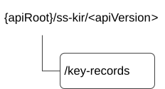
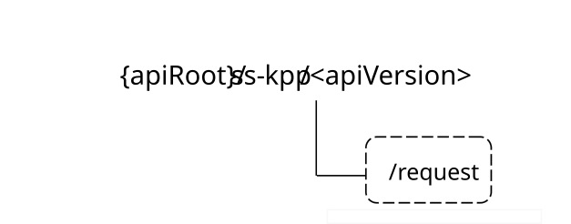

# 7.6 Key management APIs

## 7.6.1 SS_KeyInfoRetrieval API

### 7.6.1.1 API URI

The request URI used in each HTTP request from the VAL server towards the Key management server shall have the structure as defined in clause 6.5 with the following clarifications:

\- The \<apiName\> shall be "ss-kir".

\- The \<apiVersion\> shall be "v1".

\- The \<apiSpecificSuffixes\> shall be set as described in clause 7.6.1.2.

### 7.6.1.2 Resources

#### 7.6.1.2.1 Overview

This clause describes the structure for the Resource URIs and the resources and methods used for the service.

Figure 7.6.1.2.1-1 depicts the resource URIs structure for the SS_KeyInfoRetrieval API.

Figure 7.6.1.2.1-1: Resource URI structure of the SS_KeyInfoRetrieval API

Table 7.6.1.2.1-1 provides an overview of the resources and applicable HTTP methods.

Table 7.6.1.2.1-1: Resources and methods overview

| Resource name | Resource URI | HTTP method or custom operation | Description                                                                                 |
|---------------|--------------|---------------------------------|---------------------------------------------------------------------------------------------|
| Key records   | /key-records | GET                             | Retrieve key management information uniquely applicable to VAL service, VAL user or VAL UE. |

#### 7.6.1.2.2 Resource: Key Records

##### 7.6.1.2.2.1 Description

The Key Records resource represents the key management information of all VAL services that are created at a given key management server.

##### 7.6.1.2.2.2 Resource Definition

Resource URI: **{apiRoot}/ss-kir/\<apiVersion\>/key-records**

This resource shall support the resource URI variables defined in the table 7.6.1.2.2.2-1.

Table 7.6.1.2.2.2-1: Resource URI variables for this resource

| Name    | Data Type | Definition          |
|---------|-----------|---------------------|
| apiRoot | string    | See clause 7.6.1.1. |

##### 7.6.1.2.2.3 Resource Standard Methods

###### 7.6.1.2.2.3.1 GET

This operation retrieves VAL service key management information satisfying the filter criteria. This method shall support the URI query parameters specified in table 7.6.1.2.2.3.1-1.

Table 7.6.1.2.2.3.1-1: URI query parameters supported by the GET method on this resource

|                |             |     |             |                                     |
|----------------|-------------|-----|-------------|-------------------------------------|
| Name           | Data type   | P   | Cardinality | Description                         |
| val-tgt-ue     | ValTargetUe | O   | 0..1        | Identifying a VAL user or a VAL UE. |
| val-service-id | string      | M   | 1           | String identifying a VAL service.   |

This method shall support the request data structures specified in table 7.6.1.2.2.3.1-2 and the response data structures and response codes specified in table 7.6.1.2.2.3.1 -3.

Table 7.6.1.2.2.3.1-2: Data structures supported by the GET Request Body on this resource

|           |     |             |             |
|-----------|-----|-------------|-------------|
| Data type | P   | Cardinality | Description |
| n/a       |     |             |             |

Table 7.6.1.2.2.3.1-3: Data structures supported by the GET Response Body on this resource

<table>
<colgroup>
<col style="width: 16%" />
<col style="width: 9%" />
<col style="width: 14%" />
<col style="width: 19%" />
<col style="width: 39%" />
</colgroup>
<tbody>
<tr class="odd">
<td>Data type</td>
<td>P</td>
<td>Cardinality</td>
<td>
Response

codes
</td>
<td>Description</td>
</tr>
<tr class="even">
<td>ValKeyInfo</td>
<td>M</td>
<td>1</td>
<td>200 OK</td>
<td>Key management information specific to VAL service, VAL user or VAL UE. This response shall include key management information matching the query parameters provided in the request.</td>
</tr>
<tr class="odd">
<td>n/a</td>
<td></td>
<td></td>
<td>307 Temporary Redirect</td>
<td>
Temporary redirection, during resource retrieval. The response shall include a Location header field containing an alternative URI of the resource located in an alternative key management server.

Redirection handling is described in clause 5.2.10 of 3GPP TS 29.122 [3].
</td>
</tr>
<tr class="even">
<td>n/a</td>
<td></td>
<td></td>
<td>308 Permanent Redirect</td>
<td>
Permanent redirection, during resource retrieval. The response shall include a Location header field containing an alternative URI of the resource located in an alternative key management server.

Redirection handling is described in clause 5.2.10 of 3GPP TS 29.122 [3].
</td>
</tr>
<tr class="odd">
<td colspan="5">NOTE: The mandatory HTTP error status codes for the GET method listed in table 5.2.6-1 of 3GPP TS 29.122 [3] also apply.</td>
</tr>
</tbody>
</table>

Table 7.6.1.2.2.3.1-4: Headers supported by the 307 Response Code on this resource

|          |           |     |             |                                                                                     |
|----------|-----------|-----|-------------|-------------------------------------------------------------------------------------|
| Name     | Data type | P   | Cardinality | Description                                                                         |
| Location | string    | M   | 1           | An alternative URI of the resource located in an alternative key management server. |

Table 7.6.1.2.2.3.1-5: Headers supported by the 308 Response Code on this resource

|          |           |     |             |                                                                                     |
|----------|-----------|-----|-------------|-------------------------------------------------------------------------------------|
| Name     | Data type | P   | Cardinality | Description                                                                         |
| Location | string    | M   | 1           | An alternative URI of the resource located in an alternative key management server. |

##### 7.6.1.2.2.4 Resource Custom Operations

None.

### 7.6.1.3 Notifications

None.

### 7.6.1.4 Data Model

#### 7.6.1.4.1 General

This clause specifies the application data model supported by the API. Data types listed in clause 6.2 apply to this API.

Table 7.6.1.4.1-1 specifies the data types defined specifically for the SS_KeyInfoRetrieval API service.

Table 7.6.1.4.1-1: SS_KeyInfoRetrieval API specific Data Types

| Data type  | Section defined | Description                                                                | Applicability |
|------------|-----------------|----------------------------------------------------------------------------|---------------|
| ValKeyInfo | 7.6.1.4.2.3     | Key management information associated with VAL server, VAL user or VAL UE. |               |

Table 7.6.1.4.1-2 specifies data types re-used by the SS_KeyInfoRetrieval API service.

Table 7.6.1.4.1-2: Re-used Data Types

| Data type   | Reference            | Comments                                                                              | Applicability |
|-------------|----------------------|---------------------------------------------------------------------------------------|---------------|
| Uri         | 3GPP TS 29.122 \[3\] | Represents a URI.                                                                     |               |
| ValTargetUe | Clause 7.3.1.4.2.3   | Used to identify a VAL User ID or VAL UE ID applicable to key management information. |               |

#### 7.6.1.4.2 Structured Data Types

##### 7.6.1.4.2.1 Introduction

##### 7.6.1.4.2.2 ValKeyInfo

Table 7.6.1.4.2.2-1: Definition of type ValKeyInfo

| Attribute name | Data type   | P   | Cardinality | Description                                                                                                    | Applicability |
|----------------|-------------|-----|-------------|----------------------------------------------------------------------------------------------------------------|---------------|
| userUri        | Uri         | M   | 1           | URI of the user for which the response is intended.                                                            |               |
| skmsId         | string      | O   | 0..1        | String identifying the SEAL key management server, sending the response.                                       |               |
| valService     | string      | M   | 1           | String identifying the VAL service. This attribute shall be same as in the HTTP GET request.                   |               |
| valTgtUe       | ValTargetUe | O   | 0..1        | String identifying a VAL user or VAL UE. This value depends on the value that was in the HTTP GET request.     |               |
| keyInfo        | string      | M   | 1           | Key management information uniquely applicable to the requested VAL service, VAL user or VAL UE or VAL client. |               |

#### 7.6.1.4.3 Simple data types and enumerations

None.

### 7.6.1.5 Error Handling

#### 7.6.1.5.1 General

HTTP error handling shall be supported as specified in clause 6.7.

In addition, the requirements in the following clauses shall apply.

#### 7.6.1.5.2 Protocol Errors

In this Release of the specification, there are no additional protocol errors applicable for the SS_KeyInfoRetrieval API.

#### 7.6.1.5.3 Application Errors

The application errors defined for SS_KeyInfoRetrieval API are listed in table 7.6.1.5.3-1.

Table 7.6.1.5.3-1: Application errors

| Application Error | HTTP status code | Description | Applicability |
|-------------------|------------------|-------------|---------------|
|                   |                  |             |               |

### 7.6.1.6 Feature Negotiation

General feature negotiation procedures are defined in clause 6.8.

Table 7.6.1.6-1: Supported Features

| Feature number | Feature Name | Description |
|----------------|--------------|-------------|
|                |              |             |

## 7.6.2 SS_KMParametersProvisioning API

### 7.6.2.1 Introduction

The SS_KMParametersProvisioning service shall use the SS_KMParametersProvisioning API.

The API URI of the SS_KMParametersProvisioning API shall be:

**{apiRoot}/\<apiName\>/\<apiVersion\>**

The request URIs used in HTTP requests shall have the Resource URI structure as defined in clause 6.5, i.e.:

**{apiRoot}/\<apiName\>/\<apiVersion\>/\<apiSpecificSuffixes\>**

with the following components:

\- The {apiRoot} shall be set as described in clause 6.5.

\- The \<apiName\> shall be "ss-kpp".

\- The \<apiVersion\> shall be "v1".

\- The \<apiSpecificSuffixes\> shall be set as described in clauses 7.6.2.3 and 7.6.2.4.

7.6.2.2 Usage of HTTP

The provisions of clause 6.3 shall apply for the SS_KMParametersProvisioning API.

### 7.6.2.3 Resources

There are no resources defined for this resource in this release of the sepcifciation.

### 7.6.2.4 Custom operations without associated resources

#### 7.6.2.4.1 Overview

The structure of the custom operation URIs of the SS_KMParametersProvisioning API is shown in Figure 7.6.2.4.1-1.

Figure 7.6.2.4.1-1: Custom operation URI structure of the SS_KMParametersProvisioning API

Table 7.6.2.4.1-1 provides an overview of the custom operations and applicable HTTP methods defined for the SS_KMParametersProvisioning API.

Table 7.6.2.4.1-1: Custom operations without associated resources

| Custom operation name | Custom operation URI | Mapped HTTP method | Description                                                                              |
|-----------------------|----------------------|--------------------|------------------------------------------------------------------------------------------|
| Request               | /request             | POST               | Enables a service consumer to request key parameters provisioning to the SEAL KM Server. |

The custom operations shall support the URI variables defined in table 7.6.2.4.1-2.

Table 7.6.2.4.1-2: URI variables for this custom operation

| Name    | Data type | Definition          |
|---------|-----------|---------------------|
| apiRoot | string    | See clause 7.6.2.1. |

#### 7.6.2.4.2 Operation: Request

##### 7.6.2.4.2.1 Description

The custom operation enables a service consumer to request key parameters provisioning to the SEAL KM Server.

##### 7.6.2.4.2.2 Operation Definition

This operation shall support the request data structures specified in table 7.6.2.4.2.2-1 and the response data structures and response codes specified in table 7.6.2.4.2.2-2.

Table 7.6.2.4.2.2-1: Data structures supported by the POST Request Body on this resource

|             |     |             |                                                        |
|-------------|-----|-------------|--------------------------------------------------------|
| Data type   | P   | Cardinality | Description                                            |
| VALKeyPpReq | M   | 1           | Contains the key management parameters to provisioned. |

Table 7.6.2.4.2.2-2: Data structures supported by the POST Response Body on this resource

<table>
<colgroup>
<col style="width: 19%" />
<col style="width: 4%" />
<col style="width: 11%" />
<col style="width: 16%" />
<col style="width: 48%" />
</colgroup>
<tbody>
<tr class="odd">
<td>Data type</td>
<td>P</td>
<td>Cardinality</td>
<td>
Response

codes
</td>
<td>Description</td>
</tr>
<tr class="even">
<td>VALKeyPpResp</td>
<td></td>
<td></td>
<td>200 OK</td>
<td>Successful case. The requested key management parameters are successfully received, processed and provisioned.</td>
</tr>
<tr class="odd">
<td>n/a</td>
<td></td>
<td></td>
<td>307 Temporary Redirect</td>
<td>
Temporary redirection.

The response shall include a Location header field containing an alternative target URI located in an alternative SEAL KM Server.

Redirection handling is described in clause 5.2.10 of 3GPP TS 29.122 [3].
</td>
</tr>
<tr class="even">
<td>n/a</td>
<td></td>
<td></td>
<td>308 Permanent Redirect</td>
<td>
Permanent redirection.

The response shall include a Location header field containing an alternative target URI located in an alternative SEAL KM Server.

Redirection handling is described in clause 5.2.10 of 3GPP TS 29.122 [3]
</td>
</tr>
<tr class="odd">
<td colspan="5">NOTE: The mandatory HTTP error status codes for the HTTP POST method listed in table 5.2.6-1 of 3GPP TS 29.122 [3] shall also apply.</td>
</tr>
</tbody>
</table>

**Table 7.6.2.4.2.2-3: Headers supported by the 307 Response Code on this custom operation**

|          |               |       |                 |                                                                              |
|----------|---------------|-------|-----------------|------------------------------------------------------------------------------|
| **Name** | **Data type** | **P** | **Cardinality** | **Description**                                                              |
| Location | string        | M     | 1               | Contains an alternative target URI located in an alternative SEAL KM Server. |

**Table 7.6.2.4.2.2-4: Headers supported by the 308 Response Code on this custom operation**

|          |               |       |                 |                                                                              |
|----------|---------------|-------|-----------------|------------------------------------------------------------------------------|
| **Name** | **Data type** | **P** | **Cardinality** | **Description**                                                              |
| Location | string        | M     | 1               | Contains an alternative target URI located in an alternative SEAL KM Server. |

### 7.6.2.5 Notifications

There are no notifications defined for this API in this release of the sepcifciation.

### 7.6.2.6 Data Model

#### 7.6.2.6.1 General

This clause specifies the application data model supported by the API.

Table 7.6.2.6.1-1 specifies the data types defined specifically for the SS_KMParametersProvisioning API service.

Table 7.6.2.6.1-1: SS_KMParametersProvisioning API specific Data Types

| Data type    | Section defined | Description                                                                  | Applicability |
|--------------|-----------------|------------------------------------------------------------------------------|---------------|
| VALKeyPpReq  | 7.6.2.6.2.2     | Represents the VAL key management parameters to be provisioned.              |               |
| VALKeyPpResp | 7.6.2.6.2.3     | Represents the response to a key management parameters provisioning request. |               |

Table 7.6.2.6.1-2 specifies data types re-used by the SS_KMParametersProvisioning API service.

Table 7.6.2.6.1-2: Re-used Data Types

| Data type         | Reference             | Comments                                                                                                      | Applicability |
|-------------------|-----------------------|---------------------------------------------------------------------------------------------------------------|---------------|
| Bytes             | 3GPP TS 29.571 \[21\] | Represents a string formatted as a sequence of bytes.                                                         |               |
| SupportedFeatures | 3GPP TS 29.571 \[21\] | Represents the list of supported feature(s) and used to negotiate the applicability of the optional features. |               |
| Uri               | 3GPP TS 29.122 \[3\]  | Represents a URI.                                                                                             |               |
| ValTargetUe       | Clause 7.3.1.4.2.3    | Represents the identifier of the targeted VAL UE or VAL User.                                                 |               |

#### 7.6.2.6.2 Structured data types

##### 7.6.2.6.2.1 Introduction

This clause defines the data structures to be used in resource representations.

##### 7.6.2.6.2.2 Type: VALKeyPpReq

Table 7.6.2.6.2.3-1: Definition of type VALKeyPpReq

<table>
<colgroup>
<col style="width: 14%" />
<col style="width: 10%" />
<col style="width: 4%" />
<col style="width: 14%" />
<col style="width: 35%" />
<col style="width: 20%" />
</colgroup>
<thead>
<tr class="header">
<th>Attribute name</th>
<th>Data type</th>
<th>P</th>
<th>Cardinality</th>
<th>Description</th>
<th>Applicability</th>
</tr>
</thead>
<tbody>
<tr class="odd">
<td>skmcUri</td>
<td>Uri</td>
<td>M</td>
<td>1</td>
<td>Contains the URI of the SEAL KM Client (residing in the VAL Server) that is initiating the request.</td>
<td></td>
</tr>
<tr class="even">
<td>valServiceId</td>
<td>string</td>
<td>M</td>
<td>1</td>
<td>Contains the identifier of the VAL service to which the provisioned key management parameters are related.</td>
<td></td>
</tr>
<tr class="odd">
<td>valTgtUe</td>
<td>ValTargetUe</td>
<td>O</td>
<td>0..1</td>
<td>Contains the identifier of the VAL User or VAL UE for which the provisioned key management parameters are related.</td>
<td></td>
</tr>
<tr class="even">
<td>payloadId</td>
<td>string</td>
<td>O</td>
<td>0..1</td>
<td>Contains the identifier of the provisioned key management parameters.</td>
<td></td>
</tr>
<tr class="odd">
<td>payload</td>
<td>Bytes</td>
<td>C</td>
<td>0..1</td>
<td>Contains the provisioned key management parameters data.</td>
<td></td>
</tr>
<tr class="even">
<td>suppFeat</td>
<td>SupportedFeatures</td>
<td>C</td>
<td>0..1</td>
<td>
Contains the list of supported features among the ones defined in clause 7.6.2.8.

This attribute shall be present only when feature negotiation needs to take place.
</td>
<td></td>
</tr>
</tbody>
</table>

##### 7.6.2.6.2.3 Type: VALKeyPpResp

Table 7.6.2.6.2.2-1: Definition of type VALKeyPpResp

<table>
<colgroup>
<col style="width: 14%" />
<col style="width: 10%" />
<col style="width: 4%" />
<col style="width: 14%" />
<col style="width: 35%" />
<col style="width: 20%" />
</colgroup>
<thead>
<tr class="header">
<th>Attribute name</th>
<th>Data type</th>
<th>P</th>
<th>Cardinality</th>
<th>Description</th>
<th>Applicability</th>
</tr>
</thead>
<tbody>
<tr class="odd">
<td>skmcUri</td>
<td>Uri</td>
<td>M</td>
<td>1</td>
<td>Contains the URI of the SEAL Key Management Client (residing in the VAL Server) that initiated the corresponding request.</td>
<td></td>
</tr>
<tr class="even">
<td>valServiceId</td>
<td>string</td>
<td>M</td>
<td>1</td>
<td>Contains the identifier of the VAL service to which the provisioned key management parameters are related.</td>
<td></td>
</tr>
<tr class="odd">
<td>skmsId</td>
<td>string</td>
<td>O</td>
<td>0..1</td>
<td>Contains the identifier of the SEAL KM Server that is sending the response.</td>
<td></td>
</tr>
<tr class="even">
<td>valTgtUe</td>
<td>ValTargetUe</td>
<td>O</td>
<td>0..1</td>
<td>Contains the identifier of the VAL User or VAL UE for which the provisioned key management parameters are related.</td>
<td></td>
</tr>
<tr class="odd">
<td>payloadId</td>
<td>string</td>
<td>O</td>
<td>0..1</td>
<td>Contains the identifier of the provisioned key management parameters.</td>
<td></td>
</tr>
<tr class="even">
<td>suppFeat</td>
<td>SupportedFeatures</td>
<td>O</td>
<td>0..1</td>
<td>
Contains the list of supported features among the ones defined in clause 7.6.2.8.

This attribute shall be present only when feature negotiation needs to take place.
</td>
<td></td>
</tr>
</tbody>
</table>

#### 7.6.2.6.3 Simple data types and enumerations

##### 7.6.2.6.3.1 Introduction

This clause defines simple data types and enumerations that can be referenced from data structures defined in the previous clauses.

7.6.2.6.3.2 Simple data types

The simple data types defined in table 7.6.2.6.3.2-1shall be supported.

**Table 7.6.2.6.3.2-1: Simple data types**

|               |                 |
|---------------|-----------------|
| **Type name** | **Description** |
|               |                 |

#### 7.6.2.6.4 Data types describing alternative data types or combinations of data types

There are no data types describing alternative data types or combinations of data types defined for this API in this release of the specification.

#### 7.6.2.6.5 Binary data

##### 7.6.2.6.5.1 Binary Data Types

Table 7.6.2.6.5.1-1: Binary Data Types

| Name | Clause defined | Content type |
|------|----------------|--------------|
|      |                |              |

### 7.6.2.7 Error Handling

#### 7.6.2.7.1 General

HTTP error handling shall be supported as specified in clause 6.7.

In addition, the requirements in the following clauses shall apply.

#### 7.6.2.7.2 Protocol Errors

In this Release of the specification, there are no additional protocol errors applicable for the SS_KMParametersProvisioning API.

#### 7.6.2.7.3 Application Errors

The application errors defined for SS_KMParametersProvisioning API are listed in table 7.6.2.7.3-1.

Table 7.6.2.7.3-1: Application errors

| Application Error | HTTP status code | Description | Applicability |
|-------------------|------------------|-------------|---------------|
|                   |                  |             |               |

### 7.6.2.8 Feature negotiation

The optional features listed in table 7.6.2.8-1 are defined for the SS_KMParametersProvisioning API. They shall be negotiated using the extensibility mechanism defined in clause 6.8.

Table 7.6.2.8-1: Supported Features

| Feature number | Feature Name | Description |
|----------------|--------------|-------------|
|                |              |             |

7.6.2.9 Security

The provisions of clause 9 shall apply for the SS_KMParametersProvisioning API.
