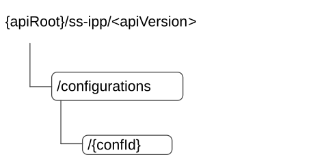

# 7.8.1.2 Resources

## 7.8.1.2.1 Overview

This clause describes the structure for the Resource URIs and the resources and methods used for the service.

Figure 7.8.1.2.1-1 depicts the resource URIs structure for the SS_IdmParameterProvisioning API.

Figure 7.8.1.2.1-1: Resource URI structure of the SS_IdmParameterProvisioning API

Table 7.8.1.2.1-1 provides an overview of the resources and applicable HTTP methods.

Table 7.8.1.2.1-1: Resources and methods overview

| Resource name                         | Resource URI             | HTTP method or custom operation | Description                                                            |
|---------------------------------------|--------------------------|---------------------------------|------------------------------------------------------------------------|
| VAL Services Configurations           | /configurations          | POST                            | Request the creation of a VAL Services Configuration.                  |
|                                       |                          | GET                             | Retrieve one or several VAL services configuration(s).                 |
| Individual VAL Services Configuration | /configurations/{confId} | GET                             | Retrieve an existing "Individual VAL Services Configuration" resource. |
|                                       |                          | PUT                             | Update an "Individual VAL Services Configuration" resource.            |
|                                       |                          | PATCH                           | Modify an existing "Individual VAL Services Configuration" resource.   |
|                                       |                          | DELETE                          | Delete an existing "Individual VAL Services Configuration" resource.   |

## 7.8.1.2.2 Resource: VAL Services Configurations

### 7.8.1.2.2.1 Description

This resource represents the collection of VAL Services Configurations managed by the IM Server.

### 7.8.1.2.2.2 Resource Definition

Resource URI: **{apiRoot}/ss-ipp/\<apiVersion\>/configurations**

This resource shall support the resource URI variables defined in the table 7.8.1.2.2.2-1.

Table 7.8.1.2.2.2-1: Resource URI variables for this resource

| Name    | Data Type | Definition      |
|---------|-----------|-----------------|
| apiRoot | string    | See clause 6.5. |

### 7.8.1.2.2.3 Resource Standard Methods

#### 7.8.1.2.2.3.1 POST

The HTTP POST method enables to request the creation of a VAL Services Configuration to the IM Server.

This method shall support the URI query parameters specified in table 7.8.1.2.2.3.1-1.

Table 7.8.1.2.2.3.1-1: URI query parameters supported by the POST method on this resource

|      |           |     |             |             |
|------|-----------|-----|-------------|-------------|
| Name | Data type | P   | Cardinality | Description |
| n/a  |           |     |             |             |

This method shall support the request data structures specified in table 7.8.1.2.2.3.1-2 and the response data structures and response codes specified in table 7.8.1.2.2.3.1-3.

Table 7.8.1.2.2.3.1-2: Data structures supported by the POST Request Body on this resource

|                   |     |             |                                                                      |
|-------------------|-----|-------------|----------------------------------------------------------------------|
| Data type         | P   | Cardinality | Description                                                          |
| VALServicesConfig | M   | 1           | Represents the VAL services configurations that needs to be created. |

Table 7.8.1.2.2.3.1-3: Data structures supported by the POST Response Body on this resource

<table>
<colgroup>
<col style="width: 16%" />
<col style="width: 9%" />
<col style="width: 14%" />
<col style="width: 19%" />
<col style="width: 39%" />
</colgroup>
<tbody>
<tr class="odd">
<td>Data type</td>
<td>P</td>
<td>Cardinality</td>
<td>
Response

codes
</td>
<td>Description</td>
</tr>
<tr class="even">
<td>VALServicesConfig</td>
<td>M</td>
<td>1</td>
<td>201 Created</td>
<td>
Successful case. The requested VAL services configuration is successfully created.

The URI of the created "Individual VAL Services Configuration" resource shall be returned in the "Location" HTTP header.
</td>
</tr>
<tr class="odd">
<td colspan="5">NOTE: The mandatory HTTP error status codes for the HTTP POST method listed in table 5.2.6-1 of 3GPP TS 29.122 [3] shall also apply.</td>
</tr>
</tbody>
</table>

Table 7.8.1.2.2.3.1-4: Headers supported by the 201 Response Code on this resource

<table>
<colgroup>
<col style="width: 16%" />
<col style="width: 14%" />
<col style="width: 4%" />
<col style="width: 11%" />
<col style="width: 52%" />
</colgroup>
<tbody>
<tr class="odd">
<td>Name</td>
<td>Data type</td>
<td>P</td>
<td>Cardinality</td>
<td>Description</td>
</tr>
<tr class="even">
<td>Location</td>
<td>string</td>
<td>M</td>
<td>1</td>
<td>
Contains the URI of the newly created resource, according to the structure:

{apiRoot}/ss-ipp/&lt;apiVersion&gt;/configurations/{confId}
</td>
</tr>
</tbody>
</table>

#### 7.8.1.2.2.3.2 GET

The HTTP GET method enables to retrieve one or several VAL services configuration(s) satisfying filtering criteria at the IM Server.

This method shall support the URI query parameters specified in table 7.8.1.2.2.3.2-1.

Table 7.8.1.2.2.3.2-1: URI query parameters supported by the GET method on this resource

<table>
<colgroup>
<col style="width: 16%" />
<col style="width: 18%" />
<col style="width: 4%" />
<col style="width: 12%" />
<col style="width: 47%" />
</colgroup>
<tbody>
<tr class="odd">
<td>Name</td>
<td>Data type</td>
<td>P</td>
<td>Cardinality</td>
<td>Description</td>
</tr>
<tr class="even">
<td>val-server-id</td>
<td>string</td>
<td>O</td>
<td>0..1</td>
<td>Contains the identifier of the VAL Server.</td>
</tr>
<tr class="odd">
<td>config-ids</td>
<td>array(string)</td>
<td>O</td>
<td>1..N</td>
<td>Contains the list of the identifier(s) of the targeted "Individual VAL Services Configuration" resource(s).</td>
</tr>
<tr class="even">
<td>supp-feats</td>
<td>SupportedFeatures</td>
<td>C</td>
<td>0..1</td>
<td>
Contains the list of supported features among the ones defined in clause 7.8.1.7.

This query parameter shall be present only when feature negotiation needs to take place.
</td>
</tr>
</tbody>
</table>

This method shall support the request data structures specified in table 7.8.1.2.2.3.2-2 and the response data structures and response codes specified in table 7.8.1.2.2.3.2-3.

Table 7.8.1.2.2.3.2-2: Data structures supported by the GET Request Body on this resource

|           |     |             |             |
|-----------|-----|-------------|-------------|
| Data type | P   | Cardinality | Description |
| n/a       |     |             |             |

Table 7.8.1.2.2.3.2-3: Data structures supported by the GET Response Body on this resource

<table>
<colgroup>
<col style="width: 16%" />
<col style="width: 9%" />
<col style="width: 14%" />
<col style="width: 19%" />
<col style="width: 39%" />
</colgroup>
<tbody>
<tr class="odd">
<td>Data type</td>
<td>P</td>
<td>Cardinality</td>
<td>
Response

codes
</td>
<td>Description</td>
</tr>
<tr class="even">
<td>array(VALServicesConfig)</td>
<td>M</td>
<td>0..N</td>
<td>200 OK</td>
<td>
Successful case. The requested VAL services configuration(s) matching the received query parameter(s) shall be returned.

If there are no active VAL services configuration(s) matching the received query parameter(s), an empty array is returned.
</td>
</tr>
<tr class="odd">
<td>n/a</td>
<td></td>
<td></td>
<td>307 Temporary Redirect</td>
<td>
Temporary redirection.

The response shall include a Location header field containing an alternative URI of the resource located in an alternative IM Server.

Redirection handling is described in clause 5.2.10 of 3GPP TS 29.122 [3].
</td>
</tr>
<tr class="even">
<td>n/a</td>
<td></td>
<td></td>
<td>308 Permanent Redirect</td>
<td>
Permanent redirection.

The response shall include a Location header field containing an alternative URI of the resource located in an alternative IM Server.

Redirection handling is described in clause 5.2.10 of 3GPP TS 29.122 [3].
</td>
</tr>
<tr class="odd">
<td colspan="5">NOTE: The mandatory HTTP error status codes for the HTTP GET method listed in table 5.2.6-1 of 3GPP TS 29.122 [3] shall also apply.</td>
</tr>
</tbody>
</table>

Table 7.8.1.2.2.3.2-4: Headers supported by the 307 Response Code on this resource

|          |           |     |             |                                                                                  |
|----------|-----------|-----|-------------|----------------------------------------------------------------------------------|
| Name     | Data type | P   | Cardinality | Description                                                                      |
| Location | string    | M   | 1           | Contains an alternative URI of the resource located in an alternative IM Server. |

Table 7.8.1.2.2.3.2-5: Headers supported by the 308 Response Code on this resource

|          |           |     |             |                                                                                  |
|----------|-----------|-----|-------------|----------------------------------------------------------------------------------|
| Name     | Data type | P   | Cardinality | Description                                                                      |
| Location | string    | M   | 1           | Contains an alternative URI of the resource located in an alternative IM Server. |

### 7.8.1.2.2.4 Resource Custom Operations

There are no resource custom operations defined for this resource in this release of the sepcifciation.

## 7.8.1.2.3 Resource: Individual VAL Services Configuration

### 7.8.1.2.3.1 Description

This resource represents an "Individual VAL Services Configuration" resource managed by the IM Server.

### 7.8.1.2.3.2 Resource Definition

Resource URI: **{apiRoot}/ss-ipp/\<apiVersion\>/configurations/{confId}**

This resource shall support the resource URI variables defined in the table 7.8.1.2.3.2-1.

Table 7.8.1.2.3.2-1: Resource URI variables for this resource

| Name    | Data Type | Definition                                                      |
|---------|-----------|-----------------------------------------------------------------|
| apiRoot | string    | See clause 6.5.                                                 |
| confId  | string    | Represents an "Individual VAL Services Configuration" resource. |

### 7.8.1.2.3.3 Resource Standard Methods

#### 7.8.1.2.3.3.1 GET

The HTTP GET method enables to retrieve an "Individual VAL Services Configuration" resource at the IM Server.

This method shall support the URI query parameters specified in table 7.8.1.2.3.3.1-1.

Table 7.8.1.2.3.3.1-1: URI query parameters supported by the GET method on this resource

|      |           |     |             |             |
|------|-----------|-----|-------------|-------------|
| Name | Data type | P   | Cardinality | Description |
|      |           |     |             |             |

This method shall support the request data structures specified in table 7.8.1.2.3.3.1-2 and the response data structures and response codes specified in table 7.8.1.2.3.3.1-3.

Table 7.8.1.2.3.3.1-2: Data structures supported by the GET Request Body on this resource

|           |     |             |             |
|-----------|-----|-------------|-------------|
| Data type | P   | Cardinality | Description |
| n/a       |     |             |             |

Table 7.8.1.2.3.3.1-3: Data structures supported by the GET Response Body on this resource

<table>
<colgroup>
<col style="width: 16%" />
<col style="width: 9%" />
<col style="width: 14%" />
<col style="width: 19%" />
<col style="width: 39%" />
</colgroup>
<tbody>
<tr class="odd">
<td>Data type</td>
<td>P</td>
<td>Cardinality</td>
<td>
Response

codes
</td>
<td>Description</td>
</tr>
<tr class="even">
<td>VALServicesConfig</td>
<td>M</td>
<td>1</td>
<td>200 OK</td>
<td>Successful case. The requested "Individual VAL Services Configuration" resource shall be returned.</td>
</tr>
<tr class="odd">
<td>n/a</td>
<td></td>
<td></td>
<td>307 Temporary Redirect</td>
<td>
Temporary redirection.

The response shall include a Location header field containing an alternative URI of the resource located in an alternative IM Server.

Redirection handling is described in clause 5.2.10 of 3GPP TS 29.122 [3].
</td>
</tr>
<tr class="even">
<td>n/a</td>
<td></td>
<td></td>
<td>308 Permanent Redirect</td>
<td>
Permanent redirection.

The response shall include a Location header field containing an alternative URI of the resource located in an alternative IM Server.

Redirection handling is described in clause 5.2.10 of 3GPP TS 29.122 [3].
</td>
</tr>
<tr class="odd">
<td colspan="5">NOTE: The mandatory HTTP error status codes for the HTTP GET method listed in table 5.2.6-1 of 3GPP TS 29.122 [3] shall also apply.</td>
</tr>
</tbody>
</table>

Table 7.8.1.2.3.3.1-4: Headers supported by the 307 Response Code on this resource

|          |           |     |             |                                                                                  |
|----------|-----------|-----|-------------|----------------------------------------------------------------------------------|
| Name     | Data type | P   | Cardinality | Description                                                                      |
| Location | string    | M   | 1           | Contains an alternative URI of the resource located in an alternative IM Server. |

Table 7.8.1.2.3.3.1-5: Headers supported by the 308 Response Code on this resource

|          |           |     |             |                                                                                  |
|----------|-----------|-----|-------------|----------------------------------------------------------------------------------|
| Name     | Data type | P   | Cardinality | Description                                                                      |
| Location | string    | M   | 1           | Contains an alternative URI of the resource located in an alternative IM Server. |

#### 7.8.1.2.3.3.2 PUT

The HTTP PUT method enables to update an existing "Individual VAL Services Configuration" resource at the IM Server.

This method shall support the URI query parameters specified in table 7.8.1.2.3.3.2-1.

Table 7.8.1.2.3.3.2-1: URI query parameters supported by the PUT method on this resource

|      |           |     |             |             |
|------|-----------|-----|-------------|-------------|
| Name | Data type | P   | Cardinality | Description |
| n/a  |           |     |             |             |

This method shall support the request data structures specified in table 7.8.1.2.3.3.2-2 and the response data structures and response codes specified in table 7.8.1.2.3.3.2-3.

Table 7.8.1.2.3.3.2-2: Data structures supported by the PUT Request Body on this resource

|                   |     |             |                                                                                                |
|-------------------|-----|-------------|------------------------------------------------------------------------------------------------|
| Data type         | P   | Cardinality | Description                                                                                    |
| VALServicesConfig | M   | 1           | Represents the updated representation of the "Individual VAL Services Configuration" resource. |

Table 7.8.1.2.3.3.2-3: Data structures supported by the PUT Response Body on this resource

<table>
<colgroup>
<col style="width: 16%" />
<col style="width: 9%" />
<col style="width: 14%" />
<col style="width: 19%" />
<col style="width: 39%" />
</colgroup>
<tbody>
<tr class="odd">
<td>Data type</td>
<td>P</td>
<td>Cardinality</td>
<td>
Response

codes
</td>
<td>Description</td>
</tr>
<tr class="even">
<td>VALServicesConfig</td>
<td>M</td>
<td>1</td>
<td>200 OK</td>
<td>Successful case. The VAL services configuration is successfully updated and a representation of the updated "Individual VAL Services Configuration" resource is returned in the response body.</td>
</tr>
<tr class="odd">
<td>n/a</td>
<td></td>
<td></td>
<td>204 No Content</td>
<td>Successful case. The VAL services configuration is successfully updated and no content is returned in the response body.</td>
</tr>
<tr class="even">
<td>n/a</td>
<td></td>
<td></td>
<td>307 Temporary Redirect</td>
<td>
Temporary redirection.

The response shall include a Location header field containing an alternative URI of the resource located in an alternative IM Server.

Redirection handling is described in clause 5.2.10 of 3GPP TS 29.122 [3].
</td>
</tr>
<tr class="odd">
<td>n/a</td>
<td></td>
<td></td>
<td>308 Permanent Redirect</td>
<td>
Permanent redirection.

The response shall include a Location header field containing an alternative URI of the resource located in an alternative IM Server.

Redirection handling is described in clause 5.2.10 of 3GPP TS 29.122 [3].
</td>
</tr>
<tr class="even">
<td colspan="5">NOTE: The mandatory HTTP error status codes for the HTTP PUT method listed in table 5.2.6-1 of 3GPP TS 29.122 [3] shall also apply.</td>
</tr>
</tbody>
</table>

Table 7.8.1.2.3.3.2-4: Headers supported by the 307 Response Code on this resource

|          |           |     |             |                                                                                  |
|----------|-----------|-----|-------------|----------------------------------------------------------------------------------|
| Name     | Data type | P   | Cardinality | Description                                                                      |
| Location | string    | M   | 1           | Contains an alternative URI of the resource located in an alternative IM Server. |

Table 7.8.1.2.3.3.2-5: Headers supported by the 308 Response Code on this resource

|          |           |     |             |                                                                                  |
|----------|-----------|-----|-------------|----------------------------------------------------------------------------------|
| Name     | Data type | P   | Cardinality | Description                                                                      |
| Location | string    | M   | 1           | Contains an alternative URI of the resource located in an alternative IM Server. |

#### 7.8.1.2.3.3.3 PATCH

The HTTP PATCH method enables to modify an existing "Individual VAL Services Configuration" resource at the IM Server.

This method shall support the URI query parameters specified in table 7.8.1.2.3.3.3-1.

Table 7.8.1.2.3.3.3-1: URI query parameters supported by the PATCH method on this resource

| Name | Data type | P   | Cardinality | Description |
|------|-----------|-----|-------------|-------------|
| n/a  |           |     |             |             |

This method shall support the request data structures specified in table 7.8.1.2.3.3.3-2 and the response data structures and response codes specified in table 7.8.1.2.3.3.3-3.

Table 7.8.1.2.3.3.3-2: Data structures supported by the PATCH Request Body on this resource

| Data type              | P   | Cardinality | Description                                                                                                   |
|------------------------|-----|-------------|---------------------------------------------------------------------------------------------------------------|
| VALServicesConfigPatch | M   | 1           | Represents the requested modifications to be applied to the "Individual VAL Services Configuration" resource. |

Table 7.8.1.2.3.3.3-3: Data structures supported by the PATCH Response Body on this resource

<table>
<colgroup>
<col style="width: 21%" />
<col style="width: 3%" />
<col style="width: 11%" />
<col style="width: 10%" />
<col style="width: 53%" />
</colgroup>
<thead>
<tr class="header">
<th>Data type</th>
<th>P</th>
<th>Cardinality</th>
<th>
Response

codes
</th>
<th>Description</th>
</tr>
</thead>
<tbody>
<tr class="odd">
<td>VALServicesConfig</td>
<td>M</td>
<td>1</td>
<td>200 OK</td>
<td>Successful case. The VAL services configuration is successfully modified and a representation of the updated "Individual VAL Services Configuration" resource is returned in the response body.</td>
</tr>
<tr class="even">
<td>n/a</td>
<td></td>
<td></td>
<td>204 No Content</td>
<td>Successful case. The VAL services configuration is successfully modified and no content is returned in the response body.</td>
</tr>
<tr class="odd">
<td>n/a</td>
<td></td>
<td></td>
<td>307 Temporary Redirect</td>
<td>
Temporary redirection.

The response shall include a Location header field containing an alternative URI of the resource located in an alternative IM Server.

Redirection handling is described in clause 5.2.10 of 3GPP TS 29.122 [3].
</td>
</tr>
<tr class="even">
<td>n/a</td>
<td></td>
<td></td>
<td>308 Permanent Redirect</td>
<td>
Permanent redirection.

The response shall include a Location header field containing an alternative URI of the resource located in an alternative IM Server.

Redirection handling is described in clause 5.2.10 of 3GPP TS 29.122 [3].
</td>
</tr>
<tr class="odd">
<td colspan="5">NOTE: The mandatory HTTP error status codes for the HTTP PATCH method listed in table 5.2.6-1 of 3GPP TS 29.122 [3] shall also apply.</td>
</tr>
</tbody>
</table>

Table 7.8.1.2.3.3.3-4: Headers supported by the 307 Response Code on this resource

|          |           |     |             |                                                                                  |
|----------|-----------|-----|-------------|----------------------------------------------------------------------------------|
| Name     | Data type | P   | Cardinality | Description                                                                      |
| Location | string    | M   | 1           | Contains an alternative URI of the resource located in an alternative IM Server. |

Table 7.8.1.2.3.3.3-5: Headers supported by the 308 Response Code on this resource

|          |           |     |             |                                                                                  |
|----------|-----------|-----|-------------|----------------------------------------------------------------------------------|
| Name     | Data type | P   | Cardinality | Description                                                                      |
| Location | string    | M   | 1           | Contains an alternative URI of the resource located in an alternative IM Server. |

#### 7.8.1.2.3.3.4 DELETE

The HTTP DELETE method enables to delete an existing "Individual VAL Services Configuration" resource at the IM Server.

This method shall support the URI query parameters specified in table 7.8.1.2.3.3.4-1.

Table 7.2.1.2.3.3.4-1: URI query parameters supported by the DELETE method on this resource

|      |           |     |             |             |
|------|-----------|-----|-------------|-------------|
| Name | Data type | P   | Cardinality | Description |
| n/a  |           |     |             |             |

This method shall support the request data structures specified in table 7.8.1.2.3.3.4-2 and the response data structures and response codes specified in table 7.8.1.2.3.3.4-3.

Table 7.8.1.2.3.3.4-2: Data structures supported by the DELETE Request Body on this resource

|           |     |             |             |
|-----------|-----|-------------|-------------|
| Data type | P   | Cardinality | Description |
| n/a       |     |             |             |

Table 7.8.1.2.3.3.4-3: Data structures supported by the DELETE Response Body on this resource

<table>
<colgroup>
<col style="width: 16%" />
<col style="width: 9%" />
<col style="width: 14%" />
<col style="width: 19%" />
<col style="width: 39%" />
</colgroup>
<tbody>
<tr class="odd">
<td>Data type</td>
<td>P</td>
<td>Cardinality</td>
<td>
Response

codes
</td>
<td>Description</td>
</tr>
<tr class="even">
<td>n/a</td>
<td></td>
<td></td>
<td>204 No Content</td>
<td>Successful case. The "Individual VAL Services Configuration" is successfully deleted.</td>
</tr>
<tr class="odd">
<td>n/a</td>
<td></td>
<td></td>
<td>307 Temporary Redirect</td>
<td>
Temporary redirection.

The response shall include a Location header field containing an alternative URI of the resource located in an alternative IM Server.

Redirection handling is described in clause 5.2.10 of 3GPP TS 29.122 [3].
</td>
</tr>
<tr class="even">
<td>n/a</td>
<td></td>
<td></td>
<td>308 Permanent Redirect</td>
<td>
Permanent redirection.

The response shall include a Location header field containing an alternative URI of the resource located in an alternative IM Server.

Redirection handling is described in clause 5.2.10 of 3GPP TS 29.122 [3].
</td>
</tr>
<tr class="odd">
<td colspan="5">NOTE: The mandatory HTTP error status codes for the HTTP DELETE method listed in table 5.2.6-1 of 3GPP TS 29.122 [3] shall also apply.</td>
</tr>
</tbody>
</table>

Table 7.8.1.2.3.3.4-4: Headers supported by the 307 Response Code on this resource

|          |           |     |             |                                                                                  |
|----------|-----------|-----|-------------|----------------------------------------------------------------------------------|
| Name     | Data type | P   | Cardinality | Description                                                                      |
| Location | string    | M   | 1           | Contains an alternative URI of the resource located in an alternative IM Server. |

Table 7.8.1.2.3.3.4-5: Headers supported by the 308 Response Code on this resource

|          |           |     |             |                                                                                  |
|----------|-----------|-----|-------------|----------------------------------------------------------------------------------|
| Name     | Data type | P   | Cardinality | Description                                                                      |
| Location | string    | M   | 1           | Contains an alternative URI of the resource located in an alternative IM Server. |

### 7.8.1.2.3.4 Resource Custom Operations

There are no resource custom operations defined for this resource in this release of the sepcifciation.
