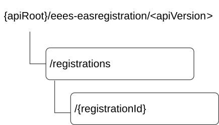

# 8.1.2 Resources

## 8.1.2.1 Overview

This clause describes the structure for the Resource URIs and the resources and methods used for the service.

Figure 8.1.2.1-1 depicts the resource URIs structure for the Eees_EASRegistration API.

Figure 8.1.2.1-1: Resource URI structure of the Eees_EASRegistration API

Table 8.1.2.1-1 provides an overview of the resources and applicable HTTP methods.

Table 8.1.2.1-1: Resources and methods overview

| Resource name               | Resource URI                    | HTTP method or custom operation | Description                                                  |
|-----------------------------|---------------------------------|---------------------------------|--------------------------------------------------------------|
| EAS Registrations           | /registrations                  | POST                            | Creates a new EAS Registration at the EES.                   |
| Individual EAS Registration | /registrations/{registrationId} | GET                             | Retrieve an existing "Individual EAS Registration" resource. |
|                             |                                 | PUT                             | Update an existing "Individual EAS Registration" resource.   |
|                             |                                 | DELETE                          | Remove an existing "Individual EAS Registration" resource.   |
|                             |                                 | PATCH                           | Modify an existing "Individual EAS Registration" resource.   |

NOTE: When this API is exposed by a CES as specified in clause 6B, the "EAS" is replaced by the "CAS" in the clauses under clause 8.1 and the OpenAPI description in Annex A.2. In other words, the "EAS Registrations" resource contains the collection of CAS Registrations managed by the CES and the "Individual EAS Registration" resource contains a CAS Registration managed by the CES.

## 8.1.2.2 Resource: EAS Registrations

### 8.1.2.2.1 Description

This resource represents the Collection of EAS Registrations managed by the EES.

### 8.1.2.2.2 Resource Definition

Resource URI: **{apiRoot}/eees-easregistration/\<apiVersion\>/registrations**

This resource shall support the resource URI variables defined in the table 8.1.2.2.2-1.

Table 8.1.2.2.2-1: Resource URI variables for this resource

| Name    | Data Type | Definition      |
|---------|-----------|-----------------|
| apiRoot | string    | See clause 7.5. |

### 8.1.2.2.3 Resource Standard Methods

#### 8.1.2.2.3.1 POST

This method shall support the URI query parameters specified in table 8.1.2.2.3.1-1.

Table 8.1.2.2.3.1-1: URI query parameters supported by the POST method on this resource

|      |           |     |             |             |
|------|-----------|-----|-------------|-------------|
| Name | Data type | P   | Cardinality | Description |
| n/a  |           |     |             |             |

This method shall support the request data structures specified in table 8.1.2.2.3.1-2 and the response data structures and response codes specified in table 8.1.2.2.3.1-3.

Table 8.1.2.2.3.1-2: Data structures supported by the POST Request Body on this resource

|                 |     |             |                                                                  |
|-----------------|-----|-------------|------------------------------------------------------------------|
| Data type       | P   | Cardinality | Description                                                      |
| EASRegistration | M   | 1           | Represents the parameters of the EAS Registration to be created. |

Table 8.1.2.2.3.1-3: Data structures supported by the POST Response Body on this resource

<table>
<colgroup>
<col style="width: 19%" />
<col style="width: 4%" />
<col style="width: 13%" />
<col style="width: 14%" />
<col style="width: 48%" />
</colgroup>
<tbody>
<tr class="odd">
<td>Data type</td>
<td>P</td>
<td>Cardinality</td>
<td>
Response

codes
</td>
<td>Description</td>
</tr>
<tr class="even">
<td>EASRegistration</td>
<td>M</td>
<td>1</td>
<td>201 Created</td>
<td>
Successful case. The EAS Registration is successfully created at EES and a representation of the created "Individual EAS Registration" resource is returned in the response body.

The URI of the created resource shall be returned in the "Location" HTTP header.
</td>
</tr>
<tr class="odd">
<td colspan="5">NOTE: The mandatory HTTP error status codes for the HTTP POST method listed in Table 5.2.6-1 of 3GPP TS 29.122 [6] shall also apply.</td>
</tr>
</tbody>
</table>

Table 8.1.2.2.3.1-4: Headers supported by the 201 response code on this resource

|          |           |     |             |                                                                                                                                                          |
|----------|-----------|-----|-------------|----------------------------------------------------------------------------------------------------------------------------------------------------------|
| Name     | Data type | P   | Cardinality | Description                                                                                                                                              |
| Location | string    | M   | 1           | Contains the URI of the newly created resource, according to the structure: {apiRoot}/eees-easregistration/\<apiVersion\>/registrations/{registrationId} |

### 8.1.2.2.4 Resource Custom Operations

There are no resource Custom Operations defined for this resource in this release of the specification.

## 8.1.2.3 Resource: Individual EAS Registration

### 8.1.2.3.1 Description

This "Individual EAS Registration" resource represents an individual EAS registration managed by the EES.

### 8.1.2.3.2 Resource Definition

Resource URI: **{apiRoot}/eees-easregistration/\<apiVersion\>/registrations/{registrationId}**

This resource shall support the resource URI variables defined in the table 8.1.2.3.2-1.

Table 8.1.2.3.2-1: Resource URI variables for this resource

| Name           | Data Type | Definition                                                               |
|----------------|-----------|--------------------------------------------------------------------------|
| apiRoot        | string    | See clause 7.5.                                                          |
| registrationId | string    | Represents the identifier of the "Individual EAS Registration" resource. |

### 8.1.2.3.3 Resource Standard Methods

#### 8.1.2.3.3.1 GET

This method shall support the URI query parameters specified in table 8.1.2.3.3.1-1.

Table 8.1.2.3.3.1-1: URI query parameters supported by the GET method on this resource

|      |           |     |             |             |
|------|-----------|-----|-------------|-------------|
| Name | Data type | P   | Cardinality | Description |
| n/a  |           |     |             |             |

This method shall support the request data structures specified in table 8.1.2.3.3.1-2 and the response data structures and response codes specified in table 8.1.2.3.3.1-3.

Table 8.1.2.3.3.1-2: Data structures supported by the GET Request Body on this resource

|           |     |             |             |
|-----------|-----|-------------|-------------|
| Data type | P   | Cardinality | Description |
| n/a       |     |             |             |

Table 8.1.2.3.3.1-3: Data structures supported by the GET Response Body on this resource

<table>
<colgroup>
<col style="width: 16%" />
<col style="width: 9%" />
<col style="width: 14%" />
<col style="width: 19%" />
<col style="width: 39%" />
</colgroup>
<tbody>
<tr class="odd">
<td>Data type</td>
<td>P</td>
<td>Cardinality</td>
<td>
Response

codes
</td>
<td>Description</td>
</tr>
<tr class="even">
<td>EASRegistration</td>
<td>M</td>
<td>1</td>
<td>200 OK</td>
<td>Successful case. The requested "Individual EAS Registration" resource shall be returned.</td>
</tr>
<tr class="odd">
<td>n/a</td>
<td></td>
<td></td>
<td>307 Temporary Redirect</td>
<td>
Temporary redirection.

The response shall include a Location header field containing an alternative target URI of the resource located in an alternative EES.

Redirection handling is described in clause 5.2.10 of TS 29.122 [6].
</td>
</tr>
<tr class="even">
<td>n/a</td>
<td></td>
<td></td>
<td>308 Permanent Redirect</td>
<td>
Permanent redirection.

The response shall include a Location header field containing an alternative target URI of the resource located in an alternative EES.

Redirection handling is described in clause 5.2.10 of TS 29.122 [6].
</td>
</tr>
<tr class="odd">
<td colspan="5">NOTE: The mandatory HTTP error status codes for the HTTP GET method listed in Table 5.2.6-1 of 3GPP TS 29.122 [6] shall also apply.</td>
</tr>
</tbody>
</table>

Table 8.1.2.3.3.1-4: Headers supported by the 307 Response Code on this resource

|          |           |     |             |                                                                                   |
|----------|-----------|-----|-------------|-----------------------------------------------------------------------------------|
| Name     | Data type | P   | Cardinality | Description                                                                       |
| Location | string    | M   | 1           | Contains an alternative target URI of the resource located in an alternative EES. |

Table 8.1.2.3.3.1-5: Headers supported by the 308 Response Code on this resource

|          |           |     |             |                                                                                   |
|----------|-----------|-----|-------------|-----------------------------------------------------------------------------------|
| Name     | Data type | P   | Cardinality | Description                                                                       |
| Location | string    | M   | 1           | Contains an alternative target URI of the resource located in an alternative EES. |

#### 8.1.2.3.3.2 PUT

This method enables to update an existing "Individual EAS Registration" resource at the EES. The values of the "suppFeat" within the EASRegistration data type and the "easId" attribute within the EASProfile data type shall not be updated.

This method shall support the URI query parameters specified in the table 8.1.2.3.3.2-1.

Table 8.1.2.3.3.2-1: URI query parameters supported by the PUT method on this resource

|      |           |     |             |             |
|------|-----------|-----|-------------|-------------|
| Name | Data type | P   | Cardinality | Description |
| n/a  |           |     |             |             |

This method shall support the request data structures specified in table 8.1.2.3.3.2-2 and the response data structures and response codes specified in table 8.1.2.3.3.2-3.

Table 8.1.2.3.3.2-2: Data structures supported by the PUT Request Body on this resource

|                 |     |             |                                                                                      |
|-----------------|-----|-------------|--------------------------------------------------------------------------------------|
| Data type       | P   | Cardinality | Description                                                                          |
| EASRegistration | M   | 1           | Represents the updated representation of the "Individual EAS Registration" resource. |

Table 8.1.2.3.3.2-3: Data structures supported by the PUT Response Body on this resource

<table>
<colgroup>
<col style="width: 16%" />
<col style="width: 9%" />
<col style="width: 14%" />
<col style="width: 19%" />
<col style="width: 39%" />
</colgroup>
<tbody>
<tr class="odd">
<td>Data type</td>
<td>P</td>
<td>Cardinality</td>
<td>
Response

codes
</td>
<td>Description</td>
</tr>
<tr class="even">
<td>EASRegistration</td>
<td>M</td>
<td>1</td>
<td>200 OK</td>
<td>Successful case. The "Individual EAS Registration" resource is successfully updated and a representation of the updated resource shall be returned in the response body.</td>
</tr>
<tr class="odd">
<td>n/a</td>
<td></td>
<td></td>
<td>204 No Content</td>
<td>Successful case. The "Individual EAS Registration" resource is successfully updated and no content is returned in the response body.</td>
</tr>
<tr class="even">
<td>n/a</td>
<td></td>
<td></td>
<td>307 Temporary Redirect</td>
<td>
Temporary redirection.

The response shall include a Location header field containing an alternative target URI of the resource located in an alternative EES.

Redirection handling is described in clause 5.2.10 of TS 29.122 [6].
</td>
</tr>
<tr class="odd">
<td>n/a</td>
<td></td>
<td></td>
<td>308 Permanent Redirect</td>
<td>
Permanent redirection.

The response shall include a Location header field containing an alternative target URI of the resource located in an alternative EES.

Redirection handling is described in clause 5.2.10 of TS 29.122 [6].
</td>
</tr>
<tr class="even">
<td colspan="5">NOTE: The mandatory HTTP error status code for the HTTP PUT method listed in Table 5.2.6-1 of 3GPP TS 29.122 [6] shall also apply.</td>
</tr>
</tbody>
</table>

Table 8.1.2.3.3.2-4: Headers supported by the 307 Response Code on this resource

|          |           |     |             |                                                                                   |
|----------|-----------|-----|-------------|-----------------------------------------------------------------------------------|
| Name     | Data type | P   | Cardinality | Description                                                                       |
| Location | string    | M   | 1           | Contains an alternative target URI of the resource located in an alternative EES. |

Table 8.1.2.3.3.2-5: Headers supported by the 308 Response Code on this resource

|          |           |     |             |                                                                                   |
|----------|-----------|-----|-------------|-----------------------------------------------------------------------------------|
| Name     | Data type | P   | Cardinality | Description                                                                       |
| Location | string    | M   | 1           | Contains an alternative target URI of the resource located in an alternative EES. |

#### 8.1.2.3.3.3 DELETE

This method shall support the URI query parameters specified in the table 8.1.2.3.3.3-1.

Table 8.1.2.3.3.3-1: URI query parameters supported by the DELETE method on this resource

|      |           |     |             |             |
|------|-----------|-----|-------------|-------------|
| Name | Data type | P   | Cardinality | Description |
| n/a  |           |     |             |             |

This method shall support the request data structures specified in table 8.1.2.3.3.3-2 and the response data structures and response codes specified in table 8.1.2.3.3.3-3.

Table 8.1.2.3.3.3-2: Data structures supported by the DELETE Request Body on this resource

|           |     |             |             |
|-----------|-----|-------------|-------------|
| Data type | P   | Cardinality | Description |
| n/a       |     |             |             |

Table 8.1.2.3.3.3-3: Data structures supported by the DELETE Response Body on this resource

<table>
<colgroup>
<col style="width: 16%" />
<col style="width: 9%" />
<col style="width: 14%" />
<col style="width: 19%" />
<col style="width: 39%" />
</colgroup>
<tbody>
<tr class="odd">
<td>Data type</td>
<td>P</td>
<td>Cardinality</td>
<td>
Response

codes
</td>
<td>Description</td>
</tr>
<tr class="even">
<td>n/a</td>
<td></td>
<td></td>
<td>204 No Content</td>
<td>Successful case. The "Individual EAS Registration" resource is successfully deleted.</td>
</tr>
<tr class="odd">
<td>n/a</td>
<td></td>
<td></td>
<td>307 Temporary Redirect</td>
<td>
Temporary redirection.

The response shall include a Location header field containing an alternative target URI of the resource located in an alternative EES.

Redirection handling is described in clause 5.2.10 of TS 29.122 [6].
</td>
</tr>
<tr class="even">
<td>n/a</td>
<td></td>
<td></td>
<td>308 Permanent Redirect</td>
<td>
Permanent redirection.

The response shall include a Location header field containing an alternative target URI of the resource located in an alternative EES.

Redirection handling is described in clause 5.2.10 of TS 29.122 [6].
</td>
</tr>
<tr class="odd">
<td colspan="5">NOTE: The mandatory HTTP error status codes for the HTTP DELETE method listed in Table 5.2.6-1 of 3GPP TS 29.122 [6] shall also apply.</td>
</tr>
</tbody>
</table>

Table 8.1.2.3.3.3-4: Headers supported by the 307 Response Code on this resource

|          |           |     |             |                                                                                   |
|----------|-----------|-----|-------------|-----------------------------------------------------------------------------------|
| Name     | Data type | P   | Cardinality | Description                                                                       |
| Location | string    | M   | 1           | Contains an alternative target URI of the resource located in an alternative EES. |

Table 8.1.2.3.3.3-5: Headers supported by the 308 Response Code on this resource

|          |           |     |             |                                                                                   |
|----------|-----------|-----|-------------|-----------------------------------------------------------------------------------|
| Name     | Data type | P   | Cardinality | Description                                                                       |
| Location | string    | M   | 1           | Contains an alternative target URI of the resource located in an alternative EES. |

#### 8.1.2.3.3.4 PATCH

This method shall support the URI query parameters specified in the table 8.1.2.3.3.4-1.

Table 8.1.2.3.3.4-1: URI query parameters supported by the PATCH method on this resource

|      |           |     |             |             |
|------|-----------|-----|-------------|-------------|
| Name | Data type | P   | Cardinality | Description |
| n/a  |           |     |             |             |

This method shall support the request data structures specified in table 8.1.2.3.3.4-2 and the response data structures and response codes specified in table 8.1.2.3.3.4-3.

Table 8.1.2.3.3.4-2: Data structures supported by the PATCH Request Body on this resource

|                      |     |             |                                                                                                      |
|----------------------|-----|-------------|------------------------------------------------------------------------------------------------------|
| Data type            | P   | Cardinality | Description                                                                                          |
| EASRegistrationPatch | M   | 1           | Represents the parameters to request the modification of the "Individual EAS Registration" resource. |

Table 8.1.2.3.3.4-3: Data structures supported by the PATCH Response Body on this resource

<table>
<colgroup>
<col style="width: 16%" />
<col style="width: 9%" />
<col style="width: 14%" />
<col style="width: 19%" />
<col style="width: 39%" />
</colgroup>
<tbody>
<tr class="odd">
<td>Data type</td>
<td>P</td>
<td>Cardinality</td>
<td>
Response

codes
</td>
<td>Description</td>
</tr>
<tr class="even">
<td>EASRegistration</td>
<td>M</td>
<td>1</td>
<td>200 OK</td>
<td>Successful case. The "Individual EAS Registration" resource is successfully modified and a representation of the updated resource shall be returned in the response body.</td>
</tr>
<tr class="odd">
<td>n/a</td>
<td></td>
<td></td>
<td>204 No Content</td>
<td>Successful case. The "Individual EAS Registration" resource is successfully modified and no content is returned in the response body.</td>
</tr>
<tr class="even">
<td>n/a</td>
<td></td>
<td></td>
<td>307 Temporary Redirect</td>
<td>
Temporary redirection.

The response shall include a Location header field containing an alternative target URI of the resource located in an alternative EES.

Redirection handling is described in clause 5.2.10 of TS 29.122 [6].
</td>
</tr>
<tr class="odd">
<td>n/a</td>
<td></td>
<td></td>
<td>308 Permanent Redirect</td>
<td>
Permanent redirection.

The response shall include a Location header field containing an alternative target URI of the resource located in an alternative EES.

Redirection handling is described in clause 5.2.10 of TS 29.122 [6].
</td>
</tr>
<tr class="even">
<td colspan="5">NOTE: The mandatory HTTP error status codes for the HTTP PATCH method listed in Table 5.2.6-1 of 3GPP TS 29.122 [6] shall also apply.</td>
</tr>
</tbody>
</table>

Table 8.1.2.3.3.4-4: Headers supported by the 307 Response Code on this resource

|          |           |     |             |                                                                                   |
|----------|-----------|-----|-------------|-----------------------------------------------------------------------------------|
| Name     | Data type | P   | Cardinality | Description                                                                       |
| Location | string    | M   | 1           | Contains an alternative target URI of the resource located in an alternative EES. |

Table 8.1.2.3.3.4-5: Headers supported by the 308 Response Code on this resource

|          |           |     |             |                                                                                   |
|----------|-----------|-----|-------------|-----------------------------------------------------------------------------------|
| Name     | Data type | P   | Cardinality | Description                                                                       |
| Location | string    | M   | 1           | Contains an alternative target URI of the resource located in an alternative EES. |

### 8.1.2.3.4 Resource Custom Operations

There are no resource Custom Operations defined for this resource in this release of the specification.
