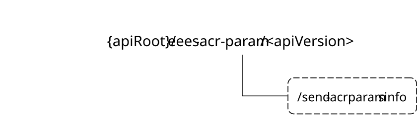

# 8.10 Eees_ACRParameterInformation API

## 8.10.1 Introduction

The Eees_ACRParameterInformation service shall use the Eees_ACRParameterInformation API.

The API URI of the Eees_ACRParameterInformation API shall be:

**{apiRoot}/\<apiName\>/\<apiVersion\>**

The request URIs used in HTTP requests shall have the Resource URI structure defined in clause 5.2.4 of 3GPP TS 29.122 \[6\], i.e.:

**{apiRoot}/\<apiName\>/\<apiVersion\>/\<apiSpecificSuffixes\>**

with the following components:

\- The {apiRoot} shall be set as described in clause 5.2.4 of 3GPP TS 29.122 \[6\].

\- The \<apiName\> shall be "eees-acr-param".

\- The \<apiVersion\> shall be "v1".

\- The \<apiSpecificSuffixes\> shall be set as described in clause 5.2.4 of 3GPP TS 29.122 \[6\].

NOTE: When 3GPP TS 29.122 \[6\] is referenced for the common protocol and interface aspects for API definition in the clauses under clause 6.5, the EES takes the role of the SCEF and the service consumer takes the role of the SCS/AS.

## 8.10.2 Usage of HTTP

The provisions of clause 5.2.2 of 3GPP TS 29.122 \[6\] shall apply for the Eees_ACRParameterInformation API.

## 8.10.3 Resources

There are no resources defined for this API in this release of the specification.

## 8.10.4 Custom Operations without associated resources

### 8.10.4.1 Overview

The structure of the custom operation URIs of the Eees_ACRParameterInformation API is shown in Figure 8.10.4.1-1.

Figure 8.10.4.1-1: Custom operation URI structure of the Eees_ACRParameterInformation API

Table 8.10.4.1-1 provides an overview of the custom operations and applicable HTTP methods defined for the Eees_ACRParameterInformation API.

Table 8.10.4.1-1: Custom operations without associated resources

| Operation name | Custom operation URI | Mapped HTTP method | Description                                                               |
|----------------|----------------------|--------------------|---------------------------------------------------------------------------|
| Request        | /send-acrparamsinfo  | POST               | Enables a service consumer to send ACR parameters information to the EES. |

### 8.10.4.2 Operation: Request

#### 8.10.4.2.1 Description

The custom operation enables a service consumer to send ACR parameters information to the EES.

#### 8.10.4.2.2 Operation Definition

This operation shall support the request data structures and the response data structures and response codes specified in tables 8.10.4.2.2-1 and 8.10.4.2.2-2.

Table 8.10.4.2.2-1: Data structures supported by the POST Request Body

|               |     |             |                                                                    |
|---------------|-----|-------------|--------------------------------------------------------------------|
| Data type     | P   | Cardinality | Description                                                        |
| ACRParamsInfo | M   | 1           | Contains the ACR parameters information to be provisioned/updated. |

Table 8.10.4.2.2-2: Data structures supported by the POST Response Body

<table>
<colgroup>
<col style="width: 16%" />
<col style="width: 4%" />
<col style="width: 11%" />
<col style="width: 14%" />
<col style="width: 52%" />
</colgroup>
<tbody>
<tr class="odd">
<td>Data type</td>
<td>P</td>
<td>Cardinality</td>
<td>
Response

codes
</td>
<td>Description</td>
</tr>
<tr class="even">
<td>n/a</td>
<td></td>
<td></td>
<td>204 No Content</td>
<td>Successful case. The ACR parameters information is successfully received and processed.</td>
</tr>
<tr class="odd">
<td>n/a</td>
<td></td>
<td></td>
<td>307 Temporary Redirect</td>
<td>
Temporary redirection.

The response shall include a Location header field containing an alternative target URI located in an alternative EES.

Redirection handling is described in clause 5.2.10 of 3GPP TS 29.122 [6].
</td>
</tr>
<tr class="even">
<td>n/a</td>
<td></td>
<td></td>
<td>308 Permanent Redirect</td>
<td>
Permanent redirection.

The response shall include a Location header field containing an alternative target URI located in an alternative EES.

Redirection handling is described in clause 5.2.10 of 3GPP TS 29.122 [6].
</td>
</tr>
<tr class="odd">
<td colspan="5">NOTE: The manadatory HTTP error status codes for the HTTP POST method listed in Table 5.2.6-1 of 3GPP TS 29.122 [6] shall also apply.</td>
</tr>
</tbody>
</table>

Table 8.10.4.2.2-3: Headers supported by the 307 Response Code

|          |           |     |             |                                                                   |
|----------|-----------|-----|-------------|-------------------------------------------------------------------|
| Name     | Data type | P   | Cardinality | Description                                                       |
| Location | string    | M   | 1           | Contains an alternative target URI located in an alternative EES. |

Table 8.10.4.2.2-4: Headers supported by the 308 Response Code

|          |           |     |             |                                                                   |
|----------|-----------|-----|-------------|-------------------------------------------------------------------|
| Name     | Data type | P   | Cardinality | Description                                                       |
| Location | string    | M   | 1           | Contains an alternative target URI located in an alternative EES. |

## 8.10.5 Notifications

There are no notifications defined for this API in this release of the specification.

## 8.10.6 Data Model

### 8.10.6.1 General

This clause specifies the application data model supported by the API.

Table 8.10.6.1-1 specifies the data types defined for the Eees_ACRParameterInformation API.

Table 8.10.6.1-1: Eees_ACRParameterInformation API specific Data Types

| Data type     | Clause defined | Description                                | Applicability |
|---------------|----------------|--------------------------------------------|---------------|
| ACRParamsInfo | 8.10.6.2.2     | Represents the ACR parameters information. |               |

Table 8.10.6.1-2 specifies data types re-used by the Eees_ACRParameterInformation API from other specifications, including a reference to their respective specifications and when needed, a short description of their use within the Eees_ACRParameterInformation API.

Table 8.10.6.1-2: Eees_ACRParameterInformation API re-used Data Types

| Data type     | Reference         | Comments                             | Applicability |
|---------------|-------------------|--------------------------------------|---------------|
| ACRParameters | Clause 8.6.5.2.13 | Represents ACR parameters.           |               |
| EndPoint      | Clause 8.1.5.2.5  | Represents the endpoint information. |               |

### 8.10.6.2 Structured data types

#### 8.10.6.2.1 Introduction

This clause defines the structures to be used in resource representations.

#### 8.10.6.2.2 Type: ACRParamsInfo

Table 8.10.6.2.2-1: Definition of type ACRParamsInfo

| Attribute name | Data type     | P   | Cardinality | Description                                                                            | Applicability |
|----------------|---------------|-----|-------------|----------------------------------------------------------------------------------------|---------------|
| requestorId    | string        | M   | 1           | Contains the identifier of the service consumer that is sending the request.           |               |
| eecId          | string        | M   | 1           | Contains the identifier of the concerned EEC.                                          |               |
| acId           | string        | M   | 1           | Contains the identifier of the concerned AC.                                           |               |
| sAsEndPoint    | EndPoint      | M   | 1           | Contains the endpoint information of the source Application Server (e.g., S-EAS, CAS). |               |
| tAsEndPoint    | EndPoint      | M   | 1           | Contains the endpoint information of the target Application Server (e.g., T-EAS, CAS). |               |
| acrParams      | ACRParameters | M   | 1           | Contains the ACR Parameters.                                                           |               |

### 8.10.6.3 Simple data types and enumerations

#### 8.10.6.3.1 Introduction

This clause defines simple data types and enumerations that can be referenced from data structures defined in the previous clauses.

#### 8.10.6.3.2 Simple data types

The simple data types defined in table 8.10.6.3.2-1 shall be supported.

Table 8.10.6.3.2-1: Simple data types

|           |                 |             |               |
|-----------|-----------------|-------------|---------------|
| Type Name | Type Definition | Description | Applicability |
|           |                 |             |               |

### 8.10.6.4 Data types describing alternative data types or combinations of data types

There are no data types describing alternative data types or combinations of data types defined for this API in this release of the specification.

### 8.10.6.5 Binary data

#### 8.10.6.5.1 Binary Data Types

Table 8.10.6.5.1-1: Binary Data Types

| Name | Clause defined | Content type |
|------|----------------|--------------|
|      |                |              |

## 8.10.7 Error Handling

### 8.10.7.1 General

For the Eees_ACRParameterInformation API, HTTP error responses shall be supported as specified in clause 5.2.6 of 3GPP TS 29.122 \[6\]. Protocol errors and application errors specified in clause 5.2.6 of 3GPP TS 29.122 \[6\] shall be supported for the HTTP status codes specified in table 5.2.6-1 of 3GPP TS 29.122 \[6\].

In addition, the requirements in the following clauses are applicable for the Eees_ACRParameterInformation API.

### 8.10.7.2 Protocol Errors

No specific protocol errors for the Eees_ACRParameterInformation API are specified.

### 8.10.7.3 Application Errors

The application errors defined for the Eees_ACRParameterInformation API are listed in Table 8.10.7.3-1.

Table 8.10.7.3-1: Application errors

| Application Error | HTTP status code | Description | Applicability |
|-------------------|------------------|-------------|---------------|
|                   |                  |             |               |

## 8.10.8 Feature negotiation

The optional features in table 8.10.8-1 are defined for the Eees_ACRParameterInformation API. They shall be negotiated using the extensibility mechanism defined in clause 5.2.7 of 3GPP TS 29.122 \[6\].

Table 8.10.8-1: Supported Features

| Feature number | Feature Name | Description |
|----------------|--------------|-------------|
|                |              |             |
