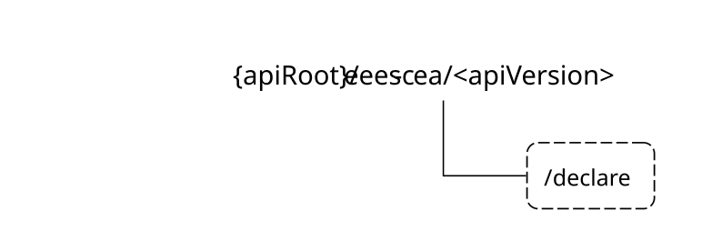

# 8.11 Eees_CommonEASAnnouncement API

## 8.11.1 Introduction

The Eees_CommonEASAnnouncement service shall use the Eees_CommonEASAnnouncement API.

The API URI of the Eees_CommonEASAnnouncement API shall be:

**{apiRoot}/\<apiName\>/\<apiVersion\>**

The request URIs used in HTTP requests shall have the Resource URI structure defined in clause 5.2.4 of 3GPP TS 29.122 \[6\], i.e.:

**{apiRoot}/\<apiName\>/\<apiVersion\>/\<apiSpecificSuffixes\>**

with the following components:

\- The {apiRoot} shall be set as described in clause 5.2.4 of 3GPP TS 29.122 \[6\].

\- The \<apiName\> shall be "eees-cea".

\- The \<apiVersion\> shall be "v1".

\- The \<apiSpecificSuffixes\> shall be set as described in clause 5.2.4 of 3GPP TS 29.122 \[6\].

NOTE: When 3GPP TS 29.122 \[6\] is referenced for the common protocol and interface aspects for API definition in the clauses under clause 6.5, the EES takes the role of the SCEF and the service consumer takes the role of the SCS/AS.

## 8.11.2 Usage of HTTP

The provisions of clause 5.2.2 of 3GPP TS 29.122 \[6\] shall apply for the Eees_CommonEASAnnouncement API.

## 8.11.3 Resources

There are no resources defined for this API in this release of the specification.

## 8.11.4 Custom Operations without associated resources

### 8.11.4.1 Overview

The structure of the custom operation URIs of the Eees_CommonEASAnnouncement API is shown in Figure 8.11.4.1-1.

Figure 8.11.4.1-1: Custom operation URI structure of the Eees_CommonEASAnnouncement API

Table 8.11.4.1-1 provides an overview of the custom operations and applicable HTTP methods defined for the Eees_CommonEASAnnouncement API.

Table 8.11.4.1-1: Custom operations without associated resources

| Operation name | Custom operation URI | Mapped HTTP method | Description                                                           |
|----------------|----------------------|--------------------|-----------------------------------------------------------------------|
| Declare        | /declare             | POST               | Enables a service consumer to send common EAS information to the EES. |

### 8.11.4.2 Operation: Declare

#### 8.11.4.2.1 Description

The custom operation enables a service consumer to send common EAS information to the EES.

#### 8.11.4.2.2 Operation Definition

This operation shall support the request data structures and the response data structures and response codes specified in tables 8.11.4.2.2-1 and 8.11.4.2.2-2.

Table 8.11.4.2.2-1: Data structures supported by the POST Request Body on this resource

|               |     |             |                                                     |
|---------------|-----|-------------|-----------------------------------------------------|
| Data type     | P   | Cardinality | Description                                         |
| CommonEASInfo | M   | 1           | Contains the common EAS information to be declared. |

Table 8.11.4.2.2-2: Data structures supported by the POST Response Body on this resource

<table>
<colgroup>
<col style="width: 16%" />
<col style="width: 4%" />
<col style="width: 11%" />
<col style="width: 14%" />
<col style="width: 52%" />
</colgroup>
<tbody>
<tr class="odd">
<td>Data type</td>
<td>P</td>
<td>Cardinality</td>
<td>
Response

codes
</td>
<td>Description</td>
</tr>
<tr class="even">
<td>n/a</td>
<td></td>
<td></td>
<td>204 No Content</td>
<td>Successful case. The common EAS information is successfully received and no content is returned in the response body.</td>
</tr>
<tr class="odd">
<td>CommonEASInfoDecResp</td>
<td>M</td>
<td>1</td>
<td>200 OK</td>
<td>Successful case. The common EAS information is successfully received and common EAS declaration related information is returned in the response body.</td>
</tr>
<tr class="even">
<td>n/a</td>
<td></td>
<td></td>
<td>307 Temporary Redirect</td>
<td>
Temporary redirection.

The response shall include a Location header field containing an alternative target URI located in an alternative EES.

Redirection handling is described in clause 5.2.10 of 3GPP TS 29.122 [6].
</td>
</tr>
<tr class="odd">
<td>n/a</td>
<td></td>
<td></td>
<td>308 Permanent Redirect</td>
<td>
Permanent redirection.

The response shall include a Location header field containing an alternative target URI located in an alternative EES.

Redirection handling is described in clause 5.2.10 of 3GPP TS 29.122 [6].
</td>
</tr>
<tr class="even">
<td colspan="5">NOTE: The manadatory HTTP error status codes for the HTTP POST method listed in Table 5.2.6-1 of 3GPP TS 29.122 [6] shall also apply.</td>
</tr>
</tbody>
</table>

Table 8.11.4.2.2-3: Headers supported by the 307 Response Code on this resource

|          |           |     |             |                                                                   |
|----------|-----------|-----|-------------|-------------------------------------------------------------------|
| Name     | Data type | P   | Cardinality | Description                                                       |
| Location | string    | M   | 1           | Contains an alternative target URI located in an alternative EES. |

Table 8.11.4.2.2-4: Headers supported by the 308 Response Code on this resource

|          |           |     |             |                                                                   |
|----------|-----------|-----|-------------|-------------------------------------------------------------------|
| Name     | Data type | P   | Cardinality | Description                                                       |
| Location | string    | M   | 1           | Contains an alternative target URI located in an alternative EES. |

## 8.11.5 Notifications

There are no notifications defined for this API in this release of the specification.

## 8.11.6 Data Model

### 8.11.6.1 General

This clause specifies the application data model supported by the API.

Table 8.11.6.1-1 specifies the data types defined for the Eees_CommonEASAnnouncement API.

Table 8.10.6.1-1: Eees_CommonEASAnnouncement API specific Data Types

| Data type            | Clause defined | Description                                                              | Applicability |
|----------------------|----------------|--------------------------------------------------------------------------|---------------|
| CommonEASInfo        | 8.11.6.2.2     | Represents the common EAS information.                                   |               |
| CommonEASInfoDecResp | 8.11.6.2.3     | Represents the response to a common EAS information declaration request. |               |
| GrpConnInfo          | 8.11.6.2.4     | Represents the group connection information.                             |               |

Table 8.11.6.1-2 specifies data types re-used by the Eees_CommonEASAnnouncement API from other specifications, including a reference to their respective specifications and when needed, a short description of their use within the Eees_CommonEASAnnouncement API.

Table 8.11.6.1-2: Eees_CommonEASAnnouncement API re-used Data Types

| Data type         | Reference            | Comments                                           | Applicability |
|-------------------|----------------------|----------------------------------------------------|---------------|
| EASServiceKPI     | 8.1.5.2.4            | Represents the EAS Service KPIs.                   | EdgeApp_3     |
| EDNInfo           | 9.1.5.2.10           | Represents EDN related information.                | EdgeApp_3     |
| EndPoint          | 8.1.5.2.5            | Represents the end point information of an entity. |               |
| Gpsi              | 3GPP TS 29.571 \[8\] | Represents a GPSI.                                 |               |
| SupportedFeatures | 3GPP TS 29.571 \[8\] | Represents the list of supported features.         |               |

### 8.11.6.2 Structured data types

#### 8.11.6.2.1 Introduction

This clause defines the structures to be used in resource representations.

#### 8.11.6.2.2 Type: CommonEASInfo

Table 8.11.6.2.2-1: Definition of type CommonEASInfo

<table>
<colgroup>
<col style="width: 14%" />
<col style="width: 16%" />
<col style="width: 4%" />
<col style="width: 11%" />
<col style="width: 38%" />
<col style="width: 13%" />
</colgroup>
<thead>
<tr class="header">
<th>Attribute name</th>
<th>Data type</th>
<th>P</th>
<th>Cardinality</th>
<th>Description</th>
<th>Applicability</th>
</tr>
</thead>
<tbody>
<tr class="odd">
<td>requestorId</td>
<td>string</td>
<td>M</td>
<td>1</td>
<td>Contains the identifier of the service consumer (e.g., announcing EES) that is sending the request.</td>
<td></td>
</tr>
<tr class="even">
<td>requestorEndPt</td>
<td>EndPoint</td>
<td>O</td>
<td>0..1</td>
<td>Contains the endpoint information of the service consumer (e.g., announcing EES).</td>
<td></td>
</tr>
<tr class="odd">
<td>easId</td>
<td>string</td>
<td>M</td>
<td>1</td>
<td>Contains the identifier of the selected common EAS.</td>
<td></td>
</tr>
<tr class="even">
<td>easEndPt</td>
<td>EndPoint</td>
<td>M</td>
<td>1</td>
<td>Contains the endpoint information of the selected common EAS.</td>
<td></td>
</tr>
<tr class="odd">
<td>serviceKpisList</td>
<td>EASServiceKPI</td>
<td>O</td>
<td>0..1</td>
<td>Contains the list of service KPI(s) of the selected common EAS.</td>
<td>EdgeApp_3</td>
</tr>
<tr class="even">
<td>ednInfo</td>
<td>EDNInfo</td>
<td>C</td>
<td>0..1</td>
<td>
Contains information related to the EDN where the selected common EAS resides.

When the "EdgeApp_3" feature is supported, this attribute shall be present.
</td>
<td>EdgeApp_3</td>
</tr>
<tr class="odd">
<td>appGrpId</td>
<td>string</td>
<td>M</td>
<td>1</td>
<td>Contains the targeted application group identifier.</td>
<td></td>
</tr>
<tr class="even">
<td>suppFeat</td>
<td>SupportedFeatures</td>
<td>C</td>
<td>0..1</td>
<td>
Contains the list of supported features among the ones defined in clause 8.11.8.

This attribute shall be present only when feature negotiation needs to take place.
</td>
<td></td>
</tr>
</tbody>
</table>

#### 8.11.6.2.3 Type: CommonEASInfoDecResp

Table 8.11.6.2.3-1: Definition of type CommonEASInfoDecResp

<table>
<colgroup>
<col style="width: 14%" />
<col style="width: 17%" />
<col style="width: 4%" />
<col style="width: 11%" />
<col style="width: 37%" />
<col style="width: 13%" />
</colgroup>
<thead>
<tr class="header">
<th>Attribute name</th>
<th>Data type</th>
<th>P</th>
<th>Cardinality</th>
<th>Description</th>
<th>Applicability</th>
</tr>
</thead>
<tbody>
<tr class="odd">
<td>grpConnInfo</td>
<td>array(GrpConnInfo)</td>
<td>C</td>
<td>1..N</td>
<td>
Contains the group connection information, i.e., whether the UE(s) in the group should connect to the selected common EAS or not.

(NOTE)
</td>
<td></td>
</tr>
<tr class="even">
<td>suppFeat</td>
<td>SupportedFeatures</td>
<td>C</td>
<td>0..1</td>
<td>
Contains the list of supported features among the ones defined in clause 8.11.8.

This attribute shall be present only when feature negotiation needs to take place.
</td>
<td></td>
</tr>
<tr class="odd">
<td colspan="6">NOTE: At least one of these attributes shall be present.</td>
</tr>
</tbody>
</table>

#### 8.11.6.2.4 Type: GrpConnInfo

Table 8.11.6.2.4-1: Definition of type GrpConnInfo

<table>
<colgroup>
<col style="width: 14%" />
<col style="width: 16%" />
<col style="width: 4%" />
<col style="width: 11%" />
<col style="width: 38%" />
<col style="width: 13%" />
</colgroup>
<thead>
<tr class="header">
<th>Attribute name</th>
<th>Data type</th>
<th>P</th>
<th>Cardinality</th>
<th>Description</th>
<th>Applicability</th>
</tr>
</thead>
<tbody>
<tr class="odd">
<td>ueId</td>
<td>Gpsi</td>
<td>M</td>
<td>1</td>
<td>Contains the GPSI of the UE.</td>
<td></td>
</tr>
<tr class="even">
<td>connInd</td>
<td>boolean</td>
<td>M</td>
<td>1</td>
<td>
Contains the common EAS connection indication, i.e., whether or not the UE identified by the "ueId" attribute should connect to the selected common EAS.

- When set to "true", it indicates that UE should connect to the selected common EAS.

- When set to "false", it indicates that UE should not connect to the selected common EAS.
</td>
<td></td>
</tr>
</tbody>
</table>

### 8.11.6.3 Simple data types and enumerations

#### 8.11.6.3.1 Introduction

This clause defines simple data types and enumerations that can be referenced from data structures defined in the previous clauses.

#### 8.11.6.3.2 Simple data types

The simple data types defined in table 8.11.6.3.2-1 shall be supported.

Table 8.11.6.3.2-1: Simple data types

|           |                 |             |               |
|-----------|-----------------|-------------|---------------|
| Type Name | Type Definition | Description | Applicability |
|           |                 |             |               |

### 8.11.6.4 Data types describing alternative data types or combinations of data types

There are no data types describing alternative data types or combinations of data types defined for this API in this release of the specification.

### 8.11.6.5 Binary data

#### 8.11.6.5.1 Binary Data Types

Table 8.11.6.5.1-1: Binary Data Types

| Name | Clause defined | Content type |
|------|----------------|--------------|
|      |                |              |

## 8.11.7 Error Handling

### 8.11.7.1 General

For the Eees_CommonEASAnnouncement API, HTTP error responses shall be supported as specified in clause 5.2.6 of 3GPP TS 29.122 \[6\]. Protocol errors and application errors specified in clause 5.2.6 of 3GPP TS 29.122 \[6\] shall be supported for the HTTP status codes specified in table 5.2.6-1 of 3GPP TS 29.122 \[6\].

In addition, the requirements in the following clauses are applicable for the Eees_CommonEASAnnouncement API.

### 8.11.7.2 Protocol Errors

No specific protocol errors for the Eees_CommonEASAnnouncement API are specified.

### 8.11.7.3 Application Errors

The application errors defined for the Eees_CommonEASAnnouncement API are listed in Table 8.11.7.3-1.

Table 8.11.7.3-1: Application errors

| Application Error | HTTP status code | Description | Applicability |
|-------------------|------------------|-------------|---------------|
|                   |                  |             |               |

## 8.11.8 Feature negotiation

The optional features in table 8.11.8-1 are defined for the Eees_CommonEASAnnouncement API. They shall be negotiated using the extensibility mechanism defined in clause 5.2.7 of 3GPP TS 29.122 \[6\].

Table 8.11.8-1: Supported Features

<table>
<colgroup>
<col style="width: 16%" />
<col style="width: 23%" />
<col style="width: 60%" />
</colgroup>
<thead>
<tr class="header">
<th>Feature number</th>
<th>Feature Name</th>
<th>Description</th>
</tr>
</thead>
<tbody>
<tr class="odd">
<td>1</td>
<td>EdgeApp_3</td>
<td>
This feature indicates the support of the second set of enhancements to the Edge Applications Enabler Layer.

Within this feature, the following enhancements are covered:

- Support of the provisioning of the service KPIs and the EDN information of the selected common EAS in the selected common EAS announcement request.
</td>
</tr>
</tbody>
</table>
