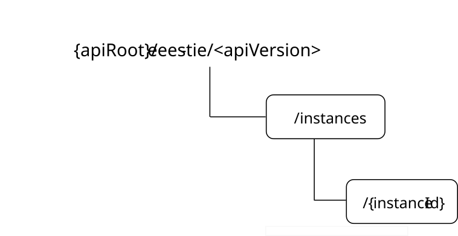

# 8.12 Eees_TrafficInfluenceEAS API

## 8.12.1 Introduction

The Eees_TrafficInfluenceEAS service shall use the Eees_TrafficInfluenceEAS API.

The API URI of the Eees_TrafficInfluenceEAS API shall be:

**{apiRoot}/\<apiName\>/\<apiVersion\>**

The request URIs used in HTTP requests shall have the Resource URI structure defined in clause 5.2.4 of 3GPP TS 29.122 \[6\], i.e.:

**{apiRoot}/\<apiName\>/\<apiVersion\>/\<apiSpecificSuffixes\>**

with the following components:

\- The {apiRoot} shall be set as described in clause 5.2.4 of 3GPP TS 29.122 \[6\].

\- The \<apiName\> shall be "eees-tie".

\- The \<apiVersion\> shall be "v1".

\- The \<apiSpecificSuffixes\> shall be set as described in clause 5.2.4 of 3GPP TS 29.122 \[6\].

## 8.12.2 Usage of HTTP

The provisions of clause 5.2.2 of 3GPP TS 29.122 \[6\] shall apply for the Eees_TrafficInfluenceEAS API.

## 8.12.3 Resources

### 8.12.3.1 Overview

This clause describes the structure for the Resource URIs and the resources and methods used for the service.

Figure 8.12.3.1-1 depicts the resource URIs structure for the Eees_TrafficInfluenceEAS API.

Figure 8.12.3.1-1: Resource URIs structure of the Eees_TrafficInfluenceEAS API

Table 8.12.3.1-1 provides an overview of the resources and applicable HTTP methods for the Eees_TrafficInfluenceEAS API.

Table 8.12.3.1-1: Resources and methods overview

| Resource name                                     | Resource URI            | HTTP method or custom operation | Description                                                                                           |
|---------------------------------------------------|-------------------------|---------------------------------|-------------------------------------------------------------------------------------------------------|
| Application Traffic Influence Instances           | /instances              | POST                            | Request the creation of an Application Traffic Influence Instance.                                    |
| Individual Application Traffic Influence Instance | /instances/{instanceId} | GET                             | Request the retrieval of an "Individual Application Traffic Influence Instance" resource.             |
|                                                   |                         | PUT                             | Request the update of an existing "Individual Application Traffic Influence Instance" resource.       |
|                                                   |                         | PATCH                           | Request the modification of an existing "Individual Application Traffic Influence Instance" resource. |
|                                                   |                         | DELETE                          | Request the cancelation of an existing "Individual Application Traffic Influence Instance" resource.  |

### 8.12.3.2 Resource: Application Traffic Influence

#### 8.12.3.2.1 Description

This resource represents the collection of Application Traffic Influence Instances managed by the EES.

#### 8.12.3.2.2 Resource Definition

Resource URI: **{apiRoot}/eees-tie/\<apiVersion\>/instances**

This resource shall support the resource URI variables defined in table 8.12.3.2.2-1.

Table 8.12.3.2.2-1: Resource URI variables for this resource

| Name    | Data type | Definition                                |
|---------|-----------|-------------------------------------------|
| apiRoot | string    | See clause 5.2.4 of 3GPP TS 29.122 \[6\]. |

#### 8.12.3.2.3 Resource Standard Methods

The following clauses specify the standard methods supported by the resource.

##### 8.12.3.2.3.1 POST

The POST method allows a service consumer to request the creation of an Application Traffic Influence Instance.

This method shall support the URI query parameters specified in table 8.12.3.2.3.1-1.

Table 8.12.3.2.3.1-1: URI query parameters supported by the POST method on this resource

|      |           |     |             |             |               |
|------|-----------|-----|-------------|-------------|---------------|
| Name | Data type | P   | Cardinality | Description | Applicability |
| n/a  |           |     |             |             |               |

This method shall support the request data structures specified in table 8.12.3.2.3.1-2 and the response data structures and response codes specified in table 8.12.3.2.3.1-3.

Table 8.12.3.2.3.1-2: Data structures supported by the POST Request Body on this resource

|                     |     |             |                                                                                                 |
|---------------------|-----|-------------|-------------------------------------------------------------------------------------------------|
| Data type           | P   | Cardinality | Description                                                                                     |
| AppTrafficInfluence | M   | 1           | Represents the parameters to request the creation of an Application Traffic Influence Instance. |

Table 8.12.3.2.3.1-3: Data structures supported by the POST Response Body on this resource

<table>
<colgroup>
<col style="width: 19%" />
<col style="width: 4%" />
<col style="width: 11%" />
<col style="width: 13%" />
<col style="width: 51%" />
</colgroup>
<tbody>
<tr class="odd">
<td>Data type</td>
<td>P</td>
<td>Cardinality</td>
<td>
Response

codes
</td>
<td>Description</td>
</tr>
<tr class="even">
<td>AppTrafficInfluence</td>
<td>M</td>
<td>1</td>
<td>201 Created</td>
<td>
Successful case. The application traffic influence is successfully created and a representation of the created "Individual Application Traffic Influence Instance" resource is returned.

An HTTP "Location" header that contains the URI of the created "Individual Application Traffic Influence Instance" resource shall also be included.
</td>
</tr>
<tr class="odd">
<td colspan="5">NOTE: The mandatory HTTP error status codes for the HTTP POST method listed in table 5.2.6-1 of 3GPP TS 29.122 [6] shall also apply.</td>
</tr>
</tbody>
</table>

Table 8.12.3.2.3.1-4: Headers supported by the 201 Response Code on this resource

|          |           |     |             |                                                                                                                                      |
|----------|-----------|-----|-------------|--------------------------------------------------------------------------------------------------------------------------------------|
| Name     | Data type | P   | Cardinality | Description                                                                                                                          |
| Location | string    | M   | 1           | Contains the URI of the newly created resource, according to the structure: {apiRoot}/eees-tie/\<apiVersion\>/instances/{instanceId} |

#### 8.12.3.2.4 Resource Custom Operations

There are no resource custom operations defined for this resource in this release of the specification.

### 8.12.3.3 Resource: Individual Application Traffic Influence

#### 8.12.3.3.1 Description

This resource represents the collection of Individual Application Traffic Influence Instances managed by the EES.

#### 8.12.3.3.2 Resource Definition

Resource URI: **{apiRoot}/eees-tie/\<apiVersion\>/instances/{instanceId}**

This resource shall support the resource URI variables defined in table 8.12.3.3.2-1.

Table 8.12.3.3.2-1: Resource URI variables for this resource

| Name       | Data type | Definition                                                                                   |
|------------|-----------|----------------------------------------------------------------------------------------------|
| apiRoot    | string    | See clause 5.2.4 of 3GPP TS 29.122 \[6\].                                                    |
| instanceId | string    | Contains the identifier of an "Individual Application Traffic Influence Instance " resource. |

#### 8.12.3.3.3 Resource Standard Methods

The following clauses specify the standard methods supported by the resource.

##### 8.12.3.3.3.1 GET

This method requests retrieval of an existing Application Traffic Influence Instance.

This method shall support the URI query parameters specified in the table 8.12.3.3.3.2-1.

Table 8.12.3.3.3.1-1: URI query parameters supported by the GET method on this resource

|      |           |     |             |             |
|------|-----------|-----|-------------|-------------|
| Name | Data type | P   | Cardinality | Description |
|      |           |     |             |             |

This method shall support the request data structures specified in table 8.12.3.3.3.1-2 and the response data structures and response codes specified in table 8.12.3.3.3.1-3.

Table 8.12.3.3.3.1-2: Data structures supported by the GET Request Body on this resource

|           |     |             |             |
|-----------|-----|-------------|-------------|
| Data type | P   | Cardinality | Description |
| n/a       |     |             |             |

Table 8.12.3.3.3.1-3: Data structures supported by the GET Response Body on this resource

<table>
<colgroup>
<col style="width: 16%" />
<col style="width: 9%" />
<col style="width: 14%" />
<col style="width: 19%" />
<col style="width: 39%" />
</colgroup>
<tbody>
<tr class="odd">
<td>Data type</td>
<td>P</td>
<td>Cardinality</td>
<td>
Response

codes
</td>
<td>Description</td>
</tr>
<tr class="even">
<td>AppTrafficInfluence</td>
<td>M</td>
<td>1</td>
<td>200 OK</td>
<td>Successful case. The "Individual Application Traffic Influence Instance" resource is successfully returned by the EES.</td>
</tr>
<tr class="odd">
<td>n/a</td>
<td></td>
<td></td>
<td>307 Temporary Redirect</td>
<td>
Temporary redirection. The response shall include a Location header field containing an alternative URI of the resource located in an alternative EES.

Redirection handling is described in clause 5.2.10 of TS 29.122 [6].
</td>
</tr>
<tr class="even">
<td>n/a</td>
<td></td>
<td></td>
<td>308 Permanent Redirect</td>
<td>
Permanent redirection. The response shall include a Location header field containing an alternative URI of the resource located in an alternative EES.

Redirection handling is described in clause 5.2.10 of TS 29.122 [6].
</td>
</tr>
<tr class="odd">
<td colspan="5">NOTE: The mandatory HTTP error status codes for the HTTP GET method listed in Table 5.2.6-1 of 3GPP TS 29.122 [6] shall also apply.</td>
</tr>
</tbody>
</table>

Table 8.12.3.3.3.1-4: Headers supported by the 307 Response Code on this resource

|          |           |     |             |                                                                            |
|----------|-----------|-----|-------------|----------------------------------------------------------------------------|
| Name     | Data type | P   | Cardinality | Description                                                                |
| Location | string    | M   | 1           | Contains an alternative URI of the resource located in an alternative EES. |

Table 8.12.3.3.3.1-5: Headers supported by the 308 Response Code on this resource

|          |           |     |             |                                                                            |
|----------|-----------|-----|-------------|----------------------------------------------------------------------------|
| Name     | Data type | P   | Cardinality | Description                                                                |
| Location | string    | M   | 1           | Contains an alternative URI of the resource located in an alternative EES. |

##### 8.12.3.3.3.2 PUT

This method requests modification of an existing Application Traffic Influence Instance.

This method shall support the URI query parameters specified in the table 8.12.3.3.3.2-1.

Table 8.12.3.3.3.2-1: URI query parameters supported by the PUT method on this resource

|      |           |     |             |             |
|------|-----------|-----|-------------|-------------|
| Name | Data type | P   | Cardinality | Description |
| n/a  |           |     |             |             |

This method shall support the request data structures specified in table 8.12.3.3.3.2-2 and the response data structures and response codes specified in table 8.12.3.3.3.2-3.

Table 8.12.3.3.3.2-2: Data structures supported by the PUT Request Body on this resource

|                     |     |             |                                                               |
|---------------------|-----|-------------|---------------------------------------------------------------|
| Data type           | P   | Cardinality | Description                                                   |
| AppTrafficInfluence | M   | 1           | Request to update the Application Traffic Influence Instance. |

Table 8.12.3.3.3.2-3: Data structures supported by the PUT Response Body on this resource

<table>
<colgroup>
<col style="width: 16%" />
<col style="width: 9%" />
<col style="width: 14%" />
<col style="width: 19%" />
<col style="width: 39%" />
</colgroup>
<tbody>
<tr class="odd">
<td>Data type</td>
<td>P</td>
<td>Cardinality</td>
<td>
Response

codes
</td>
<td>Description</td>
</tr>
<tr class="even">
<td>AppTrafficInfluence</td>
<td>M</td>
<td>1</td>
<td>200 OK</td>
<td>Successful case. The "Individual Application Traffic Influence Instance" resource is successfully updated and the updated representation of the resource is returned in the response.</td>
</tr>
<tr class="odd">
<td>n/a</td>
<td></td>
<td></td>
<td>204 No Content</td>
<td>Successful case. The "Individual Application Traffic Influence Instance" resource is successfully updated and no content is returned in the response body.</td>
</tr>
<tr class="even">
<td>n/a</td>
<td></td>
<td></td>
<td>307 Temporary Redirect</td>
<td>
Temporary redirection. The response shall include a Location header field containing an alternative URI of the resource located in an alternative EES.

Redirection handling is described in clause 5.2.10 of TS 29.122 [6].
</td>
</tr>
<tr class="odd">
<td>n/a</td>
<td></td>
<td></td>
<td>308 Permanent Redirect</td>
<td>
Permanent redirection. The response shall include a Location header field containing an alternative URI of the resource located in an alternative EES.

Redirection handling is described in clause 5.2.10 of TS 29.122 [6].
</td>
</tr>
<tr class="even">
<td colspan="5">NOTE: The manadatory HTTP error status codes for the HTTP PUT method listed in Table 5.2.6-1 of 3GPP TS 29.122 [6] shall also apply.</td>
</tr>
</tbody>
</table>

Table 8.12.3.3.3.2-4: Headers supported by the 307 Response Code on this resource

|          |           |     |             |                                                                            |
|----------|-----------|-----|-------------|----------------------------------------------------------------------------|
| Name     | Data type | P   | Cardinality | Description                                                                |
| Location | string    | M   | 1           | Contains an alternative URI of the resource located in an alternative EES. |

Table 8.12.3.3.3.2-5: Headers supported by the 308 Response Code on this resource

|          |           |     |             |                                                                            |
|----------|-----------|-----|-------------|----------------------------------------------------------------------------|
| Name     | Data type | P   | Cardinality | Description                                                                |
| Location | string    | M   | 1           | Contains an alternative URI of the resource located in an alternative EES. |

##### 8.12.3.3.3.3 PATCH

This method modifies an existing Application Traffic Influence Instance.

This method shall support the URI query parameters specified in the table 8.12.3.3.3.3-1.

Table 8.12.3.3.3.3-1: URI query parameters supported by the PATCH method on this resource

|      |           |     |             |             |
|------|-----------|-----|-------------|-------------|
| Name | Data type | P   | Cardinality | Description |
| n/a  |           |     |             |             |

This method shall support the request data structures specified in table 8.12.3.3.3.3-2 and the response data structures and response codes specified in table 8.12.3.3.3.3-3.

Table 8.12.3.3.3.3-2: Data structures supported by the PATCH Request Body on this resource

|                          |     |             |                                                               |
|--------------------------|-----|-------------|---------------------------------------------------------------|
| Data type                | P   | Cardinality | Description                                                   |
| AppTrafficInfluencePatch | M   | 1           | Request to modify the Application Traffic Influence Instance. |

Table 8.12.3.3.3.3-3: Data structures supported by the PATCH Response Body on this resource

<table>
<colgroup>
<col style="width: 16%" />
<col style="width: 9%" />
<col style="width: 14%" />
<col style="width: 19%" />
<col style="width: 39%" />
</colgroup>
<tbody>
<tr class="odd">
<td>Data type</td>
<td>P</td>
<td>Cardinality</td>
<td>
Response

codes
</td>
<td>Description</td>
</tr>
<tr class="even">
<td>AppTrafficInfluence</td>
<td>M</td>
<td>1</td>
<td>200 OK</td>
<td>Successful case. The "Individual Application Traffic Influence Instance" resource is successfully modified and the updated representation of the resource is returned in the response</td>
</tr>
<tr class="odd">
<td>n/a</td>
<td></td>
<td></td>
<td>204 No Content</td>
<td>Successful case. The "Individual Application Traffic Influence Instance" resource is successfully modified and no content is returned in the response body.</td>
</tr>
<tr class="even">
<td>n/a</td>
<td></td>
<td></td>
<td>307 Temporary Redirect</td>
<td>
Temporary redirection. The response shall include a Location header field containing an alternative URI of the resource located in an alternative EES.

Redirection handling is described in clause 5.2.10 of TS 29.122 [6].
</td>
</tr>
<tr class="odd">
<td>n/a</td>
<td></td>
<td></td>
<td>308 Permanent Redirect</td>
<td>
Permanent redirection. The response shall include a Location header field containing an alternative URI of the resource located in an alternative EES.

Redirection handling is described in clause 5.2.10 of TS 29.122 [6].
</td>
</tr>
<tr class="even">
<td colspan="5">NOTE: The manadatory HTTP error status codes for the PATCH method listed in Table 5.2.6-1 of 3GPP TS 29.122 [6] shall also apply.</td>
</tr>
</tbody>
</table>

Table 8.12.3.3.3.3-4: Headers supported by the 307 Response Code on this resource

|          |           |     |             |                                                                            |
|----------|-----------|-----|-------------|----------------------------------------------------------------------------|
| Name     | Data type | P   | Cardinality | Description                                                                |
| Location | string    | M   | 1           | Contains an alternative URI of the resource located in an alternative EES. |

Table 8.12.3.3.3.3-5: Headers supported by the 308 Response Code on this resource

|          |           |     |             |                                                                            |
|----------|-----------|-----|-------------|----------------------------------------------------------------------------|
| Name     | Data type | P   | Cardinality | Description                                                                |
| Location | string    | M   | 1           | Contains an alternative URI of the resource located in an alternative EES. |

##### 8.12.3.3.3.4 DELETE

This method cancels an existing Application Traffic Influence Instance.

This method shall support the URI query parameters specified in table 8.12.3.3.3.4-1.

Table 8.12.3.3.3.4-1: URI query parameters supported by the DELETE method on this resource

|      |           |     |             |             |
|------|-----------|-----|-------------|-------------|
| Name | Data type | P   | Cardinality | Description |
| n/a  |           |     |             |             |

This method shall support the request data structures specified in table 8.12.3.3.3.4-2 and the response data structures and response codes specified in table 8.12.3.3.3.4-3.

Table 8.12.3.3.3.4-2: Data structures supported by the DELETE Request Body on this resource

|           |     |             |             |
|-----------|-----|-------------|-------------|
| Data type | P   | Cardinality | Description |
| n/a       |     |             |             |

Table 8.12.3.3.3.4-3: Data structures supported by the DELETE Response Body on this resource

<table>
<colgroup>
<col style="width: 16%" />
<col style="width: 9%" />
<col style="width: 14%" />
<col style="width: 19%" />
<col style="width: 39%" />
</colgroup>
<tbody>
<tr class="odd">
<td>Data type</td>
<td>P</td>
<td>Cardinality</td>
<td>
Response

codes
</td>
<td>Description</td>
</tr>
<tr class="even">
<td>n/a</td>
<td></td>
<td></td>
<td>204 No Content</td>
<td>The "Individual Application Traffic Influence Instance" resource is successfully deleted.</td>
</tr>
<tr class="odd">
<td>n/a</td>
<td></td>
<td></td>
<td>307 Temporary Redirect</td>
<td>
Temporary redirection. The response shall include a Location header field containing an alternative URI of the resource located in an alternative EES.

Redirection handling is described in clause 5.2.10 of TS 29.122 [6].
</td>
</tr>
<tr class="even">
<td>n/a</td>
<td></td>
<td></td>
<td>308 Permanent Redirect</td>
<td>
Permanent redirection. The response shall include a Location header field containing an alternative URI of the resource located in an alternative EES.

Redirection handling is described in clause 5.2.10 of TS 29.122 [6].
</td>
</tr>
<tr class="odd">
<td colspan="5">NOTE: The manadatory HTTP error status codes for the DELETE method listed in Table 5.2.6-1 of 3GPP TS 29.122 [6] shall also apply.</td>
</tr>
</tbody>
</table>

Table 8.12.3.3.3.4-4: Headers supported by the 307 Response Code on this resource

|          |           |     |             |                                                                            |
|----------|-----------|-----|-------------|----------------------------------------------------------------------------|
| Name     | Data type | P   | Cardinality | Description                                                                |
| Location | string    | M   | 1           | Contains an alternative URI of the resource located in an alternative EES. |

Table 8.12.3.3.3.4-5: Headers supported by the 308 Response Code on this resource

|          |           |     |             |                                                                            |
|----------|-----------|-----|-------------|----------------------------------------------------------------------------|
| Name     | Data type | P   | Cardinality | Description                                                                |
| Location | string    | M   | 1           | Contains an alternative URI of the resource located in an alternative EES. |

#### 8.12.3.3.4 Resource Custom Operations

There are no resource custom operations defined for this resource in this release of the specification.

## 8.12.4 Notifications

There are no notifications defined for this API in this release of the specification.

## 8.12.5 Data Model

### 8.12.5.1 General

This clause specifies the application data model supported by the API.

Table 8.12.5.1-1 specifies the data types defined for the Eees_TrafficInfluenceEAS API.

Table 8.12.5.1-1: Eees_TrafficInfluenceEAS API specific Data Types

| Data type                | Clause defined | Description                                                                                         | Applicability |
|--------------------------|----------------|-----------------------------------------------------------------------------------------------------|---------------|
| AppTrafficInfluence      | 8.12.5.2.2     | Represents the application traffic influence information.                                           |               |
| AppTrafficInfluencePatch | 8.12.5.2.3     | Represents the parameters to request the modification of an application traffic influence instance. |               |

Table 8.12.5.1-2 specifies data types re-used by the Eees_TrafficInfluenceEAS API from other specifications, including a reference to their respective specifications and when needed, a short description of their use within the Eees_TrafficInfluenceEAS API.

Table 8.12.5.1-2: Eees_TrafficInfluenceEAS API re-used Data Types

| Data type              | Reference            | Comments                                   | Applicability |
|------------------------|----------------------|--------------------------------------------|---------------|
| SupportedFeatures      | 3GPP TS 29.571 \[8\] | Represents the list of supported features. |               |
| TargetUeIdentification | 8.6.5.2.8            | Indicates the target UE.                   |               |

### 8.12.5.2 Structured data types

#### 8.12.5.2.1 Introduction

This clause defines the structures to be used in resource representations.

#### 8.12.5.2.2 Type: AppTrafficInfluence

Table 8.12.5.2.2-1: Definition of type AppTrafficInfluence

<table>
<colgroup>
<col style="width: 14%" />
<col style="width: 16%" />
<col style="width: 4%" />
<col style="width: 11%" />
<col style="width: 38%" />
<col style="width: 13%" />
</colgroup>
<thead>
<tr class="header">
<th>Attribute name</th>
<th>Data type</th>
<th>P</th>
<th>Cardinality</th>
<th>Description</th>
<th>Applicability</th>
</tr>
</thead>
<tbody>
<tr class="odd">
<td>requestorId</td>
<td>string</td>
<td>M</td>
<td>1</td>
<td>Contains the identifier of the service consumer that is sending the request.</td>
<td></td>
</tr>
<tr class="even">
<td>tgtUes</td>
<td>array(TargetUeIdentification)</td>
<td>C</td>
<td>1..N</td>
<td>
Indicates the target UE(s).

(NOTE 1)
</td>
<td></td>
</tr>
<tr class="odd">
<td>addTgtUes</td>
<td>array(TargetUeIdentification)</td>
<td>C</td>
<td>1..N</td>
<td>
Indicates the target UE(s) to be added.

(NOTE 2)
</td>
<td></td>
</tr>
<tr class="even">
<td>deleTgtUes</td>
<td>array(TargetUeIdentification)</td>
<td>C</td>
<td>1..N</td>
<td>
Indicates the target UE(s) to be deleted.

(NOTE 2)
</td>
<td></td>
</tr>
<tr class="odd">
<td>anyUe</td>
<td>boolean</td>
<td>C</td>
<td>0..1</td>
<td>
Indicates whether the request applies to any UE.

- "true": Indicates that the request applies to any UE.

- "false": Indicates that the request does not apply to any UE.

- The default value when this attribute is omitted is "false".

(NOTE 1) (NOTE 2)
</td>
<td></td>
</tr>
<tr class="even">
<td>suppFeat</td>
<td>SupportedFeatures</td>
<td>C</td>
<td>0..1</td>
<td>
Contains the list of supported features among the ones defined in clause 8.12.7.

This attribute shall be present only when feature negotiation needs to take place.
</td>
<td></td>
</tr>
<tr class="odd">
<td colspan="6">
NOTE 1: Either the "anyUe" attribute set to the value "true" or the "tgtUes" attribute shall be present in the Application Traffic Influence creation request. The "edgeUeId" attribute within the TargetUeIdentification data type is not applicable for the "tgtUes" attribute.

NOTE 2: Either the "anyUe" attribute set to the value "true" or the "addTgtUes" and/or "deleTgtUes" attributes shall be present in the Application Traffic Influence update request. The "edgeUeId" attribute within the TargetUeIdentification data type is not applicable for the "addTgtUes" and "deleTgtUes" attributes.
</td>
</tr>
</tbody>
</table>

#### 8.12.5.2.3 Type: AppTrafficInfluencePatch

Table 8.12.5.2.3-1: Definition of type AppTrafficInfluencePatch

<table>
<colgroup>
<col style="width: 14%" />
<col style="width: 16%" />
<col style="width: 4%" />
<col style="width: 11%" />
<col style="width: 38%" />
<col style="width: 13%" />
</colgroup>
<thead>
<tr class="header">
<th>Attribute name</th>
<th>Data type</th>
<th>P</th>
<th>Cardinality</th>
<th>Description</th>
<th>Applicability</th>
</tr>
</thead>
<tbody>
<tr class="odd">
<td>addTgtUes</td>
<td>array(TargetUeIdentification)</td>
<td>O</td>
<td>1..N</td>
<td>
Indicates the target UE(s) to be added.

(NOTE)
</td>
<td></td>
</tr>
<tr class="even">
<td>deleTgtUes</td>
<td>array(TargetUeIdentification)</td>
<td>O</td>
<td>1..N</td>
<td>
Indicates the target UE(s) to be deleted.

(NOTE)
</td>
<td></td>
</tr>
<tr class="odd">
<td>anyUe</td>
<td>boolean</td>
<td>O</td>
<td>0..1</td>
<td>
Indicates whether the request applies to any UE.

- "true": Indicates that the request applies to any UE.

- "false": Indicates that the request does not apply to any UE.

(NOTE)
</td>
<td></td>
</tr>
<tr class="even">
<td colspan="6">NOTE: Either the "anyUe" attribute set to the value "true" or the "addTgtUes" and/or "deleTgtUes" attributes may be present. If the "anyUe" attribute is present and set to the "true" and the existing resource representation contains the "tgtUes" attribute, then the "tgtUes" attribute shall be deleted from the resource representation. If the "addTgtUes" and/or "deleTgtUes" attributes is present and the existing resource representation contains the "anyUe" attribute set to "true", the "anyUe" attribute shall either be deleted from the resource representation or its value changed to "false".</td>
</tr>
</tbody>
</table>

### 8.12.5.3 Simple data types and enumerations

#### 8.12.5.3.1 Introduction

This clause defines simple data types and enumerations that can be referenced from data structures defined in the previous clauses.

#### 8.12.5.3.2 Simple data types

The simple data types defined in table 8.12.5.3.2-1 shall be supported.

Table 8.12.5.3.2-1: Simple data types

|           |                 |             |               |
|-----------|-----------------|-------------|---------------|
| Type Name | Type Definition | Description | Applicability |
|           |                 |             |               |

### 8.12.5.4 Data types describing alternative data types or combinations of data types

There are no data types describing alternative data types or combinations of data types defined for this API in this release of the specification.

### 8.12.5.5 Binary data

#### 8.12.5.5.1 Binary Data Types

Table 8.12.5.5.1-1: Binary Data Types

| Name | Clause defined | Content type |
|------|----------------|--------------|
|      |                |              |

## 8.12.6 Error Handling

### 8.12.6.1 General

For the Eees_TrafficInfluenceEAS API, HTTP error responses shall be supported as specified in clause 5.2.6 of 3GPP TS 29.122 \[6\]. Protocol errors and application errors specified in clause 5.2.6 of 3GPP TS 29.122 \[6\] shall be supported for the HTTP status codes specified in table 5.2.6-1 of 3GPP TS 29.122 \[6\].

In addition, the requirements in the following clauses are applicable for the Eees_TrafficInfluenceEAS API.

### 8.12.6.2 Protocol Errors

No specific protocol errors for the Eees_TrafficInfluenceEAS API are specified.

### 8.12.6.3 Application Errors

The application errors defined for the Eees_TrafficInfluenceEAS API are listed in Table 8.12.6.3-1.

Table 8.12.6.3-1: Application errors

| Application Error | HTTP status code | Description | Applicability |
|-------------------|------------------|-------------|---------------|
|                   |                  |             |               |

## 8.12.7 Feature negotiation

The optional features in table 8.10.7-1 are defined for the Eees_TrafficInfluenceEAS API. They shall be negotiated using the extensibility mechanism defined in clause 5.2.7 of 3GPP TS 29.122 \[6\].

Table 8.12.7-1: Supported Features

| Feature number | Feature Name | Description |
|----------------|--------------|-------------|
|                |              |             |
