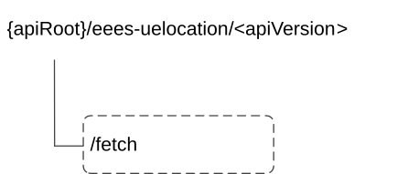

# 8.2.3 Custom Operations without associated resources

## 8.2.3.1 Overview

The structure of the custom operation URIs of the Eees_UELocation API is shown in Figure 8.2.3.1-1.

Figure 8.2.3.1-1: Custom operation URI structure of the Eees_UELocation API

Custom operations used for this API are summarized in table 8.2.3.1-1.

Table 8.2.3.1-1: Custom operations without associated resources

| Operation name | Custom operation URI | Mapped HTTP method | Description                       |
|----------------|----------------------|--------------------|-----------------------------------|
| Fetch          | /fetch               | POST               | Fetch an UE location information. |

## 8.2.3.2 Operation: Fetch

### 8.2.3.2.1 Description

This custom operation allows the EAS to fetch an UE's location information from the EES.

### 8.2.3.2.2 Operation Definition

This operation shall support the request data structures and response codes and data structures specified in tables 8.2.3.2.2-1 and 8.2.3.2.2-2.

Table 8.2.3.2.2-1: Data structures supported by the POST Request Body on this resource

|                 |     |             |                                                             |
|-----------------|-----|-------------|-------------------------------------------------------------|
| Data type       | P   | Cardinality | Description                                                 |
| LocationRequest | M   | 1           | Parameters to request to fetch the UE location information. |

Table 8.2.3.2.2-2: Data structures supported by the POST Response Body on this resource

<table>
<colgroup>
<col style="width: 16%" />
<col style="width: 4%" />
<col style="width: 12%" />
<col style="width: 11%" />
<col style="width: 54%" />
</colgroup>
<tbody>
<tr class="odd">
<td>Data type</td>
<td>P</td>
<td>Cardinality</td>
<td>
Response

codes
</td>
<td>Description</td>
</tr>
<tr class="even">
<td>LocationResponse</td>
<td>M</td>
<td>1</td>
<td>200 OK</td>
<td>Upon success, the UE location information returned by the EES.</td>
</tr>
<tr class="odd">
<td>n/a</td>
<td></td>
<td></td>
<td>307 Temporary Redirect</td>
<td>
Temporary redirection. The response shall include a Location header field containing an alternative URI of the resource located in an alternative EES.

Redirection handling is described in clause 5.2.10 of TS 29.122 [6].
</td>
</tr>
<tr class="even">
<td>n/a</td>
<td></td>
<td></td>
<td>308 Permanent Redirect</td>
<td>
Permanent redirection. The response shall include a Location header field containing an alternative URI of the resource located in an alternative EES.

Redirection handling is described in clause 5.2.10 of TS 29.122 [6].
</td>
</tr>
<tr class="odd">
<td>ProblemDetails</td>
<td>O</td>
<td>0..1</td>
<td>403 Forbidden</td>
<td>(NOTE 2)</td>
</tr>
<tr class="even">
<td colspan="5">
NOTE 1: The manadatory HTTP error status code for the POST method listed in the Table 5.2.6-1 of 3GPP TS 29.122 [6] also apply.

NOTE 2: Failure cases are described in clause 8.2.6.3.
</td>
</tr>
</tbody>
</table>

Table 8.2.3.2.2-3: Headers supported by the 307 Response Code on this resource

|          |           |     |             |                                                                   |
|----------|-----------|-----|-------------|-------------------------------------------------------------------|
| Name     | Data type | P   | Cardinality | Description                                                       |
| Location | string    | M   | 1           | An alternative URI of the resource located in an alternative EES. |

Table 8.2.3.2.2-4: Headers supported by the 308 Response Code on this resource

|          |           |     |             |                                                                   |
|----------|-----------|-----|-------------|-------------------------------------------------------------------|
| Name     | Data type | P   | Cardinality | Description                                                       |
| Location | string    | M   | 1           | An alternative URI of the resource located in an alternative EES. |
